# Welcome! {background-color="#cfb991"}

## Overview

:::::: nonincremental
::::: columns
::: {.column style="width: 50%; text-align: center; justify-content: center; align-items: center;"}
-   Introductions, logistics & your group
-   **The semester roadmap: two cases, one job**
-   **Case Spotlight: A/B Testing at Vungle**
-   What is statistics? Where is it used?
-   The map: descriptive vs. inferential
:::

::: {.column style="width: 50%; text-align: center; justify-content: center; align-items: center;"}
-   Data, variables & observations: the Vungle dataset
-   Data types & scales of measurement
-   Study design: why Vungle ran an *experiment*
-   A first look at the data in Excel (`Excel4stats`)
:::
:::::
::::::

# Introductions

## Instructor

::::: columns
::: {.column style="width: 40%; text-align: center; justify-content: center; align-items: center;"}
```{r  echo=FALSE, out.width = "60%",fig.align="center"}

```

[dcordeir\@purdue.edu](dcordeir@purdue.edu)

<https://davi-moreira.github.io/>
:::

::: {.column style="width: 60%; text-align: center; justify-content: center; align-items: center;"}
-   Clinical Assistant Professor in the Management Department at Purdue University;

<br>

-   My academic work addresses Political Communication, Data Science, Text as Data, Artificial Intelligence, and Comparative Politics.

<br>

-   [M&E Specialist consultant - World Bank (Brazil, Mozambique, Angola, and DRC)](https://blogs.worldbank.org/opendata/improving-how-we-measure-progress-community-biodiversity-conservation-projects-mozambique)
:::
:::::

## Instructor's Passions

```{r  echo=FALSE, out.width = "15%", fig.align="center"}

```

```{r  echo=FALSE, out.width = "40%", fig.align="center"}

```

<center>

::: {style="font-size: 80%;"}
**The Most Exciting Game in History**
:::

</center>

<br>

<br>

## Instructor's Passions

```{r  echo=FALSE, out.width = "25%", fig.align="center"}

```

<center>[NYT - How John Travolta Became the Star of Carnival](https://www.nytimes.com/2024/02/13/world/americas/brazil-carnival-john-travolta.html)[-Video.](https://www.nytimes.com/video/world/americas/100000009311331/the-star-of-this-carnival-is-a-giant-john-travolta-puppet.html)</center>

<br>

## Find Your Group & Meet Your Team

<br>

- You were **randomly assigned to a fixed group** for the whole term. Find your group number and members on **Brightspace → Groups**.

- **Email your group today:** start a thread with your groupmates to introduce yourselves and agree how you'll coordinate this semester.

- **In your intro, share** your name, where you are from, your background, and **one book, film, song, or anything** that tells the group something about you.

- This is your team for every in-class case this semester.


# Course Overview and Logistics {background-color="#cfb991"}

## Course Overview and Logistics

::: nonincremental
- **Course webpage** ([link](https://davi-moreira.github.io/2026F_business_analytics_qm670){target="_blank"}): the **syllabus**, the **schedule**, every topic's **slides**, and the **datasets** to download.

- **Brightspace** (your official channel): announcements, your **group**, the **in-class group cases**, the **three homeworks**, the exams, and your grades.

- **Excel + the Analysis ToolPak:** install it this week; we use it every class.

- **iClicker** for attendance.
:::

## Textbook & Materials

::::: columns
::: {.column style="width: 35%; text-align: center; justify-content: center; align-items: center;"}
```{r echo=FALSE, out.width="72%", fig.align="center"}

```
:::

::: {.column style="width: 65%; justify-content: center; align-items: center;"}
::: nonincremental
**_Statistics for Business and Economics_ (SBE), 14th edition**

Anderson · Sweeney · Williams · Camm · Cochran · Cengage, 2020 · ISBN-13 978-1337901062

[View on Cengage](https://www.cengage.com/c/statistics-for-business-economics-14e-anderson/9781337901062/){target="_blank"}

<br>

- The course **schedule** lists the readings for each topic.
- **Software:** Excel with the **Analysis ToolPak**; every worked example is Excel-first.
:::
:::
:::::

## How to Succeed in This Course

<br>

- **Keep up every week.** Statistics builds on itself: today's vocabulary becomes next week's formulas. Falling behind compounds.

- **Work with your group.** In-class cases are solved and submitted together; homework you do on your own. Explaining a method to a groupmate is the fastest way to learn it.

- **You're the decision-maker.** Every method we learn answers a call *you* have to make. Learn each one well enough to check an analyst's work, and always ask: *what decision does this number support, and would I stake money on it?*

- **Use Excel from day one.** Install the Analysis ToolPak this week and open the course dataset; you will use it all semester.

## How Every Class Runs

{.nostretch fig-align="center" width="90%"}

::: nonincremental
The class **ends on the Team Sprint**, your group's graded submission. **Today is the exception:** introductions and logistics come first, so the group case is short.
:::

# Your Semester: Two Cases, One Job {background-color="#cfb991"}

## You're the Decision-Maker: Two Cases to Crack

<br>

- This course puts **you in the decision-maker's seat**: the **manager** who has to act. You'll work in a **fixed group** (assigned this week), cracking real cases in class and judging the analysis behind every call.

::: {.fragment .nonincremental}
- **① Vungle A/B (Topics 1–9, up first).** A mobile ad-tech startup asking *roll out algorithm B, or keep A?* You'll learn to **describe, quantify uncertainty, and test** so you can judge that claim before betting the company on it.
:::

::: {.fragment .nonincremental}
- **② Auto-parts retail (Topics 10–11).** A 45-store chain asking *where should the next dollar go?* You'll **evaluate the analyst's model** that predicts store sales, then decide where to invest.
:::

::: {.fragment .nonincremental}
- **Every class:** your group works in the in-class case and **submits its call before you leave** (graded).
:::

## The Roadmap

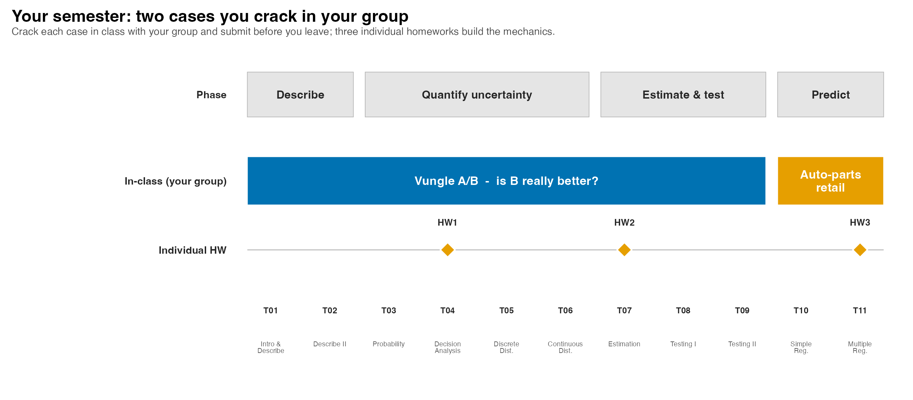{.nostretch fig-align="center" width="92%"}

# Case Spotlight: A/B Testing at Vungle {background-color="#cfb991"}

## Meet Vungle: One Decision, 30 Days of Data

<br>

- **Vungle** is a mobile ad-tech startup: it serves 15-second video ads inside other apps and earns revenue mainly when a viewer **installs** the advertised app.

- The metric that pays the bills is **eRPM**: effective revenue per 1,000 impressions.

- In June 2014, two analysts built a new ad-serving algorithm (**B**) and ran it head-to-head against the current one (**A**) for the whole month.

- **Your call as Vungle's manager:** *roll out B to all advertisers, or stay with A?*

- We will use this one decision (*is B better than A?*) to motivate **every** tool in this course. The data is in `vungle_daily.csv`.

## What Is an A/B Test?

- An **A/B test** is a controlled experiment that compares **two versions** of one thing to see which wins on a single metric, fixed up front.

- The anatomy is always the same:

::: {.fragment style="font-size: 88%;"}

| Piece | What it is | At Vungle |
|---|---|---|
| **Control (A)** | the current baseline version | the existing algorithm |
| **Variant (B)** | the one change being tested | the new algorithm |
| **Random split** | each unit assigned at random, same time | impressions routed by a hash |
| **One metric** | the number that decides, fixed up front | **eRPM** |

:::

::: {.fragment .nonincremental}
- **Why split at random:** it balances everything else (same days, market, advertisers), so any gap in the metric points to the **version**, not to outside factors.
:::

::: {.fragment .nonincremental}
- So *"is B better than A?"* becomes testable: **does B's eRPM really differ from A's, or is any gap just noise?**
:::

## One Big Call, One Question a Week

**Vungle's call (we land it in Topic 9):** *roll out B to all advertisers, or stay with A?* Each topic answers one piece of it.

:::: fragment
::: {style="font-size: 76%;"}
| Topic | The question we answer toward the call |
|---|---|
| **1 · Describe I** | Is B's **average** eRPM above A's (and is the data valid to compare)? |
| **2 · Describe II** | Is B's edge **steady**, or just more volatile? |
| **3 · Probability** | What are the **odds** at each step of the funnel? |
| **4 · Decision Analysis** | Roll out, keep A, or **test more**: which has the best expected value? |
| **5 · Discrete** | How many **installs** should we expect on a given day? |
| **6 · Continuous** | What's the **chance** of a high or low eRPM day? |
| **7 · Estimation** | From 30 days, what's B's **true** mean eRPM, give or take? |
| **8 · Testing I** | Is B's eRPM really **above the benchmark**? |
| **9 · Testing II** | **Is B really better than A?** |
:::
::::

## The Data Behind the Decision

```{r  echo=FALSE, out.width = "78%",fig.align="center"}
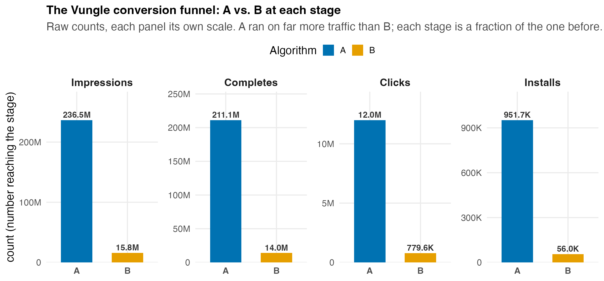
```

::: nonincremental
- Each ad **impression** can become a completed view, then a click, then an **install**. That chain is the *conversion funnel*.
- 30 days, both algorithms, the full funnel; that is the dataset `vungle_daily.csv` we will analyze.
:::

## The Tempting Answer: Why It Is Not Enough

<br>

- A quick glance is tempting: *"B's average eRPM looks higher, so roll out B!"*

- Not so fast. Before you can bet the company on that \$0.11 gap, you have to ask:

  - Is \$0.11 a **real** difference, or just day-to-day **noise**?
  - Is **30 days** enough to generalize to all future traffic?
  - What **kind** of data is this, and which statistics are even **valid** to compute?

- Answering those is your job. **Today we start at the foundation: what is this data?**

# What is Statistics? {background-color="#cfb991"}

## What is Statistics?

::::: columns
::: {.column style="width: 60%; text-align: center; justify-content: center; align-items: center;"}
<br>

<br>

<br>

> "Without data, you're just another person with an opinion." – W. Edwards Deming
:::

::: {.column style="width: 40%; text-align: center; justify-content: center; align-items: center;"}
```{r  echo=FALSE, out.width = "70%",fig.align="center"}

```

W. Edwards Deming

[Wiki](https://en.wikipedia.org/wiki/W._Edwards_Deming)
:::
:::::

## What is Statistics?

<br>

Statistics is the **science of collecting, organizing, analyzing, interpreting, and presenting data to make informed business decisions**.

<br>

- It turns raw numbers, like Vungle's 30 days of eRPM, into a defensible answer to the manager's question.

- The goal is always the same: **reduce uncertainty enough to act.**

## Where Is Statistics Applied in Business?

::: nonincremental
- **Accounting:** audit sampling to test whether reported figures are accurate.

- **Finance:** estimating the return and risk of portfolios; pricing default risk.

- **Marketing:** consumer surveys, A/B testing ad creative, demand forecasting.

- **Production / Operations:** quality control, process design, capacity planning.

- **Human Resources:** recruiting analytics, salary benchmarking, retention modeling.
:::

## The Map: How Statistical Analysis Works

```{r  echo=FALSE, out.width = "82%",fig.align="center"}
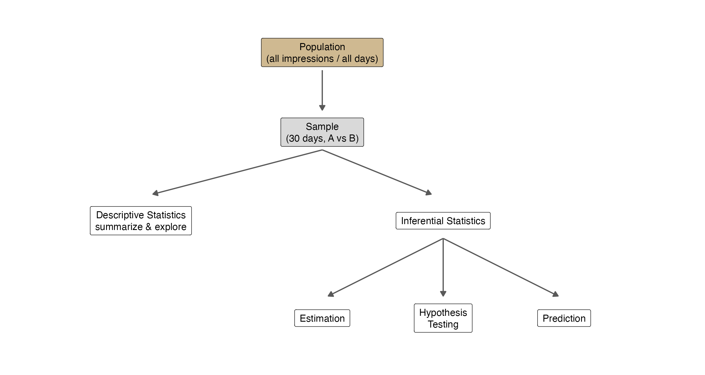
```

## Descriptive vs. Inferential Statistics

<br>

- **Descriptive statistics:** tabular, graphical, and numerical methods that **summarize** the data you have (means, charts, tables).

- **Inferential statistics:** using **sample** data to draw conclusions or make decisions about a larger **population**.

- Classify each Vungle statement:

::: fragment
| Statement | Descriptive or Inferential? |
|---|---|
| "Over the 30 test days, B's mean eRPM was \$3.46." | **Descriptive** (summarizes the sample) |
| "If rolled out to all traffic, B will earn more than A." | **Inferential** (a claim about the population) |
| "26 of 30 days favored B." | **Descriptive** |
| "B's true conversion rate differs from A's." | **Inferential** |
:::

## A Question That Often Comes Up

:::: {.faq}
**A question that often comes up at this point:**

[If we already have all 30 days of data, why can't we just compute the answer? Why do we need "inference" at all?]{.faq-q}

::: {.fragment .faq-a}
**Short answer:** those 30 days are a **sample** of all the future traffic B would ever serve. Describing what happened in June is certain; claiming B will keep winning next month is a leap from sample to population, and that leap is exactly what **inference** (Topics 7–9) is for.
:::
::::

## Roadmap: What "Descriptive" Covers

<br>

::: nonincremental
| Lens | Question it answers | Tool |
|---|---|---|
| **Location** | Where is the center? | mean, median (summary stats) |
| **Variability** | How spread out? | standard deviation, range |
| **Shape** | Symmetric or skewed? | histogram, box plot |
| **Empirical rule** | How much falls near the mean? | 68–95–99.7% |
| **Association** | Do two variables move together? | scatter plot, correlation |
:::

# Data and Statistics {background-color="#cfb991"}

## Elements, Variables, and Observations

```{r  echo=FALSE, out.width = "28%",fig.align="center"}
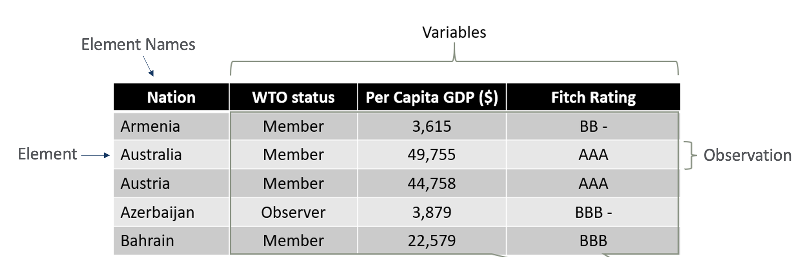
```

::: nonincremental
- An **element** is the entity on which data are collected.
- A **variable** is a characteristic of interest for the elements.
- An **observation** is the set of measurements for one element.
- A data set with $n$ elements has $n$ observations; total values = elements × variables.
:::

## Read the Data Before You Trust the Analysis

<br>

- A recommendation is only as good as the data under it, so a sharp manager looks first. Here is a slice of `vungle_daily.csv`, algorithms interleaved by day:

::: fragment
| algorithm | date | impressions | completes | clicks | installs | erpm |
|---|---|---:|---:|---:|---:|---:|
| A | 2014-06-01 | 6,777,407 | 5,978,434 | 345,309 | 31,119 | 3.327 |
| B | 2014-06-01 | 569,044 | 499,235 | 28,035 | 2,111 | 2.953 |
| A | 2014-06-02 | 6,004,310 | 5,331,727 | 299,732 | 24,601 | 2.943 |
| B | 2014-06-02 | 505,963 | 447,695 | 24,621 | 1,713 | 2.587 |
:::

::: {.fragment .nonincremental}
- **Element** = one algorithm-day (60 of them). **Variables** = the 7 columns. **One observation** = one row. Total values = **60 × 7 = 420**.
:::

## Data Types

::::::: columns
:::: {.column style="width: 50%; text-align: center; justify-content: center; align-items: center;"}
::: nonincremental
**Categorical (Qualitative) Data**

-   Labels or names that identify an attribute of each element
-   Use the **nominal** or **ordinal** scale
-   Can be numeric or non-numeric
-   Only limited arithmetic is meaningful (counts, proportions)
:::
::::

:::: {.column style="width: 50%; text-align: center; justify-content: center; align-items: center;"}
::: nonincremental
**Quantitative Data**

-   Indicate **how many** or **how much**, always numeric
-   **Discrete**: counts (how many), e.g., installs
-   **Continuous**: measurements (how much), e.g., eRPM
-   Ordinary arithmetic (+, −, ×, ÷) is meaningful
:::
::::
:::::::

## Data Types: Examples

<br>

| Categorical: Nominal | Categorical: Ordinal | Quantitative: Continuous or Discrete |
|---------------------|-------------------|--------------------------------|
| Ad algorithm (A/B) | Satisfaction Level | eRPM (revenue / 1,000 impr.) |
| Vehicle Type | Education Level | Number of Installs |
| Music Genre | Customer Feedback | Revenue |
| Nationality | Job Position | Product Weight |
| Operating System | Priority Level | Market Share |

<br>

::: r-fit-text
-   **Nominal** categorizes with no inherent order (Vungle's `algorithm`: A vs. B).
-   **Ordinal** categorizes with a meaningful order but no consistent gap between levels.
-   **Quantitative** is numeric: *discrete* values are countable (`installs`); *continuous* values can take any value in a range (`erpm`).
:::

## Scales of Measurement

```{r  echo=FALSE, out.width = "70%",fig.align="center"}
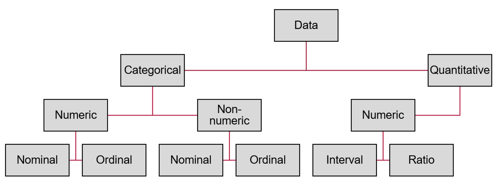
```

## Scales of Measurement

::::: columns
::: {.column style="width: 50%; text-align: center; justify-content: center; align-items: center;"}
::: nonincremental
1.  **Categorical Data:** sortable into groups.
    -   **Nominal**: no inherent order (gender, car type, nationality, **ad algorithm**).
    -   **Ordinal**: a meaningful order, but no consistent difference between levels (satisfaction level; education level; job rank).
:::
:::

::: {.column style="width: 50%; text-align: center; justify-content: center; align-items: center;"}
::: nonincremental
2.  **Quantitative Data:** measured numerically.
    -   **Interval**: meaningful differences, **no true zero** (temperature in °C/°F).
    -   **Ratio**: meaningful differences **and a true zero** (height, weight, revenue, **eRPM**, **installs**).
:::
:::
:::::

## Classify Vungle's Variables

<br>

- Before any analysis, audit every column, because **the scale determines which statistics are valid**:

::: fragment
| Variable | Type | Scale | What you may compute |
|---|---|---|---|
| `algorithm` | Categorical | Nominal | counts, proportions (**not** a mean) |
| `date` | Categorical (ordered) | Ordinal / Interval | ordering, time gaps |
| `impressions`, `completes`, `clicks`, `installs` | Quantitative, discrete | Ratio | counts, sums, means, rates |
| `erpm` | Quantitative, continuous | Ratio | mean, SD, t-tests (the primary KPI) |
:::

::: {.fragment .nonincremental}
- Asking for the "average `algorithm`" is meaningless; asking for the "average `erpm`" is the whole point. **Scale sets your toolbox.**
:::

## Where Data Comes From

<br>

::: nonincremental
- **Existing sources:** internal records (Vungle's ad server logs), public/government databases, industry reports.

- **Collection by study:**
  - **Observational:** record what happens without intervening (a customer survey).
  - **Experimental:** set the conditions on purpose, then measure (Vungle *assigns* traffic to A or B).

- **Cross-sectional:** many elements at **one** point in time.
- **Time series:** **one** element across **many** time periods.
:::

## Cross-Sectional vs. Time Series: the Vungle Data

<br>

::: nonincremental
- On any single day, comparing **A vs. B** is a **cross-sectional** snapshot (two entities, one moment).

- Tracking **one algorithm across the 30 days** is a **time series**.

- The full dataset is a **panel**: repeated cross-sections over time.
:::

```{r  echo=FALSE, out.width = "42%",fig.align="center"}
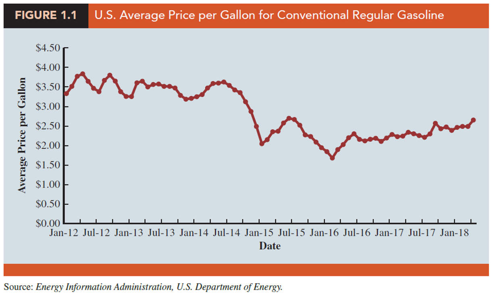
```

# Study Design {background-color="#cfb991"}

## Observational vs. Experimental Studies

::::: columns
::: {.column style="width: 50%; text-align: center; justify-content: center; align-items: center;"}
**Observational**

In an observational study, no attempt is made to control the variables of interest. A survey is the classic example.

<br>

> Researchers watch a random sample of Walmart shoppers and record time in store, gender, and amount spent, *without ever intervening*.
:::

::: {.column style="width: 50%; text-align: center; justify-content: center; align-items: center;"}
**Experimental**

In an experiment, the variable of interest is identified, then its levels are **set and controlled**, so we can see how they influence an outcome.

<br>

> The 1954 Salk polio-vaccine trial randomly assigned nearly two million children to vaccine or placebo. It is the largest experiment ever run.
:::
:::::

## Vungle Ran an Experiment, So We Can Say "Caused"

<br>

- The `algorithm` column is the **treatment**: each impression was randomly assigned to A or B (by an MD5 hash) **on the same days**.

- Random assignment balances everything else (same market, same advertisers, same weekends), so the only systematic difference is the algorithm.

- That is what licenses **causal** language: *"B **caused** higher eRPM,"* not merely *"B was associated with higher eRPM."*

- **Payoff:** only an **experiment** supports a causal claim. An observational "B-days looked better" could be confounded; Vungle's design rules that out.

## Random Assignment vs. Random Sampling

<br>

```{r  echo=FALSE, out.width = "50%",fig.align="center"}
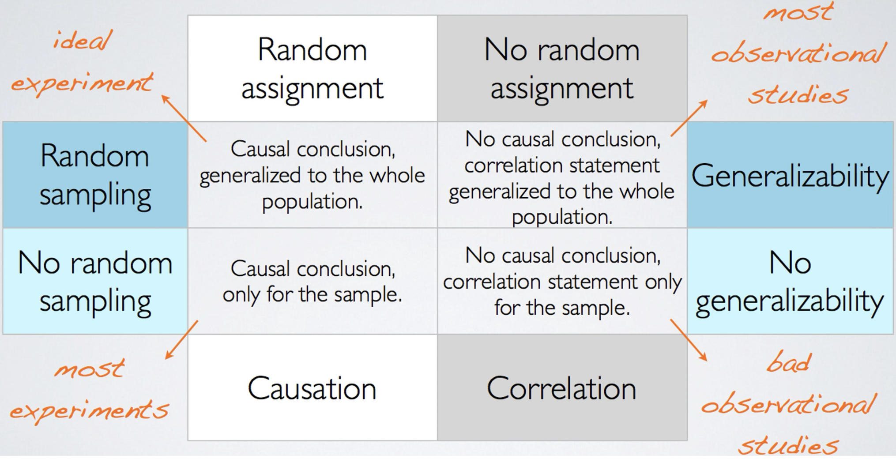
```

::: nonincremental
- **Random sampling** (*who gets into the study*) supports generalizing to the population.
- **Random assignment** (*who gets which treatment*) supports causal comparison.
:::

## A Question That Often Comes Up

:::: {.faq}
**A question that often comes up at this point:**

[We randomly assigned impressions to A or B, but we did not randomly sample all of next year's traffic. So what can we actually claim from these 30 days?]{.faq-q}

::: {.fragment .faq-a}
**Short answer:** two different guarantees. Random **assignment** lets you say B **caused** the higher eRPM on these days; random **sampling** would let you generalize to all future traffic. You have the first, not the second, which is why a company-wide roll-out still needs an inference test (Topics 7–9).
:::
::::

# Descriptive Statistics {background-color="#cfb991"}

## Summarizing and Presenting Data {.smaller}

<br>

```{r  echo=FALSE, out.width = "50%",fig.align="center"}
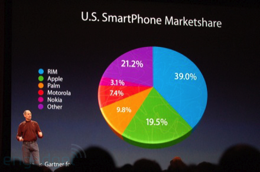
```

<br>

<center>[June 9th Apple CEO Steve Jobs - Post](https://paragraft.wordpress.com/2008/06/03/the-chart-junk-of-steve-jobs/)</center>

## Summarizing and Presenting Data {.smaller}

```{r  echo=FALSE, out.width = "70%",fig.align="center"}
knitr::include_graphics("figs/pie-vs-bar.png")
```

<br>

<center>[Problems with pie charts - Post](https://stats.stackexchange.com/questions/8974/problems-with-pie-charts)</center>

## A First Look at eRPM

```{r  echo=FALSE, out.width = "55%",fig.align="center"}
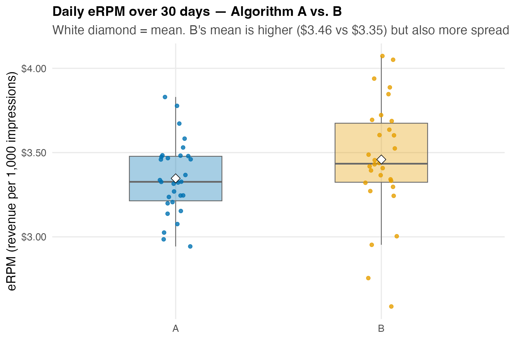
```

::: nonincremental
- A picture already tells a story: **B's mean is higher** (white diamonds), but B is **more spread out**, a hint that "B is better" may not be the whole truth.
- Describing is step one; *deciding* whether that gap is real comes later (Topics 7–9).
:::

## A Question That Often Comes Up

:::: {.faq}
**A question that often comes up at this point:**

[Why does Vungle judge the algorithms on eRPM instead of total revenue or total installs?]{.faq-q}

::: {.fragment .faq-a}
**Short answer:** eRPM is revenue per 1,000 impressions, so it compares A and B **fairly** even when they served different amounts of traffic. Total revenue would just crown whichever algorithm happened to run more often; eRPM is the per-impression efficiency the business actually optimizes.
:::
::::

## Measures of Location: the Mean

<br>

- The first job of *describing* is finding the **center**. The workhorse is the **mean**: add the values, divide by the count:

::: fragment
$$
\bar{x} = \frac{\sum_{i=1}^{n} x_i}{n}
$$
:::

::: {.fragment .nonincremental}
- Vungle's 30-day mean eRPM: **A = \$3.347**, **B = \$3.459**; B's center sits **\$0.11 higher**.
:::

::: {.fragment .nonincremental}
- That \$3.459 is a **point estimate** of B's *true* mean eRPM, the number we will later put to the test.
:::

## Median & Mode: When to Use Which

<br>

::: nonincremental
- **Median:** the middle value (50th percentile); unmoved by outliers. Vungle: A median **\$3.327**, B **\$3.434**. Mean ≈ median ⟹ the eRPM distribution is roughly **symmetric**.
- **Mode:** the most frequent value; the only center valid for **categorical** data (e.g., the most-served `algorithm`). For continuous eRPM every value is distinct, so the mode says nothing.
- **Rule of thumb:** report the **mean** for symmetric data, the **median** when it is skewed or has outliers.
:::

## A Question That Often Comes Up

:::: {.faq}
**A question that often comes up at this point:**

[Vungle's mean and median eRPM are almost equal, so why bother computing both?]{.faq-q}

::: {.fragment .faq-a}
**Short answer:** their **agreement** is itself information. Mean ≈ median tells you the eRPM distribution is roughly symmetric with no extreme days, so the mean is trustworthy here. When the two pull apart, that gap is your early warning of skew or an outlier day, which is exactly what we dissect next class.
:::
::::

## Your Excel Toolkit: the Analysis ToolPak

<br>

```{r  echo=FALSE, out.width = "12%",fig.align="center"}

```

<center>`data/vungle_daily.xlsx`</center>

<br>

- Install it once: **File → Options → Add-ins → Analysis ToolPak** (and Analysis ToolPak-VBA) **→ Go**.

- Then every analysis lives under **Data → Data Analysis**.

- Do this **this week** with `vungle_daily.xlsx` open; it is the dataset for the whole term.

## Teaser: Descriptive Statistics on eRPM

::::: nonincremental
:::: columns
::: {.column width="42%"}
<br>

**Data → Data Analysis →<br> Descriptive Statistics**

- Input Range: the `erpm` values for Algorithm A
- check **Summary statistics**

<br>

The mean eRPM for A is **\$3.347**. Every row of this panel (median, SD, skewness) is a *descriptive* measure we unpack in **Topic 2**.
:::

::: {.column width="58%"}
```{r  echo=FALSE, out.width = "85%",fig.align="center"}
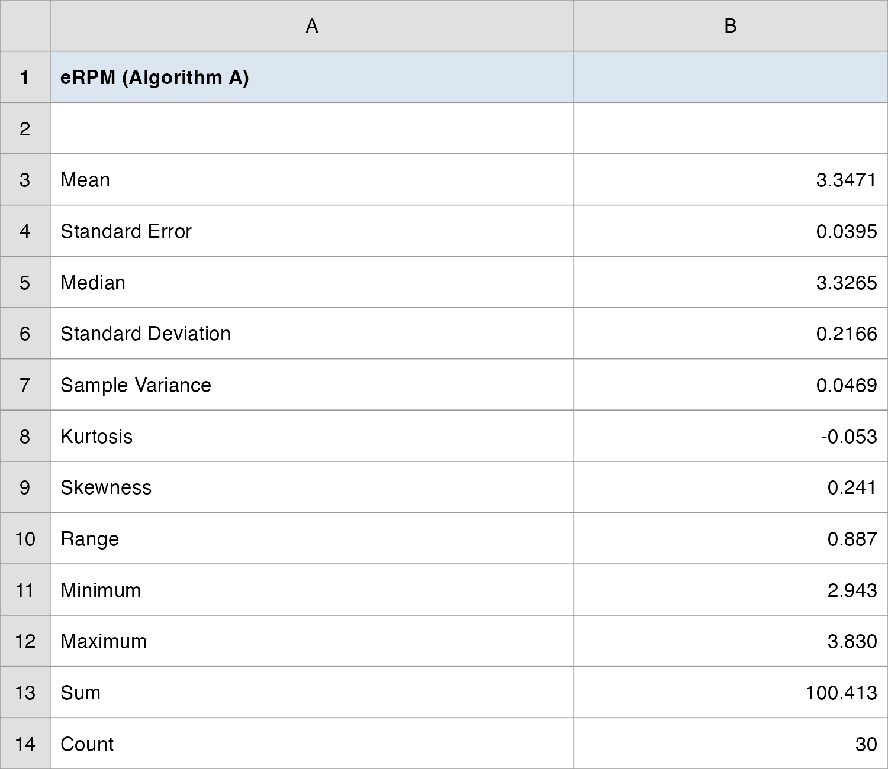
```
:::
::::
:::::

## Debrief: Back to the Decision

<br>

- We can now **describe** the data cleanly: A's mean eRPM is **\$3.35**, B's is **\$3.46**, over 30 carefully-designed experimental days.

- We **cannot yet** say whether B is *really* better for all future traffic; that is **inference**, and it needs the tools in Topics 7–9.

- **Your call today:** *not yet.* You can describe B's edge, but approving a company-wide roll-out needs an inference test, and that is exactly what you will demand from your analyst in Topics 7–9.

## Today's Question, Today's Answer

<br>

**The question (Topic 1 of the ladder):**

> *Is B's average eRPM above A's, and is the data valid to compare?*

::: fragment
<br>

**The answer we reached today:**

> **Yes.** On 30 valid, randomized experimental days, B's average eRPM (**\$3.46**) edges A's (**\$3.35**) by **\$0.11**. Whether that **\$0.11** edge is *real* or just day-to-day noise is the **inference** question, settled in Topics 7–9.
:::

# Statistical Inference {background-color="#cfb991"}

## Statistical Inference

<br>

::::::: columns
::: {.column style="width: 40%; text-align: center; justify-content: center; align-items: center;"}
```{r  echo=FALSE, out.width = "80%",fig.align="center"}
```
:::

::::: {.column style="width: 50%; text-align: left; justify-content: center; align-items: center;"}
:::: {.fragment .nonincremental}
::: r-fit-text
-   **Population**: all elements of interest (every future impression).

-   **Sample**: a subset (Vungle's 30 test days).

-   **Descriptive Statistics**: tabular, graphical, numerical summaries.

-   **Inferential Statistics**: using the sample to estimate or test claims about the population.

-   **Estimation**: approximate a population parameter (true mean eRPM).

-   **Hypothesis Testing**: weigh evidence for a claim (is B > A?).

-   **Prediction**: forecast future outcomes from data.
:::
::::
:::::
:::::::

# The Takeaway {background-color="#cfb991"}

## The Manager's Takeaway

<br>

- **One sentence:** today we turned the manager's question (*roll out B or keep A?*) into a precise data problem, and found B's average eRPM (**\$3.46**) edges A's (**\$3.35**) by **\$0.11**; whether that edge is *real* is the inference question (Topics 7–9).

- **One number to remember:** **60 rows × 7 variables = 420 values**. That is Vungle's dataset, and you can name every element, variable, and observation in it.

- **One principle:** the **scale of a variable** determines which statistics are valid: count `algorithm`, average `erpm`.

- **Practice:** open `data/vungle_daily.xlsx`, install the Analysis ToolPak, and run **Descriptive Statistics** on `erpm`. Bring one question to next class.

## ⏱️ Team Sprint: Your Group Case

::: {.sprint .nonincremental}
**Now it's your group's turn.** Today's in-class group case is posted on **Brightspace** (*Topic 01 Group Case*): a short business decision you make with today's tools.

**What you'll use:** data **types and scales**, and the **mean, median, and mode**. **Excel:** Analysis ToolPak → Descriptive Statistics.

**Submit one PDF per group before you leave:** your decision plus the numbers behind it.
:::

# Wrap-up {background-color="#cfb991"}

## Summary

::: nonincremental
The main points from this session:

-   **Your seat all term:** you are the **decision-maker**. You run every method yourself, but to *judge* the analysis and make the call, not to be the analyst.
-   **Two cases drive the course:** Vungle A/B (describe → test, Topics 1–9) and auto-parts retail (predict, Topics 10–11). Each class your group also works a separate in-class case and submits it; group homework drills the mechanics.
-   **Statistics** turns data into defensible business decisions; it splits into **descriptive** (summarize) and **inferential** (generalize).
-   **Data vocabulary:** elements, variables, observations; categorical vs. quantitative; the four scales of measurement, and the rule that **scale determines method**.
-   **Study design:** Vungle ran a randomized **experiment**, which is what licenses *causal* claims.
-   **Excel is your toolkit:** install the Analysis ToolPak and meet the dataset on day one.
-   **Next time:** Descriptive Statistics II: spread, shape, the boxplot, and how two variables move together.
:::

# Thank you! {background-color="#cfb991"}
