## Overview

:::::: nonincremental
::::: columns
::: {.column style="width: 50%; text-align: center; justify-content: center; align-items: center;"}
- Case Spotlight: A/B Testing at Vungle
- Beyond the center: measures of **variability**
  - range, IQR, variance, SD, coefficient of variation
- Distribution **shape**: skewness
- Relative location: **z-scores**, Chebyshev, the Empirical Rule
- Detecting **outliers**
:::

::: {.column style="width: 50%; text-align: center; justify-content: center; align-items: center;"}
- The **five-number summary** and the **boxplot**
- Measures of **association**: covariance & correlation
- Building an A-vs-B descriptive **dashboard**
- From "B's mean is higher" to "is B's edge real or just noise?"
:::
:::::
::::::

## How Every Class Runs

{.nostretch fig-align="center" width="90%"}

::: nonincremental
The class **ends on the Team Sprint**, your group's graded submission: a decision plus your read of the analysis, one PDF before you leave.
:::

# Case Spotlight: A/B Testing at Vungle {background-color="#cfb991"}

## Recap: Where We Left Off

<br>

- **Vungle** is a mobile ad-tech startup: it serves 15-second video ads inside other apps and earns revenue mainly when a viewer **installs** the advertised app.

- The metric that pays the bills is **eRPM**: effective revenue per 1,000 impressions.

- Two analysts built a new ad-serving algorithm (**B**) and ran it head-to-head against the current one (**A**) for the whole month of June 2014.

- Last time we computed the **centers**: A's mean eRPM is **\$3.347**, B's is **\$3.459**; B's average sits **\$0.11 higher**.

- It is tempting to glance at that gap and say: *"B wins, roll it out."*

## The Brief: Today's Manager Question

<br>

- **The big call (we land it in Topic 9):** roll out algorithm B to all advertisers, or stay with A? Last time you saw B's average eRPM sits **\$0.11 higher**.

- **Today's piece of that call:** *is B's edge steady, or just more volatile?* As Vungle's manager, you cannot bet the company on an average that hides wild day-to-day swings.

::: fragment
> "B's average daily eRPM ran about **\$0.11 higher** than A's. Before I act: is that edge **steady**, or does B just bounce around more? How confident am I in that one number?"
:::

::: {.fragment .nonincremental}
- The **mean is only half the story.** A center tells you *where* the data sit; it says nothing about how *spread out*, *lopsided*, or *risky* they are. Two algorithms can share the **same average** and behave completely differently day to day.
:::

## Why the Mean Alone Misleads

```{r  echo=FALSE, out.width = "80%",fig.align="center"}
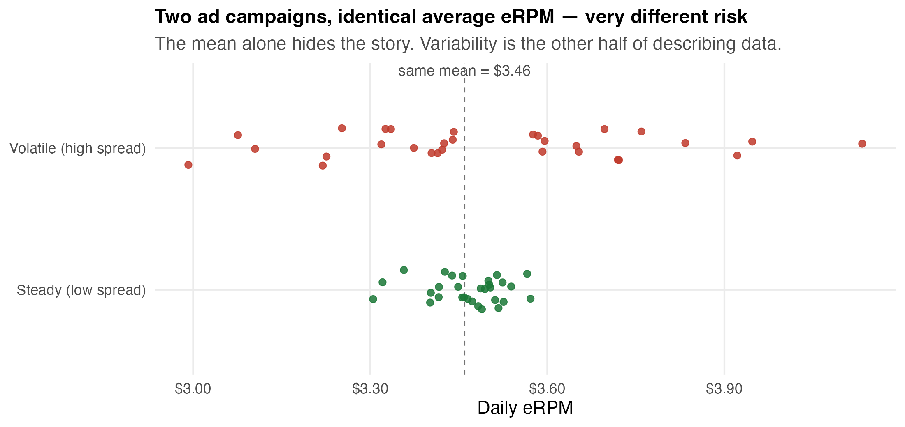
```

::: nonincremental
- **Same mean (\$3.46), opposite risk.** The manager who only hears "average \$3.46" cannot tell these two campaigns apart.
- Today we add the **other half of describing data**: spread, shape, and how two variables move together.
:::

## How Today's Tools Build the Manager Brief

<br>

Each tool answers one question the manager will ask about Vungle's data:

| The manager asks… | The tool |
|---|---|
| "How *risky* is each algorithm day to day?" | **Range, IQR, variance, SD, CV** |
| "Is the eRPM distribution *lopsided*?" | **Skewness** |
| "Was any day *weirdly* high or low?" | **z-scores, Empirical Rule, Chebyshev, outliers** |
| "Show me A vs. B *at a glance*." | **Five-number summary + boxplot** |
| "Do clicks and installs *move together*?" | **Covariance & correlation** |

<br>

- By the end, your team turns these into a **one-screen A-vs-B dashboard**, the manager's first honest read.

# Measures of Variability {background-color="#cfb991"}

## Why Spread Matters as Much as Center

<br>

- Choosing between **supplier A and supplier B**, you weigh the *average* delivery time and the *variability* together: a supplier that is fast on average but wildly inconsistent can wreck a schedule.

- Same for Vungle: an algorithm with a slightly higher mean eRPM but **huge day-to-day swings** is a riskier bet than a steady one.

- Five workhorse measures of variability, smallest toolkit to richest:

::: fragment

| Measure | What it captures |
|---|---|
| **Range** | total swing (max − min) |
| **IQR** | swing of the middle 50% |
| **Variance / SD** | typical distance from the mean (uses all the data) |
| **Coefficient of variation** | spread *relative* to the mean (unit-free) |

:::

## Range and Interquartile Range (IQR)

<br>

- **Range** = largest value − smallest value. Simplest measure, but **driven entirely by the two extremes**, so a single odd day distorts it.

::: fragment

$$
\text{Range} = x_{\max} - x_{\min}
$$

:::

- **Interquartile range (IQR)** = the range of the **middle 50%** of the data:

::: fragment

$$
\text{IQR} = Q_3 - Q_1
$$

:::

- IQR throws away the top 25% and bottom 25%, so it **ignores extremes**: a steadier read of "typical" spread.

- **Excel:** `=MAX(rng)-MIN(rng)` for the range; `=QUARTILE.INC(rng,3)-QUARTILE.INC(rng,1)` for the IQR.

## Variance: the Average Squared Distance from the Mean

<br>

- Variance uses **every** observation: it averages the **squared deviations** from the mean. Squaring keeps positives and negatives from cancelling and punishes big misses.

::: fragment

$$
\text{Sample: } \; s^2 = \frac{\sum_{i=1}^{n}(x_i - \bar{x})^2}{n-1}
\qquad\qquad
\text{Population: } \; \sigma^2 = \frac{\sum_{i=1}^{N}(x_i - \mu)^2}{N}
$$

:::

- **Why divide by $n-1$ for a sample?** We "spend" one degree of freedom estimating $\bar{x}$ from the same data; dividing by $n-1$ corrects the bias so $s^2$ is an honest estimate of $\sigma^2$.

- The catch: variance is in **squared units** (dollars²), hard to interpret directly. That is what the standard deviation fixes.

## A Question That Often Comes Up

:::: {.faq}
**A question that often comes up at this point:**

[We have all 30 of B's days. Why divide by 29 instead of 30 when we average the squared deviations?]{.faq-q}

::: {.fragment .faq-a}
**Short answer:** because those 30 days are a *sample*, and we already used them to compute B's mean (\$3.459). Once the mean is pinned down, only 29 of the deviations are free to vary; dividing by 29 corrects a bias that would otherwise make B's spread look smaller than it is. If the 30 days were the entire population, you would divide by 30.
:::
::::

## Standard Deviation and the Notation Table

<br>

- **Standard deviation** = the positive square root of the variance, back in the **original units** (dollars), so it reads as "a typical day lands about this far from the mean."

::: fragment

$$
s = \sqrt{s^2} \qquad\qquad \sigma = \sqrt{\sigma^2}
$$

:::

::: fragment

| Quantity | Sample (statistic) | Population (parameter) |
|---|:---:|:---:|
| Mean | $\bar{x}$ | $\mu$ |
| Variance | $s^2$ | $\sigma^2$ |
| Standard deviation | $s$ | $\sigma$ |

:::

- **Excel:** `=VAR.S` / `=STDEV.S` for a **sample**; `=VAR.P` / `=STDEV.P` for a full **population**. Our 30 days are a *sample* of all possible days → use the **`.S`** versions.

## Coefficient of Variation: Spread Relative to Size

<br>

- A standard deviation of \$0.34 is large for eRPM but trivial for a stock price. The **coefficient of variation (CV)** rescales spread by the mean, so you can compare **differently-sized series**:

::: fragment

$$
\text{CV} = \left( \frac{s}{\bar{x}} \right) \times 100\%
$$

:::

- It is **unit-free** (a percentage): "the SD is X% of the mean."

- **Vungle read:** even before testing, CV tells you which algorithm is *relatively* more volatile, exactly the risk question you, the manager, care about.

- **Excel:** `=STDEV.S(rng)/AVERAGE(rng)`.

## Anchor Example: Two Suppliers' Delivery Times

::: r-fit-text
A purchasing manager compares delivery times (hours) from two carriers over five shipments. **Same mean, very different reliability.**

| | Ship 1 | Ship 2 | Ship 3 | Ship 4 | Ship 5 | Mean | Range | $s$ | CV |
|---|---:|---:|---:|---:|---:|---:|---:|---:|---:|
| **Carrier A** | 14 | 15 | 16 | 15 | 15 | **15** | 2 | 0.71 | **4.7%** |
| **Carrier B** | 9 | 21 | 14 | 19 | 12 | **15** | 12 | 4.95 | **33.0%** |

::: {.fragment .nonincremental}
- **Identical average (15 hrs)**, but A's range is 2 hours and B's is 12.
- A's CV is 4.7%; B's is 33.0%. **A is the dependable carrier**; B is a gamble.
- *The mean could not tell them apart; variability did.* This is the lesson we now take to Vungle.
:::
:::

## Vungle Variability: A vs. B

::: r-fit-text
Computing each measure on the 30 daily eRPM values, by algorithm:

| Measure | Algorithm A | Algorithm B | Read |
|---|---:|---:|---|
| Mean | \$3.347 | \$3.459 | B's center is \$0.11 higher |
| Range | 0.887 | **1.486** | B swings far more day to day |
| IQR ($Q_3-Q_1$) | 0.264 | **0.350** | even the middle 50% is wider for B |
| Variance ($s^2$) | 0.047 | **0.119** | |
| Standard deviation ($s$) | **0.217** | **0.344** | a typical B-day is \$0.34 off its mean |
| CV | 6.5% | **10.0%** | B is ~50% more volatile, *relative to its size* |

<br>

::: {.fragment .nonincremental}
- **B earns more on average, and is markedly riskier.** Higher mean, higher spread.
- That is the real headline for the manager: *"B's edge comes with more volatility."* The mean hid it; variability reveals it.
:::
:::

## A Question That Often Comes Up

:::: {.faq}
**A question that often comes up at this point:**

[B earns more AND swings more. Doesn't the higher average just settle it?]{.faq-q}

::: {.fragment .faq-a}
**Short answer:** not yet. The higher average is only in these 30 days, and the extra volatility means part of B's edge could be the luck of one month. Description flags the risk; whether the \$0.11 edge is real is the inference question we settle in Topics 7-9.
:::
::::

## Do It in Excel: Descriptive Statistics

:::::: columns
::: {.column width="46%"}
**Follow along:**

1. Select the `erpm` column for Algorithm B (30 values)
2. **Data -> Data Analysis -> Descriptive Statistics**
3. Set Input Range, check **Labels in first row** and **Summary statistics**
4. Click **OK**; read **Mean (3.459)**, **Standard Deviation (0.344)**, **Skewness (-0.47)**, **Range, Minimum, Maximum** straight off the panel
:::
::: {.column width="54%"}
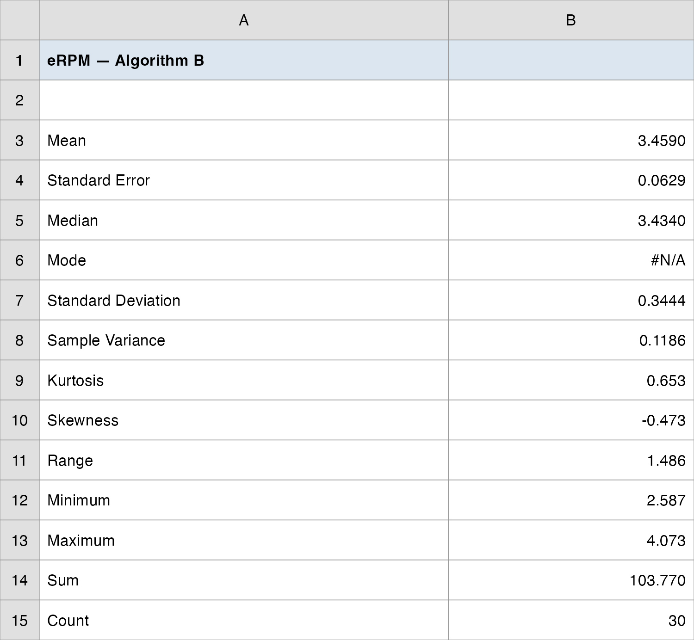{.nostretch fig-align="center" width="100%"}
:::
::::::

# Distribution Shape & Relative Location {background-color="#cfb991"}

## Skewness: Is the Distribution Lopsided?

<br>

- Center and spread still miss one thing: **symmetry**. **Skewness** measures the lopsidedness of a distribution.

::: fragment

$$
\text{Skewness} = \frac{n}{(n-1)(n-2)} \sum_{i=1}^{n}\left( \frac{x_i - \bar{x}}{s} \right)^3
$$

:::

::: fragment

| Shape | Skewness | Mean vs. median |
|---|:---:|---|
| **Skewed left** (long lower tail) | negative | mean **<** median |
| **Symmetric** | ≈ 0 | mean **≈** median |
| **Skewed right** (long upper tail) | positive (often > 1) | mean **>** median |

:::

- **Quick check, no formula:** compare mean and median. If they are close, the data are roughly symmetric.

## Vungle Shape Check

- Compare each algorithm's mean to its median:

::: fragment

| | Mean | Median | Skewness | Read |
|---|---:|---:|---:|---|
| **A** | \$3.347 | \$3.327 | +0.24 | mean slightly above median → **mild right skew** |
| **B** | \$3.459 | \$3.434 | −0.47 | a few low days pull the **left** tail → **mild left skew** |

:::

- Both are **close to symmetric** (|skew| well under 1): good news, because the Empirical Rule we are about to use assumes a roughly bell shape.

- B's slight **left** skew traces to a couple of weak early days (a slow June 2–3): worth flagging, not alarming.

## Boxplots Show Shape at a Glance

```{r  echo=FALSE, out.width = "82%",fig.align="center"}
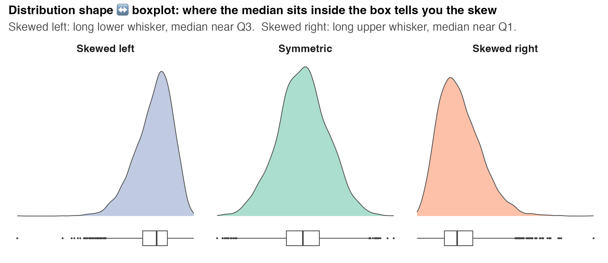
```

::: nonincremental
- **Where the median line sits inside the box tells you the skew:** centered → symmetric; pushed toward $Q_3$ with a long lower whisker → skewed left; pushed toward $Q_1$ with a long upper whisker → skewed right.
:::

## z-Scores: How Unusual Is One Day?

<br>

- A **z-score** (standardized value) reports how many **standard deviations** a value sits from the mean, a unit-free measure of **relative location**:

::: fragment

$$
z_i = \frac{x_i - \bar{x}}{s}
$$

:::

- $z < 0$ → below the mean; $z > 0$ → above; $z = 0$ → exactly at the mean. A $z$ of $+2$ means "two SDs above average."

- It lets you compare positions **across different scales**: a \$4.07 eRPM day and a 38,000-install day both become "how many SDs from typical?"

- **Excel:** `=STANDARDIZE(x, mean, standard_deviation)`.

## The Empirical Rule: for Bell-Shaped Data

```{r  echo=FALSE, out.width = "68%",fig.align="center"}
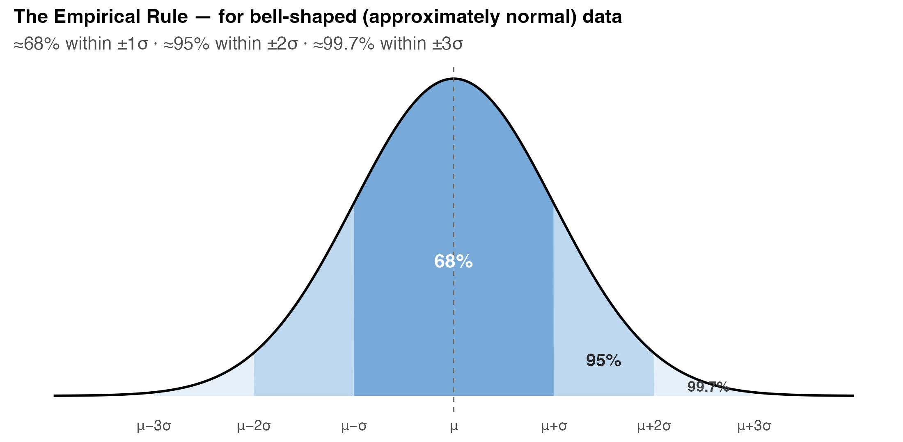
```

::: nonincremental
- When data are roughly **bell-shaped**: ≈**68%** fall within ±1 SD, ≈**95%** within ±2 SD, ≈**99.7%** within ±3 SD of the mean.
- Read as a probability: a randomly chosen day has ≈ a 95% chance of landing within 2 SDs of the mean.
:::

## Empirical Rule on Vungle's B

<br>

- B's mean is \$3.459 and SD is \$0.344, so the Empirical Rule **predicts**:

::: fragment

| Band | Interval | Rule predicts | Actually observed |
|---|---|:---:|:---:|
| $\bar{x} \pm 1s$ | \$3.11 – \$3.80 | ≈ 68% | **70%** (21/30) |
| $\bar{x} \pm 2s$ | \$2.77 – \$4.15 | ≈ 95% | **93%** (28/30) |
| $\bar{x} \pm 3s$ | \$2.43 – \$4.49 | ≈ 99.7% | **100%** (30/30) |

:::

- The observed shares track the rule closely → B's eRPM is **well-approximated by a bell shape**. (We will *fit* that bell formally in a later topic.)

- **Practical use:** a day outside \$2.77–\$4.15 is in the rare 5% tail, worth a second look.

## Chebyshev: When You Can't Assume a Bell

<br>

- The Empirical Rule needs a **bell shape**. **Chebyshev's Theorem** makes a weaker promise that holds for **any** distribution:

::: fragment

$$
\text{At least } \left( 1 - \frac{1}{z^2} \right) \text{ of the data lie within } z \text{ SDs of the mean} \quad (z > 1)
$$

:::

::: fragment

| $z$ | Empirical Rule (bell only) | Chebyshev (any shape) |
|:---:|:---:|:---:|
| 2 | ≈ 95% | **at least 75%** |
| 3 | ≈ 99.7% | **at least 89%** |
| 4 | ≈ 100% | **at least 94%** |

:::

- Chebyshev is the **safe, conservative** bound; the Empirical Rule is **tighter but only valid for bell-shaped data**. Check the shape, then pick the rule.

## A Question That Often Comes Up

:::: {.faq}
**A question that often comes up at this point:**

[If Chebyshev works for any shape, why not always use it and skip the bell-shape check?]{.faq-q}

::: {.fragment .faq-a}
**Short answer:** because Chebyshev's safety costs you precision. At two SDs it only promises *at least 75%*, while the Empirical Rule says *about 95%* once you have earned the bell assumption. For B, where the shape check passed, the tighter 95% band is far more useful for spotting a rare day. Use Chebyshev when the data are lopsided or you do not know the shape.
:::
::::

## Detecting Outliers: Two Rules That Can Disagree

<br>

- An **outlier** is an unusually small or large value. It may be a recording error, a wrongly-included point, or a **genuinely unusual but valid** observation. Two common rules:

::: fragment

| Rule | Flags a value as an outlier when… |
|---|---|
| **z-score** | $|z| > 3$ (more than 3 SDs from the mean) |
| **Boxplot (1.5 × IQR)** | below $Q_1 - 1.5\,\text{IQR}$ or above $Q_3 + 1.5\,\text{IQR}$ |

:::

- **They do not always agree:** the IQR rule is more sensitive in the tails. On Vungle's B, **two** slow days (June 2 at \$2.587 and June 3 at \$2.755) sit *below* the boxplot lower fence (≈\$2.80), yet both stay *inside* the $|z|>3$ cutoff (June 2's $z = -2.53$ is the most extreme). The boxplot rule flags two days; the z-rule flags none.

- **A flag is an invitation to investigate, not a delete button.** Ask *why* before you drop a point.

## Outlier Hunt on Vungle's B

```{r  echo=FALSE, out.width = "78%",fig.align="center"}
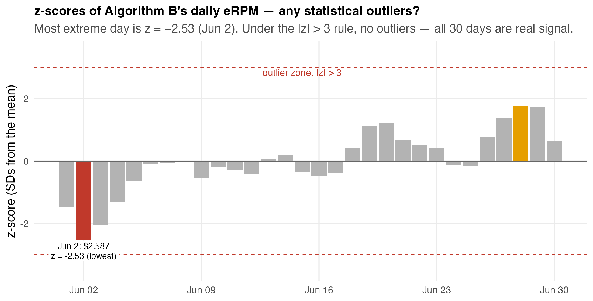
```

::: nonincremental
- The most extreme day is **June 2 at \$2.587, z = −2.53**: notable, but **not** an outlier by the $|z| > 3$ rule (which flags **no** days here).
- The **boxplot** rule flags **two** days below the \$2.80 fence: June 2 *and* **June 3 (\$2.755)**. Same data, two rules, different verdicts; judgment decides.
:::

## A Question That Often Comes Up

:::: {.faq}
**A question that often comes up at this point:**

[The two rules disagree on June 2 and June 3. Which one is right, and should I drop those days?]{.faq-q}

::: {.fragment .faq-a}
**Short answer:** neither is "right": the 1.5×IQR rule is simply more sensitive in the tails than the |z| > 3 rule. A flag is an invitation to investigate, not a delete button. Check whether June 2 and 3 were genuine slow days before you ever drop them.
:::
::::

# Five-Number Summary & Boxplot {background-color="#cfb991"}

## The Five-Number Summary

<br>

- Five numbers summarize a whole distribution: center, spread, and shape in one compact line:

::: fragment

$$
\underbrace{x_{\min}}_{\text{Min}} \;\le\; \underbrace{Q_1}_{\text{25th}} \;\le\; \underbrace{Q_2}_{\text{Median}} \;\le\; \underbrace{Q_3}_{\text{75th}} \;\le\; \underbrace{x_{\max}}_{\text{Max}}
$$

:::

::: fragment

| | Min | $Q_1$ | Median | $Q_3$ | Max |
|---|---:|---:|---:|---:|---:|
| **Algorithm A** | 2.943 | 3.214 | 3.327 | 3.478 | 3.830 |
| **Algorithm B** | 2.587 | 3.324 | 3.434 | 3.674 | 4.073 |

:::

- **Excel:** `=MIN`, `=QUARTILE.INC(rng,1)`, `=MEDIAN`, `=QUARTILE.INC(rng,3)`, `=MAX`.

## Anatomy of a Boxplot

<br>

::: nonincremental
- A **boxplot** draws the five-number summary as a picture:
  - The **box** spans $Q_1$ to $Q_3$ (the middle 50%); its height **is** the IQR.
  - A line inside the box marks the **median**.
  - **Whiskers** reach to the most extreme points still inside the fences:
    - Lower fence: $Q_1 - 1.5\,\text{IQR}$ · Upper fence: $Q_3 + 1.5\,\text{IQR}$.
  - Points **beyond the fences** are plotted individually as **outliers**.
:::

- **Excel 2016+:** select the data → **Insert → Statistic Chart → Box and Whisker**.

## A-vs-B Boxplots Side by Side

```{r  echo=FALSE, out.width = "60%",fig.align="center"}
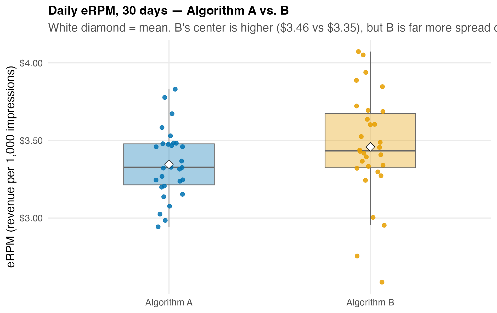
```

::: nonincremental
- One picture carries the whole brief: **B's box is higher** (greater median/mean) **and taller** (greater spread), with two low days (June 2 and June 3) falling past the lower fence.
- This single chart will anchor your team's dashboard.
:::

## Do It in Excel: Five-Number Summary & Boxplot

:::::: columns
::: {.column width="46%"}
**Follow along:**

1. Type five cells per algorithm: `=MIN`, `=QUARTILE.INC(rng,1)`, `=MEDIAN`, `=QUARTILE.INC(rng,3)`, `=MAX`
2. Add `=QUARTILE.INC(rng,3)-QUARTILE.INC(rng,1)` for the **IQR** (B 0.350 vs A 0.264)
3. Select the data -> **Insert -> Statistic Chart -> Box and Whisker**
4. Read it: B's box sits **higher** (median \$3.434) and runs **taller** (wider IQR), two low days past the fence
:::
::: {.column width="54%"}
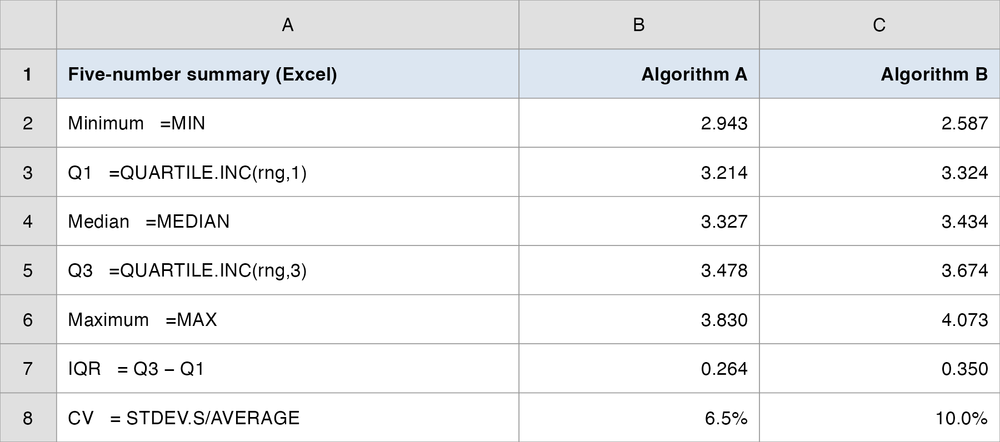{.nostretch fig-align="center" width="100%"}
:::
::::::

# Measures of Association {background-color="#cfb991"}

## From One Variable to Two

<br>

- So far we have summarized **one** variable at a time. Managers usually care about **relationships**: do clicks drive installs? does spending lift sales?

- Two numerical measures of the **linear** relationship between two variables:

::: fragment

| Measure | Tells you | Range |
|---|---|---|
| **Covariance** | the **direction** of the linear relationship | any value (unit-dependent) |
| **Correlation** | direction **and strength**, on a fixed scale | always between **−1 and +1** |

:::

- Start with a **scatter plot**: always look before you compute.

## A Scatter Plot Comes First

```{r  echo=FALSE, out.width = "56%",fig.align="center"}
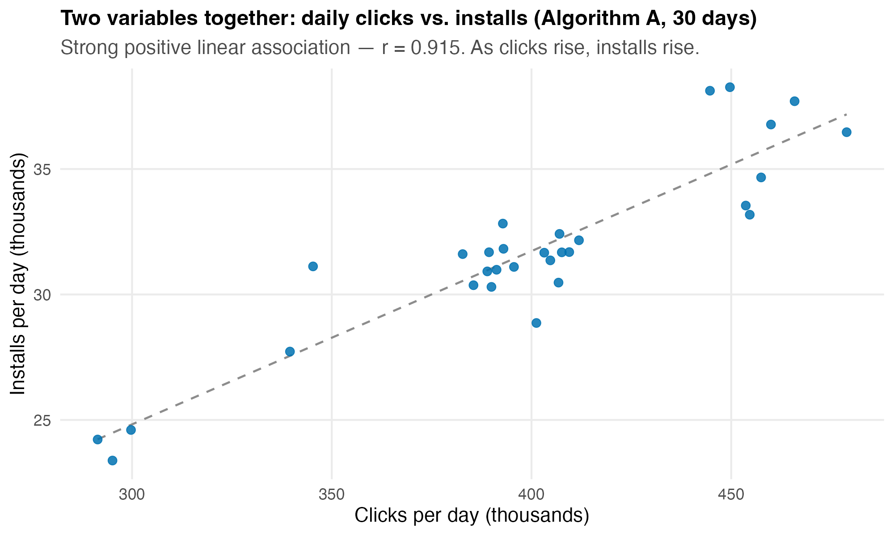
```

::: nonincremental
- Each dot is one day for Algorithm A: its clicks (x) and installs (y). The cloud slopes **up**: more clicks, more installs.
- A scatter plot reveals the **direction, strength, and any non-linearity** the single numbers might hide.
:::

## Covariance: Direction of the Relationship

<br>

- Covariance averages the **product of paired deviations** from each variable's mean:

::: fragment

$$
\text{Sample: } \; s_{xy} = \frac{\sum_{i=1}^{n}(x_i - \bar{x})(y_i - \bar{y})}{n-1}
\qquad
\text{Population: } \; \sigma_{xy} = \frac{\sum (x_i - \mu_x)(y_i - \mu_y)}{N}
$$

:::

- **Sign is the message:** positive → the variables move **together**; negative → they move **opposite**; near zero → no linear relationship.

- **But the magnitude is uninterpretable:** covariance depends on the units. Rescale clicks from raw counts to thousands and the number changes; it captures **direction, not strength**.

- **Excel:** `=COVARIANCE.S(array1, array2)` (sample) or `=COVARIANCE.P(...)` (population).

## Correlation: Direction *and* Strength

<br>

- The **correlation coefficient** divides covariance by the two standard deviations, stripping out the units:

::: fragment

$$
r_{xy} = \frac{s_{xy}}{s_x \, s_y}
$$

:::

::: fragment

| $r$ near… | Linear relationship |
|---|---|
| **+1** | strong **positive** |
| **0** | weak / none |
| **−1** | strong **negative** |

:::

- Always between **−1 and +1**, **unit-free**, so it compares across any two variables. **Excel:** `=CORREL(array1, array2)`.

## Reading r: a Visual Gallery

```{r  echo=FALSE, out.width = "90%",fig.align="center"}
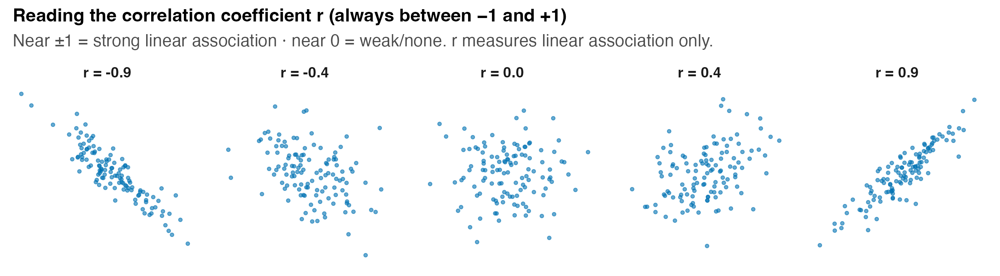
```

::: nonincremental
- As $|r|$ grows, the cloud tightens toward a line. $r$ captures **linear** association only; a perfect U-shape can have $r \approx 0$.
:::

## Vungle Association: Clicks vs. Installs

::: r-fit-text
For Algorithm A's 30 days, with clicks and installs measured in thousands:

| Quantity | Value | Excel |
|---|---:|---|
| Sample covariance $s_{xy}$ | **+163.7** | `=COVARIANCE.S(clicks_k, installs_k)` |
| SD of clicks (thousands) | 48.69 | `=STDEV.S(clicks_k)` |
| SD of installs (thousands) | 3.67 | `=STDEV.S(installs_k)` |
| Correlation $r$ | **+0.915** | `=CORREL(clicks, installs)` |

<br>

::: {.fragment .nonincremental}
- Covariance is **positive** → clicks and installs move together. But "163.7" means nothing on its own.
- Correlation **+0.915** says the same direction *and* that the relationship is **strong**; check: $163.7 / (48.69 \times 3.67) \approx 0.915$.
- **Managerial read:** days with more clicks reliably bring more installs; the funnel holds together.
:::
:::

## Do It in Excel: Covariance & Correlation

:::::: columns
::: {.column width="46%"}
**Follow along:**

1. Put A's daily `clicks` and `installs` in two columns
2. `=COVARIANCE.S(clicks, installs)` returns **+163.7** (direction only)
3. `=CORREL(clicks, installs)` returns **+0.915** (direction and strength, fixed -1 to +1)
4. For a full matrix: **Data -> Data Analysis -> Correlation**, select both columns
:::
::: {.column width="54%"}
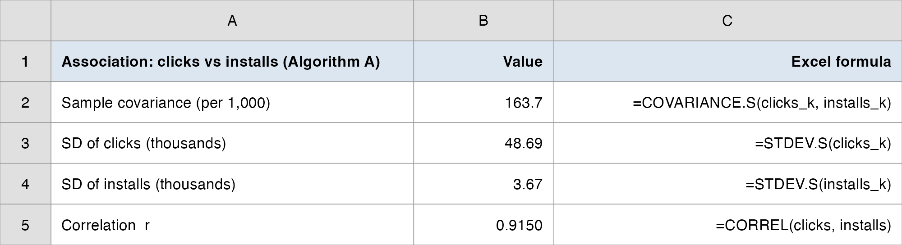{.nostretch fig-align="center" width="100%"}
:::
::::::

## Correlation Is Not Causation

::::: columns
::: {.column style="width: 55%; justify-content: center; align-items: center;"}
::: nonincremental
- A high $r$ means two variables **move together**, *not* that one **causes** the other.

- Clicks and installs are both partly driven by **daily traffic volume**, a lurking third variable.

- The internet is full of nonsense high correlations (cheese consumption vs. bedsheet accidents).

- **Only the experimental design** (random assignment of A vs. B) licenses causal claims; correlation alone never does.
:::
:::

::: {.column style="width: 45%; text-align: center; justify-content: center; align-items: center;"}
```{r  echo=FALSE, out.width = "92%",fig.align="center"}
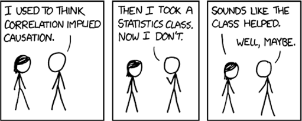
```

::: {style="font-size: 70%;"}
[Spurious Correlations](https://www.tylervigen.com/spurious-correlations)
:::
:::
:::::

## A Question That Often Comes Up

:::: {.faq}
**A question that often comes up at this point:**

[Clicks and installs correlate at +0.92. So more clicks cause more installs?]{.faq-q}

::: {.fragment .faq-a}
**Short answer:** not from the correlation alone. Clicks and installs are both driven by daily traffic volume, a lurking third variable. Only Vungle's randomized A/B design licenses a causal claim; r just says the two move together.
:::
::::

# Debrief: The Manager's Brief {background-color="#cfb991"}

## What the Dashboard Says

<br>

- **Center:** B's mean eRPM (\$3.459) sits about **\$0.11 above** A's (\$3.347); B's edge is real *in this sample*.

- **Spread:** B is **markedly riskier**: SD \$0.344 vs. \$0.217, CV 10.0% vs. 6.5%, a wider IQR and a wider range. **Higher reward comes with higher volatility.**

- **Shape:** both are roughly symmetric (|skew| < 0.5); no day is an outlier by the $|z|>3$ rule, though B's two slow days (June 2 & June 3) fall past the boxplot's lower fence.

- **The honest two-sentence read:** *"Over 30 days, B averaged \$0.11 more per 1,000 impressions than A, but with ~50% more day-to-day volatility. Whether that \$0.11 edge is real signal or sampling noise is a question description alone cannot settle; that needs a hypothesis test."*

## Today's Question, Today's Answer

<br>

**The question (Topic 2 of the ladder):**

> *Is B's edge steady, or just more volatile?*

::: fragment
<br>

**The answer we reached today:**

> **More volatile.** B earns more on average (**\$3.46** vs **\$3.35**), but its day-to-day spread is markedly larger: **SD \$0.34 vs \$0.22**, **CV 10.0% vs 6.5%**, about 50% more volatile relative to its size. Whether that **\$0.11** edge is real signal or sampling noise is the **inference** question, Topics 7-9.
:::

## The Manager's Takeaway

<br>

- **One sentence:** B earns **more on average** (\$3.46 vs. \$3.35) but is **more volatile** (SD \$0.34 vs. \$0.22, CV 10% vs. 6.5%); the mean was only half the story.

- **One number to remember:** **CV**. Algorithm B's spread is **10% of its mean** vs. A's 6.5%; that is the risk you, the manager, must weigh against the \$0.11 reward.

- **One caveat:** description **summarizes the 30 days we have**; it **cannot** tell us whether B's \$0.11 edge generalizes to all future traffic. *Is the edge real or noise?* is an **inference** question, the heart of Topics 7–9.

- **Practice with the real data:** `data/vungle_daily.csv` + the Analysis ToolPak, then reproduce the A-vs-B dashboard. Worked solutions: `data/vungle_descriptive.xlsx`.

## ⏱️ Team Sprint: Your Group Case

::: {.sprint .nonincremental}
**Now it's your group's turn.** Today's in-class group case is posted on **Brightspace** (*Topic 02 Group Case*): a separate business decision you make with today's tools.

**What you'll use:** center, spread, shape, boxplots, and correlation. **Excel:** Analysis ToolPak, then Descriptive Statistics and a Box & Whisker chart.

**Submit one PDF per group before you leave:** your decision plus the numbers behind it.
:::

# Wrap-up {background-color="#cfb991"}

## Summary

::: nonincremental
Some key takeaways from this session:

- **The center is only half the story.** Range, IQR, variance, SD, and CV describe **spread**; two algorithms with the same mean can carry very different risk.
- **Standard deviation** puts spread back in the data's own units; **CV** makes spread comparable across differently-sized series.
- **Shape** (skewness) and **relative location** (z-scores, Empirical Rule, Chebyshev) tell you whether a value is unusual; **outlier rules can disagree**, so investigate before you delete.
- The **five-number summary** and **boxplot** compress center, spread, and shape into one picture, ideal for an A-vs-B comparison.
- **Covariance** gives the direction of a relationship; **correlation** ($-1$ to $+1$) gives direction *and* strength; but **correlation is not causation**.
- For Vungle: **B earns more but is riskier**, and whether its \$0.11 edge is *real* is the inference question we tackle next.
- **Next time:** **Probability**, the chance a random impression installs and how that chance shifts once a viewer clicks.
:::

# Thank you! {background-color="#cfb991"}
