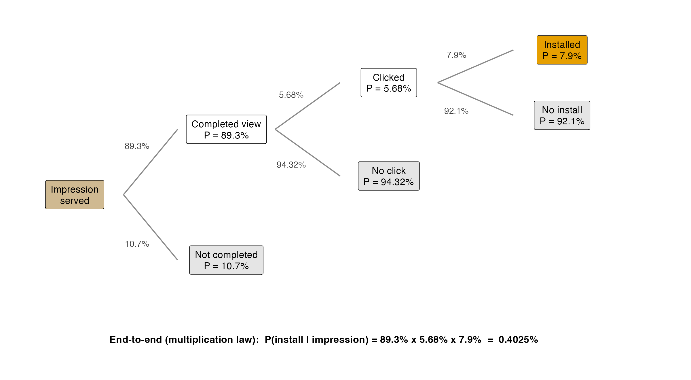
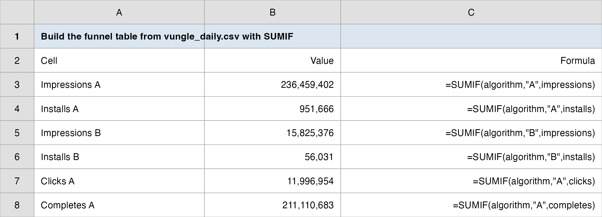
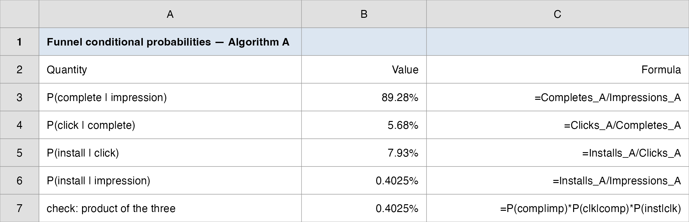
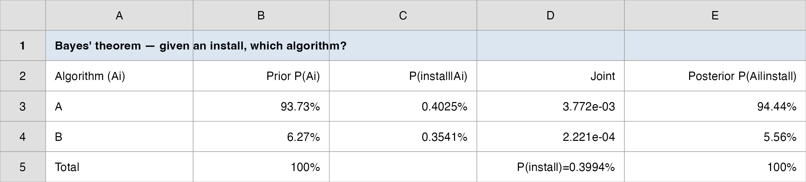
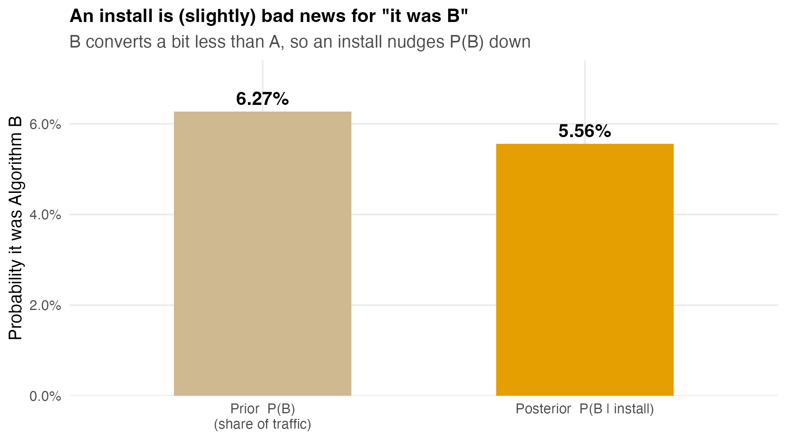
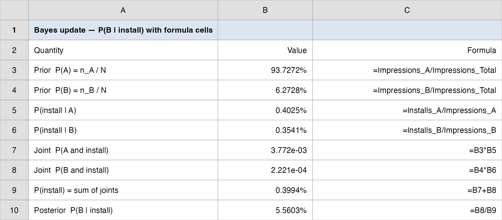

## Overview

:::::: nonincremental
::::: columns
::: {.column style="width: 50%; text-align: center; justify-content: center; align-items: center;"}
- Case Spotlight: the Vungle conversion funnel
- Experiments, sample spaces, and events
- Assigning probabilities; basic relationships
- Conditional probability: the funnel as a chain
:::

::: {.column style="width: 50%; text-align: center; justify-content: center; align-items: center;"}
- The multiplication law and independence
- Bayes' theorem: revising a belief with evidence
- Marginal vs. conditional: the manager's trap
- The decision: what a single install tells you
:::
:::::
::::::

# Case Spotlight: The Vungle Funnel {background-color="#cfb991"}

## Every Impression Is a Gamble

<br>

- **Vungle** serves a 15-second video ad inside another app. Most of the time it earns money only when the viewer **installs** the advertised app.

- Each impression travels a **funnel**: it can be watched to **completion**, then **clicked**, then turn into an **install**, and at every step most users drop off.

- So every ad served is a small bet. The whole business is the **probability** that the bet pays off, and how that probability changes as the user moves down the funnel.

- We carry the same June 2014 A/B dataset from before: 30 days, two algorithms (**A** and **B**), the full funnel counts in `data/vungle_daily.csv`.

## The Brief: Today's Question

<br>

- The big call you carry as Vungle's **manager** is still *roll out algorithm B, or stay with A?* Today's piece of it: **what are the odds at each step of the funnel?**

::: fragment
> "What is the chance a **random impression** ends in an install? And if we already know it was **clicked**, how does that chance change? Finally, we just recorded **one install**: how likely is it that it came from algorithm **B**?"
:::

<br>

- These three questions are the three pillars of probability: a **marginal** chance, a **conditional** chance, and a **reverse** (Bayes) chance.

- **How today's studio runs:** I demo each idea on the Vungle funnel (and a quick textbook anchor); we debrief what one install really tells you; then your group decides on a separate case posted to Brightspace.

## How Today's Tools Answer It

<br>

Every probability concept today maps onto the funnel:

| Funnel question | The tool |
|---|---|
| List every outcome of "serve one ad" | **Experiment, sample space, events** |
| Chance a random impression installs | **Marginal probability** |
| Chance of install **given** a click | **Conditional probability** |
| Chain the funnel steps into one rate | **Multiplication law** |
| Given an install, was it A or B? | **Bayes' theorem** |

<br>

- One funnel, five tools; the last one (Bayes) is where intuition usually breaks.

## How Every Class Runs

{.nostretch fig-align="center" width="90%"}

::: nonincremental
The class **ends on the Team Sprint**, your group's graded submission: a decision plus your read of the analysis, one PDF before you leave.
:::

# Experiments, Events, and Probability {background-color="#cfb991"}

## The Vocabulary of Uncertainty

<br>

- A **random experiment** is any process whose outcome is not known in advance: *serve one impression and watch what happens.*

- The **sample space** $S$ is the set of **all** possible outcomes (the *sample points*).

- An **event** is a collection of outcomes, a subset of $S$.

::: fragment

| Term | "Serve one Vungle impression" |
|---|---|
| Experiment | Show one ad, follow it down the funnel |
| Sample space | $S = \{$ no completion, completion-no-click, click-no-install, **install** $\}$ |
| Event | $I$ = "the impression installs" = one outcome in $S$ |

:::

## What a Probability Is

<br>

- A **probability** is a number measuring how likely an event is. Two rules anchor everything:

::: fragment

$$
0 \le P(E_i) \le 1 \qquad\qquad \sum_{i=1}^{n} P(E_i) = 1
$$

:::

- Near **0** = almost impossible; near **1** = almost certain.

- **Where do the numbers come from?** Three methods:

  - **Classical:** equally likely outcomes (a fair die: each face $1/6$).
  - **Relative frequency:** from data: *Vungle ran 236M impressions and saw 951,666 installs* → $P \approx 0.40\%$.
  - **Subjective:** informed judgment when no data exist (a new product's chance of success).

- Vungle is a **relative-frequency** shop: 30 days of counts give us all our probabilities.

## Basic Relationships You Already Use

::: r-fit-text
| Relationship | Meaning | Formula |
|---|---|---|
| **Complement** | "$A$ does **not** happen" | $P(A^C) = 1 - P(A)$ |
| **Union** | "$A$ **or** $B$ (or both)" | $P(A \cup B) = P(A) + P(B) - P(A \cap B)$ |
| **Intersection** | "$A$ **and** $B$ together" | $P(A \cap B)$, the *joint* probability |
| **Mutually exclusive** | $A$ and $B$ cannot co-occur | $P(A \cap B) = 0 \Rightarrow P(A \cup B) = P(A) + P(B)$ |
:::

<br>

- **Complement, on the funnel:** if $P(\text{install}) = 0.40\%$, then $P(\text{no install}) = 99.60\%$. Most bets lose; that is the ad business.

- The **addition law** subtracts the overlap so you don't double-count it: a customer who buys *both* the DVD *and* the HDTV is counted once in "DVD **or** HDTV."

## Anchor Example: Reading a Contingency Table

:::: nonincremental
::: r-fit-text
A retailer logs **100 customers** by TV type bought and whether they also bought a **DVD player**. The body holds **joint** counts; the margins hold **marginal** totals.

| | Regular | Flat Screen | HDTV | **Total** |
|---|---:|---:|---:|---:|
| **No DVD** | 20 | 10 | 10 | **40** |
| **Bought DVD** | 5 | 25 | 30 | **60** |
| **Total** | **25** | **35** | **40** | **100** |

- **Joint:** $P(\text{DVD and HDTV}) = 30/100 = 0.30$, a body cell over the grand total.
- **Marginal:** $P(\text{Flat Screen}) = 35/100 = 0.35$, a margin over the grand total.
- **Addition law:** $P(\text{DVD or HDTV}) = 0.60 + 0.40 - 0.30 = 0.70$.
:::
::::

# Conditional Probability: The Funnel as a Chain {background-color="#cfb991"}

## Given That…: The Most Useful Idea Today

<br>

- A **conditional probability** is the chance of $A$ **once you know** $B$ has happened, written $P(A \mid B)$:

::: fragment

$$
P(A \mid B) = \frac{P(A \cap B)}{P(B)}
$$

:::

- **Intuition:** $B$ becoming known **shrinks the sample space** to just the $B$ outcomes; you re-weigh $A$ inside that smaller world.

- **On the contingency table:** $P(\text{DVD} \mid \text{HDTV}) = \dfrac{30/100}{40/100} = \dfrac{30}{40} = 0.75$: restrict to the 40 HDTV buyers, then ask how many bought a DVD.

- The whole Vungle funnel is **nothing but a chain of conditional probabilities.**

## A Question That Often Comes Up

:::: {.faq}
**A question that often comes up at this point:**

[Is $P(A \mid B)$ the same as $P(B \mid A)$? Both mention $A$ and $B$, so why would the order matter?]{.faq-q}

::: {.fragment .faq-a}
**Short answer:** they are usually very different, because the denominator changes. $P(\text{install} \mid \text{click}) = 7.93\%$ asks "of clickers, how many install?"; $P(\text{click} \mid \text{install})$ asks "of installers, how many clicked?" and is near 100% (you must click before you install). Same two events, two questions, two answers. Flipping the order is the single most common probability mistake, and Bayes is the tool for doing it correctly.
:::
::::

## The Vungle Funnel Is Conditional Probability

<br>

- Each funnel step *conditions* on surviving the previous one. For algorithm **A** (June totals):

::: fragment

| Step | Conditional probability | Value |
|---|---|---:|
| Watched to completion | $P(\text{complete} \mid \text{impression})$ | **89.28%** |
| Clicked, given completed | $P(\text{click} \mid \text{complete})$ | **5.68%** |
| Installed, given clicked | $P(\text{install} \mid \text{click})$ | **7.93%** |
| Installed overall | $P(\text{install} \mid \text{impression})$ | **0.4025%** |

:::

- Notice the **marginal** install rate ($0.40\%$) is tiny, but the **conditional** rate *given a click* ($7.93\%$) is 20× larger. A clicked impression is worth 20 ordinary ones, so the manager's spend should chase clicks, not raw impressions.

## The Funnel as a Probability Tree

```{r  echo=FALSE, out.width = "82%",fig.align="center"}

```

::: nonincremental
- Each branch is a conditional probability; multiply **along a path** to reach a leaf.
:::

## The Multiplication Law: Chaining the Steps

<br>

- Rearranging the conditional formula gives the **multiplication law**, the probability that **both** events occur:

::: fragment

$$
P(A \cap B) = P(B)\, P(A \mid B) = P(A)\, P(B \mid A)
$$

:::

- Chained down the funnel, it rebuilds the end-to-end install rate from the three step rates:

::: fragment

$$
\underbrace{P(\text{install} \mid \text{imp})}_{0.4025\%} = \underbrace{P(\text{comp} \mid \text{imp})}_{89.28\%} \times \underbrace{P(\text{click} \mid \text{comp})}_{5.68\%} \times \underbrace{P(\text{install} \mid \text{click})}_{7.93\%}
$$

:::

- $0.8928 \times 0.0568 \times 0.0793 = 0.004025$, exactly $951{,}666 / 236{,}459{,}402$. The chain **must** reconcile with the raw counts; if it doesn't, you mislabeled a step.

## Independence: When "Given" Changes Nothing

<br>

- Two events are **independent** when conditioning on one does **not** move the other:

::: fragment

$$
P(A \mid B) = P(A) \quad\Longleftrightarrow\quad P(A \cap B) = P(A)\,P(B)
$$

:::

- **Funnel test:** is clicking independent of completing? Compare $P(\text{click} \mid \text{complete}) = 5.68\%$ with the unconditional click rate $P(\text{click} \mid \text{impression}) = 5.07\%$. They differ → **not independent**: completing the video makes a click *more* likely. That is *why* the funnel must be modeled with conditional, not marginal, probabilities.

- **Warning: do not confuse with mutually exclusive.** Mutually exclusive events with nonzero probability are the *opposite* of independent: if one happens the other *cannot*, so knowing one is maximally informative.

## A Question That Often Comes Up

:::: {.faq}
**A question that often comes up at this point:**

[The completing and clicking rates were close (5.68% vs 5.07%). Isn't that close enough to just call them independent and use one number?]{.faq-q}

::: {.fragment .faq-a}
**Short answer:** independence is exact, not "close." 5.68% is not 5.07%, so completing genuinely raises the click chance, and over 236M impressions that small gap moves real money. More to the point, the whole funnel is *built* on dependence: if the steps were independent, conditioning would be pointless and there would be no funnel to optimize. We keep the conditional numbers because the dependence is the business.
:::
::::

## Do It in Excel: Build the Funnel Totals (SUMIF)

:::::: columns
::: {.column width="46%"}
**Follow along:**

1. Open `vungle_daily.csv`; columns are `algorithm`, `impressions`, `completes`, `clicks`, `installs`.
2. One stage total per cell: `=SUMIF(algorithm,"A",impressions)` gives 236,459,402.
3. Repeat for A's completes, clicks, installs (and the same four for "B").
4. Name each total cell (`Impressions_A`, `Clicks_A`, ...) so the next step reads cleanly.
:::
::: {.column width="54%"}
{.nostretch fig-align="center" width="100%"}
:::
::::::

## Do It in Excel: Funnel Conditional Rates

:::::: columns
::: {.column width="46%"}
**Follow along:**

1. Each conditional rate = the **later** stage cell ÷ its **previous** stage cell.
2. $P(\text{click}\mid\text{comp})$: `=Clicks_A/Completes_A` returns 5.68%.
3. $P(\text{install}\mid\text{click})$: `=Installs_A/Clicks_A` returns 7.93%.
4. Check: the three rates multiplied equal `=Installs_A/Impressions_A` (0.4025%).
:::
::: {.column width="54%"}
{.nostretch fig-align="center" width="100%"}
:::
::::::

# Bayes' Theorem: Revising a Belief {background-color="#cfb991"}

## The Reverse Question

<br>

- The funnel runs **forward**: given the algorithm, what is the install rate? Bayes runs it **backward**: *we just saw an install, which algorithm produced it?*

- We **flip the conditioning**: we know $P(\text{install} \mid \text{algorithm})$, we want $P(\text{algorithm} \mid \text{install})$.

- The ingredients:

  - **Prior** $P(A_i)$: belief *before* the evidence (here: each algorithm's share of traffic).
  - **Likelihood** $P(B \mid A_i)$: how probable the evidence is under each cause (the install rate).
  - **Posterior** $P(A_i \mid B)$: the revised belief *after* the evidence.

::: fragment

$$
\text{Prior} \;\xrightarrow{\;\text{new information}\;}\; \text{Posterior}
$$

:::

## A Question That Often Comes Up

:::: {.faq}
**A question that often comes up at this point:**

[Where does the prior come from? If I have to pick the "before" belief myself, can't I just rig the answer?]{.faq-q}

::: {.fragment .faq-a}
**Short answer:** here the prior is not a guess, it is a count: algorithm B's share of impressions, 6.27%. When data exist, the prior is the base rate; subjective priors are a last resort for genuinely new bets. And the more evidence you feed in, the less the starting prior matters, which is exactly why one lone install barely moves B's number.
:::
::::

## Bayes' Theorem: The Formula

<br>

:::: {style="font-size: 88%;"}
- For mutually exclusive, collectively exhaustive causes $A_1, \dots, A_n$ and evidence $B$:

::: fragment

$$
P(A_i \mid B) = \frac{P(A_i)\,P(B \mid A_i)}{\displaystyle\sum_{j=1}^{n} P(A_j)\,P(B \mid A_j)}
$$

:::

- The **numerator** is one joint probability $P(A_i \cap B) = P(A_i)\,P(B\mid A_i)$ (the multiplication law).

- The **denominator** is $P(B)$, the sum of *all* the joints, by the **total probability** rule.

- So Bayes is just: **(this path's joint) ÷ (total of all joints).** A table does the bookkeeping.
::::

## Anchor Example: A Test-Market Decision

::: r-fit-text
A bank's new product has three possible fates. **Priors** from past launches: $P(\text{Failure}) = 0.80$, $P(\text{Marginal}) = 0.15$, $P(\text{Major success}) = 0.05$. A **test market** then returns a *large* share. How likely is each fate now?

| Outcome $A_i$ | Prior $P(A_i)$ | Likelihood $P(\text{Large}\mid A_i)$ | Joint | Posterior $P(A_i\mid\text{Large})$ |
|---|---:|---:|---:|---:|
| Failure | 0.80 | 0.02 | 0.0160 | 0.0160 / 0.1010 = **0.158** |
| Marginal | 0.15 | 0.24 | 0.0360 | **0.356** |
| Major success | 0.05 | 0.98 | 0.0490 | 0.0490 / 0.1010 = **0.485** |
| **Total** | **1.00** | | $P(\text{Large}) =$ **0.1010** | **1.000** |

A *large* test result lifts "Major success" from a **5%** prior to a **49%** posterior (nearly ten-fold): the same evidence that costs a few thousand to gather swings the launch decision from "no" to "go."
:::

## The Vungle Bayes Update: Setup

<br>

- **Evidence:** we recorded one **install**. **Question:** $P(B \mid \text{install})$?

- **Prior** = each algorithm's share of impressions (the 1/16 hash split sends most traffic to A):

::: fragment

$$
P(A) = \frac{236.5\text{M}}{252.3\text{M}} = 93.73\% \qquad P(B) = \frac{15.8\text{M}}{252.3\text{M}} = 6.27\%
$$

:::

- **Likelihood** = each algorithm's install rate (from the funnel):

::: fragment

$$
P(\text{install} \mid A) = 0.4025\% \qquad P(\text{install} \mid B) = 0.3541\%
$$

:::

- B is both a **smaller** share *and* a **lower** converter, so before any math, an install should make B look *less* likely than its 6.27% prior.

## The Vungle Bayes Update: The Table

```{r  echo=FALSE, out.width = "92%",fig.align="center"}

```

::: nonincremental
- $P(B \mid \text{install}) = \dfrac{0.0627 \times 0.003541}{0.9373 \times 0.004025 + 0.0627 \times 0.003541} = \dfrac{0.000222}{0.003994} = \mathbf{5.56\%}$.
:::

## What the Update Means

```{r  echo=FALSE, out.width = "60%",fig.align="center"}

```

::: nonincremental
- An install *lowers* the chance it was B (6.27% → **5.56%**): because B converts at a slightly lower rate, an install is weak evidence **against** B.
- Same machinery, reversed for a **click**: $P(B \mid \text{click}) = 6.10\%$, a click is also mild evidence against B, but less so than an install.
:::

## A Question That Often Comes Up

:::: {.faq}
**A question that often comes up at this point:**

[An install barely moved B's number, from 6.27% to 5.56%. So is Bayes basically useless here?]{.faq-q}

::: {.fragment .faq-a}
**Short answer:** the small move *is* the finding. It says one install carries almost no information about which algorithm served it, because A's and B's install rates (0.4025% vs 0.3541%) are so close and A dominates the traffic. Bayes earns its keep by telling you *not* to over-read a single event: the manager should judge A vs B on thirty days of rates, never on one observed install.
:::
::::

## Do It in Excel: The Bayes Update

:::::: columns
::: {.column width="46%"}
**Follow along:**

1. One row per algorithm (A, B); type the **priors** (impression shares: 0.9373, 0.0627).
2. Type the **likelihoods** next to them (install rates: 0.004025, 0.003541).
3. **Joint** column: `=prior*likelihood` for each row.
4. `=SUM(joint range)` gives $P(\text{install})$; **posterior** = B's joint ÷ that sum.
:::
::: {.column width="54%"}
{.nostretch fig-align="center" width="100%"}
:::
::::::

# Debrief: Marginal vs. Conditional {background-color="#cfb991"}

## The Manager's Trap

<br>

- The three answers to today's Brief are **three different numbers** for the *same* funnel:

::: fragment

| Question | Type | Answer |
|---|---|---:|
| Chance a random impression installs | **Marginal** | 0.40% |
| Chance of install **given a click** | **Conditional** | 7.93% |
| Given an install, chance it was **B** | **Bayes (reverse)** | 5.56% |

:::

- Confusing these is the classic error: *"B has a lower install rate, so most installs come from A"* is true, but only because A serves 15× more traffic, **not** because A is the better algorithm. **Rates and counts answer different questions.**

## A Question That Often Comes Up

:::: {.faq}
**A question that often comes up at this point:**

[If most installs come from A, why is the rollout question even open? Doesn't "more installs" settle that A wins?]{.faq-q}

::: {.fragment .faq-a}
**Short answer:** A produces more installs only because A is shown to far more impressions, not because each A impression is better. The rollout call compares *rates per impression*, where A and B are nearly tied (0.4025% vs 0.3541%). Counting total installs answers "which got more traffic?"; deciding A vs B needs the rate, and proving that gap is real is the inference work in Topics 7 to 9.
:::
::::

## Why Conditioning Drives the Funnel

<br>

- The unconditional install rate (0.40%) makes every ad look like a near-certain loss. But the **conditional** rates tell the real operational story:

  - A completed view raises the click chance (5.68% vs. 5.07% unconditional) → completion is **not** independent of clicking.
  - A click raises the install chance 20-fold (7.93% vs. 0.40%).

- **So where should Vungle spend?** On the steps with the steepest conditional lift: getting users to *complete* and *click*, because everything downstream is conditioned on them.

- This is the bridge to the next topics: those conditional rates become the **parameters** of probability *models* (a click is a Bernoulli trial with $p \approx 5\%$).

## Today's Question, Today's Answer

<br>

**The question (Topic 3 of the ladder):**

> *What are the odds at each step of the funnel?*

::: fragment
<br>

**The answer we reached today:**

> A random impression installs **0.40%** of the time (the marginal rate). Condition on a **click** and that jumps to **7.93%**, a 20-fold lift, so the funnel is a chain of conditional probabilities, not one flat rate. Run it **backward** with Bayes and an observed install is only weak evidence it came from B (**5.56%** posterior vs. a **6.27%** prior).
:::

## The Manager's Takeaway

<br>

- **One sentence:** every funnel rate is a **conditional probability**, the end-to-end install rate is their **product**, and Bayes lets you read the funnel **backward**, from an observed install to the likely algorithm.

- **One number to remember:** **0.40%**, the marginal install rate, and how a single click multiplies it 20-fold to **7.93%**, so the verdict is chase clicks, not raw impressions.

- **One caveat:** an install is *weak* evidence about which algorithm served it ($P(B\mid\text{install}) = 5.56\%$ vs. a $6.27\%$ prior); base rates dominate, so never read a posterior off the likelihood alone.

- **Practice with the real data:** `data/vungle_daily.csv` + `SUMIF` → reproduce the funnel rates; `data/vungle_probability.xlsx` holds the worked funnel and Bayes tables.

## ⏱️ Team Sprint: Your Group Case

::: {.sprint .nonincremental}
**Now it's your group's turn.** Today's in-class group case is posted on **Brightspace** (*Topic 03 Group Case*): a separate business decision you make with today's tools.

**What you'll use:** probability rules, conditional probability, and **Bayes**. **Excel:** Analysis ToolPak (probabilities are `SUMIF` ratios and a small Bayes table).

**Submit one PDF per group before you leave:** your decision plus the numbers behind it.
:::

# Wrap-up {background-color="#cfb991"}

## Summary

::: nonincremental
Some key takeaways from this session:

- **Probability vocabulary:** an experiment has a **sample space** of outcomes; an **event** is a subset; probabilities live in $[0,1]$ and sum to 1. **Basic relationships:** complement, union (the addition law subtracts the overlap), intersection (joint), mutually exclusive.
- **Conditional probability** $P(A\mid B) = P(A\cap B)/P(B)$ is the engine of funnel analytics: each step conditions on surviving the last.
- The **multiplication law** chains the steps into the end-to-end rate; **independence** is when conditioning changes nothing (the funnel steps are *not* independent).
- **Bayes' theorem** reverses the conditioning (prior → posterior); base rates dominate, so one install is weak evidence about which algorithm served it.
- **Marginal, conditional, and reverse probabilities are different numbers** for the same data; match the number to the manager's question.
- **Next time:** probabilities become **decisions** in Decision Analysis (payoffs, expected value, value of information). Today's tools are also drilled on **HW1** (group, on Brightspace).
:::

# Thank you! {background-color="#cfb991"}
