## Overview

:::::: nonincremental
::::: columns
::: {.column style="width: 50%; text-align: center; justify-content: center; align-items: center;"}
- Case Spotlight: the Vungle rollout decision
- Structuring a decision: alternatives, states of nature, payoffs
- Payoff tables and decision trees
- Expected value (EV): deciding under risk
:::

::: {.column style="width: 50%; text-align: center; justify-content: center; align-items: center;"}
- Expected value of perfect information (EVPI)
- Sample information, Bayes revision, and EVSI
- Sensitivity: does the call hold if the prior shifts?
- From inference to action: making the rollout recommendation
:::
:::::
::::::

# Case Spotlight: The Vungle Rollout Decision {background-color="#cfb991"}

## Rewind: Before the A/B Test

<br>

- Earlier in our work with **Vungle** (the mobile ad-tech startup that earns revenue when viewers **install** an advertised app) we tested whether their new ad-serving algorithm **B** beat the incumbent **A**.

- The verdict: B's daily eRPM (revenue per 1,000 impressions) ran about **\$0.11 higher** than A's, and a paired test said that lift was **real** ($t = 3.33$), worth roughly **\$26.5K/month** at June's traffic.

- But statistics told us *what is true and how sure we are*. They did **not** tell management **what to do**.

- Today you put on the **manager's hat**: given that uncertainty, what is the right **action**?

## The Brief: Today's Manager Question

<br>

- **The big call** running through Vungle is one decision: *roll out algorithm B to all traffic, or stay with A?* **Today's piece of it:** roll out, keep A, or test more, which has the best **expected value**?

::: fragment
> "Algorithm B looks better, but we're not certain. Do we **roll out B** to all traffic now, **keep A** and play it safe, or **run a bigger test** before committing? Quantify it and make the call."
:::

<br>

- Rolling out B and being **wrong** degrades *all* of Vungle's revenue, not a 1/16 slice. Keeping A forgoes a real upside. Testing more costs time and money.

- **How today's studio runs:** I demo each tool on a textbook anchor; you reproduce the Vungle rollout tree and interrogate it; we debrief the recommendation together.

- By the end of class, **you** make the call, with the decision math to back it up.

## How Every Class Runs

{.nostretch fig-align="center" width="90%"}

::: nonincremental
The class **ends on the Team Sprint**, your group's graded submission: a decision plus your read of the analysis, one PDF before you leave.
:::

## How Today's Tools Answer It

<br>

Every tool today maps onto the Vungle rollout:

| The manager's question | The tool |
|---|---|
| What are my options, and what could happen? | **Payoff table** (alternatives × states) |
| What's the sequence of choice and chance? | **Decision tree** |
| Which option is best *on average*? | **Expected value (EV)** |
| What is it worth to remove the uncertainty? | **EVPI** / **EVSI** |
| Would the call change if I'm a bit off? | **Sensitivity analysis** |

<br>

- One decision, five tools, and they all build on the **probability** logic from earlier in the course.

# Structuring the Decision {background-color="#cfb991"}

## Step Zero: Problem Formulation

<br>

- Before any number, **decision analysis** forces three clean lists:

  - **Decision alternatives:** the strategies *you* control.
  - **States of nature:** the uncertain future events *you do not* control. They must be **mutually exclusive** and **collectively exhaustive**.
  - **Payoffs:** the consequence (profit, cost, time…) of each *alternative × state* combination.

- The discipline is in the structuring: most bad business decisions come from a **missing alternative** or an **unstated state of nature**, not from arithmetic.

- The whole apparatus (payoff tables, trees, EV) is just bookkeeping on top of these three lists.

## The Vungle Decision, in Three Lists

<br>

**Decision alternatives** (what Vungle controls):

::: nonincremental
- $d_1$: **Roll out B now** to all traffic
- $d_2$: **Keep A** (the safe baseline)
- $d_3$: **Run a bigger test** first, then decide
:::

**States of nature** (the uncertainty management faces):

::: nonincremental
- $s_1$: **B is truly better** than A
- $s_2$: **B is not better** (no real lift, or worse)
:::

- These two states are mutually exclusive and exhaustive: exactly one is true, we just don't know which.

- **Payoffs** come next, and we'll build them from the data we already have.

## Where Do the Payoffs Come From? The Data

<br>

- We don't invent payoffs; we **anchor them in the eRPM evidence**:

  - The mean lift was **+\$0.112** per 1,000 impressions; A served **≈ 236.5M** impressions/month.
  - At that scale: $\dfrac{236{,}459{,}402}{1{,}000} \times \$0.112 \approx \$26.5\text{K/month} \approx \$318\text{K/year}$.

::: fragment

| If we **roll out B** and… | Annual payoff (\$K) | Reasoning |
|---|---:|---|
| $s_1$: B *is* truly better | **+318** | full lift across all traffic |
| $s_2$: B is *not* better | **−160** | degraded revenue vs. a working algorithm |

:::

- **Keep A** is the baseline: **\$0** in both states (no gain, no loss).

- *(The −160 is management's estimate of the downside of replacing a working algorithm with a worse one, about half the upside. We'll stress-test it later.)*

## The Payoff Table

<br>

The payoff table is the whole problem on one page; rows are **alternatives**, columns are **states of nature**:

::: fragment

| Decision alternative | $s_1$: B truly better | $s_2$: B not better |
|---|---:|---:|
| $d_1$: Roll out B now | **+\$318K** | **−\$160K** |
| $d_2$: Keep A | \$0 | \$0 |

:::

<br>

- Read a cell as: "*if I choose this row and that state occurs, this is what I get*."

- A payoff table with no probabilities supports only crude rules (best-case, worst-case). To do better, we need the **odds** on the states; that is the next ingredient.

## A Question That Often Comes Up

:::: {.faq}
**A question that often comes up at this point:**

[The +318 comes straight from the eRPM data, but the −160 downside is just management's estimate. Doesn't that make the whole table arbitrary?]{.faq-q}

::: {.fragment .faq-a}
**Short answer:** the downside is a judgment, not data, and that is fine as long as you say so and test it. We pin +318 to the measured \$0.112 lift at 236.5M impressions, and we flag −160 as an estimate (about half the upside). The discipline is putting the number on the table so it can be **stress-tested**; later the sensitivity step shows exactly how wrong −160 would have to be to change the call.
:::
::::

## Decision Trees: Sequencing Choice and Chance

```{r  echo=FALSE, out.width = "78%",fig.align="center"}
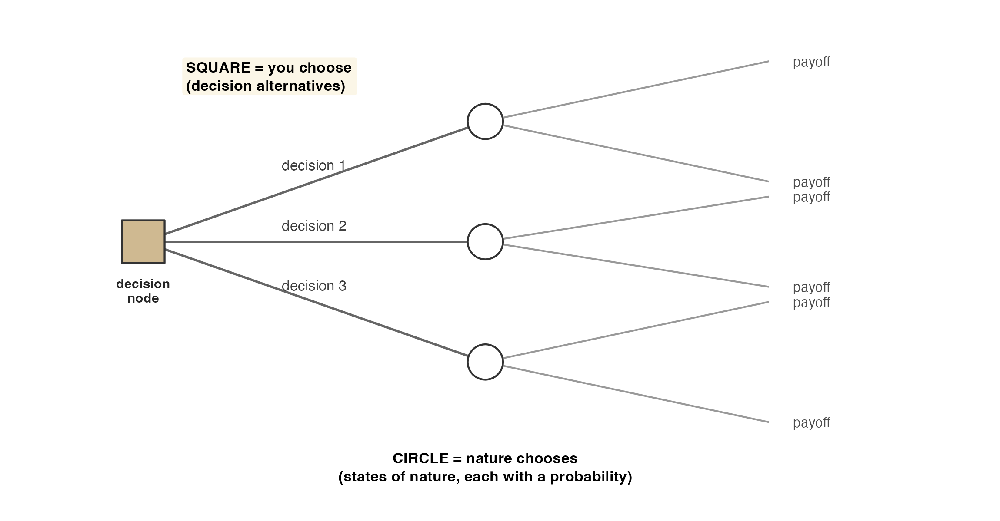
```

::: nonincremental
- **Square node = a decision** (you choose the branch). **Round node = a chance event** (nature chooses, with probabilities).
- Branches from a square = alternatives; branches from a circle = states of nature. **Payoffs sit at the tips.**
:::

# Decision Making with Probabilities {background-color="#cfb991"}

## Putting Odds on the States of Nature

<br>

- To choose, we need $P(s_1)$ and $P(s_2)$. Because exactly one state occurs, they must satisfy

::: fragment

$$
P(s_j) \geq 0 \quad\text{for all } j, \qquad \sum_{j=1}^{N} P(s_j) = 1
$$

:::

- Vungle's data-science team, having seen the encouraging A/B signal, assigns a **prior**:

  - $P(s_1) = 0.60$ (B truly better) and $P(s_2) = 0.40$ (not better).

- These can come from the **classical**, **relative-frequency**, or **subjective** method. Here they are an informed subjective judgment, and we will **test how much they matter** at the end.

## The Expected Value Approach

<br>

- The **expected value** of a decision alternative is its probability-weighted average payoff:

::: fragment

$$
EV(d_i) = \sum_{j=1}^{N} P(s_j)\, V_{ij}
$$

:::

- where $V_{ij}$ is the payoff for alternative $d_i$ under state $s_j$, and $N$ is the number of states.

- The **decision rule:** choose the alternative with the **best EV** (highest for profit, lowest for cost).

- In Excel, one formula does it: `=SUMPRODUCT(probabilities, payoff_row)`.

## Do It in Excel: Expected Value

:::::: columns
::: {.column width="46%"}
**Follow along:**

1. Put the **priors** in one row (0.60, 0.40) and each alternative's **payoff row** beneath ($d_1$: 318, −160; $d_2$: 0, 0)
2. In an **EV** cell for $d_1$: `=SUMPRODUCT($B$3:$C$3, B4:C4)` (lock the priors with `$`)
3. Fill the formula **down** to get EV for every alternative
4. Read the **best EV** (roll out B = \$126.8K vs. keep A = \$0); that row is the call
:::
::: {.column width="54%"}
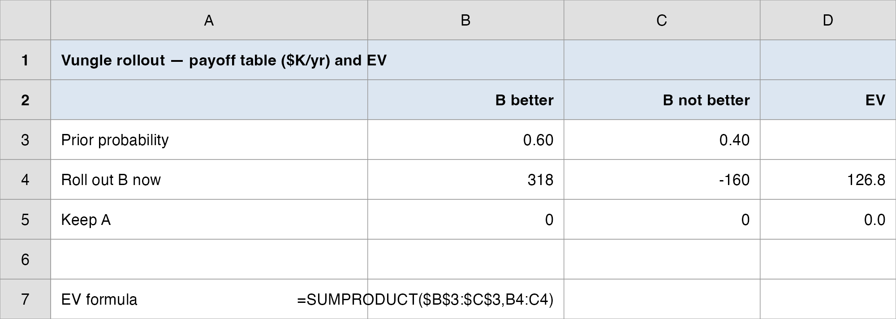{.nostretch fig-align="center" width="100%"}
:::
::::::

## Anchor Example: Burger Prince

::: r-fit-text
**Burger Prince** is choosing a restaurant layout. Demand could be **80, 100, or 120** customers/hour, with probabilities **0.4, 0.2, 0.4**. Profit (\$):

| Model | $s_1{=}80$ (0.4) | $s_2{=}100$ (0.2) | $s_3{=}120$ (0.4) | **EV** |
|---|---:|---:|---:|---:|
| A | 10,000 | 15,000 | 14,000 | **\$12,600** |
| B | 8,000 | 18,000 | 12,000 | \$11,600 |
| **C** | 6,000 | 16,000 | 21,000 | **\$14,000** ✅ |

$$
EV(\text{C}) = 0.4(6{,}000) + 0.2(16{,}000) + 0.4(21{,}000) = \$14{,}000
$$

**Decision:** Model C has the highest EV → choose **Model C**. (We'll reuse this example for EVPI and Bayes.)
:::

## The Vungle Decision Tree

```{r  echo=FALSE, out.width = "82%",fig.align="center"}
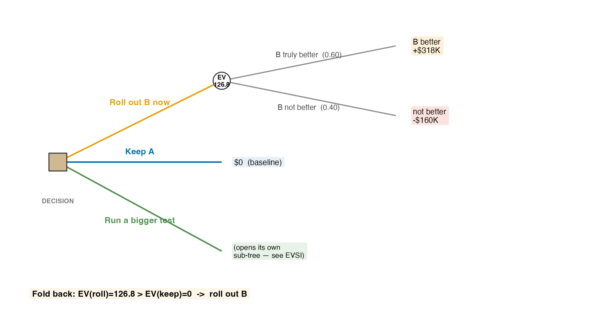
```

::: nonincremental
- The square is Vungle's choice; the circle is nature deciding whether B is truly better. To pick a branch, we **fold the tree back**: replace each chance node by its EV.
:::

## Folding Back: EV of Each Vungle Alternative

<br>

Using priors $P(s_1)=0.60$, $P(s_2)=0.40$:

::: fragment

$$
EV(\text{Roll out B}) = 0.60(318) + 0.40(-160) = 190.8 - 64.0 = \mathbf{\$126.8K}
$$

:::

::: fragment

$$
EV(\text{Keep A}) = 0.60(0) + 0.40(0) = \mathbf{\$0}
$$

:::

<br>

- **Decision rule:** \$126.8K > \$0 → **roll out B**.

- The expected payoff is positive *because* the upside (+318) is large and fairly likely (0.60), even though the downside (−160) is real.

## A Question That Often Comes Up

:::: {.faq}
**A question that often comes up at this point:**

[Why do we work the tree from the tips backward to the root, instead of forward from Vungle's choice?]{.faq-q}

::: {.fragment .faq-a}
**Short answer:** you cannot score the "roll out B" branch until you know what the chance node beyond it is worth, and that needs the payoffs at the tips. So you start at the right (the +318 / −160 tips), collapse each chance circle into its EV, and only then can the square at the left compare branches. Forward, you would be choosing before you knew what each choice leads to.
:::
::::

## Visualizing the Expected Values

```{r  echo=FALSE, out.width = "68%",fig.align="center"}
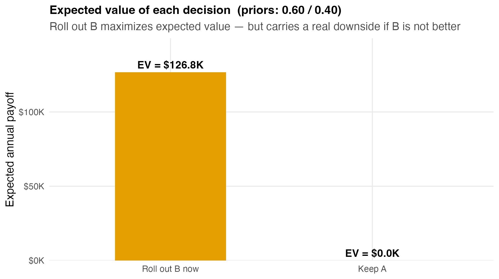
```

::: nonincremental
- EV ranks the alternatives, but it **hides the risk**: "roll out B" averages +\$126.8K while still risking a **−\$160K** year. EV is the right tool when this decision repeats; a one-shot, bet-the-company call would also weigh that downside.
:::

## A Quick Check on the Logic

<br>

- **EV is a long-run average, not a guaranteed outcome.** If Vungle faced this exact decision many times, "roll out B" would net +\$126.8K *per decision on average*.

- The actual result will be **either** +\$318K **or** −\$160K, never \$126.8K. The expected value is a **ranking device**, not a forecast of what happens this once.

- This is exactly why a manager also asks: *what would it be worth to know the true state before deciding?* That question has a precise answer: **EVPI**.

# The Value of Information {background-color="#cfb991"}

## Expected Value of Perfect Information (EVPI)

<br>

- Imagine a perfect oracle who tells you the true state **before** you decide. How much is that worth?

- **EVwPI** (expected value *with* perfect information): for each state, take the **best** payoff you'd choose if you knew that state, then weight by the priors.

- **EVPI** is the *gain* over deciding blind:

::: fragment

$$
\text{EVPI} = \lvert\, \text{EVwPI} - \text{EVwoPI} \,\rvert
$$

:::

- where **EVwoPI** is the best EV **without** information, what we just computed (\$126.8K).

- EVPI is an **upper bound** on the value of *any* study, survey, or test: no information can beat perfect information.

## EVPI: the Three Steps (Vungle)

::: r-fit-text
**Step 1, best payoff in each state** (look down each column of the payoff table):

| State | Best choice if you knew | Best payoff |
|---|---|---:|
| $s_1$: B truly better (0.60) | Roll out B | +\$318K |
| $s_2$: B not better (0.40) | Keep A | \$0 |

**Step 2, expected value of those best returns:**

$$
\text{EVwPI} = 0.60(318) + 0.40(0) = \$190.8\text{K}
$$

**Step 3, subtract the best EV without information:**

$$
\text{EVPI} = 190.8 - 126.8 = \mathbf{\$64K}
$$
:::

## What EVPI Tells the Manager

```{r  echo=FALSE, out.width = "60%",fig.align="center"}
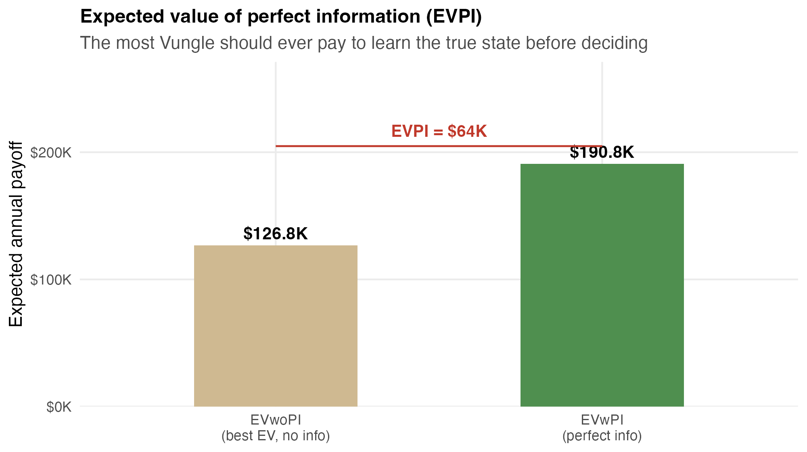
```

::: nonincremental
- **\$64K** is the *most* Vungle should ever pay to remove all doubt about B before deciding. Any real test (always imperfect) is worth **less** than this ceiling.
:::

## A Question That Often Comes Up

:::: {.faq}
**A question that often comes up at this point:**

[A perfect oracle doesn't exist. Why compute the value of information Vungle can never actually buy?]{.faq-q}

::: {.fragment .faq-a}
**Short answer:** because it gives you a hard ceiling before you shop. Any real study (an A/B test, a survey) is imperfect, so it is worth strictly less than the \$64K EVPI. The instant a vendor quotes more than \$64K for any study, you decline without doing further math. EVPI is the budget cap that no real information can ever justify exceeding.
:::
::::

## Do It in Excel: EVPI

:::::: columns
::: {.column width="46%"}
**Follow along:**

1. Below the payoff table, add a **Best per state** cell under each column: `=MAX(B4:B5)`, `=MAX(C4:C5)`
2. **EVwPI** in one cell: `=SUMPRODUCT($B$3:$C$3, best-per-state)` (the priors times the best returns)
3. **EVPI** in the next cell: `=EVwPI - EVwoPI` (subtract the best blind EV, \$126.8K)
4. Read **EVPI = \$64K**; it is always **≥ 0** (you can ignore information, so it can't hurt)
:::
::: {.column width="54%"}
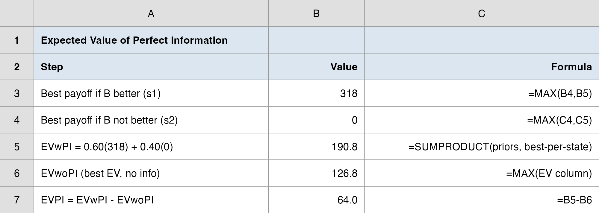{.nostretch fig-align="center" width="100%"}
:::
::::::

# Sample Information & Bayes {background-color="#cfb991"}

## The Third Alternative: Run a Bigger Test

<br>

- Vungle's real third option, $d_3$, is to **buy information**: run a larger, longer A/B test before committing.

- A test is **imperfect** (sample) information: it returns a **signal**, not the truth.

  - **Favorable (F):** the bigger test shows a significant lift.
  - **Unfavorable (U):** the test shows no significant lift.

- The signal is **reliable but not perfect**. Suppose the test's track record gives the conditional probabilities:

::: fragment

$$
P(F \mid s_1) = 0.80, \qquad P(F \mid s_2) = 0.25
$$

:::

- "When B really is better, the test flags it 80% of the time; when B is not better, it gives a false 'favorable' 25% of the time."

## Prior, Conditional, Posterior

<br>

- We have **priors** $P(s_j)$ and **conditionals** $P(\text{signal} \mid s_j)$. We want the **posterior**, the revised odds *after* seeing the signal:

::: fragment

$$
P(s_j \mid \text{signal}) = \frac{P(s_j)\,P(\text{signal}\mid s_j)}{\sum_k P(s_k)\,P(\text{signal}\mid s_k)}
$$

:::

- This is **Bayes' theorem**, the same updating logic from earlier in the course, now feeding a decision tree.

- A simple **tabular** layout does the arithmetic: **prior → joint → marginal → posterior**. The posteriors become the **branch probabilities** on the tree after the test.

## Do It in Excel: Bayes Revision (Favorable Report)

:::::: columns
::: {.column width="46%"}
**Follow along:**

1. List the **priors** column (0.60, 0.40) and the **conditionals** $P(F \mid s_j)$ (0.80, 0.25)
2. **Joint** column: `=prior*conditional` → 0.48, 0.10
3. **Marginal** $P(F)$: `=SUM(joint)` = 0.48 + 0.10 = 0.58
4. **Posterior** column: `=joint/marginal`; read the odds B is better rise **0.60 → 0.828**
:::
::: {.column width="54%"}
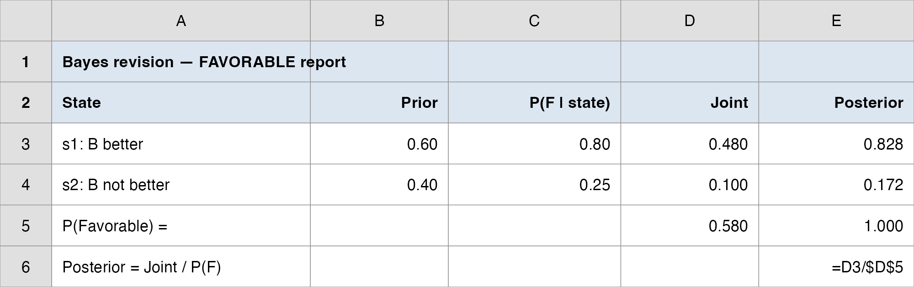{.nostretch fig-align="center" width="100%"}
:::
::::::

## Do It in Excel: Bayes Revision (Unfavorable Report)

:::::: columns
::: {.column width="46%"}
**Follow along:**

1. Repeat the table with the **other** conditionals $P(U \mid s_j)$ (0.20, 0.75)
2. **Joint**: `=prior*conditional` → 0.12, 0.30
3. **Marginal** $P(U)$: `=SUM(joint)` = 0.42 (check: 0.58 + 0.42 = 1)
4. **Posterior** = `=joint/marginal`; the odds B is better **drop 0.60 → 0.286** (same data, opposite signal)
:::
::: {.column width="54%"}
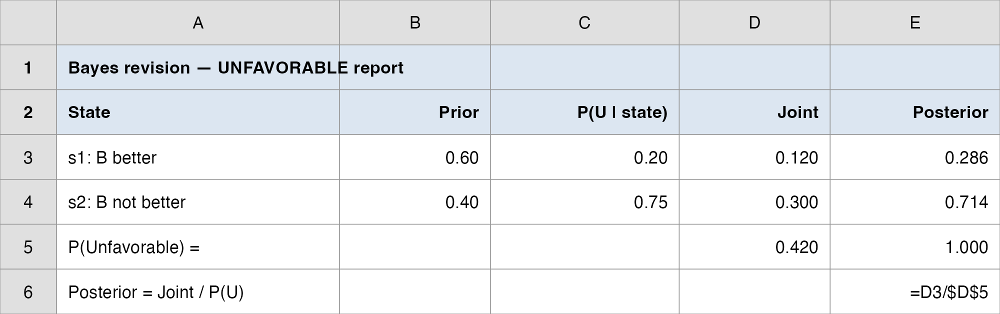{.nostretch fig-align="center" width="100%"}
:::
::::::

## The Signal Moves the Decision

```{r  echo=FALSE, out.width = "70%",fig.align="center"}
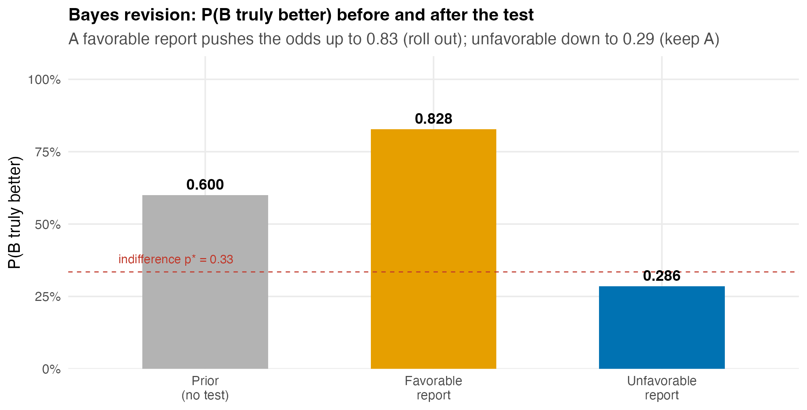
```

::: nonincremental
- After **favorable**: $EV(\text{roll}) = 0.828(318) + 0.172(-160) = \$235.6K > 0$ → **roll out B**.
- After **unfavorable**: $EV(\text{roll}) = 0.286(318) + 0.714(-160) = -\$23.4K < 0$ → **keep A**.
:::

## A Question That Often Comes Up

:::: {.faq}
**A question that often comes up at this point:**

[A favorable report only lifts the odds from 0.60 to 0.828, not to certainty. Why doesn't a positive test just prove B is better?]{.faq-q}

::: {.fragment .faq-a}
**Short answer:** because the test is imperfect: it cries "favorable" 25% of the time even when B is *not* better ($P(F \mid s_2) = 0.25$). So some favorable reports are false alarms, and the posterior holds back from 1.0 to absorb that. The stronger the signal (a lower false-alarm rate), the closer to certainty it would push you; a perfect test would take you to 1.0, which is exactly the oracle EVPI priced.
:::
::::

## Expected Value of Sample Information (EVSI)

<br>

- The test is worth the *extra* expected profit it buys, **before** its cost:

::: fragment

$$
\text{EVSI} = \lvert\, \text{EVwSI} - \text{EVwoSI} \,\rvert
$$

:::

- **EVwSI** weights each signal's best decision by how often that signal occurs:

::: fragment

$$
\text{EVwSI} = P(F)\,(235.6) + P(U)\,(0) = 0.58(235.6) + 0.42(0) = \$136.6\text{K}
$$

:::

- **EVwoSI** is the best EV with no test = **\$126.8K**. So

::: fragment

$$
\text{EVSI} = 136.6 - 126.8 = \mathbf{\$9.84K}
$$

:::

## Is the Test Worth Buying?

```{r  echo=FALSE, out.width = "58%",fig.align="center"}
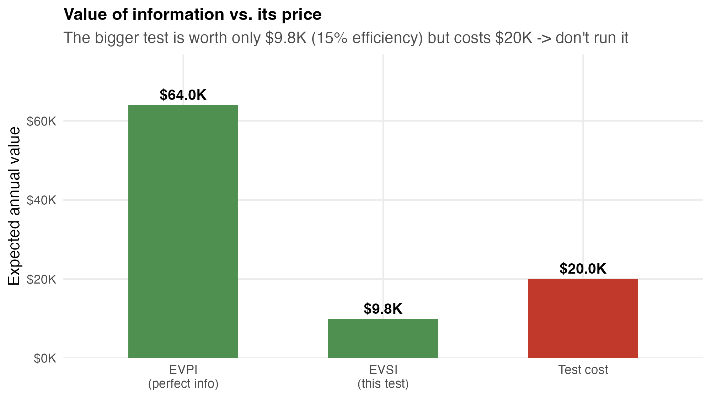
```

::: nonincremental
- **Efficiency** $= \text{EVSI}/\text{EVPI} = 9.84/64 \approx 15\%$: this imperfect test captures only 15% of perfect information's value.
- The test costs **≈ \$20K** to run, but is worth only **\$9.84K** → **net −\$10K**. **Do not run the bigger test.** (Compare: the textbook's Burger Prince survey also failed this test, EVSI \< its price.)
:::

## A Question That Often Comes Up

:::: {.faq}
**A question that often comes up at this point:**

[We already ran an A/B test, and that was clearly worth it. So why is running a *bigger* test now not worth it?]{.faq-q}

::: {.fragment .faq-a}
**Short answer:** EVSI is the value of information *from where you stand now*. Before the first test, Vungle knew almost nothing, so a test bought a lot. After it, the 0.60 prior already points toward rolling out, so a second test would mostly confirm what you would do anyway: it only changes the call in the unfavorable case, which is unlikely. Less left to learn means a smaller EVSI (\$9.84K), and that is now below the \$20K price.
:::
::::

## Do It in Excel: EVSI

:::::: columns
::: {.column width="46%"}
**Follow along:**

1. From each Bayes table, compute the **best EV after that signal** with the posteriors: favorable \$235.6K, unfavorable \$0
2. **EVwSI**: `=SUMPRODUCT(P(signal), best-EV)` = `0.58*235.6 + 0.42*0` = \$136.6K
3. **EVSI**: `=EVwSI - EVwoSI` = `136.6 - 126.8` = **\$9.84K**
4. Compare to the **test cost** (\$20K): EVSI \< cost, so **skip the study** and decide now
:::
::: {.column width="54%"}
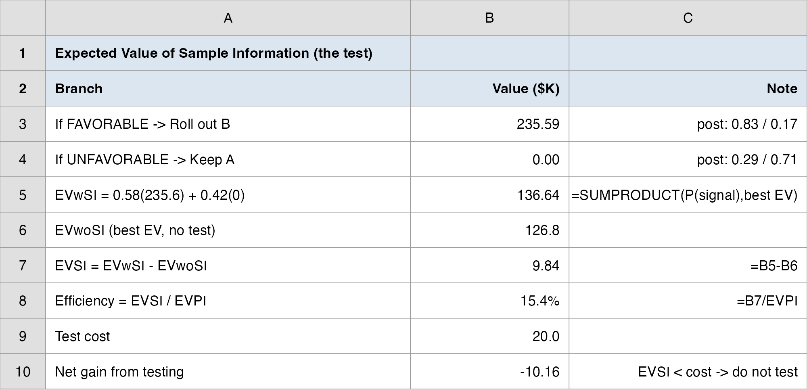{.nostretch fig-align="center" width="100%"}
:::
::::::

# How Robust Is the Call? {background-color="#cfb991"}

## Sensitivity Analysis

```{r  echo=FALSE, out.width = "68%",fig.align="center"}
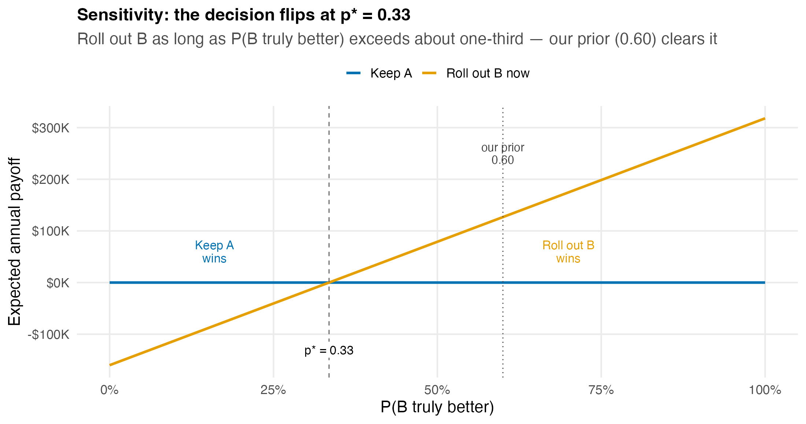
```

::: nonincremental
- "Roll out B" wins as long as $P(s_1)$ exceeds the **indifference prior** $p^{*} \approx 0.33$. Our prior (0.60) clears it comfortably, so the call is **stable**.
- Below one-third, keep A. The call only flips if we're *very* pessimistic about B.
:::

## Finding the Tipping Point

<br>

- The decision flips where the two EV lines cross: set $EV(\text{roll}) = EV(\text{keep})$ and solve for the prior $p = P(s_1)$:

::: fragment

$$
p(318) + (1-p)(-160) = 0 \;\Longrightarrow\; p^{*} = \frac{160}{318 + 160} \approx 0.335
$$

:::

- A **stable** decision is one that holds under small changes in the inputs. Here, B would have to be **more likely wrong than right** before we'd keep A.

- **This is the real payoff of structuring the decision:** we now know not just *what* to do, but *how sure we'd have to be to change our minds*. In Excel: a **What-If Data Table** varying $p$ traces the whole line.

# Debrief: The Rollout Recommendation {background-color="#cfb991"}

## The Decision on One Page

<br>

| Question | Tool | Answer |
|---|---|---:|
| Best option on average? | EV | **Roll out B** (\$126.8K vs. \$0) |
| Worth knowing the truth for sure? | EVPI | \$64K ceiling |
| Worth running a bigger test? | EVSI | \$9.84K \< \$20K cost → **no** |
| Stable to our prior? | Sensitivity | flips only below $p^{*} = 0.33$ |

<br>

- **Recommendation:** **roll out B now.** Expected value is clearly positive (+\$126.8K/yr), the decision holds unless we think B is more likely wrong than right, and a further test isn't worth its price. **Caveat:** there is a real **−\$160K** downside if B disappoints, so monitor eRPM closely post-rollout and be ready to revert.

## How Inference and Decision Analysis Fit Together

<br>

- This is the division of labor that runs through the whole course:

  - **Inference** (estimation, hypothesis tests): *what is true, and how sure are we?* → gave us the **\$0.11 lift**, the CI, the $p$-value.
  - **Decision analysis** (today): *given that uncertainty, what should we do?* → turned those into **alternatives, payoffs, and an EV-maximizing call**.

- The test result was an **input** to the decision, not the decision itself. The paired $t$ said "the lift is real"; the EV said "and acting on it is worth +\$126.8K."

- A good analyst can do both, and knows which question they're answering.

## Today's Question, Today's Answer

<br>

**The question (Topic 4 of the ladder):**

> *Roll out B, keep A, or run a bigger test, which has the best expected value?*

::: fragment
<br>

**The answer we reached today:**

> **Roll out B.** Its expected value (**\$126.8K/yr**) beats keeping A (**\$0**); the call stays the same unless B is more likely wrong than right ($p^{*} \approx 0.33$, and our prior is **0.60**); and a bigger test is worth only **\$9.84K**, under its **\$20K** price, so we skip it.
:::

## The Manager's Takeaway

<br>

- **One sentence:** Structuring the rollout as a decision (alternatives, states, payoffs) says **roll out B**, because its expected value (**\$126.8K/yr**) beats keeping A, and a further test isn't worth its cost.

- **One number to remember:** **EVPI = \$64K**, the ceiling on what *any* information is worth here; the actual test cleared only \$9.84K of it.

- **One caveat:** EV is a long-run average. "Roll out B" still risks a **−\$160K** year; sensitivity shows the call is stable (flips only below $p^{*} = 0.33$), but the downside is real, so monitor and stay ready to revert.

## ⏱️ Team Sprint: Your Group Case

::: {.sprint .nonincremental}
**Now it's your group's turn.** Today's in-class group case is posted on **Brightspace** (*Topic 04 Group Case*): a separate business decision you make with today's tools.

**What you'll use:** payoff tables, decision trees, **EV**, and **EVPI / EVSI**. **Excel:** Analysis ToolPak → `=SUMPRODUCT` for EV, `=MAX` per state for EVPI.

**Submit one PDF per group before you leave:** your decision plus the numbers behind it.
:::

# Wrap-up {background-color="#cfb991"}

## Summary

::: nonincremental
- **Structure first:** every decision under uncertainty reduces to **alternatives × states of nature → payoffs**; the payoff table and tree are that on a page.
- **Decide by expected value:** $EV(d_i) = \sum_j P(s_j) V_{ij}$; pick the best EV, a long-run average that hides the downside.
- **Value information before buying it:** **EVPI** is the ceiling (perfect info); **EVSI** is what a real, imperfect test is worth; buy a study only if its value beats its cost.
- **Bayes turns a signal into revised odds:** prior → joint → marginal → posterior; the posteriors become the post-test branch probabilities.
- **Sensitivity tells you how stable the call is:** find the prior $p^{*}$ where the decision flips; ours holds comfortably.
- **Inference and decision analysis are partners:** one says *what's true and how sure*; the other says *what to do about it*.
- **Next time:** modeling **uncertain counts** (how many installs tomorrow?) with discrete probability distributions.
:::

# Thank you! {background-color="#cfb991"}
