## Overview

:::::: nonincremental
::::: columns
::: {.column style="width: 50%; text-align: center; justify-content: center; align-items: center;"}
- Case Spotlight: planning capacity at Vungle
- Random variables: discrete vs. continuous
- Discrete probability distributions: table, conditions, graph
- Expected value and variance of a random variable
- Covariance, correlation, and the diversification math
- The **Binomial** distribution: counting installs over impressions
:::

::: {.column style="width: 50%; text-align: center; justify-content: center; align-items: center;"}
- The **Poisson** distribution: rare events over an interval
- When Binomial ≈ Poisson (large $n$, small $p$)
- Excel: `BINOM.DIST` and `POISSON.DIST`
- Tail probabilities: $P(X \geq N)$ for capacity planning
- The decision: how big a postback pipeline does Vungle need?
:::
:::::
::::::

# Case Spotlight: A/B Testing at Vungle {background-color="#cfb991"}

## June 2014: From "Is B Better?" to "Can We Handle It?"

<br>

- [Vungle](https://techcrunch.com/2019/07/15/blackstone-is-acquiring-mobile-ad-company-vungle/) (today part of Liftoff) is a mobile ad-tech startup: it serves 15-second video ads inside other apps and earns revenue mainly when a viewer **installs** the advertised app.

- Across June 2014, algorithm **A** served ~236M impressions and **B** served ~16M, side by side. The metric that pays the bills is **eRPM** (revenue per 1,000 impressions).

- Every install fires a **postback**: a real-time callback the ad server must record, bill, and confirm to the advertiser. Installs are the events the **infrastructure** has to absorb.

- Engineering's worry is not "is B better?"; it is **"how many installs hit us at once, and how often?"** Provision too little capacity and postbacks drop (lost revenue); too much and you burn cash on idle servers.

## The Brief: Today's Managerial Question

<br>

- **The big call (Topics 1–9):** *roll out B to all advertisers, or stay with A?* Before you can ship B, engineering has to know the install load it creates. Today's slice of that call:

::: fragment
> "For a typical burst, **what's the chance of at least $N$ installs**, so we can size the postback pipeline without over- or under-building?"
:::

<br>

- So far we have *described* and *compared* data. Today we **model** it: as the manager you put a **probability distribution** on a random count, then read off the chance of any outcome you care about.

- **How today's studio runs:** I demo each distribution on a textbook example, then your group cracks a separate posted case (one sprint per class), then we debrief the capacity call.

- By the end you turn a conversion rate into a defensible **capacity plan**, with the probabilities to back it up.

## How Today's Tools Answer It

<br>

Every tool today maps onto the Vungle install count:

| Feature of the Vungle problem | The tool |
|---|---|
| Each impression installs (yes) or not (no) | **Bernoulli trial** |
| Count installs over $n$ fixed impressions | **Binomial** distribution (Lecture 1) |
| Installs as rare arrivals over an interval | **Poisson** distribution (Lecture 2) |
| "How big must capacity be?" | a **tail probability** $P(X \geq N)$ |

<br>

- One conversion rate, two models; for Vungle's tiny $p$ they will give **almost the same answer**. That is today's punchline.

# Lecture 1: Random Variables, Expected Value & the Binomial {background-color="#cfb991"}

## The Brief: Lecture 1

<br>

- **The big call:** *roll out B, or stay with A?* **Today's rung:** *how many installs should we expect, and how do we model them as a Binomial?*

::: fragment
> "Model the number of **installs in a burst of 1,000 impressions** as a random count. What is its expected value, its spread, and the probability it hits **at least 8**, the level that stresses a single postback worker?"
:::

<br>

- As the manager you build the machinery in three steps: (1) name the **random variable**, (2) get its **expected value and variance**, (3) recognize it as a **Binomial** and compute exact probabilities in Excel.

- The number that drives everything is Vungle's conversion rate: $p \approx 0.0035$ for B, $p \approx 0.0040$ for A.

## How Every Class Runs

{.nostretch fig-align="center" width="90%"}

::: nonincremental
The class **ends on the Team Sprint**, your group's graded submission: a decision plus your read of the analysis, one PDF before you leave.
:::

# Random Variables {background-color="#cfb991"}

## What Is a Random Variable?

<br>

- A **random variable** is a numerical description of the outcome of an experiment: it assigns a **number** to each possible result.

- Two flavors:

  - **Discrete**: assumes a finite or countable list of values (you can list them: $0, 1, 2, \dots$).
  - **Continuous**: assumes any value in an interval (we handle these next topic).

- For Vungle, the count we care about is discrete:

::: fragment

$$
X = \text{number of installs in a fixed batch of impressions} \in \{0, 1, 2, \dots\}
$$

:::

- Installs are **counted**, not measured, so $X$ is a **discrete** random variable. (eRPM, by contrast, is continuous; next topic.)

## Discrete: Finite vs. Countably Infinite

<br>

- **Finite** number of values, a hard upper limit exists:

  - *JSL Appliances:* $x$ = TVs sold in a day $\in \{0,1,2,3,4\}$ (you cannot sell more than you stock).
  - *Vungle burst:* installs in 1,000 impressions $\in \{0, 1, \dots, 1000\}$.

- **Countably infinite**: no upper limit, but still countable:

  - *JSL:* $x$ = customers arriving in a day $\in \{0, 1, 2, \dots\}$.
  - *Vungle:* installs across a whole day (millions of impressions), no fixed ceiling.

- **Why it matters:** the distribution we choose mirrors the structure. A fixed-$n$ count → **Binomial**; an open-ended count of rare events → **Poisson**.

## Quick Check: Classify the Variable

<br>

| Random variable | Discrete or continuous? |
|---|---|
| Installs in a 1,000-impression burst | **Discrete** (finite) |
| Customers arriving at Vungle's API per minute | **Discrete** (countably infinite) |
| eRPM on a given day (\$ per 1,000 impr.) | **Continuous** |
| Number of postbacks dropped in an hour | **Discrete** |
| Time until the next install fires | **Continuous** |

<br>

- **Rule of thumb:** if you would naturally *count* it, it is discrete; if you would *measure* it on a scale, it is continuous.

# Discrete Probability Distributions {background-color="#cfb991"}

## The Probability Distribution

<br>

- The **probability distribution** of a discrete random variable lists every value $x$ together with its probability, through a **probability function** $f(x) = P(X = x)$.

- It can be given as a **table**, a **graph**, or a **formula**.

- Two conditions make a probability function **valid**:

::: fragment

$$
f(x) \geq 0 \qquad \text{for every } x \qquad\qquad \sum_{x} f(x) = 1
$$

:::

- The first says probabilities cannot be negative; the second says *something* must happen.

## Where the Probabilities Come From

<br>

- Three standard ways to assign the probabilities $f(x)$:

::: {.fragment .nonincremental}
  - **Classical:** equally likely outcomes (a fair die: each face $1/6$).
  - **Subjective:** informed judgment when there is no track record.
  - **Relative frequency:** the share of past observations, the route we take for JSL next. It gives an **empirical** distribution.
:::

- A **formula** can also supply $f(x)$ directly. The simplest is the **discrete uniform**, $f(x) = 1/n$ over $n$ equally likely values.

- Our two workhorses, the **Binomial** and **Poisson**, are the formula distributions that fit the Vungle install count.

## Anchor Example: JSL Appliances

<br>

- Using 200 days of past TV-sales data, JSL builds an **empirical** distribution (relative frequencies):

::: fragment

| $x$ (TVs sold) | Days | $f(x) = P(X=x)$ |
|---:|---:|---:|
| 0 | 80 | 0.40 |
| 1 | 50 | 0.25 |
| 2 | 40 | 0.20 |
| 3 | 10 | 0.05 |
| 4 | 20 | 0.10 |
| **Total** | **200** | **1.00** |

:::

- **Check the conditions:** every $f(x) \geq 0$ ✓, and they sum to $1.00$ ✓, a valid distribution.

## Reading the Distribution

<br>

- Once you have $f(x)$, **any** question about $X$ is just addition:

  - $P(X = 0) = 0.40$: no sale on 40% of days.
  - $P(X \geq 2) = 0.20 + 0.05 + 0.10 = 0.35$.
  - $P(X \leq 1) = 0.40 + 0.25 = 0.65$.

- This is exactly the move we will make for Vungle: build $f(x)$ for installs, then read off $P(X \geq N)$ for the capacity plan.

- The only change is **how** we get $f(x)$: JSL used past data; for Vungle we will use a **formula** (the Binomial) driven by the conversion rate $p$.

## A Question That Often Comes Up

:::: {.faq}
**A question that often comes up at this point:**

[JSL got its $f(x)$ by counting 200 days of sales. Why would I ever trust a formula's $f(x)$ for Vungle instead of just counting past installs the same way?]{.faq-q}

::: {.fragment .faq-a}
**Short answer:** counting works only for outcomes you have already seen at the right scale. JSL sold at most 4 TVs a day, so 200 days cover every value. A 1,000-impression burst can produce **0 to 1,000** installs; you will never observe enough bursts to fill that table by hand. The Binomial formula gives the probability of **every** $x$, including the rare 8-plus bursts that size the pipeline, from just $n$ and $p$.
:::
::::

# Expected Value and Variance {background-color="#cfb991"}

## Expected Value: the Center

<br>

- The **expected value** $E(X)$ (or mean $\mu$) is the **probability-weighted average** of the values $X$ can take:

::: fragment

$$
E(X) = \mu = \sum_{x} x \, f(x)
$$

:::

- It is the **long-run average** outcome over many repetitions of the experiment.

- It need **not** be a value $X$ can actually assume: JSL's $E(X) = 1.2$ TVs, though you never sell 1.2 TVs.

## Variance and Standard Deviation: the Spread

<br>

- The **variance** is the probability-weighted average of squared deviations from the mean; it measures **risk / variability**:

::: fragment

$$
\text{Var}(X) = \sigma^2 = \sum_{x} (x - \mu)^2 \, f(x)
$$

:::

- The **standard deviation** is its positive square root, in the same units as $X$:

::: fragment

$$
\sigma = \sqrt{\text{Var}(X)}
$$

:::

- Same mean, larger $\sigma$ → **more spread, more risk**, exactly what a capacity planner fears (a big burst).

## JSL Appliances: the Worksheet

::: {style="font-size: 82%;"}
| $x$ | $f(x)$ | $x\,f(x)$ | $x - \mu$ | $(x-\mu)^2$ | $(x-\mu)^2 f(x)$ |
|---:|---:|---:|---:|---:|---:|
| 0 | 0.40 | 0.00 | $-1.2$ | 1.44 | 0.576 |
| 1 | 0.25 | 0.25 | $-0.2$ | 0.04 | 0.010 |
| 2 | 0.20 | 0.40 | $0.8$ | 0.64 | 0.128 |
| 3 | 0.05 | 0.15 | $1.8$ | 3.24 | 0.162 |
| 4 | 0.10 | 0.40 | $2.8$ | 7.84 | 0.784 |
| **Sum** | **1.00** | $\boldsymbol{\mu = 1.20}$ | | | $\boldsymbol{\sigma^2 = 1.660}$ |

$$
E(X) = 1.20 \text{ TVs} \qquad \sigma^2 = 1.660 \qquad \sigma = \sqrt{1.660} = 1.288 \text{ TVs}
$$
:::

## Do It in Excel: Expected Value & Variance

:::::: columns
::: {.column .nonincremental width="46%"}
**Follow along:**

1. Lay out the $x$ values in column A and $f(x)$ in column B (the JSL table).
2. Column C: `=A2*B2` (the $x\,f(x)$ terms); $E(X) =$ `=SUM(C2:C6)` $= 1.20$.
3. Column D: `=(A2-$E$1)^2*B2`, with $\mu$ parked in `E1`; $\sigma^2 =$ `=SUM(D2:D6)` $= 1.66$.
4. $\sigma =$ `=SQRT(...)` $= 1.29$, back in plain TV units.

No ToolPak tool needed: this is the engine behind **every** discrete distribution; Binomial and Poisson just supply $f(x)$.
:::
::: {.column width="54%"}
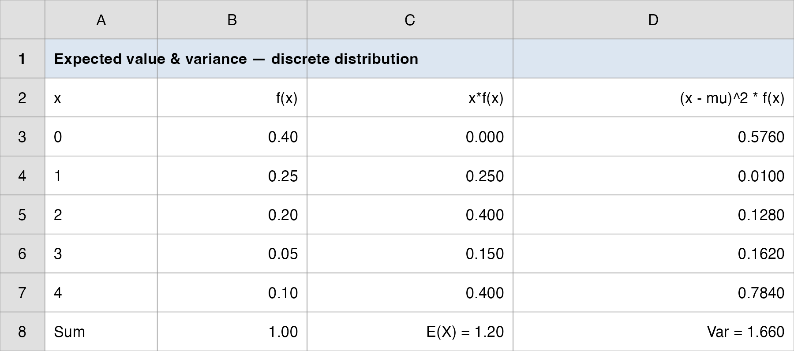{.nostretch fig-align="center" width="100%"}
:::
::::::

## Why Managers Care: Mean and Risk Together

<br>

- $E(X)$ alone is not enough. Two ad algorithms could deliver the **same average** installs but a different **spread**, and spread is what overflows a server or empties a sales pipeline.

- A capacity planner reads $E(X)$ to **size for the typical load** and $\sigma$ (and the tail) to **size for the bad days**.

- **Forward pointer:** the Vungle install count has a special structure, a fixed number of impressions, each an independent yes/no at the **same** rate $p$. That structure has a name: the **Binomial**, and it hands us $E(X)$, $\sigma$, and the full $f(x)$ from just two numbers, $n$ and $p$.

# Two Random Variables Together {background-color="#cfb991"}

## When Two Counts Move Together

<br>

- So far one random variable at a time. Most business risk involves **two** moving together: A's installs and B's installs each day, two stores' sales, two stocks in a portfolio.

- A **bivariate distribution** gives the probability of each *pair* of outcomes, $f(x, y) = P(X = x, Y = y)$.

- The new question is **association**: when one is high, is the other high too? That is what **covariance** and **correlation** measure, and it is the hinge of every diversification decision.

- **Textbook anchor:** DiCarlo Motors runs two dealerships (Geneva = $x$, Saratoga = $y$) and tracks 300 days of joint sales. **Vungle parallel:** A and B run side by side, so their daily install counts are a bivariate pair too.

## Rules for Combining Random Variables

<br>

- Before covariance, the algebra of **shifting and adding** random variables. For constants $a, b$:

::: fragment

$$
E(aX + b) = a\,E(X) + b \qquad\qquad \text{Var}(aX + b) = a^2\,\text{Var}(X)
$$

:::

- Adding a constant shifts the mean but **not** the spread; scaling by $a$ multiplies the variance by $a^2$.

- For a **sum** of two random variables, the means just add, but the variance carries a cross term:

::: fragment

$$
E(aX + bY) = a\,E(X) + b\,E(Y)
$$

$$
\text{Var}(aX + bY) = a^2\,\text{Var}(X) + b^2\,\text{Var}(Y) + 2ab\,\text{Cov}(X, Y)
$$

:::

- That last term, $\text{Cov}(X, Y)$, is the whole story: it is **why combining two things can lower (or raise) total risk**.

## Covariance and Correlation

<br>

:::: {style="font-size: 92%;"}
- **Covariance** is the probability-weighted average of the joint deviations from each mean:

::: fragment

$$
\text{Cov}(X, Y) = \sigma_{xy} = \sum \big[x - E(X)\big]\big[y - E(Y)\big]\,f(x, y)
$$

:::

- Sign reads the direction: **positive** = they tend to move together, **negative** = one up while the other down, **zero** = no linear link. Its size is hard to read (it carries mixed units), so we standardize it into the **correlation coefficient**:

::: fragment

$$
\rho_{xy} = \frac{\text{Cov}(X, Y)}{\sigma_x\,\sigma_y}, \qquad -1 \leq \rho_{xy} \leq 1
$$

:::

- **DiCarlo:** $\sigma_{xy} = 0.1350$ and $\rho_{xy} = 0.1295$, a **weak positive** link: the two dealerships rise and fall together a little, not in lockstep.
::::

## Diversification: Why Combine at All?

<br>

- Put a fraction $w$ of a portfolio in asset $X$ and the rest in $Y$. The portfolio return is $Z = wX + (1-w)Y$, so by the rules above:

::: fragment

$$
E(Z) = w\,E(X) + (1-w)\,E(Y)
$$

$$
\text{Var}(Z) = w^2 \sigma_x^2 + (1-w)^2 \sigma_y^2 + 2\,w(1-w)\,\rho_{xy}\,\sigma_x\,\sigma_y
$$

:::

- The mean is a plain blend, but the **risk is not**: when $\rho_{xy} < 1$, the cross term shrinks $\text{Var}(Z)$ below the blend of the two variances. **Low or negative correlation is what makes diversification work.**

- The same math sizes a **supply chain**: two independent suppliers ($\rho \approx 0$) cut shortage risk far more than two whose outages correlate.

## A Question That Often Comes Up

:::: {.faq}
**A question that often comes up at this point:**

[If covariance and correlation measure the same direction, why bother computing both? Why not just report the covariance?]{.faq-q}

::: {.fragment .faq-a}
**Short answer:** covariance gives the **sign** but not a readable **size**: its units are "$x$-units times $y$-units" (cars-times-cars for DiCarlo), so $0.135$ could be strong or trivial, you cannot tell. Dividing by the two standard deviations strips the units and pins it to $[-1, 1]$, so $\rho = 0.1295$ instantly reads as "weak positive." You need the covariance to **build** the portfolio variance, and the correlation to **judge** how much diversification will actually help.
:::
::::

# The Binomial Distribution {background-color="#cfb991"}

## From One Impression to Many: the Bernoulli Trial

```{r  echo=FALSE, out.width = "92%",fig.align="center"}
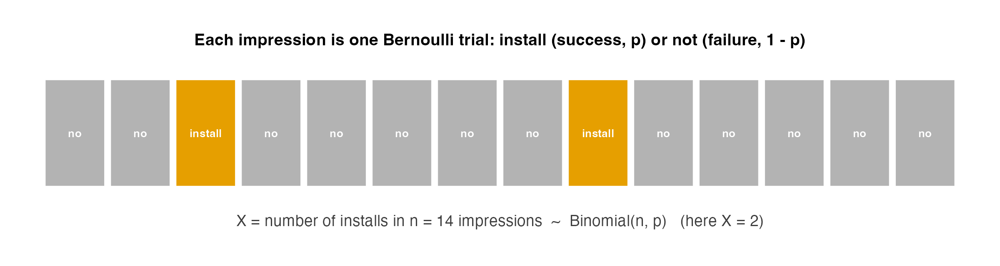
```

::: nonincremental
- Each impression is a **Bernoulli trial**: it installs (**success**, prob. $p$) or not (**failure**, prob. $1-p$).
- Count the successes over $n$ impressions and you have a **Binomial** random variable.
:::

## The Four Binomial Assumptions

<br>

A **Binomial experiment** requires all four:

::: {.fragment .nonincremental}
1. A sequence of $n$ **identical** trials.
2. Exactly **two** outcomes per trial: *success* and *failure*.
3. The success probability $p$ is **constant** across trials (the *stationarity* assumption).
4. The trials are **independent**.
:::

<br>

- **Vungle check:** $n$ impressions in a burst (1); each one installs or not (2); the conversion rate $p$ is the same within a stable burst (3); one user installing does not change another's odds (4). All four hold (approximately). So installs are **Binomial**.

## A Question That Often Comes Up

:::: {.faq}
**A question that often comes up at this point:**

[Real ad traffic is never perfectly identical or independent, so isn't calling Vungle's installs "Binomial" just wishful thinking?]{.faq-q}

::: {.fragment .faq-a}
**Short answer:** the assumptions are an approximation, and the manager's job is to know when it is good enough. Within one **stable** burst, impressions are similar users seeing the same ad at the same rate, so the four conditions nearly hold and the Binomial is trustworthy. They break during a **viral spike** (the rate jumps and installs cluster); that is the one caveat we flag in the Takeaway, and the cue to re-estimate $p$ rather than trust the model blindly.
:::
::::

## The Binomial Probability Function

<br>

:::: {style="font-size: 88%;"}
- The probability of exactly $x$ successes in $n$ trials:

::: fragment

$$
f(x) = \binom{n}{x} p^x (1-p)^{n-x}, \qquad x = 0, 1, 2, \dots, n
$$

:::

- The **binomial coefficient** counts the ways to arrange $x$ successes among $n$ trials:

::: fragment

$$
\binom{n}{x} = \frac{n!}{x!\,(n-x)!}
$$

:::

- Read it in two pieces: $p^x (1-p)^{n-x}$ is the probability of **one specific** arrangement; $\binom{n}{x}$ is **how many** arrangements give $x$ successes.
::::

## Anchor Example: Evans Electronics

<br>

- Evans Electronics loses about **10%** of hourly employees per year ($p = 0.10$). Choosing **3** employees at random ($n = 3$), what is $P(\text{exactly 1 leaves})$?

- One specific way (leaver, stayer, stayer) has probability:

::: fragment

$$
(0.10)(0.90)(0.90) = (0.10)(0.90)^2 = 0.081
$$

:::

- There are $\binom{3}{1} = 3$ such arrangements (the leaver could be 1st, 2nd, or 3rd):

::: fragment

$$
f(1) = \binom{3}{1}(0.10)^1 (0.90)^2 = 3 \times 0.081 = 0.243
$$

:::

## Evans Electronics: the Full Distribution

```{r  echo=FALSE, out.width = "72%",fig.align="center"}
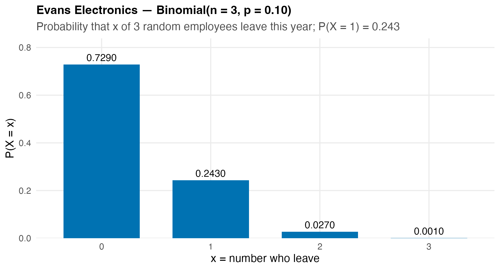
```

::: nonincremental
- $f(0)=0.729,\; f(1)=0.243,\; f(2)=0.027,\; f(3)=0.001$, and they sum to 1.
- $P(\text{at least 1 leaves}) = 1 - f(0) = 1 - 0.729 = 0.271$.
:::

## Binomial Mean, Variance, and SD

<br>

- Because the trials are identical and independent, the mean and variance collapse to clean formulas, no worksheet needed:

::: fragment

$$
E(X) = \mu = np \qquad\quad \text{Var}(X) = \sigma^2 = np(1-p) \qquad\quad \sigma = \sqrt{np(1-p)}
$$

:::

- **Evans:** $\mu = 3(0.10) = 0.30$ leavers, $\sigma^2 = 3(0.10)(0.90) = 0.27$, $\sigma = 0.520$.

- These are the same $E(X)$ and $\sigma$ from the worksheet; the Binomial just hands them to you from $n$ and $p$.

## Cumulative Probabilities and the Tail

<br>

- Most business questions are about a **range**, not a single value. Two cumulative moves cover them all:

  - "**at most** $k$": $P(X \leq k) = f(0) + f(1) + \dots + f(k)$.
  - "**at least** $N$": $P(X \geq N) = 1 - P(X \leq N-1)$, the **complement** trick.

- The capacity question is a **tail**: $P(X \geq N)$, *how often does the load exceed level $N$?*

- Computing these by hand is tedious; Excel does the summation for us with one function.

## A Question That Often Comes Up

:::: {.faq}
**A question that often comes up at this point:**

[For "at least 8 installs," why is it $1 - P(X \leq 7)$ and not $1 - P(X \leq 8)$? The off-by-one keeps tripping me up.]{.faq-q}

::: {.fragment .faq-a}
**Short answer:** "at least 8" means $8, 9, 10, \dots$, so the **opposite** event is $7$ or fewer, not 8 or fewer. Subtracting $P(X \leq 8)$ would wrongly throw out the 8 itself. The rule: $P(X \geq N) = 1 - P(X \leq N - 1)$, so for $N = 8$ you use $P(X \leq 7)$. Get that boundary wrong and Vungle's capacity probability is off by exactly the $f(8)$ term.
:::
::::

## Excel: `BINOM.DIST`

<br>

- Two arguments and a TRUE/FALSE switch give you everything:

::: fragment

| You want | Excel | Returns |
|---|---|---|
| $P(X = x)$ (PMF) | `=BINOM.DIST(x, n, p, FALSE)` | exact probability |
| $P(X \leq x)$ (CDF) | `=BINOM.DIST(x, n, p, TRUE)` | cumulative probability |
| $P(X \geq N)$ (tail) | `=1 - BINOM.DIST(N-1, n, p, TRUE)` | complement |

:::

- `BINOMDIST` (no dot) is the legacy alias, same result.

- **Capacity example:** $P(\geq 5 \text{ installs in 1{,}000 impressions at } p=0.004) =$ `=1-BINOM.DIST(4, 1000, 0.004, TRUE)`.

# The Vungle Burst: Installs as a Binomial {background-color="#cfb991"}

## Set Up the Model

<br>

- The data give us the daily install **counts**; a count over a fixed batch of impressions is exactly a Binomial.

```{r  echo=FALSE, out.width = "78%",fig.align="center"}
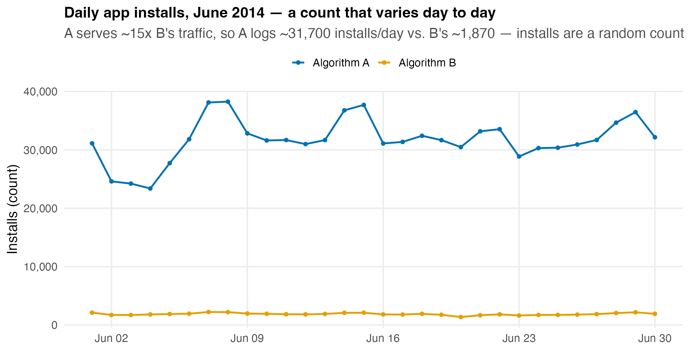
```

::: nonincremental
- A averages ~31,700 installs/day, B ~1,870; but for capacity we work at the **burst** scale (1,000 impressions), where the model is tractable and the tail is the story.
:::

## Estimate $p$, then Build the Distribution

<br>

- From `vungle_daily.csv`, the conversion rate is `installs / impressions`, averaged over the 30 days:

::: fragment

| Algorithm | Conversion rate $p$ | Per-burst mean $\mu = np$ ($n=1000$) |
|---|---:|---:|
| A | 0.4027% $\approx$ **0.0040** | $1000 \times 0.0040 =$ **4.0** installs |
| B | 0.3538% $\approx$ **0.0035** | $1000 \times 0.0035 =$ **3.5** installs |

:::

- So installs per 1,000-impression burst are:

::: fragment

$$
X_A \sim \text{Binomial}(1000,\, 0.0040) \qquad\qquad X_B \sim \text{Binomial}(1000,\, 0.0035)
$$

:::

- $\sigma_B = \sqrt{1000(0.0035)(0.9965)} = 1.868$ installs: a tight, right-skewed count.

## The Burst Distribution: A vs. B

```{r  echo=FALSE, out.width = "82%",fig.align="center"}
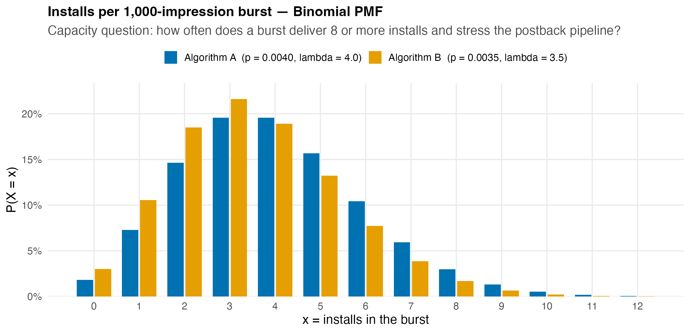
```

::: nonincremental
- Both peak near 3–4 installs; A's higher rate shifts mass right and **fattens the tail**, so A's bursts overflow capacity more often.
:::

## The Tail That Sizes the Pipeline

```{r  echo=FALSE, out.width = "72%",fig.align="center"}
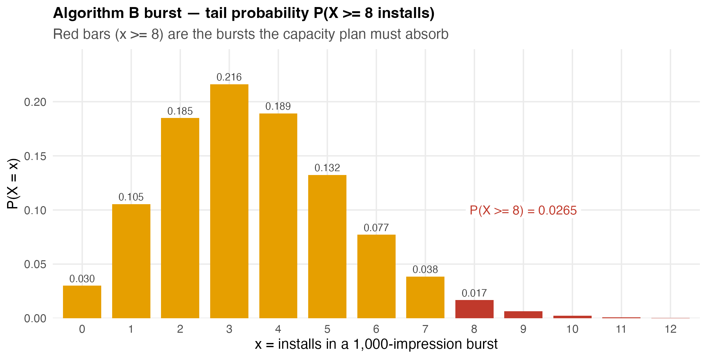
```

::: nonincremental
- For B, $P(X \geq 8) = 1 - P(X \leq 7) = 1 - 0.9735 =$ **0.0265**: about **1 burst in 38** delivers 8+ installs.
- If one postback worker handles up to 7 installs/burst, ~2.7% of B's bursts need a second worker; *that* is the capacity number.
:::

## Do It in Excel: The Vungle Burst (`BINOM.DIST`)

:::::: columns
::: {.column .nonincremental width="46%"}
**Follow along:**

1. List the install counts $x = 0, 1, 2, \dots$ down column A.
2. Column B (PMF): `=BINOM.DIST(A2, 1000, 0.0035, FALSE)`.
3. Column C (CDF): `=BINOM.DIST(A2, 1000, 0.0035, TRUE)`.
4. Read the capacity tail off the cumulative column: $P(X \leq 7) = 0.9735$, so $P(X \geq 8) =$ `=1-C9` $= 0.0265$.
:::
::: {.column width="54%"}
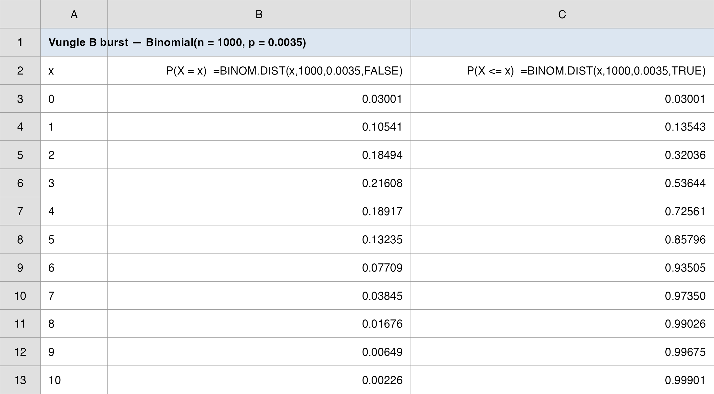{.nostretch fig-align="center" width="100%"}
:::
::::::

## The Manager's Takeaway (Lecture 1)

<br>

- **One sentence:** model installs over a fixed batch of impressions as **Binomial($n$, $p$)**, and every capacity question becomes a tail probability you read off `BINOM.DIST`.

- **One number:** for Algorithm A, $P(\geq 8 \text{ installs / 1,000-impr. burst}) \approx$ **0.051**, twice B's 0.027, because A converts at a higher rate.

- **One caveat:** the Binomial assumes a **constant, independent** $p$. Within a stable burst that holds; across a viral campaign spike it does not, so re-estimate $p$ when traffic shifts.

## Today's Question, Today's Answer

<br>

**The question (Lecture 1):**

> *How many installs should we expect in a 1,000-impression burst, and how do we model them as a Binomial?*

::: fragment
<br>

**The answer we reached today:**

> Installs are **Binomial($1000$, $p$)**. For B ($p = 0.0035$): expect $\mu = np =$ **3.5** installs with spread $\sigma =$ **1.87**, and the stress level $P(X \geq 8) = 1 - P(X \leq 7) =$ **0.0265** (about **1 burst in 38**). A converts higher, so its tail $P(X \geq 8) \approx$ **0.051** is roughly twice B's.
:::

## ⏱️ Team Sprint: Your Group Case (Lecture 1)

::: {.sprint .nonincremental}
**Now it's your group's turn.** Today's in-class group case is posted on **Brightspace** (*Topic 05 Group Case, Lecture 1*): a separate business decision you make with today's tools.

**What you'll use:** the **Binomial** model, $E(X)=np$, $\sigma=\sqrt{np(1-p)}$, and the tail $P(X \geq N)$. **Excel:** Analysis ToolPak with `BINOM.DIST(x, n, p, FALSE/TRUE)`.

**Submit one PDF per group before you leave:** your decision plus the numbers behind it.
:::

# Lecture 2: The Poisson Distribution {background-color="#cfb991"}

## The Brief: Lecture 2

<br>

- **The big call:** *roll out B, or stay with A?* **Today's rung:** *how many rare-event installs hit us over an interval, and how do we model them as a Poisson?*

::: fragment
> "Installs are **rare** (a few per thousand impressions). Is there a model that needs only the **average rate**, not the full $n$ and $p$? And does it give the same capacity answer?"
:::

<br>

- Yesterday we needed two numbers, $n$ and $p$. The **Poisson** distribution needs only **one**: the mean rate $\mu$ over an interval.

- We will introduce Poisson on its own terms, then show it is the **large-$n$, small-$p$ limit** of the Binomial, and that for Vungle the two are nearly identical.

## How Every Class Runs

{.nostretch fig-align="center" width="90%"}

::: nonincremental
The class **ends on the Team Sprint**, your group's graded submission: a decision plus your read of the analysis, one PDF before you leave.
:::

# Poisson: Rare Events Over an Interval {background-color="#cfb991"}

## When the Count Has No Fixed $n$

<br>

- The **Poisson** distribution models the number of times an event occurs over a fixed **interval of time or space**, when occurrences are rare and independent:

  - calls arriving at a switchboard in an hour;
  - flaws in 14 feet of pine board;
  - patients reaching an ER in 30 minutes;
  - **installs (postbacks) hitting Vungle's API in a one-second window**.

- There is **no natural $n$**: you are not counting successes out of a fixed number of trials; you are counting **arrivals** over an interval.

## The Two Poisson Assumptions

<br>

1. The probability of an occurrence is the **same** for any two intervals of equal length (a constant rate).
2. Occurrences in **non-overlapping** intervals are **independent**.

<br>

- One parameter governs everything: the **mean number of occurrences per interval**, $\mu$ (many texts write it $\lambda$; we keep $\mu$, the same mean symbol as everywhere else in the course).

- **Vungle:** at $p \approx 0.0035$ over 1,000 impressions, installs arrive at a mean rate $\mu = np = 3.5$ per burst. The rate is steady within a stable burst, and one install does not trigger another, so both assumptions hold.

## The Poisson Probability Function

<br>

- The probability of exactly $x$ occurrences in an interval with mean $\mu$:

::: fragment

$$
f(x) = \frac{\mu^x e^{-\mu}}{x!}, \qquad x = 0, 1, 2, \dots \qquad (e \approx 2.71828)
$$

:::

- A defining property: the mean **and** variance are **both** $\mu$:

::: fragment

$$
E(X) = \mu \qquad\qquad \text{Var}(X) = \mu \qquad\qquad \sigma = \sqrt{\mu}
$$

:::

- There is **no upper limit** on $x$, but $f(x)$ shrinks fast; for large $x$ it rounds to zero.

- (Excel calls the parameter $\mu$ its *mean* argument; some calculators and texts label the same number $\lambda$.)

## A Question That Often Comes Up

:::: {.faq}
**A question that often comes up at this point:**

[Mean equals variance, both just $\mu$? With the Binomial I had two separate knobs. How can one number fix the spread too?]{.faq-q}

::: {.fragment .faq-a}
**Short answer:** it falls right out of the large-$n$, small-$p$ setup. The Binomial variance is $np(1-p)$; when $p$ is tiny, $(1-p) \approx 1$, so the variance collapses to $np = \mu$, the same as the mean. For Vungle's $p = 0.0035$ that approximation is excellent, which is why $\mu = 3.5$ alone pins down both the center and the spread of the install count.
:::
::::

## Anchor Example: Mercy Hospital

<br>

- Patients arrive at Mercy Hospital's ER at **6 per hour** on weekend evenings. What is $P(\text{exactly 4 arrivals in 30 minutes})$?

- First **rescale the rate** to the interval: 6 per hour $= 3$ per half-hour, so $\mu = 3$.

::: fragment

$$
f(4) = \frac{3^4 e^{-3}}{4!} = \frac{81 \times 0.0498}{24} = 0.1680
$$

:::

- And the spread of arrivals: $\text{Var}(X) = \mu = 3$, so $\sigma = \sqrt{3} = 1.73$ patients per half-hour.

## Mercy Hospital: the Full Distribution

```{r  echo=FALSE, out.width = "72%",fig.align="center"}
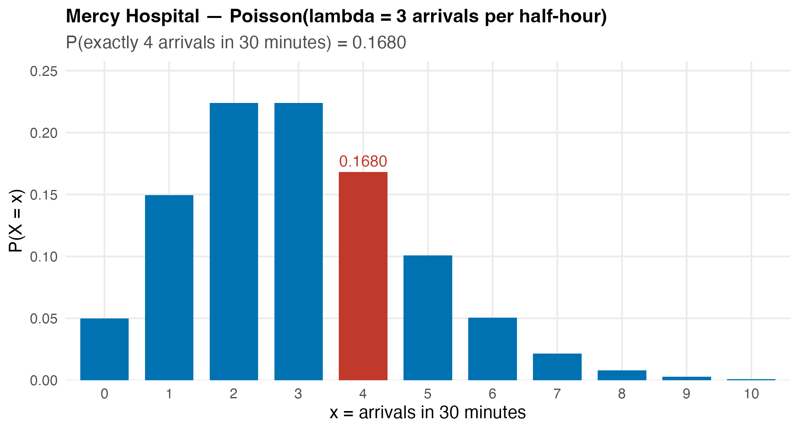
```

::: nonincremental
- The whole distribution comes from the **single** number $\mu = 3$: no $n$, no $p$.
- **Watch the units:** $\mu$ must match the interval. Six per hour and three per half-hour describe the *same* process at different scales.
:::

## A Question That Often Comes Up

:::: {.faq}
**A question that often comes up at this point:**

[If 6-per-hour and 3-per-half-hour are the "same process," why did we have to switch to $\mu = 3$? Couldn't we just plug in $\mu = 6$?]{.faq-q}

::: {.fragment .faq-a}
**Short answer:** no, because $\mu$ is the mean for the **interval the question asks about**, and the question was about **30 minutes**. Plug in $\mu = 6$ and Excel answers "4 arrivals in an *hour*," a different event. The rule is one line: match $\mu$ to the window. For Vungle the same step turns a per-burst $\mu = 3.5$ into a per-second or per-day rate before you read off any tail.
:::
::::

## Excel: `POISSON.DIST`

<br>

- Same TRUE/FALSE switch as the Binomial, but only **one** parameter ($\mu$, the *mean* argument in Excel):

::: fragment

| You want | Excel | Returns |
|---|---|---|
| $P(X = x)$ (PMF) | `=POISSON.DIST(x, mean, FALSE)` | exact probability |
| $P(X \leq x)$ (CDF) | `=POISSON.DIST(x, mean, TRUE)` | cumulative probability |
| $P(X \geq N)$ (tail) | `=1 - POISSON.DIST(N-1, mean, TRUE)` | complement |

:::

- `POISSON` (no dot) is the legacy alias.

- **Mercy check:** `=POISSON.DIST(4, 3, FALSE)` returns `0.1680`: the formula and Excel agree.

# Binomial vs. Poisson {background-color="#cfb991"}

## The Poisson Approximation to the Binomial

<br>

- When $n$ is **large** and $p$ is **small**, the Binomial and the Poisson with $\mu = np$ are nearly identical:

::: fragment

$$
\text{Binomial}(n, p) \;\approx\; \text{Poisson}(\mu = np) \qquad \text{for large } n,\; \text{small } p
$$

:::

- **Rule of thumb:** the approximation is excellent when $n \geq 20$ and $p \leq 0.05$ (some texts use $np \leq 7$).

- Vungle is the textbook case: $n = 1000 \geq 20$ and $p = 0.0035 \leq 0.05$. So $X_B \approx \text{Poisson}(3.5)$, and we can drop $n$ and $p$ and work with **rate alone**.

## A Question That Often Comes Up

:::: {.faq}
**A question that often comes up at this point:**

[If the Poisson just approximates the Binomial here, isn't it strictly worse? Why not always use the exact Binomial and skip the approximation?]{.faq-q}

::: {.fragment .faq-a}
**Short answer:** because in real ops you often **do not have** $n$ and $p$, only the rate. Vungle's pipeline tracks "installs per second," not "successes out of how many impressions," so the Binomial's two inputs are not even available; the Poisson's single $\mu$ is. When you *do* have $n$ and $p$ and they are small, the two agree to three decimals (next slide), so you lose nothing by taking the simpler model.
:::
::::

## See It: The Two Models Overlap

```{r  echo=FALSE, out.width = "80%",fig.align="center"}
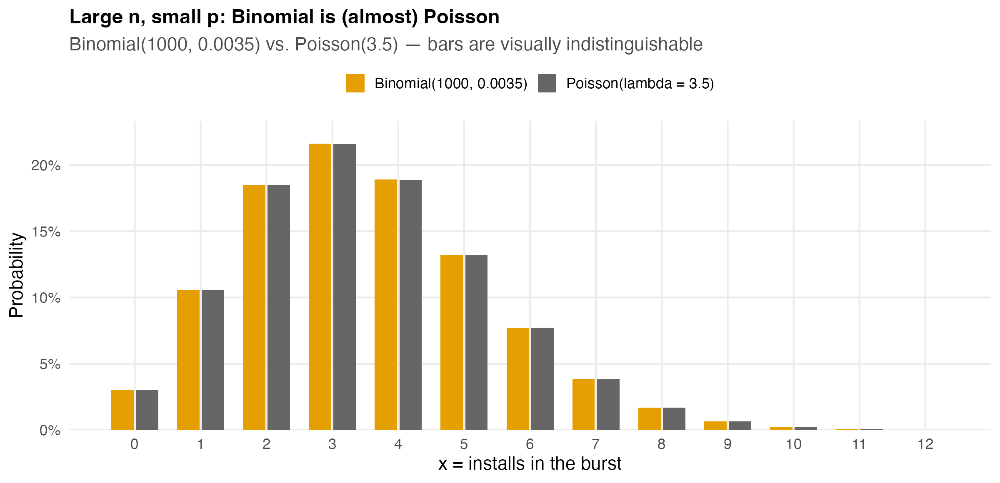
```

::: nonincremental
- Binomial($1000$, $0.0035$) and Poisson($3.5$) agree to **three decimals** at every $x$: the bars sit right on top of each other.
:::

## Do It in Excel: Binomial vs. Poisson Side by Side

:::::: columns
::: {.column .nonincremental width="46%"}
**Follow along:**

1. List the counts $x = 0, 1, 2, \dots$ in column A.
2. Column B (Binomial): `=BINOM.DIST(A2, 1000, 0.0035, FALSE)`.
3. Column C (Poisson): `=POISSON.DIST(A2, 3.5, FALSE)`.
4. Column D: `=B2-C2` to see the gap; it stays under 0.001 at every $x$.

Poisson needs **one** input ($\mu = 3.5$); Binomial needs **two** ($n, p$); for rare events you often only know the rate.
:::
::: {.column width="54%"}
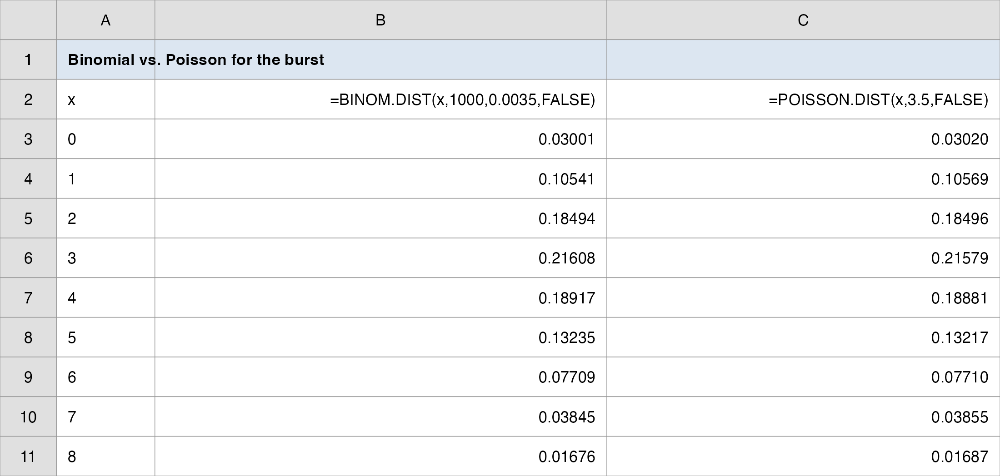{.nostretch fig-align="center" width="100%"}
:::
::::::

## Which Model Should You Reach For?

<br>

| Situation | Use |
|---|---|
| Fixed number of trials $n$, each success/failure at known $p$ | **Binomial** |
| Count of rare arrivals over an interval; no fixed $n$; you know the **rate** | **Poisson** |
| Large $n$, small $p$ (e.g., installs over impressions) | **Either** (Poisson is the simpler shortcut) |

<br>

- For Vungle's capacity work, **Poisson is the natural choice**: postbacks arrive over a *time* window, and all engineering tracks is the **mean rate** $\mu$, not a count of impressions.

# The Vungle Pipeline: A Poisson Capacity Plan {background-color="#cfb991"}

## Installs per Burst as a Poisson Process

```{r  echo=FALSE, out.width = "80%",fig.align="center"}
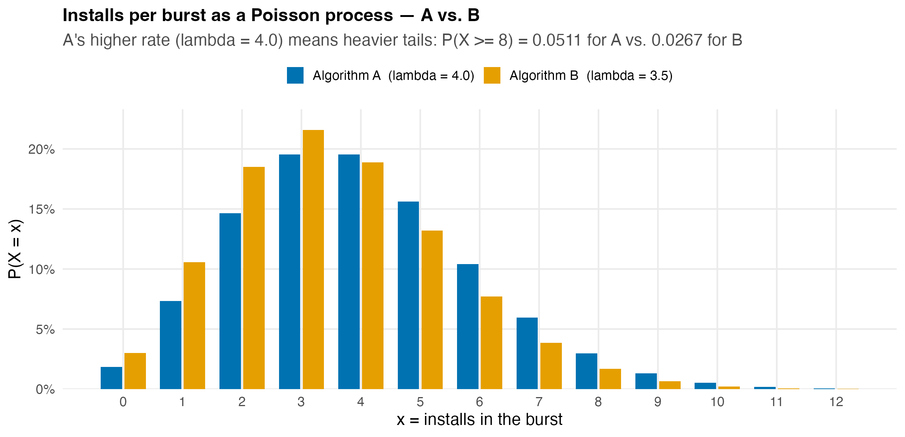
```

::: nonincremental
- $X_A \sim \text{Poisson}(4.0)$ and $X_B \sim \text{Poisson}(3.5)$.
- A's higher rate means **heavier tails**, so A overflows a fixed capacity more often than B.
:::

## The Capacity Tail: Both Ways Agree

<br>

- The question that sizes the pipeline: $P(X \geq 8)$, how often does a burst exceed a single worker's capacity of 7?

::: fragment

| Algorithm | Binomial $P(X \geq 8)$ | Poisson $P(X \geq 8)$ |
|---|---:|---:|
| B ($\mu = 3.5$) | 0.0265 | **0.0267** |
| A ($\mu = 4.0$) | 0.0508 | **0.0511** |

:::

- Both models give the **same managerial answer**: ~**5%** of A's bursts and ~**2.7%** of B's bursts need overflow capacity.

- In Excel: `=1 - POISSON.DIST(7, 4, TRUE)` $= 0.0511$ for A.

## Scaling Up: From Burst to Pipeline

<br>

- The **rate scales with the interval**, the Poisson workhorse property. If a burst is 1,000 impressions and A serves ~7.9M impressions/day:

::: fragment

$$
\mu_{\text{day}} = \underbrace{\frac{7{,}900{,}000}{1{,}000}}_{7{,}900 \text{ bursts}} \times \underbrace{4.0}_{\mu \text{ per burst}} \approx 31{,}600 \text{ installs/day} \quad (\text{matches the data's} \approx 31{,}700)
$$

:::

- Want installs **per second**? Divide $\mu$ by 86,400. Want **per hour**? Multiply by 3,600. **One parameter, any interval**, no need to recount impressions.

- That is why ops teams model arrivals as Poisson: provision for $\mu$ plus a tail buffer, and re-scale instantly as traffic grows.

## A Question That Often Comes Up

:::: {.faq}
**A question that often comes up at this point:**

[If I double the interval, $\mu$ doubles. Does the tail probability $P(X \geq N)$ just double too?]{.faq-q}

::: {.fragment .faq-a}
**Short answer:** no, only $\mu$ scales linearly with the interval; the tail does **not**. Double the window and you must recompute $P(X \geq N)$ with the **new** $\mu$ from scratch, because both the center and the whole shape shift. For Vungle: a per-second $\mu$ and a per-hour $\mu$ are a clean multiply apart, but their capacity tails are two separate `POISSON.DIST` calls. Scaling the rate is free; the probability still needs the function.
:::
::::

## The Manager's Takeaway (Lecture 2)

<br>

- **One sentence:** for rare events over an interval, the **Poisson($\mu$)** models the count from a single rate, and for Vungle's tiny $p$ it gives the **same capacity answer** as the Binomial.

- **One number:** $P(\geq 8 \text{ installs/burst}) \approx$ **0.051** for A (Poisson $\mu = 4$): provision a second worker for ~1 burst in 20.

- **One caveat:** Poisson assumes a **constant, independent** rate. A viral spike breaks both assumptions: arrivals cluster, the true tail is *heavier* than Poisson predicts, and you under-provision. Monitor for over-dispersion (variance $>$ mean).

## Today's Question, Today's Answer

<br>

**The question (Lecture 2):**

> *Is there a model that needs only the average rate, not the full $n$ and $p$, and does it give the same capacity answer?*

::: fragment
<br>

**The answer we reached today:**

> Yes: the **Poisson($\mu$)** needs only $\mu = np$. For B, $\mu =$ **3.5**; the capacity tail $P(X \geq 8) =$ **0.0267** matches the Binomial's **0.0265**, and for A both give $\approx$ **0.051**. For Vungle's tiny $p$ the two models agree to three decimals, so you can plan from the **rate alone**.
:::

# Wrap-up {background-color="#cfb991"}

## Discrete Distributions on One Page: the Vungle Bridge

::: r-fit-text
| Concept | Formula | Applied to Vungle | Excel |
|---|---|---|---|
| Expected value | $E(X) = \sum x\,f(x)$ | mean installs per burst | `=SUMPRODUCT(x, f)` |
| Variance | $\sigma^2 = \sum (x-\mu)^2 f(x)$ | spread / risk of the count | formula cells |
| Covariance / corr. | $\sigma_{xy};\;\rho_{xy} = \sigma_{xy}/(\sigma_x \sigma_y)$ | do A and B move together? | formula cells |
| **Binomial** | $f(x) = \binom{n}{x}p^x(1-p)^{n-x}$ | installs in $n=1000$ impressions, $p=0.0035$ | `=BINOM.DIST(x,n,p,0/1)` |
| Binomial mean/var | $np,\; np(1-p)$ | $\mu_B = 3.5,\; \sigma_B = 1.87$ | (formula) |
| **Poisson** | $f(x) = \mu^x e^{-\mu}/x!$ | installs as rare arrivals, $\mu = 3.5$ | `=POISSON.DIST(x,mean,0/1)` |
| Poisson mean/var | $\mu,\; \mu$ | $\mu_B = \sigma^2_B = 3.5$ | (formula) |
| Tail (capacity) | $P(X \geq N) = 1 - P(X \leq N{-}1)$ | $P(X_A \geq 8) \approx 0.051$ | `=1-...DIST(N-1,...,1)` |
:::

## The Manager's Takeaway

<br>

- **One sentence:** a conversion rate plus a count structure (fixed $n$ → **Binomial**; rare arrivals → **Poisson**) gives the **full probability distribution** of installs, and every capacity question is a **tail probability**.

- **One number to remember:** $P(X \geq 8) \approx$ **0.051** for Algorithm A bursts (about 1 in 20): the number that sizes the overflow buffer.

- **One caveat:** both models assume a **constant, independent** rate; real traffic spikes (viral campaigns) cluster arrivals and fatten the tail, so re-estimate the rate and watch for over-dispersion.

- **Practice with the real data:** `data/vungle_daily.csv` → estimate $p$; `data/vungle_discrete.xlsx` → reproduce the PMF/CDF tables with `BINOM.DIST` and `POISSON.DIST`.

## ⏱️ Team Sprint: Your Group Case (Lecture 2)

::: {.sprint .nonincremental}
**Now it's your group's turn.** Today's in-class group case is posted on **Brightspace** (*Topic 05 Group Case, Lecture 2*): a separate business decision you make with today's tools.

**What you'll use:** the **Poisson** model, $E(X)=\text{Var}(X)=\mu$, and the capacity tail $P(X \geq N)$. **Excel:** Analysis ToolPak with `POISSON.DIST(x, mean, FALSE/TRUE)`.

**Submit one PDF per group before you leave:** your decision plus the numbers behind it.
:::

## Summary

::: nonincremental
The points to carry out of this session:

- A **random variable** assigns a number to each outcome (discrete = counted, continuous = measured); a valid **distribution** has $f(x) \geq 0$, $\sum f(x) = 1$, with $E(X) = \sum x f(x)$ and $\sigma^2 = \sum (x-\mu)^2 f(x)$.
- **Covariance / correlation** measure how two counts move together; with $\rho_{xy} < 1$ the cross term in $\text{Var}(wX + (1-w)Y)$ shrinks total risk: that is **diversification**.
- The **Binomial** counts successes in $n$ fixed Bernoulli trials: $f(x) = \binom{n}{x}p^x(1-p)^{n-x}$, with $\mu = np$, $\sigma^2 = np(1-p)$.
- The **Poisson** counts rare arrivals from one rate $\mu$: $f(x) = \mu^x e^{-\mu}/x!$, with $\mu = \sigma^2$; for large $n$, small $p$ it equals Binomial($np$), the Vungle case.
- **Capacity = a tail probability:** $P(X \geq N) = 1 - P(X \leq N-1)$, computed in one Excel cell.
- **Next time:** we move from **discrete counts** to **continuous measurements**, the **Normal** distribution, and the question *"what is the probability eRPM exceeds \$3.50?"*
- **Homework (individual):** the Binomial and Poisson models are drilled on **HW2**, posted on Brightspace; run them yourself so you can check an analyst who uses them.
:::

# Thank you! {background-color="#cfb991"}
