## Overview

:::::: nonincremental
::::: columns
::: {.column style="width: 50%; text-align: center; justify-content: center; align-items: center;"}
- Case Spotlight: A/B Testing at Vungle
- Continuous random variables: probability is **area**
- The uniform distribution (the simplest continuous model)
- The **Normal** distribution: shape, the empirical rule
- The standard Normal and **z**-scores
- Modeling daily eRPM as Normal
:::

::: {.column style="width: 50%; text-align: center; justify-content: center; align-items: center;"}
- Normal probabilities in Excel: `NORM.DIST`, `NORM.INV`
- Tail probabilities: $P(\text{eRPM} > \$3.50)$
- Percentiles: the **90th-percentile day**
- **Checking** the Normal assumption (QQ plot)
- The Normal **approximation of the Binomial**
- From a distribution to a planning number
:::
:::::
::::::

# Case Spotlight: A/B Testing at Vungle {background-color="#cfb991"}

## Back to Vungle: Now We Model the *Distribution*

<br>

- **Vungle** serves 15-second video ads inside other apps and earns revenue mainly when viewers **install** the advertised app.

- The metric that pays the bills is **eRPM**: effective revenue per 1,000 impressions. Algorithm **B** is the new ad-serving engine the team is evaluating.

- So far we have **summarized** eRPM (center, spread) and modeled **counts** (installs) with the Binomial and Poisson. Today we model a **continuous** quantity: the dollar value of eRPM itself.

- Over 30 days of June 2014, B's daily eRPM averaged **\$3.46** with a standard deviation of **\$0.34**. The histogram is a bell.

- **Today's move:** treat daily eRPM as a draw from a **Normal distribution**, then we can answer *forward-looking* questions about days we have not yet seen.

## The Brief: Today's Manager Question

<br>

- **The big call (Vungle A/B):** roll out algorithm B, or stay with A? Topic 9 settles it; today answers one piece: **What's the chance of a high- or low-eRPM day?**

::: fragment
> "Model B's daily eRPM as Normal(\$3.46, \$0.34). What's the chance tomorrow's eRPM **tops \$3.50**? What eRPM marks a **90th-percentile day**, and is the Normal model even **trustworthy** here?"
:::

<br>

- Counting distributions (Binomial, Poisson) answered "how many installs?" Today's tool answers "**how much revenue per impression**, and how often above a threshold?"

- **How today's studio runs:** I demo each idea on a textbook example, then your group reproduces and interrogates the fitted Normal on the in-class group case, then we debrief what the model can and cannot tell the manager.

- By the end you can turn a fitted distribution into a planning number (a probability and a percentile) and stress-test the assumption behind it.

## How Today's Tools Answer It

<br>

Every tool today maps onto the Vungle eRPM data:

| The managerial question | The tool |
|---|---|
| "What does a *typical* day look like?" | **Normal model** (mean \$3.46, sd \$0.34) |
| "How likely is eRPM above \$3.50?" | **z-score + `NORM.DIST`** (a tail area) |
| "What's a great day, the top 10%?" | **`NORM.INV`** (a percentile) |
| "Is 'Normal' even a fair assumption?" | **Normal-probability (QQ) plot** |
| "Plan for installs at huge scale" | **Normal approximation of the Binomial** |

<br>

- One dataset, one bell curve, and from it every probability and percentile the manager needs.

# Lecture 1: Continuous Variables, the Uniform, and the Normal {background-color="#cfb991"}

## The Brief: Lecture 1

<br>

- **The big call (Vungle A/B):** roll out B, or stay with A? Today's piece for the manager: **What's the chance of a high- or low-eRPM day?** (and can we fit a Normal to it).

::: fragment
> "Before we can ask *'how likely is eRPM above \$3.50?'*, we need a **model** for a continuous quantity. Today: what a continuous distribution *is*, and the two we use most, the **uniform** and the **Normal**."
:::

<br>

- The payoff question $P(\text{eRPM} > \$3.50)$ waits for Lecture 2. First we build the machinery: **probability as area**, the **Normal** shape, and the **z-score** that handles any Normal.

- Anchor examples today: **Slater's Buffet** (uniform) and **Pep Zone** inventory (Normal). Then we fit the Normal to Vungle eRPM.

## How Every Class Runs

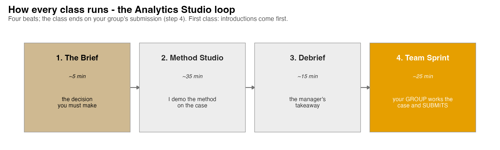{.nostretch fig-align="center" width="90%"}

::: nonincremental
The class **ends on the Team Sprint**, your group's graded submission: a decision plus your read of the analysis, one PDF before you leave.
:::

# Continuous Random Variables {background-color="#cfb991"}

## Discrete vs. Continuous: Probability Becomes Area

<br>

- A **continuous** random variable can assume **any** value in an interval on the real line (eRPM could be \$3.4590, \$3.45901, …).

- Unlike a die roll, you **cannot** ask for the probability of one *exact* value:

::: fragment

$$
P(X = x) = 0 \quad \text{for any single point } x
$$

:::

- Instead we ask about an **interval**: $P(x_1 \le X \le x_2)$. The eRPM is never *exactly* \$3.50, but it can be *between* \$3.40 and \$3.60.

- For a continuous variable, probability is the **area under a curve** called the **probability density function** $f(x)$.

## The Probability Density Function (PDF)

<br>

- Think of $f(x)$ as a **smoothed histogram**: the relative-frequency bars, refined until they form a continuous curve.

- Two defining properties:

::: fragment

$$
f(x) \ge 0 \quad \text{for all } x \qquad\qquad \int_{-\infty}^{\infty} f(x)\, dx = 1 \;\; (\text{total area} = 1)
$$

:::

- **Key subtlety:** $f(x)$ is a *density*, **not** a probability; it can exceed 1. Only **areas** are probabilities.

- The probability $X$ lands between $x_1$ and $x_2$ is the area under $f(x)$ across that interval:

::: fragment

$$
P(x_1 \le X \le x_2) = \text{area under } f(x) \text{ from } x_1 \text{ to } x_2
$$

:::

## A Question That Often Comes Up

:::: {.faq}
**A question that often comes up at this point:**

[If $P(X = x) = 0$ for every single value, how can eRPM ever be exactly \$3.50 on some day?]{.faq-q}

::: {.fragment .faq-a}
**Short answer:** it can land there; the *probability we assign in advance* to that one infinitely thin point is 0. With a continuous scale there are infinitely many possible values, so any single one carries no width and no area. That is why we always ask about an interval (\$3.45 to \$3.55, or "above \$3.50"), never a lone point. For decisions this loses nothing: the manager cares about ranges, not whether tomorrow is \$3.50000 to the last decimal.
:::
::::

# The Uniform Distribution {background-color="#cfb991"}

## The Simplest Continuous Model

<br>

- A variable is **uniformly distributed** when the probability is **proportional to the length** of the interval: every equal-width slice is equally likely.

::: fragment

$$
f(x) = \begin{cases} \dfrac{1}{b - a} & a \le x \le b \\[4pt] 0 & \text{otherwise} \end{cases}
$$

:::

- The density is a **flat rectangle** of height $1/(b-a)$, and the rectangle's total area is exactly 1.

- Mean and variance:

::: fragment

$$
E(X) = \frac{a + b}{2} \qquad\qquad \operatorname{Var}(X) = \frac{(b - a)^2}{12}
$$

:::

## Anchor Example: Slater's Buffet

<br>

- Slater's charges customers by the **weight of salad** they take. Sampling shows the amount is **uniform between 5 and 15 ounces**: $X \sim \text{Uniform}(5, 15)$, so $f(x) = 1/10$.

- **Expected value and variance:**

::: fragment

$$
E(X) = \frac{5 + 15}{2} = 10 \text{ oz} \qquad \operatorname{Var}(X) = \frac{(15 - 5)^2}{12} = 8.33
$$

:::

- **What is $P(12 \le X \le 15)$, a heaping plate?** Area = base $\times$ height:

::: fragment

$$
P(12 \le X \le 15) = (15 - 12) \times \frac{1}{10} = 0.30
$$

:::

## Slater's Buffet: Probability Is the Shaded Area

```{r  echo=FALSE, out.width = "72%",fig.align="center"}
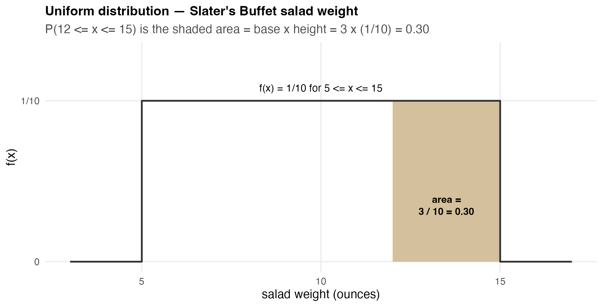
```

::: nonincremental
- 30% of customers take between 12 and 15 ounces, directly the **area** of the shaded rectangle, no calculus needed.
- The same idea, **probability = area**, now carries over to the bell-shaped Normal, where the area is harder to compute by hand (so we lean on z-scores and Excel).
:::

# The Normal Probability Distribution {background-color="#cfb991"}

## Why the Normal Matters

<br>

- The **Normal** is the most important distribution for a continuous variable: it describes heights, test scores, measurement errors, rainfall, **and** daily revenue metrics like eRPM.

- It is the backbone of statistical inference (the next several topics), and it **approximates** the Binomial and Poisson at large $n$.

- Its density:

::: fragment

$$
f(x) = \frac{1}{\sigma\sqrt{2\pi}}\; e^{-\frac{1}{2}\left(\frac{x - \mu}{\sigma}\right)^2}, \qquad \pi \approx 3.14159, \;\; e \approx 2.71828
$$

:::

- **Don't tattoo this on your arm.** You will never plug numbers into it by hand; z-scores and Excel do the work. It is here so you see *where the bell comes from*: two parameters, $\mu$ and $\sigma$.

## What the Two Parameters Do

```{r  echo=FALSE, out.width = "70%",fig.align="center"}
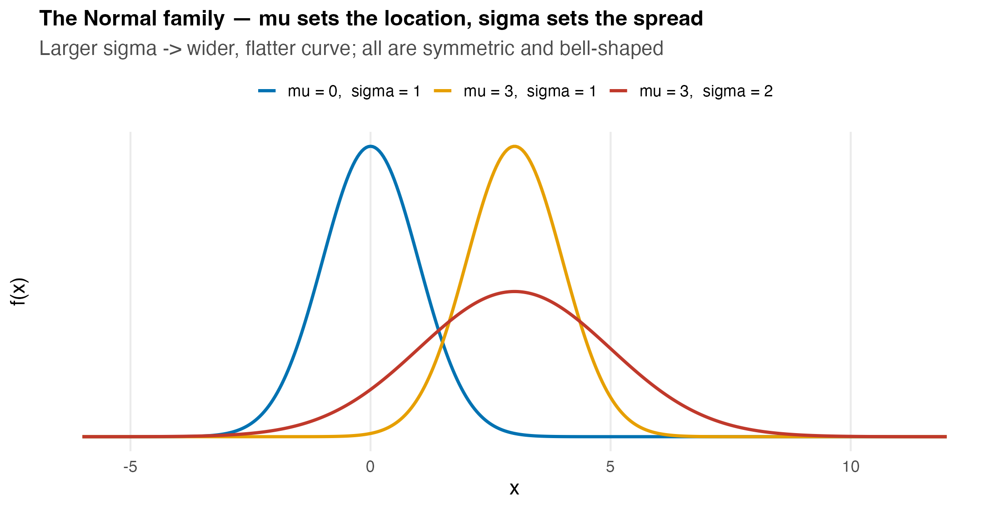
```

::: nonincremental
- The **mean $\mu$** sets the **location** (the peak); it can be any value: negative, zero, or positive.
- The **standard deviation $\sigma$** sets the **spread**: larger $\sigma$ → wider, flatter curve.
- Every Normal is **symmetric** and **bell-shaped**, with **mean = median = mode**, and an (in principle) infinite range.
:::

## The Empirical Rule

```{r  echo=FALSE, out.width = "68%",fig.align="center"}
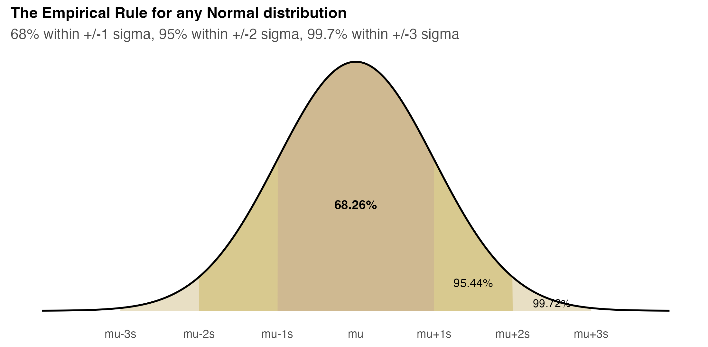
```

::: nonincremental
- **68.26%** of values fall within **$\pm 1\sigma$** of the mean.
- **95.44%** fall within **$\pm 2\sigma$**; **99.72%** fall within **$\pm 3\sigma$**.
- Half the area (0.5) sits on each side of $\mu$. For Vungle: ~95% of B-days should fall in $3.46 \pm 2(0.34) = (\$2.78, \$4.14)$.
:::

## A Question That Often Comes Up

:::: {.faq}
**A question that often comes up at this point:**

[Do 68/95/99.7 hold for any data, or only when the data are Normal?]{.faq-q}

::: {.fragment .faq-a}
**Short answer:** only for a Normal (bell) shape. The 68/95/99.7 split is a property of *that* curve, so the (\$2.78, \$4.14) range for B is trustworthy only to the extent B's eRPM is bell-shaped. That is exactly why Lecture 2 spends a slide *checking* the Normal assumption (QQ plot, Shapiro-Wilk) before we let the rule put a number in front of the manager. Skewed or heavy-tailed data break these percentages.
:::
::::

# The Standard Normal & z-Scores {background-color="#cfb991"}

## One Curve to Rule Them All: Z ~ N(0, 1)

<br>

- There are infinitely many Normal curves (one per $\mu, \sigma$). We standardize them all to a **single reference**: the **standard Normal**, $Z \sim N(0, 1)$: mean 0, standard deviation 1.

- **Standardization** converts any $x$ to a $z$:

::: fragment

$$
z = \frac{x - \mu}{\sigma}
$$

:::

- $z$ is **the number of standard deviations** $x$ lies from the mean. $z = +1.5$ means "1.5 SDs above average"; $z = -2$ means "2 SDs below."

- Once standardized, **one** table (or one Excel function) gives the area for *any* Normal problem.

## Standardizing in Pictures

```{r  echo=FALSE, out.width = "78%",fig.align="center"}
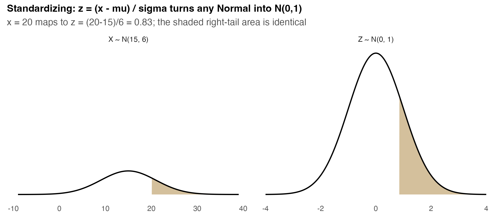
```

::: nonincremental
- The **shape and the shaded area are identical** before and after standardizing; only the axis labels change.
- Compute $z$, then read the area off $N(0,1)$. This is the move behind every Normal probability you will ever calculate.
:::

## A Question That Often Comes Up

:::: {.faq}
**A question that often comes up at this point:**

[If Excel's `NORM.DIST` takes the mean and SD directly, why bother standardizing to a z-score at all?]{.faq-q}

::: {.fragment .faq-a}
**Short answer:** for the *arithmetic*, you do not have to: `NORM.DIST(3.50, 3.459, 0.344, TRUE)` skips the z entirely. The z-score earns its keep as a *common ruler*. Saying a \$3.50 day is "z = 0.12, barely above average" lets you compare an eRPM day to an install count to a test score on one scale, and it is how textbooks and tables (and your exam) state Normal problems. Keep both: z for reasoning and comparison, Excel for the number.
:::
::::

## Anchor Example: Pep Zone Stockout

<br>

- Pep Zone reorders motor oil when stock hits **20 gallons**. Demand during the replenishment lead time is **Normal with mean 15, sd 6**: $X \sim N(15, 6)$.

- **What is the probability of a stockout**, that demand *exceeds* 20 before the new stock arrives?

::: fragment

$$
z = \frac{20 - 15}{6} = 0.83 \quad\Rightarrow\quad P(X > 20) = P(Z > 0.83) = 0.2033
$$

:::

- About a **20% chance** of running out on each cycle, and the store manager wants that lower.

## Pep Zone: the Stockout Area

```{r  echo=FALSE, out.width = "70%",fig.align="center"}
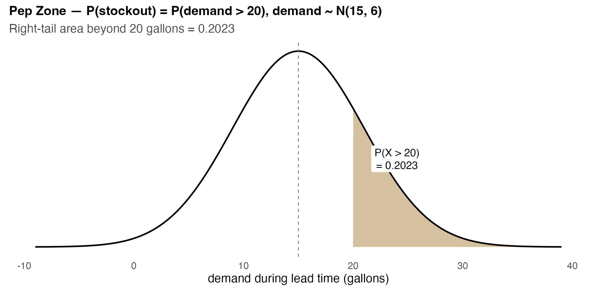
```

::: nonincremental
- The stockout probability is the **right-tail area** beyond 20 gallons: **0.2033**.
- *Inverse question (Lecture 2 tool):* what reorder point cuts stockout risk to 5%? Answer: $x = 15 + 1.645(6) \approx 25$ gallons. Raising the trigger from 20 to 25 drops stockout risk from ~20% to ~5%.
:::

# Modeling Vungle eRPM as Normal {background-color="#cfb991"}

## Fitting the Normal to Daily eRPM (Algorithm B)

:::: {style="font-size: 86%;"}

- Treat each day's eRPM for algorithm B as a draw from a Normal. From the 30 June days (`data/vungle_daily.csv`, `algorithm == "B"`):

::: fragment

| Quantity | Value |
|---|---:|
| $n$ (days) | 30 |
| $\bar{x}$ (mean eRPM) | **\$3.459** |
| $s$ (standard deviation) | **\$0.344** |

:::

- So our working model is $\text{eRPM}_B \sim N(\mu = 3.459, \; \sigma = 0.344)$.

- **A first z-score.** A \$3.50 day standardizes to:

::: fragment

$$
z = \frac{3.50 - 3.459}{0.344} = 0.12
$$

:::

- A \$3.50 day is barely above average, only **0.12 SD** up. That hints (we'll confirm next time) that beating \$3.50 is close to a coin flip.

::::

## A Question That Often Comes Up

:::: {.faq}
**A question that often comes up at this point:**

[We just declared B's eRPM Normal because the histogram looks like a bell. Isn't that assuming what we want to prove?]{.faq-q}

::: {.fragment .faq-a}
**Short answer:** fair worry, and it is why this is a *working model*, not a fact. A bell-shaped histogram is a reasonable starting hypothesis, no more. Lecture 2 puts it on trial with a QQ plot and the Shapiro-Wilk test before we let any probability ride on it. If B failed the check we would not throw out the data, we would switch to a model that fits its shape. We fit first, then verify, then decide.
:::
::::

## Normal Probabilities in Excel: Two Functions

<br>

- The ToolPak is not needed for Normal probabilities; two worksheet functions do everything:

  - `=NORM.DIST(x, mean, sd, TRUE)` → the **cumulative** probability $P(X \le x)$.
  - `=NORM.INV(p, mean, sd)` → the **inverse**: the $x$ with $P(X \le x) = p$ (a percentile).

- The standardized cousins act on $z$ directly:

  - `=NORM.S.DIST(z, TRUE)` → $P(Z \le z)$;  `=NORM.S.INV(p)` → the $z$ for probability $p$.

- **Workhorses:** `NORM.DIST` and `NORM.INV` (real units). The `.S.` versions are for when you have already standardized to a $z$.

- We put them to work in Lecture 2; for now your group just **fits the model and reads its shape**.

## The Manager's Takeaway: Lecture 1

<br>

- **One sentence:** B's daily eRPM is well described by a Normal centered at **\$3.46** with spread **\$0.34**, and standardizing ($z = (x-\mu)/\sigma$) turns any eRPM question into a single standard-Normal area.

- **One number:** $z = 0.12$ for a \$3.50 day, barely above average, so "beating \$3.50" is roughly a coin flip (we'll nail the exact probability next time).

- **One caveat:** the empirical rule and z-scores are only as good as the **Normal assumption**. We have *assumed* the bell; Lecture 2 we **check** it with a QQ plot before betting a decision on it.

## Today's Question, Today's Answer

<br>

**The question (this rung of the ladder):**

> *Can we fit a single model to B's daily eRPM, and where does a \$3.50 day sit on it?*

::: fragment
<br>

**The answer we reached today:**

> **Yes.** B's 30 days fit a Normal centered at **\$3.46** with spread **\$0.34**, so the empirical rule already puts ~95% of B-days in **(\$2.78, \$4.14)**. A \$3.50 day standardizes to **z = 0.12**, barely above average. The exact "how often above \$3.50?" probability lands in Lecture 2.
:::

## ⏱️ Team Sprint: Your Group Case (Lecture 1)

::: {.sprint .nonincremental}
**Now it's your group's turn.** Today's in-class group case is posted on **Brightspace** (*Topic 06 Group Case, Lecture 1*): a separate business decision you make with today's tools.

**What you'll use:** the **Normal model**, the **empirical rule**, and a **z-score** ($z = (x - \bar{x})/s$) to place a value. **Excel:** Analysis ToolPak → Descriptive Statistics for $\bar{x}$ and $s$.

**Submit one PDF per group before you leave:** your decision plus the numbers behind it.
:::

# Lecture 2: Normal Applications & the Normal Approximation {background-color="#cfb991"}

## The Brief: Lecture 2

<br>

- **The big call (Vungle A/B):** roll out B, or stay with A? Today's piece for the manager: **what probability and percentile does the Normal give, and is the model fair?**

::: fragment
> "Cash in the model. Tomorrow's eRPM is $\sim N(3.459, 0.344)$. **What's $P(\text{eRPM} > \$3.50)$? What eRPM defines a top-10% day?** And before we trust any of it, **is the Normal assumption fair?**"
:::

<br>

- Lecture 1 built the model; today we **use** it: a tail probability, a percentile, an assumption check, and the bridge from counts (Binomial) to the Normal at scale.

- Tools: `NORM.DIST` (tail areas), `NORM.INV` (percentiles), the **QQ plot** (assumption), and the **Normal approximation of the Binomial** (planning installs).

## How Every Class Runs

{.nostretch fig-align="center" width="90%"}

::: nonincremental
The class **ends on the Team Sprint**, your group's graded submission: a decision plus your read of the analysis, one PDF before you leave.
:::

# Normal Probabilities: Tails {background-color="#cfb991"}

## P(eRPM > \$3.50): a Right-Tail Area

<br>

- The managerial question: how often does B clear the **\$3.50** bar? Standardize, then take the tail area.

::: fragment

$$
z = \frac{3.50 - 3.459}{0.344} = 0.12 \qquad P(\text{eRPM} > 3.50) = P(Z > 0.12) = 1 - 0.547 = 0.453
$$

:::

- **In Excel** (no standardizing needed):

::: fragment

$$
\texttt{=1 - NORM.DIST(3.50, 3.459, 0.344, TRUE)} \;=\; 0.4526
$$

:::

- **Read it for the manager:** on roughly **45 of every 100 days**, B's eRPM tops \$3.50. A \$3.50 day is *not* exceptional; it is just shy of a coin flip.

## The Tail Area, Visualized

```{r  echo=FALSE, out.width = "70%",fig.align="center"}
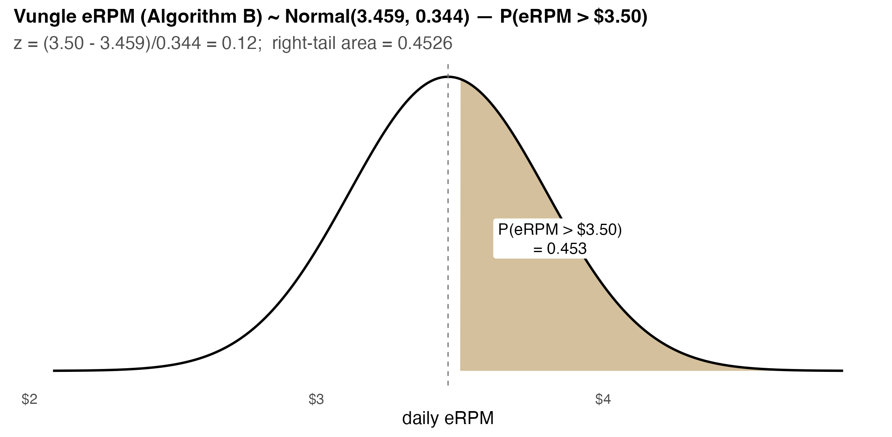
```

::: nonincremental
- The shaded right tail beyond \$3.50 is **0.4526** of the total area.
- Same machine for a **bad day**: $P(\text{eRPM} < \$3.00) =$ `NORM.DIST(3.00, 3.459, 0.344, TRUE)` $= 0.091$, about a **1-in-11** chance B dips below \$3.00.
:::

## Do It in Excel: NORM.DIST Tail Probability

:::::: columns
::: {.column width="46%"}
**Follow along:**

1. Type the model in cells: mean `3.459`, sd `0.344`, and the bar `3.50`.
2. Left area: `=NORM.DIST(3.50, 3.459, 0.344, TRUE)` returns **0.547**.
3. Right tail "tops \$3.50": `=1 - NORM.DIST(3.50, 3.459, 0.344, TRUE)` = **0.4526**.
4. Check the z-route: `=1 - NORM.S.DIST(0.12, TRUE)` gives the **same** 0.4526.
:::
::: {.column width="54%"}
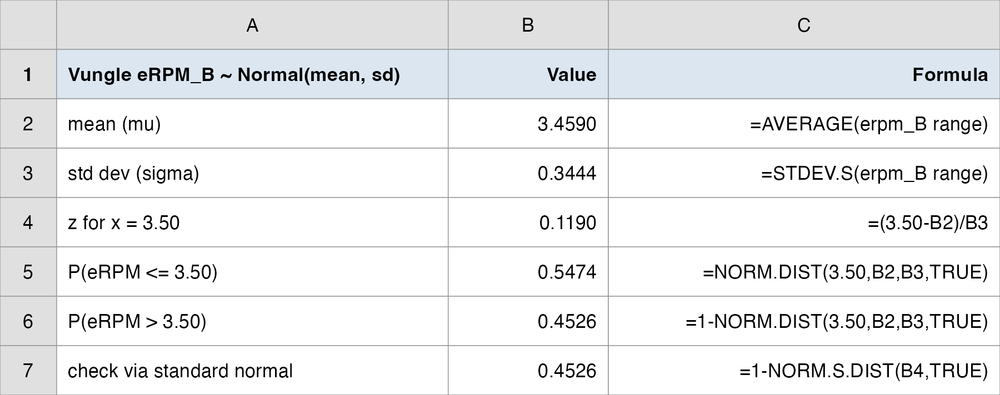{.nostretch fig-align="center" width="100%"}
:::
::::::

::: nonincremental
`NORM.DIST(..., TRUE)` returns the area to the **left**; subtract from 1 for a right tail. Two roads (real units or $z$), one answer.
:::

## A Question That Often Comes Up

:::: {.faq}
**A question that often comes up at this point:**

[`NORM.DIST` gives the area to the *left*. Does the answer change if I ask $P(\text{eRPM} > 3.50)$ versus $P(\text{eRPM} \ge 3.50)$, and why subtract from 1?]{.faq-q}

::: {.fragment .faq-a}
**Short answer:** no change. For a continuous variable the single point \$3.50 has zero area, so $>$ and $\ge$ give the identical number; the strict-versus-not distinction only matters for counts (Binomial, Poisson). We subtract from 1 because `NORM.DIST(..., TRUE)` returns the *left* area $P(X \le 3.50) = 0.547$, and a "tops \$3.50" question wants the *right* tail: $1 - 0.547 = 0.453$.
:::
::::

# Normal Percentiles: NORM.INV {background-color="#cfb991"}

## The 90th-Percentile Day

<br>

- Flip the question. Instead of "what area is above \$3.50?", ask "**what eRPM marks the top 10% of days?**": the 90th percentile.

- **Inverse Normal:** find $x$ with $P(X \le x) = 0.90$. By hand, $z_{0.90} = 1.282$, then back-convert:

::: fragment

$$
x = \mu + z\,\sigma = 3.459 + 1.282 \times 0.344 = \$3.90
$$

:::

- **In Excel** (direct, no z needed):

::: fragment

$$
\texttt{=NORM.INV(0.90, 3.459, 0.344)} \;=\; \$3.90
$$

:::

- **For the manager:** a **\$3.90** day is a genuine top-10% performance, a useful internal benchmark for "a great day."

## The Percentile, Visualized

```{r  echo=FALSE, out.width = "70%",fig.align="center"}
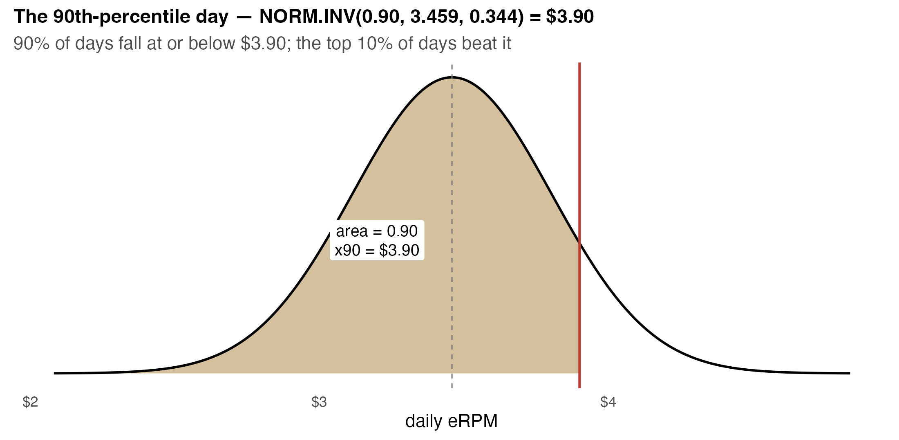
```

::: nonincremental
- 90% of the area sits **at or below \$3.90**; the top 10% of days lie beyond it.
- `NORM.DIST` and `NORM.INV` are **inverses**: `NORM.DIST(3.90, …)` $\approx 0.90$, and `NORM.INV(0.90, …)` $\approx 3.90$. One asks "what area?", the other "what value?".
:::

## Do It in Excel: NORM.INV Percentiles

:::::: columns
::: {.column width="46%"}
**Follow along:**

1. Keep mean `3.459` and sd `0.344` in cells.
2. Top-10% day: `=NORM.INV(0.90, 3.459, 0.344)` = **\$3.90**.
3. "Good" day, 75th pct: `=NORM.INV(0.75, 3.459, 0.344)` = **\$3.69**.
4. Median: `=NORM.INV(0.50, 3.459, 0.344)` = **\$3.46** (equals the mean).
5. Confirm the inverse: `=NORM.DIST(3.90, 3.459, 0.344, TRUE)` returns **0.90**.
:::
::: {.column width="54%"}
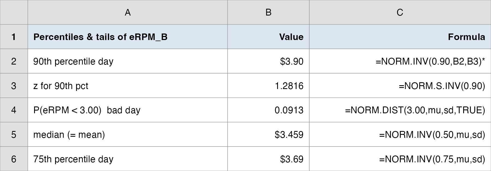{.nostretch fig-align="center" width="100%"}
:::
::::::

::: fragment
Percentiles turn the distribution into **decision thresholds**: a \$3.69 day is "good," a \$3.90 day is "great." Same model, business-ready language.
:::

## A Question That Often Comes Up

:::: {.faq}
**A question that often comes up at this point:**

[I keep mixing up `NORM.DIST` and `NORM.INV`. How do I know which one to use?]{.faq-q}

::: {.fragment .faq-a}
**Short answer:** match the function to what is *given* and what is *asked*. Given a dollar value, want a probability ("how often above \$3.50?") use `NORM.DIST`. Given a probability, want a dollar value ("what eRPM marks the top 10%?") use `NORM.INV`. One takes an x and returns an area; the other takes an area and returns an x. They undo each other: `NORM.INV(0.90, ...)` = \$3.90 and `NORM.DIST(3.90, ...)` = 0.90.
:::
::::

# Is the Normal Assumption Fair? {background-color="#cfb991"}

## Check Before You Trust: the QQ Plot

<br>

- Every probability and percentile we just computed **assumes** eRPM is Normal. If the assumption fails, the numbers are fiction. So we **check**.

- A **Normal-probability plot** (QQ plot) sorts the data and plots each value against the value a perfect Normal would predict at that rank.

- **The read:**

  - Points hug a **straight line** → Normal is a reasonable model.
  - Systematic curves, S-shapes, or fat tails → Normal is suspect.

- A formal companion is the **Shapiro-Wilk test** ($H_0$: the data are Normal). A *large* p-value means "**no evidence against** Normal", exactly what we want here.

## The QQ Plot for eRPM (Algorithm B)

```{r  echo=FALSE, out.width = "68%",fig.align="center"}
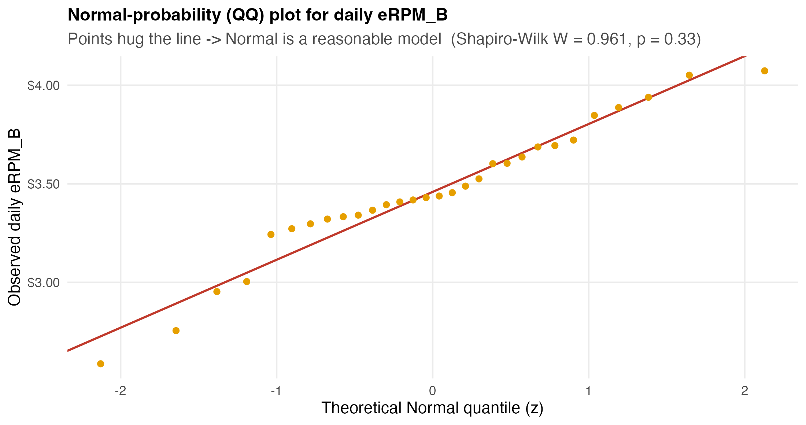
```

::: nonincremental
- The 30 B-day points **track the line** closely: no fat tails, no S-curve.
- Shapiro-Wilk: **W = 0.961, p = 0.33** → we **do not reject** Normality. The model is fair to use.
- *Honest caveat:* $n = 30$ is modest; the QQ plot can't *prove* Normal, only fail to flag a problem. For business decisions, "Normal is a reasonable working model" is the right standard.
:::

## A Question That Often Comes Up

:::: {.faq}
**A question that often comes up at this point:**

[The B-day points are not *exactly* on the line. How straight is straight enough, and doesn't the Shapiro-Wilk test settle it for me?]{.faq-q}

::: {.fragment .faq-a}
**Short answer:** never expect a perfect line; real data wiggle. You are looking for *systematic* departures (a clear S-curve, both ends flaring out), not minor scatter, and B shows none. The Shapiro-Wilk test backs the eye, it does not replace it: $p = 0.33$ means "no evidence against Normal," which is not the same as "proven Normal." Read the plot and the p-value together, and remember a large $p$ here is the result we *want*.
:::
::::

# The Normal Approximation of the Binomial {background-color="#cfb991"}

## Why Approximate? Counts at Huge Scale

<br>

- Recall installs are **counts**: each impression either installs (success) or not: a Binomial with huge $n$. On a typical B-traffic day, $n \approx 527{,}000$ impressions, $p \approx 0.0035$.

- The exact Binomial is **unwieldy** at that scale, but a smooth **Normal** matches it beautifully.

- **Conditions to approximate** $\text{Binomial}(n, p)$ with a Normal:

::: fragment

$$
n > 20, \qquad np \ge 5, \qquad n(1 - p) \ge 5
$$

:::

- Then set:

::: fragment

$$
\mu = np \qquad\qquad \sigma = \sqrt{np(1 - p)}
$$

:::

## The Picture: Binomial Bars, Normal Curve

```{r  echo=FALSE, out.width = "70%",fig.align="center"}
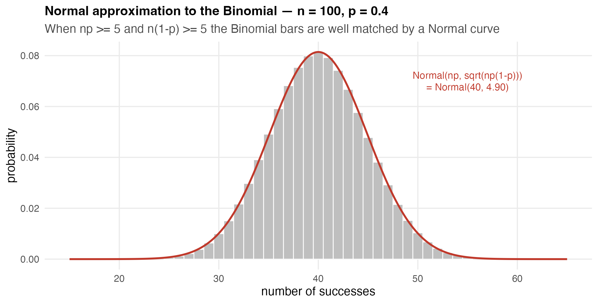
```

::: nonincremental
- Textbook anchor: $\text{Binomial}(100, 0.4)$ → $\mu = 40$, $\sigma = 4.90$. The Normal curve traces the tops of the bars.
- The bigger $n$ gets, the better the fit, which is why a 527,000-impression install count is essentially Normal.
:::

## Continuity Correction: Bars Have Width

```{r  echo=FALSE, out.width = "62%",fig.align="center"}
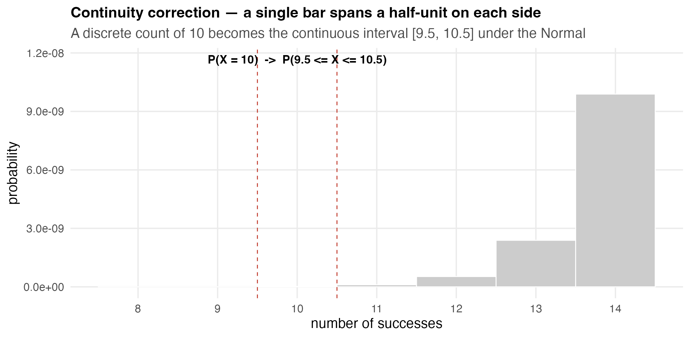
```

::: nonincremental
- A discrete count of exactly 10 occupies the **continuous interval [9.5, 10.5]**, so $P(X = 10) \approx P(9.5 \le X \le 10.5)$.
- Add/subtract **0.5** at the edges. For $P(30 \le X \le 50)$ use $P(29.5 \le X \le 50.5)$; this $\pm 0.5$ "continuity correction" sharpens the approximation (most relevant when $n$ is moderate).
:::

## Vungle Installs as a Planning Number

::: r-fit-text
**Setup.** On a typical B-traffic day: $n = 527{,}513$ impressions, install rate $p = 0.00354$. Model daily installs $\approx \text{Binomial}(n, p)$.

**Conditions.** $np = 1{,}867 \ge 5$ and $n(1-p) = 525{,}646 \ge 5$ → Normal approximation is safe.

$$
\mu = np = 1{,}867 \text{ installs} \qquad \sigma = \sqrt{np(1-p)} = 43.1 \text{ installs}
$$

**Planning question.** What is the chance the day delivers **more than 2,000 installs** (e.g., a capacity / fulfillment trigger)?

$$
z = \frac{2000.5 - 1867}{43.1} = 3.10 \qquad P(\text{installs} > 2000) = \texttt{1 - NORM.DIST(2000.5, 1867, 43.1, TRUE)} = 0.0010
$$

**Manager's translation.** *A 2,000-install B-day is rare, about a 1-in-1,000 event under current traffic. Capacity planned to 2,000 installs is comfortable; the constraint is impressions, not the install spike.*
:::

## Do It in Excel: Normal Approximation of the Binomial

:::::: columns
::: {.column width="46%"}
**Follow along:**

1. Enter `n = 527513` and `p = 0.00354`.
2. Condition check: `=n*p` (1,867) and `=n*(1-p)` (525,646), both $\ge 5$.
3. `mu =n*p` = **1,867**; `sigma =SQRT(n*p*(1-p))` = **43.1**.
4. Tail with continuity correction: `=1 - NORM.DIST(2000.5, 1867, 43.1, TRUE)`.
5. Read it: **0.0010**, about a 1-in-1,000 day above 2,000 installs.
:::
::: {.column width="54%"}
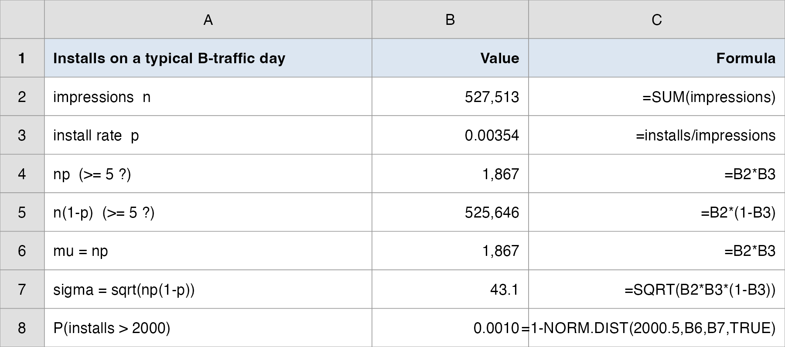{.nostretch fig-align="center" width="100%"}
:::
::::::

::: fragment
This is the bridge from Topic 5's **counting** distributions to today's **continuous** Normal; at scale, the Binomial *becomes* a Normal.
:::

## A Question That Often Comes Up

:::: {.faq}
**A question that often comes up at this point:**

[If a 527,000-impression install count is essentially Normal, why did we bother learning the Binomial in Topic 5?]{.faq-q}

::: {.fragment .faq-a}
**Short answer:** the Binomial is the *truth*; the Normal is a fast stand-in that only works at scale. The approximation needs $np \ge 5$ and $n(1-p) \ge 5$; for a small campaign (say 200 impressions) those fail and you go back to the exact Binomial. Vungle's huge daily traffic is what makes the shortcut safe here, and it lets us answer "more than 2,000 installs?" with one `NORM.DIST` instead of summing thousands of Binomial terms.
:::
::::

# Debrief: From Distribution to Decision {background-color="#cfb991"}

## Three Answers, One Model

<br>

| Question | Tool | Vungle answer |
|---|---|---|
| How often does eRPM top \$3.50? | $z$ + `NORM.DIST` | $P = 0.453$ (almost a coin flip) |
| What's a top-10% day? | `NORM.INV(0.90)` | **\$3.90** (the "great day" benchmark) |
| Is the Normal model fair? | QQ plot + Shapiro | Yes: $W = 0.96$, $p = 0.33$ |
| Plan installs at scale | Normal approx. Binomial | $P(>2000) = 0.001$ (rare) |

<br>

- Every row came from **one** fitted distribution, $N(3.459, 0.344)$: the model turns 30 observed days into statements about days we have not yet seen.

## The Manager's Takeaway

<br>

- **One sentence:** Model B's daily eRPM as $N(\$3.46, \$0.34)$ and the whole business vocabulary follows: "beats \$3.50" happens **45%** of days, a "great day" is **\$3.90**, and a sub-\$3.00 day is a **1-in-11** disappointment.

- **One number to remember:** $z = (x - \mu)/\sigma$, the single move that turns *any* Normal question into a standard-Normal area.

- **One caveat:** the model is only as good as its assumption. **Check it** (QQ plot, Shapiro) before you bet a decision on a Normal probability, and remember that at huge $n$, even the Binomial *becomes* Normal.

- **Today's call:** the Normal is a fair working model for B's eRPM, and it says a \$3.50 day is roughly a coin flip; the roll-out call still waits for the inference tests in Topics 7–9.

- **Practice with the real data:**
  - `data/vungle_daily.csv` (filter B) + `NORM.DIST` / `NORM.INV` to reproduce $P(>3.50) = 0.453$ and the \$3.90 percentile.
  - Worked solutions: `data/vungle_normal_analysis.xlsx`.

## Today's Question, Today's Answer

<br>

**The question (this rung of the ladder):**

> *What probability and percentile does the Normal give for B's eRPM, and is the model fair to trust?*

::: fragment
<br>

**The answer we reached today:**

> B clears \$3.50 on **45%** of days ($P = 0.453$), a top-10% day is **\$3.90**, and the QQ plot plus Shapiro-Wilk (**W = 0.96, p = 0.33**) say the Normal is a **fair** model to use. So a \$3.50 day is close to a coin flip; whether B beats A for good still rides on the inference tests in Topics 7–9.
:::

## ⏱️ Team Sprint: Your Group Case (Lecture 2)

::: {.sprint .nonincremental}
**Now it's your group's turn.** Today's in-class group case is posted on **Brightspace** (*Topic 06 Group Case, Lecture 2*): a separate business decision you make with today's tools.

**What you'll use:** the **Normal model**, **z-scores** / Normal probabilities (`NORM.DIST`), **percentiles** (`NORM.INV`), and a **normality check** (QQ plot / Shapiro-Wilk). **Excel:** Analysis ToolPak → Descriptive Statistics for $\bar{x}$ and $s$.

**Submit one PDF per group before you leave:** your decision plus the numbers behind it.
:::

# Wrap-up {background-color="#cfb991"}

## Summary

::: nonincremental
Some key takeaways from this session:

- For a **continuous** variable, $P(X = x) = 0$; probability is the **area** under the density $f(x)$.
- The **uniform** is the simplest model (probability ∝ interval length); the **Normal**, set by $\mu$ (location) and $\sigma$ (spread), is the workhorse, with the **empirical rule** (68/95/99.7).
- **Standardize** with $z = (x - \mu)/\sigma$, then read areas off the single standard Normal $N(0,1)$.
- In Excel: `NORM.DIST` for **probabilities** (tail areas), `NORM.INV` for **percentiles**; they are inverses.
- **Check the assumption** with a QQ plot / Shapiro-Wilk before trusting a Normal probability.
- At large $n$ with $np \ge 5$ and $n(1-p) \ge 5$, the **Binomial is well approximated by a Normal** ($\mu = np$, $\sigma = \sqrt{np(1-p)}$, with a $\pm 0.5$ continuity correction).
- **Homework (group):** HW2 drills the Normal model, z-scores, and percentiles (previous-edition problem sets on Brightspace).
- **Next time:** we stop treating these 30 days as the whole story and recognize them as a **sample**, Sampling & Estimation: how to estimate the *true* eRPM, with a margin of error.
:::

# Thank you! {background-color="#cfb991"}
