## Overview

:::::: nonincremental
::::: columns
::: {.column style="width: 50%; text-align: center; justify-content: center; align-items: center;"}
- Case Spotlight: A/B Testing at Vungle
- **Lecture 1:** sampling, point estimation
- The sampling distribution of $\bar{x}$ and $\bar{p}$
- The Central Limit Theorem & standard error
- How sure can 30 days make us?
:::

::: {.column style="width: 50%; text-align: center; justify-content: center; align-items: center;"}
- **Lecture 2:** the interval estimate
- Confidence intervals for a mean ($t$) and a proportion
- The margin of error and the three levers that set it
- How many days for $\pm\$0.05$? Sample size
- The estimation memo for Vungle
:::
:::::
::::::

# Case Spotlight: A/B Testing at Vungle {background-color="#cfb991"}

## The Brief: 30 Days Is a *Sample*

<br>

> "We ran algorithm B for **30 days** and saw a mean eRPM of about **\$3.46**. But June is over. What is B's **true** mean eRPM going forward, and how close can 30 days really get us?"

<br>

- **The big call you own as the manager:** *roll out B, or stay with A?* You cannot make it on a single 30-day number whose error you can't name.

- **Today's question (Lecture 1):** *how trustworthy is a 30-day sample mean?* Until now we **described** the 30 days we have; today we **generalize** to the days we *don't* have, every future impression B will serve.

- The 30-day mean \$3.46 is a single **point estimate**. By itself it hides the question the manager must ask: ***how much could it be off?*** This lecture quantifies that wobble; the next turns it into a range.

## How Today's Studio Runs

<br>

- This is a **two-lecture** topic. Each lecture runs the same loop: **the Brief (your decision) → Method Studio (I demo on Vungle) → Debrief (we land the call) → Team Sprint (your group case, submitted before you leave).**

::: fragment
| Lecture | The question | The tool |
|---|---|---|
| **1** | How trustworthy is a 30-day sample mean? | Sampling distribution, standard error, the CLT |
| **2** | What is B's *true* mean eRPM, give or take? How many days do we need? | Confidence intervals, margin of error, sample size |
:::

- By the end, you can write Vungle's **estimation memo**: the true mean eRPM and conversion rate, each with a 95% interval, plus the days needed for a tighter test.

# Lecture 1: Samples, Estimates & the Sampling Distribution {background-color="#cfb991"}

## The Brief: Why a Sample Mean Wobbles

<br>

- A different 30 days (say, **July**) would give a **different** mean eRPM. So would any other random sample.

- That wobble is not a mistake; it is the price of working from a **sample** instead of the whole **population**.

- **Lecture 1's question:** *if the sample mean changes every time we sample, how can the manager trust any one of them?* The answer is the **sampling distribution**, and it is surprisingly well-behaved.

## How Every Class Runs

{.nostretch fig-align="center" width="90%"}

::: nonincremental
The class **ends on the Team Sprint**, your group's graded submission: a decision plus your read of the analysis, one PDF before you leave.
:::

## Population, Sample, Inference

```{r echo=FALSE, out.width="78%", fig.align="center"}
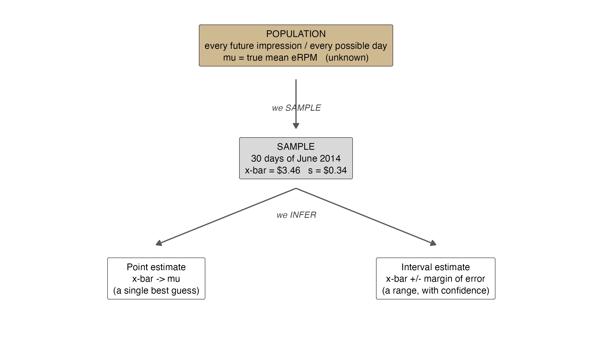
```

::: nonincremental
- **Population:** every future impression B will serve; its true mean eRPM $\mu$ is **unknown**.
- **Sample:** the 30 June days. We use them to **estimate** $\mu$, first with a point, later with an interval.
:::

## How the Sample Is Drawn

```{r echo=FALSE, out.width="84%", fig.align="center"}
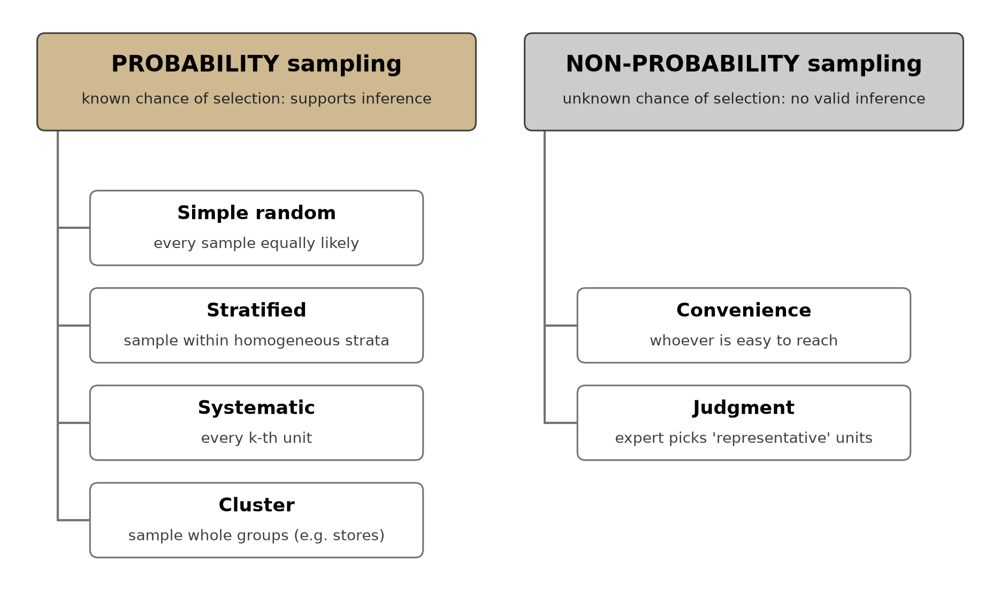
```

::: nonincremental
- **Probability** sampling gives every unit a **known chance** of selection, so the sampling distribution and every formula today hold. **Non-probability** samples (convenience, judgment) have no known selection chance, so the inference math does not apply.
- Vungle's 30 days are a probability sample of B's running output, which is what licenses the standard error and interval we build today.
:::

# Point Estimation {background-color="#cfb991"}

## From Population Parameter to Sample Statistic

<br>

- A **parameter** is a fixed (usually unknown) number describing the **population**; a **statistic** is computed from the **sample** to estimate it.

::: fragment
| Population parameter | Point estimator (statistic) |
|---|---|
| mean $\mu$ | sample mean $\bar{x}$ |
| standard deviation $\sigma$ | sample SD $s$ |
| proportion $p$ | sample proportion $\bar{p}$ |
:::

- **Point estimation** uses one sample to compute a single number as our best guess of the parameter.

- A different random sample gives a different estimate, so a point estimate alone never tells us **how close** we are.

## The Vungle Point Estimates

<br>

- Vungle's 30 days are a **sample**. Each number below is our single best guess at a *true* value we never observe directly:

::: fragment
| Parameter (true, going forward) | Point estimate from 30 days |
|---|---:|
| Mean eRPM, Algorithm A | $\bar{x}_A = \$3.347$ |
| Mean eRPM, Algorithm B | $\bar{x}_B = \$3.459$ |
| Mean daily conversion rate, B | $\bar{x} = 0.354\%$ |
:::

- These are our best single guesses, but a **different** 30 days would have landed elsewhere. That sample-to-sample wobble is exactly what the **sampling distribution** (next) describes, and what the **interval** later quantifies as "how far off might each guess be."

## Do It in Excel: Descriptive Statistics for B

:::::: columns
::: {.column width="46%"}
**Follow along:**

1. Open `vungle_estimation.xlsx` (sheet `eRPM_by_day`); select B's 30 daily eRPMs (`erpm_B`).
2. **Data -> Data Analysis -> Descriptive Statistics**.
3. Set Input Range; check **Summary statistics** and **Confidence Level for Mean (95%)**.
4. Click OK; read **Mean** ($\bar{x}_B = \$3.459$) and **Standard Deviation** ($s = \$0.344$).
5. The `Confidence Level(95.0%)` row is the margin $E$ we build the interval from next.
:::
::: {.column width="54%"}
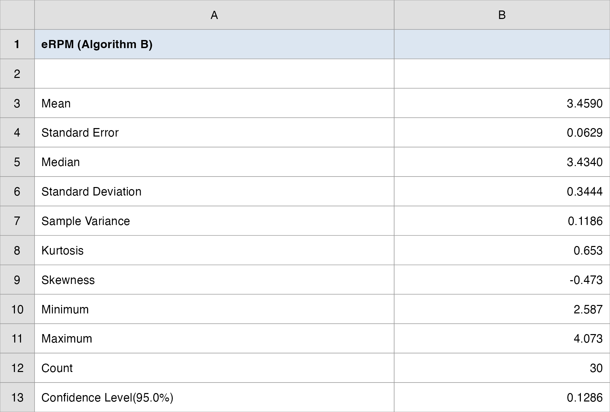{.nostretch fig-align="center" width="100%"}
:::
::::::

## A Question That Often Comes Up

:::: {.faq}
**A question that often comes up at this point:**

[If a point estimate like $\bar{x}_B = \$3.459$ is never exactly the true mean, why report a single number at all?]{.faq-q}

::: {.fragment .faq-a}
**Short answer:** $\bar{x}_B = \$3.459$ is still the best single guess we have, and every revenue projection has to start somewhere. The point is not to throw it away; it is to **attach a measure of how far off it might be**. That measure is the standard error, and the rest of the topic turns \$3.459 into a defensible range around it.
:::
::::

# The Sampling Distribution of $\bar{x}$ {background-color="#cfb991"}

## A Distribution *of the Estimates Themselves*

<br>

- Imagine drawing **many** random samples of size $n$, computing $\bar{x}$ for each. Collect all those $\bar{x}$ values.

- Their distribution is the **sampling distribution of $\bar{x}$**, the probability distribution of the sample mean.

- **Do not confuse two distributions:**

  - the distribution of the **raw data** in one sample (30 daily eRPMs), versus
  - the distribution of the **sample mean** across many samples.

- The sampling distribution is what lets us say how close *our* $\bar{x}$ is likely to be to $\mu$.

## Center and Spread of $\bar{x}$

<br>

- **Center (unbiased):** on average, the sample mean equals the population mean:

::: fragment

$$
E(\bar{x}) = \mu
$$

:::

- **Spread (the standard error):** the standard deviation of $\bar{x}$ is the **standard error of the mean**:

::: fragment

$$
\sigma_{\bar{x}} = \frac{\sigma}{\sqrt{n}}
$$

:::

- Two terms not to confuse: the **sampling error** is the gap $\bar{x} - \mu$ for *one* sample (we never see it, since $\mu$ is unknown); the **standard error** $\sigma_{\bar{x}}$ is the *typical size* of that gap across all samples (we can compute it).

- The estimate is **unbiased** (centered on the truth) and gets **more precise** as $n$ grows.

## Standard Error: Precision Depends on $n$, Not $N$

<br>

- The standard error $\sigma/\sqrt{n}$ depends on the **sample size $n$**, *not* on how big the population is.

- **This is the wonderful part:** to halve the wobble of your estimate you need **four times** the data ($\sqrt{n}$), and it does not matter whether the population is a few thousand users or Vungle's billions of impressions.

::: fragment
| B's eRPM: $s = \$0.344$ | $\sigma_{\bar{x}} = 0.344/\sqrt{n}$ |
|---|---:|
| $n = 30$ days | $\$0.063$ |
| $n = 120$ days | $\$0.031$ |
:::

- Quadruple the days ($30 \to 120$) → the standard error **halves** exactly ($\sqrt{4}=2$). Precision is *bought* with sample size.

## A Question That Often Comes Up

:::: {.faq}
**A question that often comes up at this point:**

[Vungle serves billions of impressions. How can 30 days possibly say anything about a population that huge?]{.faq-q}

::: {.fragment .faq-a}
**Short answer:** the standard error is $\sigma/\sqrt{n}$, and the population size $N$ is **nowhere in it**. A 30-day sample is exactly as precise whether B serves a few thousand impressions a day or a few billion. Precision rides on **how many days you sampled**, not on how big the world you sampled from is.
:::
::::

## Seeing the Sampling Distribution

```{r echo=FALSE, out.width="80%", fig.align="center"}
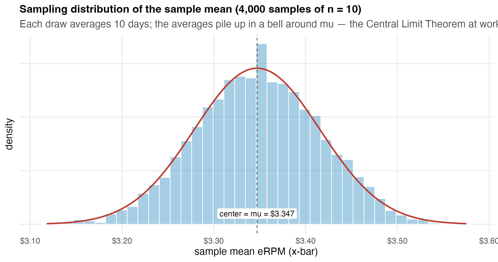
```

::: nonincremental
- Repeatedly averaging 10 Vungle A-days: the **individual days** are scattered, but their **averages** pile up tightly in a bell around $\mu$, narrower than the raw data and roughly Normal.
:::

# The Central Limit Theorem {background-color="#cfb991"}

## The CLT: Why the Bell Always Appears

<br>

- **Central Limit Theorem:** for random samples of size $n$ from *any* population with mean $\mu$ and SD $\sigma$, the sampling distribution of $\bar{x}$ is approximately

::: fragment

$$
\bar{x} \;\sim\; \text{approximately } N\!\left(\mu,\; \frac{\sigma^2}{n}\right) \quad \text{as } n \text{ grows}
$$

:::

- It works **regardless of the population's shape**: skewed, uniform, or lumpy, it does not matter.

- **Rule of thumb:** $n \geq 30$ is usually enough; $n \geq 50$ if the population is highly skewed or has outliers. Vungle's $n = 30$ sits right on the line.

## The CLT in One Picture

```{r echo=FALSE, out.width="92%", fig.align="center"}
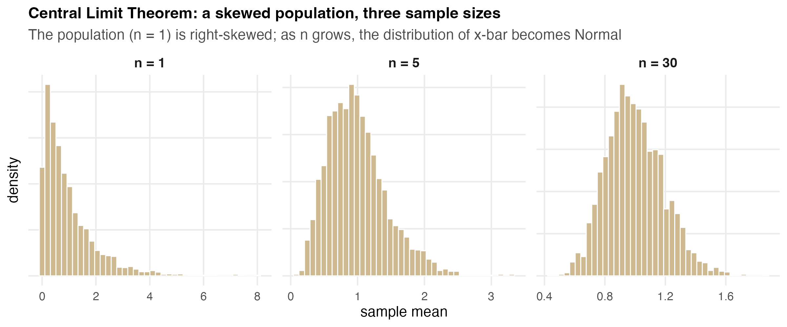
```

::: nonincremental
- Start with a sharply **right-skewed** population ($n = 1$). Average just a handful of values ($n = 5$) and it already symmetrizes; by $n = 30$ the distribution of $\bar{x}$ is essentially **Normal**.
:::

## See the CLT in Action

::: {.nonincremental style="font-size: 90%;"}
The CLT is the engine behind every interval we build today: it is *why* B's sample mean $\bar{x}_B$ stacks up in a Normal curve around the true $\mu$, even though B's 30 daily eRPMs are not perfectly bell-shaped. Watch it happen, then move the sliders yourself.
:::

:::: columns
::: {.column width="50%"}
::: {style="text-align:center; font-weight:bold; margin-bottom:0.3em;"}
Bunnies, Dragons and the 'Normal' World (NYT)
:::
<iframe width="100%" height="400" src="https://www.youtube.com/embed/jvoxEYmQHNM" title="Central Limit Theorem | The New York Times" frameborder="0" allow="accelerometer; autoplay; clipboard-write; encrypted-media; gyroscope; picture-in-picture; web-share" allowfullscreen></iframe>
<div style="text-align:center; font-size:0.62em; margin-top:0.25em;"><a href="https://www.youtube.com/watch?v=jvoxEYmQHNM" target="_blank" rel="noopener noreferrer" data-preview-link="false">Open the video in a new tab ↗</a></div>
:::
::: {.column width="50%"}
::: {style="text-align:center; font-weight:bold; margin-bottom:0.3em;"}
Seeing Theory (interactive)
:::
<iframe src="https://seeing-theory.brown.edu/" width="100%" height="400" style="border:1px solid #ccc; border-radius:4px;"></iframe>
<div style="text-align:center; font-size:0.62em; margin-top:0.25em;"><a href="https://seeing-theory.brown.edu/" target="_blank" rel="noopener noreferrer" data-preview-link="false">Open Seeing Theory in a new tab ↗</a></div>
:::
::::

## Using the CLT on Vungle: How Close Does 30 Days Get Us?

::: r-fit-text
The CLT says B's 30-day mean $\bar{x}_B$ is approximately Normal, centered on B's **true** mean $\mu$, with standard error $\sigma/\sqrt{n}$. We do not know $\sigma$, so we estimate it with $s_B = \$0.344$:

::: fragment

$$
\sigma_{\bar{x}} = \frac{s_B}{\sqrt{n}} = \frac{0.344}{\sqrt{30}} = \$0.063
$$

:::

::: fragment

$$
P\big(\,|\bar{x}_B - \mu| \le 2\,\sigma_{\bar{x}}\,\big) \approx 0.95, \qquad 2\,\sigma_{\bar{x}} \approx \$0.13
$$

:::

::: fragment
**Read it:** a single 30-day mean lands within about **\$0.13** of B's true eRPM roughly **95%** of the time (within \$0.06 about 68%). We still cannot say *where* the truth sits, only how tightly our estimate clusters around it. Flipping that around, from the estimate back to the truth, is the **confidence interval**, next lecture. In Excel: `=0.344/SQRT(30)`.
:::
:::

## A Question That Often Comes Up

:::: {.faq}
**A question that often comes up at this point:**

[Vungle's 30 daily eRPMs are not perfectly bell-shaped. Does the CLT still apply to our case?]{.faq-q}

::: {.fragment .faq-a}
**Short answer:** yes. The CLT is about the distribution of the **sample mean**, not the raw daily values. It holds no matter the shape of the daily eRPMs: skewed, lumpy, whatever. At $n = 30$ the sampling distribution of $\bar{x}_B$ is already close to Normal, which is what lets us put a $z$ (or $t$) interval around \$3.459. The one caution: $n = 30$ sits on the rule-of-thumb line, so heavy skew or outliers would push us toward wanting more days.
:::
::::

# The Sampling Distribution of $\bar{p}$ {background-color="#cfb991"}

## Proportions Have a Sampling Distribution Too

<br>

- For a **yes/no** outcome (an impression converts or it doesn't), the sample proportion is $\bar{p} = x/n$.

- It has its own sampling distribution, centered and spread by:

::: fragment

$$
E(\bar{p}) = p
\qquad\qquad
\sigma_{\bar{p}} = \sqrt{\frac{p(1-p)}{n}}
$$

:::

- **Normal approximation holds when** the sample is large enough:

::: fragment

$$
np \geq 5 \qquad \text{and} \qquad n(1-p) \geq 5
$$

:::

- **Vungle's conversion:** with $\bar{p} \approx 0.0035$ over B's 30 days of impressions, $n\bar{p} =$ installs $\approx 56{,}031 \geq 5$ and $n(1-\bar{p}) \approx 15.8\text{M} \geq 5$ ✓, so the Normal approximation is safe.

## Debrief: Lecture 1 Takeaway

<br>

- **One sentence:** a sample mean is an **unbiased** estimate of the truth, but it **wobbles** by a standard error of $\sigma/\sqrt{n}$; thanks to the CLT, that wobble is **Normal** for $n \geq 30$.

- **One number:** B's standard error is $s/\sqrt{30} = 0.344/\sqrt{30} \approx \$0.063$, the typical gap between a 30-day mean and the truth.

- **One caveat:** precision is bought with $n$, and only as $\sqrt{n}$; quadrupling the days only halves the error.

## Today's Question, Today's Answer

<br>

**The question (Lecture 1):**

> *How trustworthy is a 30-day sample mean?*

::: fragment
<br>

**The answer we reached today:**

> A 30-day mean is **unbiased** (it centers on the truth), but it **wobbles** by a standard error of $s/\sqrt{n}$: for B that is $0.344/\sqrt{30} \approx \mathbf{\$0.063}$. Thanks to the **CLT**, that wobble is **Normal** at $n = 30$, so the gap to the truth is small and now **quantifiable**: that is what lets us build a range next.
:::

## ⏱️ Team Sprint: Your Group Case (Lecture 1)

::: {.sprint .nonincremental}
**Now it's your group's turn.** Today's in-class group case is posted on **Brightspace** (*Topic 07 Group Case, Lecture 1*): a separate business decision you make with today's tools.

**What you'll use:** the **standard error** $s/\sqrt{n}$ and the **sampling distribution** of $\bar{x}$ (CLT, $n \geq 30$). **Excel:** Analysis ToolPak → Descriptive Statistics.

**Submit one PDF per group before you leave:** your decision plus the numbers behind it.
:::

# Lecture 2: The Interval Estimate {background-color="#cfb991"}

## The Brief: \$3.46, Give or Take How Much?

<br>

> "Don't just tell me B earns \$3.46. Tell me the **range** I can bank on, and tell me how many test-days it would take to cut that range in half."

<br>

- **The big call you still own as the manager:** *roll out B, or stay with A?* A single \$3.46 with no range cannot support it.

- **Today's question (Lecture 2):** *what is B's true mean (and conversion rate), give or take, and how big a sample do we need?* We attach a **margin of error** and report an **interval** we are 95% confident contains the truth.

- Then we **invert** the question: pick the precision first ($\pm\$0.05$), and solve for the **sample size** that delivers it.

## How Every Class Runs

{.nostretch fig-align="center" width="90%"}

::: nonincremental
The class **ends on the Team Sprint**, your group's graded submission: a decision plus your read of the analysis, one PDF before you leave.
:::

## A Point Estimate Is a Spear; an Interval Is a Net

```{r echo=FALSE, out.width="70%", fig.align="center"}
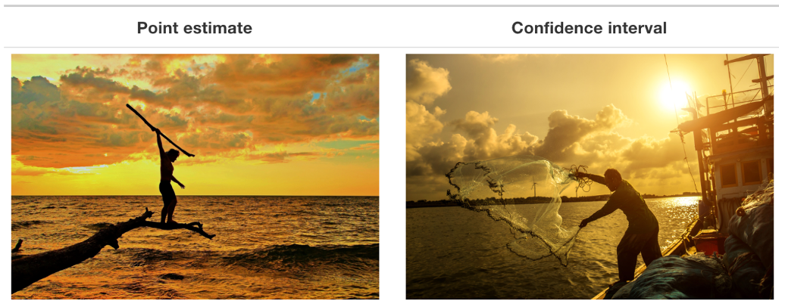
```

::: {.nonincremental style="font-size: 92%;"}
- B's 30 days give one **point estimate**, $\bar{x}_B = \$3.459$: the manager's single best guess at B's true mean eRPM, but almost surely not the exact truth.
- Quoting only that one number is **spear-fishing**, a single throw at a moving target. A **confidence interval** is **casting a net**: a plausible range, $\bar{x}_B \pm$ a **margin of error**, built to land on the true $\mu$ most of the time.
- The net is what the manager can bank the rollout on. Sizing that margin of error is the rest of today's work.
:::

## From Standard Error to a Margin of Error

<br>

- An **interval estimate** adds and subtracts a **margin of error** $E$ from the point estimate:

::: fragment

$$
\bar{x} \pm E
\qquad\text{where}\qquad
E = (\text{a multiplier}) \times (\text{standard error})
$$

:::

- The multiplier comes from the sampling distribution: about **1.96** standard errors capture the middle **95%** of a Normal curve.

- Two cases for the multiplier:

  - $\sigma$ **known** (rare) → use $z$.
  - $\sigma$ **unknown** (almost always) → estimate it with $s$ and use the **$t$ distribution**.

## The Special Case: $\sigma$ Known → Use $z$

<br>

- When $\sigma$ is somehow known (a long production history, a fixed process spec), the interval for $\mu$ uses the $z$ multiplier directly:

::: fragment

$$
\bar{x} \pm z_{\alpha/2}\,\frac{\sigma}{\sqrt{n}}
$$

:::

- The multiplier is read straight from the Normal table, the same values for every sample size:

::: fragment
| Confidence | $z_{\alpha/2}$ |
|---|---:|
| 90% | 1.645 |
| 95% | 1.960 |
| 99% | 2.576 |
:::

- Vungle does **not** know $\sigma$ for B's eRPM, so this case does not apply here. We estimate $\sigma$ with $s$, which is why the rest of the topic uses $t$.

# The $t$ Distribution {background-color="#cfb991"}

## Why $t$, Not $z$

<br>

- In real data we never know $\sigma$; we estimate it with the sample SD $s$. That extra uncertainty makes the bell **fatter in the tails**: the **$t$ distribution**.

- A $t$ distribution is indexed by its **degrees of freedom** $df = n - 1$ (the $n$ observations, minus one used up estimating $s$).

- As $df$ grows, $t$ converges to $z$: by $df = 29$ they are nearly identical, and beyond $df = 100$ the difference is negligible.

## $t$ Has Fatter Tails Than $z$

```{r echo=FALSE, out.width="80%", fig.align="center"}
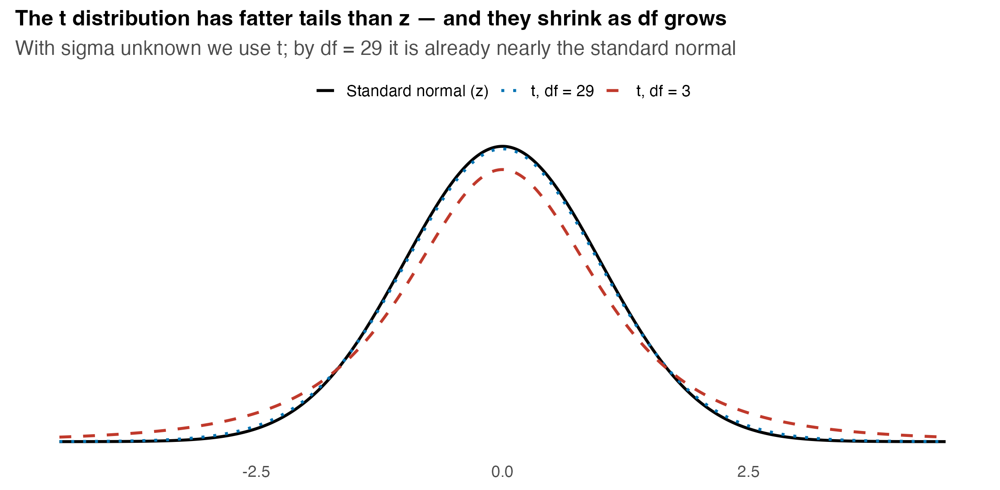
```

::: nonincremental
- Fatter tails → a **larger** multiplier → a **wider** interval. That is the honest "tax" for not knowing $\sigma$. Excel: `=T.INV.2T(0.05, df)` gives the 95% multiplier.
:::

## A Question That Often Comes Up

:::: {.faq}
**A question that often comes up at this point:**

[At $df = 29$ the $t$ multiplier 2.045 is barely above $z$'s 1.96. For Vungle's 30 days, is the difference even worth the trouble?]{.faq-q}

::: {.fragment .faq-a}
**Short answer:** here it is small but not zero: using 2.045 instead of 1.96 widens B's eRPM margin from about \$0.123 to \$0.129, the honest cost of not knowing $\sigma$. The habit matters more than this one case. With a small sample, say $n = 10$, the gap is large, and "always use $t$ when $\sigma$ is unknown" keeps you correct without having to decide each time whether $n$ is "big enough."
:::
::::

# Confidence Interval for a Mean {background-color="#cfb991"}

## The $t$-Interval Formula

<br>

- With $\sigma$ unknown (the usual case), the confidence interval for $\mu$ is:

::: fragment

$$
\bar{x} \pm t_{\alpha/2,\,n-1}\,\frac{s}{\sqrt{n}}
$$

:::

- The pieces: $\bar{x}$ the point estimate, $s/\sqrt{n}$ the standard error, $t_{\alpha/2,\,n-1}$ the multiplier for confidence level $1-\alpha$.

- Excel multipliers: `=T.INV.2T(0.05, n-1)` (95%), `=T.INV.2T(0.10, n-1)` (90%), `=T.INV.2T(0.01, n-1)` (99%).

## What "95% Confident" Really Means

```{r echo=FALSE, out.width="74%", fig.align="center"}
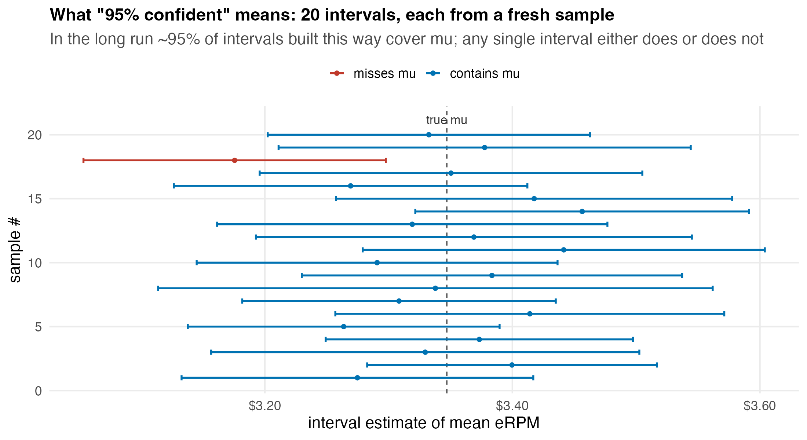
```

::: nonincremental
- **Correct:** *"in repeated sampling, about 95% of intervals built this way contain $\mu$."* The interval is random; $\mu$ is fixed.
- **Wrong:** *"there is a 95% chance $\mu$ is in this one interval."* Once computed, an interval either contains $\mu$ or it doesn't.
:::

## See "95% Confident" in Action

::: {.nonincremental style="font-size: 90%;"}
Build a 95% interval the same way many times: about **19 of every 20** capture the true mean and **1 misses**. The interval is what moves, the truth stays put. Drag the **confidence level** and **sample size** and watch the hit rate track them. The same logic sits behind B's eRPM interval.
:::

<iframe src="https://rpsychologist.com/d3/ci/" width="100%" height="560" style="border:1px solid #ccc; border-radius:4px;" title="Interpreting Confidence Intervals: an interactive simulation (Kristoffer Magnusson)"></iframe>
<div style="text-align:center; font-size:0.62em; margin-top:0.25em;"><a href="https://rpsychologist.com/d3/ci/" target="_blank" rel="noopener noreferrer" data-preview-link="false">Open the simulation in a new tab ↗</a></div>

## A Question That Often Comes Up

:::: {.faq}
**A question that often comes up at this point:**

[If I can't say there's a 95% chance B's true eRPM is inside (\$3.33, \$3.59), then what do I actually tell my boss?]{.faq-q}

::: {.fragment .faq-a}
**Short answer:** you tell the boss, *"we built this range with a method that captures the true mean 95% of the time, and it puts B's eRPM between \$3.33 and \$3.59."* The 95% is your confidence in the **procedure**, not a betting line on this one interval. In practice the manager acts on the range exactly the same way; the wording just keeps you honest about where the uncertainty lives.
:::
::::

## The Vungle eRPM Interval: the Five Steps

::: r-fit-text
**1. Business context.** B's true mean eRPM drives every revenue projection; the manager needs a defensible range, not a single number.

**2. Setup.** $n = 30$ days, $\sigma$ unknown, $\bar{x}_B = \$3.459$, $s_B = \$0.344$, $df = 29$, 95% confidence.

**3. Compute.**

$$
\frac{s}{\sqrt{n}} = \frac{0.344}{\sqrt{30}} = 0.0629,
\qquad
t_{0.025,\,29} = 2.045,
\qquad
E = 2.045 \times 0.0629 = 0.1286
$$

**4. Interval.** $3.459 \pm 0.129 = (\$3.330,\; \$3.588)$.

**5. Manager's Translation.** *We are 95% confident B's true mean eRPM is between \$3.33 and \$3.59. The \$0.13 margin is wide relative to the \$0.11 gap over A, a first hint that 30 days may not yet settle the A-vs-B question.*
:::

## The Two Intervals, Side by Side

```{r echo=FALSE, out.width="78%", fig.align="center"}
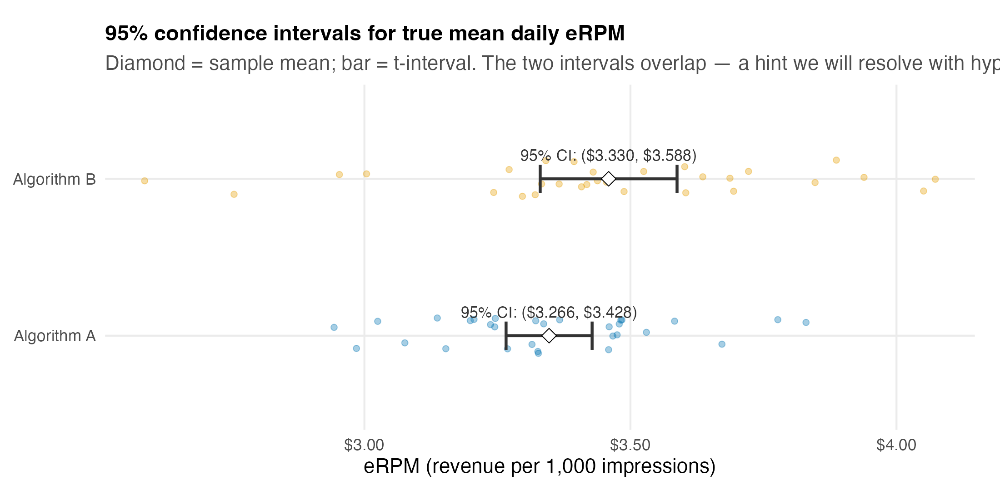
```

::: nonincremental
- A's interval is **(\$3.27, \$3.43)**, B's is **(\$3.33, \$3.59)**, and they **overlap**. Estimation alone cannot yet declare a winner; that is the job of **hypothesis testing**, next topic.
:::

## Do It in Excel: the eRPM $t$-Interval

:::::: columns
::: {.column width="46%"}
**Follow along:**

1. Open `vungle_estimation.xlsx` (sheet `eRPM_by_day`); select B's 30 daily eRPMs (`erpm_B`).
2. `=AVERAGE(range)` → $\bar{x}_B$; `=STDEV.S(range)` → $s$.
3. `=T.INV.2T(0.05, 29)` → the multiplier $2.045$.
4. `=CONFIDENCE.T(0.05, s, 30)` → the margin $E = \$0.129$ in one cell.
5. Read $\bar{x}_B \pm E$: the 95% interval $(\$3.330,\ \$3.588)$.
:::
::: {.column width="54%"}
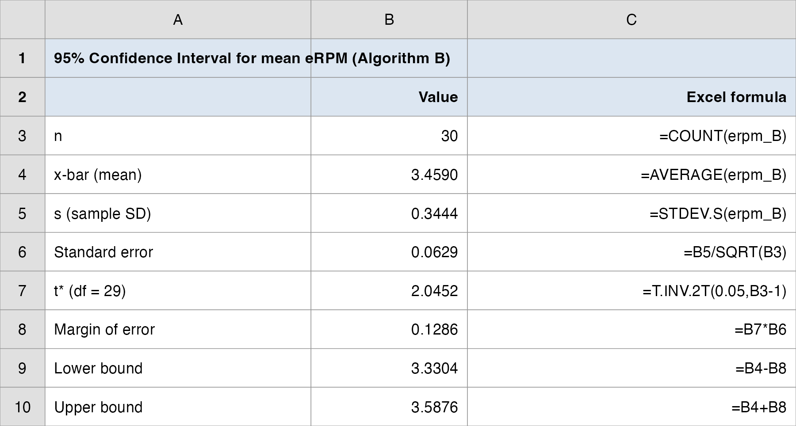{.nostretch fig-align="center" width="100%"}
:::
::::::

## Adequate Sample Size for a $t$-Interval

<br>

::: nonincremental
- A general guide for the $t$-interval to behave well:
  - $n \geq 30$ is usually adequate.
  - $n \geq 50$ if the population is highly skewed or has outliers.
  - $n \geq 15$ suffices if the population is roughly symmetric.
  - $n < 15$ only if the population is approximately Normal.
:::

- Vungle's eRPM is roughly symmetric (mean $\approx$ median in our descriptives), so $n = 30$ clears the bar; the interval is trustworthy, it is just **wide**.

# Confidence Interval for a Proportion {background-color="#cfb991"}

## The Proportion Interval

<br>

- For a population proportion $p$, the interval uses $\bar{p}$ and the **$z$** multiplier (no $t$, since there is no separate SD to estimate):

::: fragment

$$
\bar{p} \pm z_{\alpha/2}\sqrt{\frac{\bar{p}(1-\bar{p})}{n}}
$$

:::

- Check the large-sample condition first: $n\bar{p} \geq 5$ and $n(1-\bar{p}) \geq 5$.

- Excel: `=NORM.S.INV(0.975)` → 1.96 for the 95% multiplier.

## A Question That Often Comes Up

:::: {.faq}
**A question that often comes up at this point:**

[We just learned to use $t$ when $\sigma$ is unknown. For B's conversion rate we don't know the true $p$ either, so why does the proportion interval use $z$, not $t$?]{.faq-q}

::: {.fragment .faq-a}
**Short answer:** the $t$ exists to fix one specific problem: estimating a **separate** spread $s$ for a mean. A proportion has no separate spread; its variability is fixed by $p$ itself, so there is nothing extra to estimate and no fattened tails to correct. We plug $\bar{p}$ into the standard error and use $z$ straight away, after checking $n\bar{p} \geq 5$ and $n(1-\bar{p}) \geq 5$.
:::
::::

## Vungle Conversion Rate: a Proportion in Practice

<br>

- Each impression either becomes an install or not, a proportion. We estimate B's **true mean daily conversion rate** from the 30 daily rates (a $t$-interval on the daily percentages keeps the unit the **day**, parallel to eRPM):

::: fragment
| Quantity | Algorithm B |
|---|---:|
| mean daily rate | $0.3538\%$ |
| $s$ | $0.0231\%$ |
| standard error | $0.0042\%$ |
| 95% margin ($t_{29}$) | $0.0086\%$ |
| **95% CI** | $(0.345\%,\; 0.362\%)$ |
:::

- **Read it:** we are 95% confident B converts between **0.345% and 0.362%** of impressions to installs, a tight interval because day-to-day conversion is stable.

## Do It in Excel: the Conversion-Rate Interval

:::::: columns
::: {.column width="46%"}
**Follow along:**

1. In `vungle_estimation.xlsx` (sheet `eRPM_by_day`), select B's daily conversion column (`conv_B_pct`); it is in percentage points, so `0.354` means 0.354%.
2. `=AVERAGE` → $0.354\%$; `=STDEV.S` → $s = 0.023\%$.
3. `=CONFIDENCE.T(0.05, s, 30)` → margin $E = 0.0086\%$.
4. Read $\bar{x} \pm E$: $(0.345\%,\ 0.362\%)$.
5. Note how tiny $s$ is: stable days give a tight interval.
:::
::: {.column width="54%"}
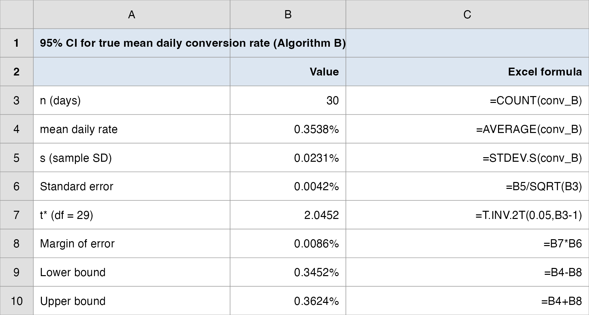{.nostretch fig-align="center" width="100%"}
:::
::::::

## Conversion as a True Proportion: the $z$-Interval

<br>

- The interval above treated B's **30 daily percentages** as the sample. The textbook proportion interval works on the **raw impressions** instead: each of B's 15.8M impressions is one yes/no trial (install or not).

- Setup: $\bar{p} = 56{,}031 / 15{,}825{,}376 = 0.354\%$, and $n\bar{p}$ and $n(1-\bar{p})$ are both far above 5, so $z$ is safe.

::: fragment

$$
\bar{p} \pm z_{\alpha/2}\sqrt{\frac{\bar{p}(1-\bar{p})}{n}}
= 0.00354 \pm 1.96\sqrt{\frac{0.00354\,(1-0.00354)}{15{,}825{,}376}}
= (0.351\%,\; 0.357\%)
$$

:::

- **The contrast:** this $z$-interval is **tighter** than the daily-rate one $(0.345\%,\, 0.362\%)$, because $n$ jumps from **30 days** to **15.8M impressions**, and precision rides on $n$. We still report the per-day version in the memo, to keep the unit the **day**, parallel to eRPM. **Excel:** $\bar{p}$ `=SUM(installs)/SUM(impressions)` on `Raw_Data`; `=NORM.S.INV(0.975)` for $z$.

# Margin of Error & Sample Size {background-color="#cfb991"}

## The Three Levers That Set Interval Width

<br>

- The margin of error $E = t_{\alpha/2}\,s/\sqrt{n}$ moves with exactly three things:

::: fragment
| Lever | Increase it → interval gets | Manager's control? |
|---|---|---|
| **Confidence level** ($1-\alpha$) | **wider** (bigger multiplier) | choose it |
| **Variability** ($s$) | **wider** | not directly |
| **Sample size** ($n$) | **narrower** (as $\sqrt{n}$) | **yes: buy more data** |
:::

- The only lever a manager freely controls is **$n$**. Want a tighter interval at the same confidence? Collect more days.

## Higher Confidence Costs Width

<br>

- For B's eRPM, holding $n = 30$ fixed, raising confidence **widens** the interval:

::: fragment
| Confidence | $t^*$ multiplier | Margin $E$ | Interval |
|---|---:|---:|---:|
| 90% | 1.699 | \$0.107 | (\$3.352, \$3.566) |
| 95% | 2.045 | \$0.129 | (\$3.330, \$3.588) |
| 99% | 2.756 | \$0.173 | (\$3.286, \$3.632) |
:::

- More confidence = a **wider net**. There is no free lunch: to be *more* sure the interval contains $\mu$, you must accept a *less* precise range.

## Sample Size: Pick Precision First, Solve for $n$

<br>

- Invert the margin-of-error formula. Set the target $E$, use a planning $s$ and $z$ (95% → 1.96):

::: fragment

$$
E = z_{\alpha/2}\frac{s}{\sqrt{n}}
\qquad\Longrightarrow\qquad
n = \left(\frac{z_{\alpha/2}\,s}{E}\right)^{2}
$$

:::

- **Always round up:** a fractional person or day cannot be sampled, and rounding down would miss the target precision.

- Planning value for $s$: a prior study, a pilot sample, or a best guess. Here we use B's pilot $s = \$0.3444$.

## How Many Days Does Vungle Need?

::: r-fit-text
**Question:** how many test-days for the mean eRPM margin to hit $\pm\$0.10$? $\pm\$0.05$? (planning $s = 0.3444$, 95% confidence, $z = 1.96$)

::: fragment

$$
n_{0.10} = \left(\frac{1.96 \times 0.3444}{0.10}\right)^{2} = 45.6 \;\rightarrow\; \mathbf{46 \text{ days}}
$$

:::

::: fragment

$$
n_{0.05} = \left(\frac{1.96 \times 0.3444}{0.05}\right)^{2} = 182.3 \;\rightarrow\; \mathbf{183 \text{ days}}
$$

:::

**The lesson:** halving the margin ($\$0.10 \rightarrow \$0.05$) takes **four times** the days ($46 \rightarrow 183$). Precision is expensive, and the manager must decide whether \$0.05 of precision is worth six months of testing.
:::

## A Question That Often Comes Up

:::: {.faq}
**A question that often comes up at this point:**

[The sample-size formula needs $s$, but $s$ is exactly what a longer test is supposed to pin down. Isn't that circular?]{.faq-q}

::: {.fragment .faq-a}
**Short answer:** it would be, except we use a **planning value** for $s$, not the final one. Here we borrow B's pilot $s = \$0.3444$ from the 30 days we already have. It only needs to be roughly right to get the day count in the ballpark: $183$ days for $\pm\$0.05$. When the real test finishes you recompute $s$ from the full data and report the actual interval; the planning value is just for sizing the test, not for the final answer.
:::
::::

## Margin of Error vs. Sample Size

```{r echo=FALSE, out.width="78%", fig.align="center"}
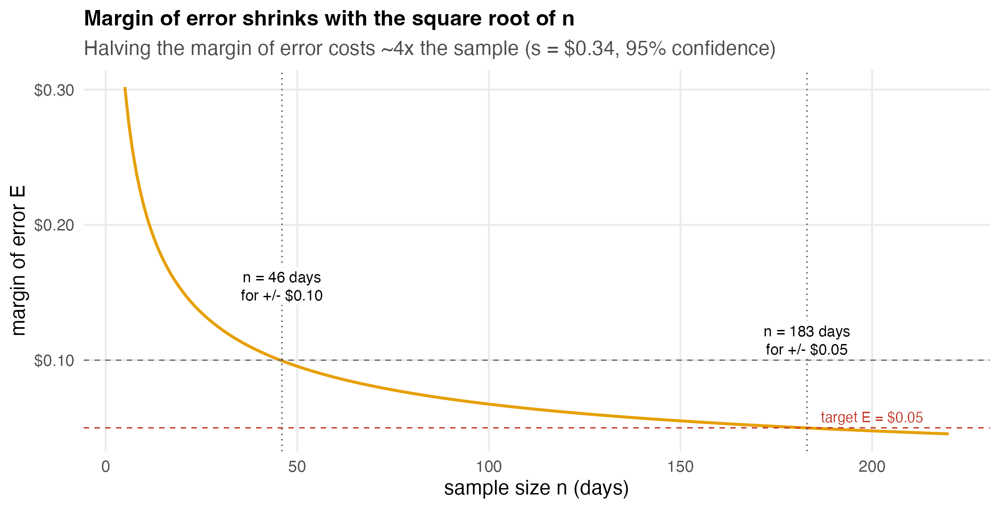
```

::: nonincremental
- The curve flattens fast: early days buy a lot of precision, later days buy very little. The $\sqrt{n}$ law is why **doubling down** on data has **diminishing returns**.
:::

## Do It in Excel: the Required Sample Size

:::::: columns
::: {.column width="46%"}
**Follow along:**

1. Enter the planning SD `s` (B's pilot $\$0.3444$) and the target margin `E` in cells.
2. `=NORM.S.INV(0.975)` → the $z$ multiplier $1.96$.
3. `=CEILING((NORM.S.INV(0.975)*s/E)^2, 1)` in one cell.
4. Set $E = 0.10$ → reads **46 days**; set $E = 0.05$ → reads **183 days**.
5. `CEILING(...,1)` rounds **up**: never round a day count down.
:::
::: {.column width="54%"}
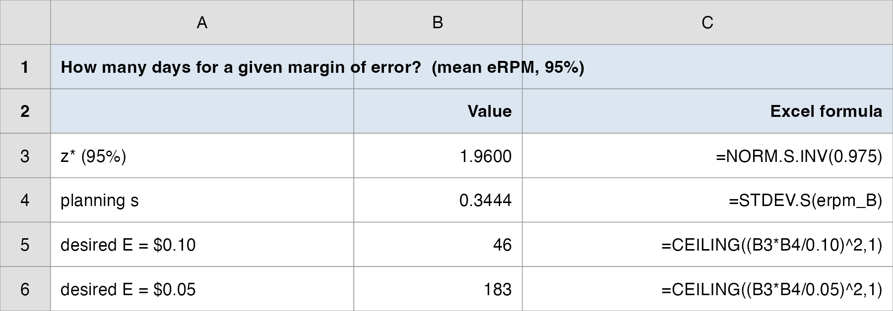{.nostretch fig-align="center" width="100%"}
:::
::::::

## Sample Size for a Proportion

<br>

- The proportion version, solving the same way:

::: fragment

$$
n = \frac{z_{\alpha/2}^{2}\,p^*(1-p^*)}{E^{2}}
$$

:::

- $p^*$ is a **planning value** for the proportion: a prior estimate, a pilot, or (if you know nothing) the **conservative $p^* = 0.5$**, which maximizes $p^*(1-p^*)$ and gives the largest (safest) $n$.

- **Vungle's conversion:** B's rate is tiny ($p^* \approx 0.0035$), so the blind $p^* = 0.5$ wildly over-sizes. To pin the true rate within $E = 0.0003$ ($\pm 0.03$pt) at 95%: the pilot $p^* = 0.0035$ needs $n \approx 149{,}000$ impressions; the conservative $p^* = 0.5$ would demand $n \approx 10.7$ million. A good planning value saves enormous data when the event is rare.

# Debrief: The Estimation Memo {background-color="#cfb991"}

## What the Intervals Tell Vungle

<br>

| Quantity | Point estimate | 95% interval | Read |
|---|---:|---:|---|
| Mean eRPM (B) | \$3.459 | (\$3.330, \$3.588) | true earning power, $\pm\$0.13$ |
| Conversion rate (B) | 0.354% | (0.345%, 0.362%) | stable, $\pm 0.009$pt |
| Days for $\pm\$0.05$ eRPM | (n/a) | $n = 183$ | six months to halve the margin |

<br>

- **The memo in one line:** B's true mean eRPM is **\$3.46 give or take \$0.13**, its conversion rate is **0.354% give or take 0.009pt**, and reaching $\pm\$0.05$ on eRPM would take about **183 days** of testing.

## The Honest Limit of Estimation

<br>

- B's eRPM interval **(\$3.33, \$3.59)** and A's **(\$3.27, \$3.43)** **overlap**. The \$0.11 sample gap is real in *this* sample, but the intervals do not, by themselves, prove B's *true* mean beats A's.

- Estimation answers *"how big, and how sure are we about that size?"*; it does **not** directly answer *"is B better than A?"*

- That comparison question (**does B beat a benchmark, and does B beat A?**) is **hypothesis testing**, the next two topics. Today's standard error and $t$ machinery carry straight over.

## The Manager's Takeaway

<br>

- **One sentence:** a confidence interval turns a point estimate into a defensible **range** (B's true mean eRPM is \$3.46 $\pm$ \$0.13 at 95% confidence), and the **margin of error** is the number the manager should actually negotiate over.

- **One number to remember:** $E = t_{\alpha/2}\,s/\sqrt{n}$, with the $\sqrt{n}$ in the denominator that makes precision expensive.

- **One caveat:** "95% confident" describes the **procedure** over many samples, not a probability for this one interval; overlapping intervals do **not** settle a comparison.

## Today's Question, Today's Answer

<br>

**The question (Lecture 2, and Topic 7 of the ladder):**

> *From 30 days, what is B's true mean eRPM, give or take, and how big a sample do we need?*

::: fragment
<br>

**The answer we reached today:**

> We are 95% confident B's true mean eRPM is **\$3.46 give or take \$0.13**, i.e. **(\$3.33, \$3.59)**, and its conversion rate is **0.354% give or take 0.009pt**, i.e. **(0.345%, 0.362%)**. To cut the eRPM margin to $\pm\$0.05$ takes about **183 days** of testing. The eRPM range still **overlaps A's**, so estimation alone cannot yet name a winner: that is hypothesis testing, next.
:::

## ⏱️ Team Sprint: Your Group Case (Lecture 2)

::: {.sprint .nonincremental}
**Now it's your group's turn.** Today's in-class group case is posted on **Brightspace** (*Topic 07 Group Case, Lecture 2*): a separate business decision you make with today's tools.

**What you'll use:** **confidence intervals** for a mean ($t$) and a proportion ($z$), the **margin of error**, and **sample size** planning. **Excel:** Analysis ToolPak, plus `=CONFIDENCE.T` and `=CEILING`.

**Submit one PDF per group before you leave:** your decision plus the numbers behind it.
:::

# Wrap-up {background-color="#cfb991"}

## Summary

::: nonincremental
Some key takeaways from this session:

- A **point estimate** ($\bar{x}$, $\bar{p}$) is a single best guess; it is **unbiased** but tells you nothing about how close it is.
- The **sampling distribution** of $\bar{x}$ is centered at $\mu$ with standard error $\sigma/\sqrt{n}$; the **CLT** makes it Normal for $n \geq 30$, whatever the population's shape.
- A **confidence interval** = point estimate $\pm$ margin of error; use **$t$** for a mean ($\sigma$ unknown), **$z$** for a proportion.
- The margin of error has **three levers**: confidence level (up → wider), variability $s$ (up → wider), sample size $n$ (up → narrower, as $\sqrt{n}$).
- **Sample size** inverts the margin formula: pick the precision, solve for $n$, round up; halving the margin costs ~4× the data.
- "95% confident" is a statement about the **method**, not a probability for one interval, and overlapping intervals do not prove a difference.
- **Next time:** we stop *estimating ranges* and start *testing claims* (**Hypothesis Testing**: fund B only if its mean eRPM clears a benchmark); today's standard error and $t$ become the test statistic.
:::

# Thank you! {background-color="#cfb991"}
