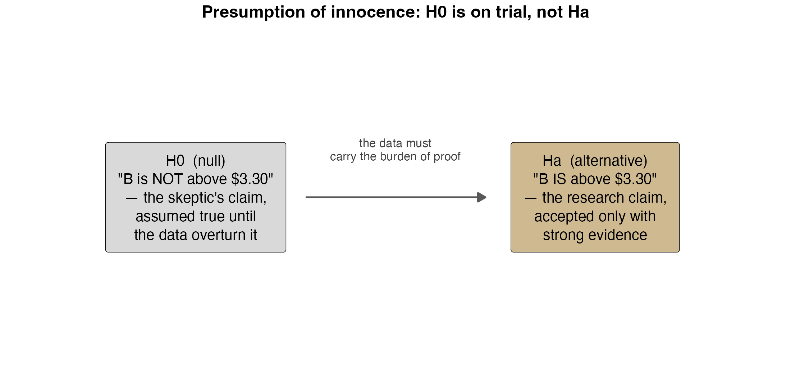
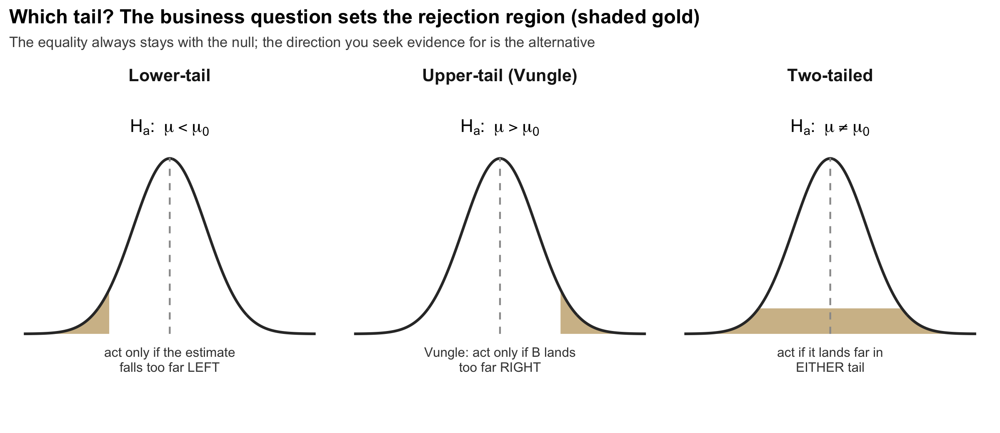
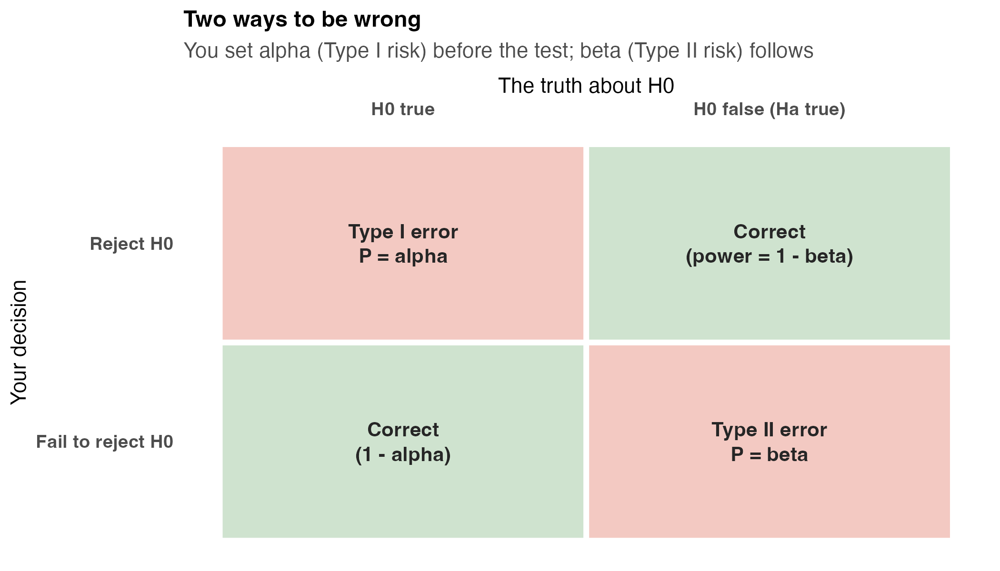
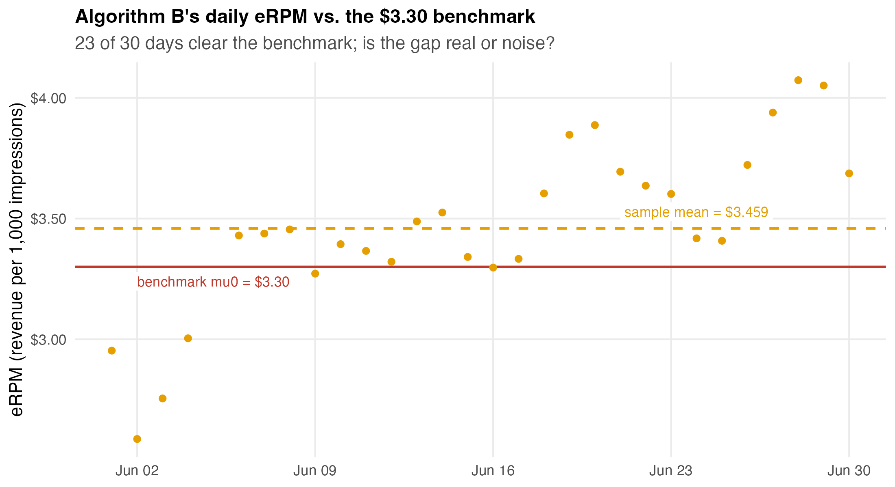
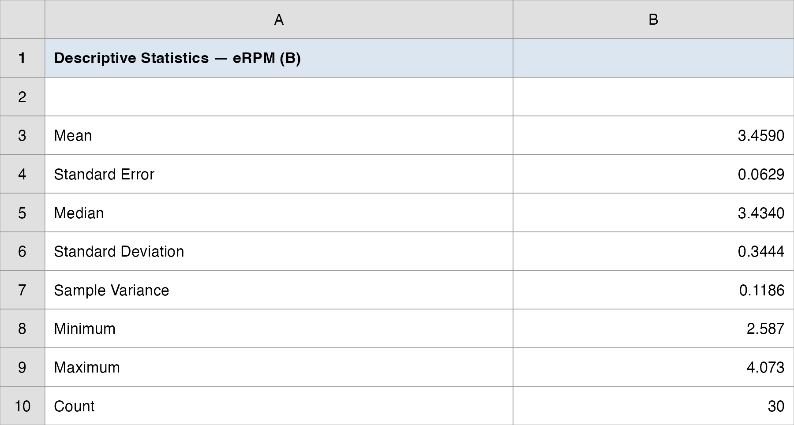
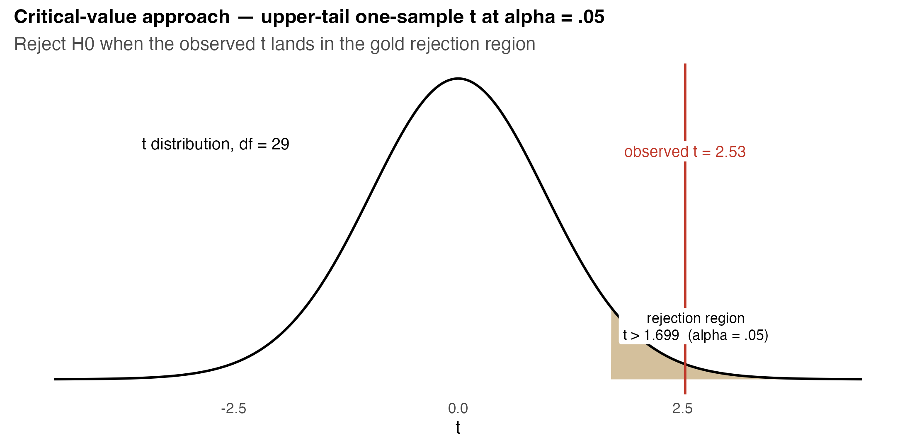
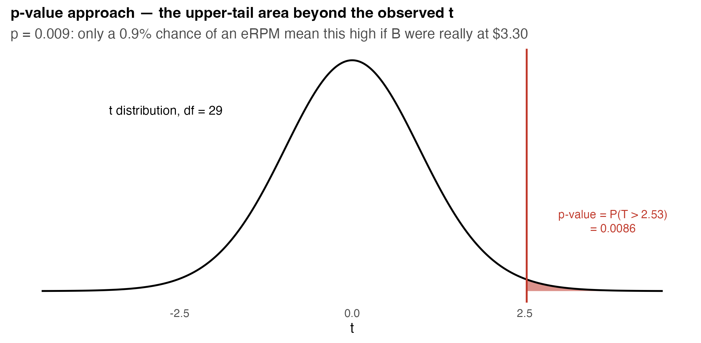
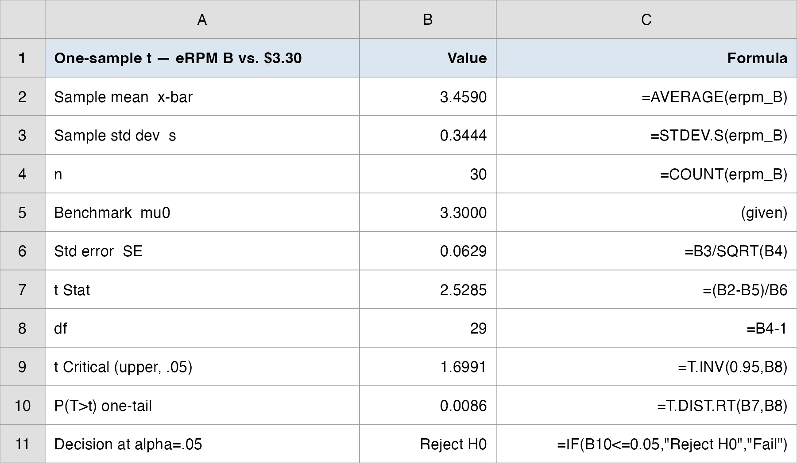
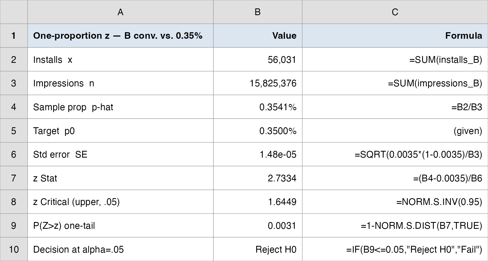
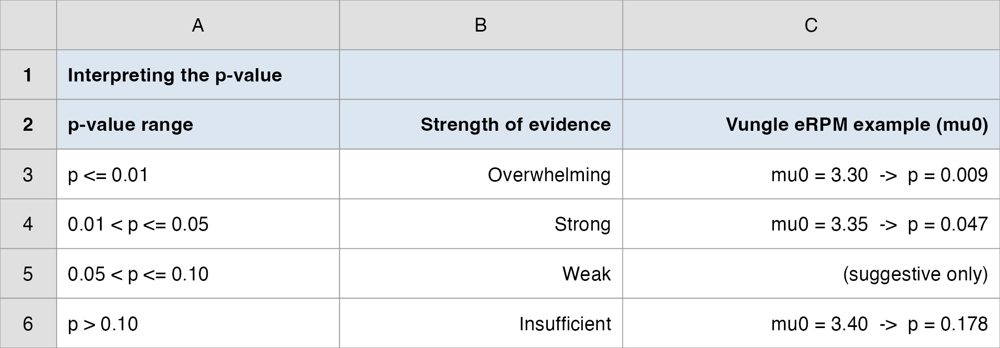

## Overview

:::::: nonincremental
::::: columns
::: {.column style="width: 50%; text-align: center; justify-content: center; align-items: center;"}
- Case Spotlight: A/B Testing at Vungle
- From estimating to **testing** a claim
- Developing $H_0$ and $H_a$; the skeptic's burden of proof
- Type I and Type II errors; the level of significance $\alpha$
- The $p$-value and critical-value approaches
:::

::: {.column style="width: 50%; text-align: center; justify-content: center; align-items: center;"}
- **Lecture 1:** one-sample $t$ about a **mean** (is B's eRPM above \$3.30?)
- **Lecture 2:** one-sample $z$ about a **proportion** (does B clear the conversion target?)
- Reading $p$-values like a manager
- The rule that sets up Topic 9: testing **two** populations
:::
:::::
::::::

# Case Spotlight: A/B Testing at Vungle {background-color="#cfb991"}

## June 2014: One Month of Data, One Funding Decision

<br>

- **Vungle** is a mobile ad-tech startup: it serves 15-second video ads inside other companies' apps and earns revenue mainly when a viewer **installs** the advertised app (cost-per-install).

- Two analysts built a new ad-serving algorithm (**B**) and ran it head-to-head against the existing one (**A**) for the entire month of June 2014. The metric that pays the bills is **eRPM**, effective revenue per 1,000 impressions.

- We have already **described** the data (Topics 1–2) and **estimated** B's true mean eRPM with a confidence interval (Topic 7). Now, as Vungle's manager, you need a **yes/no decision**.

- Up to now we asked *"what is B's true eRPM?"* Today we ask a sharper question: *"is it above a line we care about?"*, and we answer with a **test**.

## The Brief: Roll Out B, or Stay With A?

<br>

> "We fund **algorithm B** only if its mean eRPM clears the historical **\$3.30 benchmark** that algorithm A has long delivered. B's 30-day average looks like \$3.46, but is that **really** above \$3.30, or could a sample of 30 noisy days land there by luck? **Test it.**"

<br>

- The big call is *roll out B, or stay with A?* This topic answers the first piece of it. **Today's question:** *is the mean really above the benchmark?*

- This is the canonical one-population question in business: **is a parameter on the right side of a line?** A benchmark, a target, a contractual threshold.

- **How today's studio runs:** I demo each test on a textbook example, then a good analyst's work goes up for you to reproduce and interrogate, then we debrief the funding call together. Two lectures, two tests.

- By the end, **you** make the funding recommendation, with the statistics to back it up.

## Estimation vs. Testing: Two Jobs for the Same Sample

<br>

- In Topic 7 we **estimated**: built a confidence interval, a range of plausible values for B's true mean eRPM.

- Today we **test**: weigh the evidence for a **specific claim** about that mean.

::: fragment

| | Interval estimation (Topic 7) | Hypothesis testing (today) |
|---|---|---|
| Question | What is the parameter? | Is the parameter on one side of a line? |
| Output | A range (the CI) | A decision: reject $H_0$ or not |
| Knob you set | Confidence level $1-\alpha$ | Significance level $\alpha$ (the risk you accept) |
| The "answer" | Margin of error | $p$-value / critical value |

:::

- They are two views of the **same** sampling logic, and we will see at the end they agree.

# Developing the Hypotheses {background-color="#cfb991"}

## $H_0$ Is on Trial: the Skeptic's Position

```{r  echo=FALSE, out.width = "72%",fig.align="center"}

```

::: nonincremental
- The **null hypothesis** $H_0$ is the status quo: *"nothing new here, B is no better than the \$3.30 line."* It is assumed true until the data overturn it.
- The **alternative** $H_a$ is the research claim (*"B beats \$3.30"*), accepted **only** with strong evidence. The data carry the burden of proof.
:::

## Which Claim Goes Where?

<br>

- **Rule:** put what you **want to prove** in $H_a$; the equality always lives in $H_0$.

- Two ways the question arrives in business:

  - **Research hypothesis:** gather evidence *for* something new (new algorithm, new bonus plan, new drug). Start with $H_a$: *"the new thing works."*
  - **Challenge an assumption:** test whether a long-held claim still holds (a label says 67.6 oz; a goal is 12 minutes). Start with $H_0$: *"the claim is true."*

- Vungle is a **research** case: we want evidence that B clears \$3.30, so that claim is $H_a$.

::: fragment

$$
H_0: \mu \leq 3.30 \qquad \text{vs.} \qquad H_a: \mu > 3.30
$$

:::

## A Question That Often Comes Up

:::: {.faq}
**A question that often comes up at this point:**

[We are hoping B beats \$3.30, so why is "B beats \$3.30" the alternative and not the null?]{.faq-q}

::: {.fragment .faq-a}
**Short answer:** the test makes the data earn the conclusion. We start by assuming B is **no better** ($H_0$) and only fund B if the evidence is strong enough to overturn that. Putting the claim we want in $H_a$ means a "fund B" verdict survives a skeptic's challenge, not just a hopeful read of one good month.
:::
::::

## Three Forms: the Business Question Picks the Tail

```{r  echo=FALSE, out.width = "80%",fig.align="center"}

```

::: nonincremental
- **Upper-tail** (Vungle): we only act if B is **better**; "worse" and "same" lead to the same decision (don't fund).
- **Lower-tail**: we act if the parameter falls **below** a line (a defect rate above a ceiling, response time over a goal).
- **Two-tailed**: any **difference** matters (a fill weight that is too high *or* too low).
:::

## The Three Forms in Symbols

<br>

- For a population **mean** $\mu$ against a hypothesized value $\mu_0$:

::: fragment

$$
\begin{aligned}
\text{Lower-tail:} \quad & H_0: \mu \geq \mu_0 \quad &&H_a: \mu < \mu_0 \\
\text{Upper-tail:} \quad & H_0: \mu \leq \mu_0 \quad &&H_a: \mu > \mu_0 \\
\text{Two-tailed:} \quad & H_0: \mu = \mu_0 \quad &&H_a: \mu \neq \mu_0
\end{aligned}
$$

:::

- The **equality** ($=$, $\leq$, $\geq$) is always part of $H_0$: it is the value we compute the test statistic *against*.

- The direction of $H_a$ comes from the **business decision**, not from peeking at the data.

# Two Ways to Be Wrong {background-color="#cfb991"}

## Type I and Type II Errors

```{r  echo=FALSE, out.width = "62%",fig.align="center"}

```

::: nonincremental
- **Type I error:** reject $H_0$ when it is true (fund B though it really *isn't* above \$3.30, a costly false alarm).
- **Type II error:** fail to reject $H_0$ when it is false (*miss* a genuinely better B, a missed opportunity).
:::

## You Control $\alpha$; $\beta$ Follows

<br>

- The **level of significance** $\alpha$ = the probability of a **Type I error** you are willing to tolerate. You set it **before** seeing the data; usually $\alpha = 0.05$ (sometimes $0.01$ or $0.10$).

- $\beta$ = the probability of a **Type II error**. You do **not** set it directly; it follows from $\alpha$, the sample size, and how far the truth is from $H_0$.

- **The trade-off:** for a fixed sample, lowering $\alpha$ (fewer false alarms) **raises** $\beta$ (more missed effects). The only way to shrink both is a **larger sample**.

- **Language rule:** when the evidence is weak we say *"fail to reject $H_0$,"* never *"accept $H_0$."* Absence of proof is not proof of absence; we just did not gather enough evidence to overturn the skeptic.

## Why the Asymmetry Matters for Vungle

<br>

- A **Type I error** funds an algorithm that is not actually better: the company spends on a non-improvement and the analyst's credibility takes the hit.

- A **Type II error** walks away from a real improvement: money left on the table, but no bad rollout.

- As the manager you decide which mistake is worse and set $\alpha$ accordingly. Here a false "fund it" is the headline risk, so we hold $\alpha = 0.05$.

- This is why $H_0$ is conservative: the test protects the **status quo** until the evidence is strong enough to justify the change.

## A Question That Often Comes Up

:::: {.faq}
**A question that often comes up at this point:**

[If a Type I error funds a dud algorithm, why not set $\alpha$ to something tiny like 0.001 and never have a false alarm?]{.faq-q}

::: {.fragment .faq-a}
**Short answer:** because shrinking $\alpha$ raises $\beta$. Demand near-impossible evidence and you will also miss a B that genuinely beats \$3.30 (a real improvement left unfunded). With June's 30 days fixed, you cannot drive both risks to zero; $\alpha = 0.05$ is the balance Vungle is choosing between a false "fund it" and a missed winner.
:::
::::

# Lecture 1: One-Sample Test About a Mean {background-color="#cfb991"}

## The Brief: Is the Mean Really Above the Benchmark?

<br>

- The big call is *roll out B, or stay with A?* **Lecture 1's piece:** *is B's mean eRPM really above the \$3.30 benchmark, or could a noisy 30-day sample land there by luck?*

- We do **not** know the true population standard deviation $\sigma$ of B's daily eRPM, so we estimate it from the sample with $s$ and use the **$t$-distribution**.

- The decision is asymmetric (fund only if **better**), so it is an **upper-tail** test:

::: fragment

$$
H_0: \mu \leq 3.30 \qquad \text{vs.} \qquad H_a: \mu > 3.30 \qquad \alpha = 0.05
$$

:::

- $\mu$ = the **true** mean daily eRPM B would deliver across *all* future traffic; the 30 June days are our sample.

- **Today's plan:** demo the mechanics on a textbook airport-rating case, then a good analyst's work on Vungle goes up for you to reproduce and stress-test.

## How Every Class Runs

{.nostretch fig-align="center" width="90%"}

::: nonincremental
The class **ends on the Team Sprint**, your group's graded submission: a decision plus your read of the analysis, one PDF before you leave.
:::

## The Test Statistic: How Many Standard Errors Above the Line?

<br>

- The $t$ statistic measures how far the sample mean sits from $\mu_0$, in **standard-error units**:

::: fragment

$$
t = \frac{\bar{x} - \mu_0}{s / \sqrt{n}}, \qquad df = n - 1
$$

:::

- $\bar{x}$ = sample mean · $\mu_0$ = the benchmark in $H_0$ · $s$ = sample standard deviation · $n$ = sample size.

- A **big** $t$ means the sample mean is many standard errors above the line: hard to explain as luck if $H_0$ were true.

- Because $\sigma$ is unknown and replaced by $s$, the statistic follows a **$t$ distribution** with $n-1$ degrees of freedom (slightly heavier tails than the normal).

## If $\sigma$ Were Known: the $z$ Version of the Same Test

<br>

- Sometimes a long process history pins down the **true** standard deviation $\sigma$. Then you do not estimate the spread, so there is no extra uncertainty and the statistic is a **$z$** on the standard normal:

::: fragment

$$
z = \frac{\bar{x} - \mu_0}{\sigma / \sqrt{n}}
$$

:::

- Same five steps, same two roads, only the reference curve changes. Excel: `=NORM.S.INV(1-α)` for the critical $z$ ($z_{0.05} = 1.645$); `=1-NORM.S.DIST(z, TRUE)` for an upper-tail $p$-value.

- **The decision rule:** is $\sigma$ known? If yes (and $n \geq 30$ or the data look normal), use $z$. If no, estimate it with $s$ and use $t$ with $df = n-1$. In practice $\sigma$ is almost never known, so B's eRPM test uses $t$; we show $z$ so the textbook formula is on the record.

## Two Roads to the Same Decision

<br>

- **Critical-value approach:** compare $t$ to a cutoff $t_{\alpha, n-1}$ from the $t$-distribution.

::: fragment

$$
\begin{aligned}
\text{Lower-tail:} \;& \text{reject } H_0 \text{ if } t \leq -t_{\alpha,\,n-1} \\
\text{Upper-tail:} \;& \text{reject } H_0 \text{ if } t \geq t_{\alpha,\,n-1} \\
\text{Two-tailed:} \;& \text{reject } H_0 \text{ if } |t| \geq t_{\alpha/2,\,n-1}
\end{aligned}
$$

:::

- **$p$-value approach:** compute the probability, *if $H_0$ were true*, of a test statistic at least this extreme, then reject $H_0$ if $p \leq \alpha$.

- Both always agree. Excel: `=T.INV(1-α, df)` for the critical value, `=T.DIST.RT(t, df)` for an upper-tail $p$-value.

## What the $p$-Value Actually Means

<br>

- The $p$-value is **$P(\text{evidence this extreme} \mid H_0 \text{ true})$**, *not* the probability that $H_0$ is true.

- Read it as: *"if B were really only at the \$3.30 line, how often would 30 days look this good by luck?"* Small $p$ $\Rightarrow$ that luck is implausible $\Rightarrow$ doubt $H_0$.

- A manager's verbal scale for the strength of evidence against $H_0$:

::: fragment

| $p$-value | Strength of evidence against $H_0$ |
|---|---|
| $p \leq 0.01$ | **Overwhelming** |
| $0.01 < p \leq 0.05$ | **Strong** |
| $0.05 < p \leq 0.10$ | **Weak / suggestive** |
| $p > 0.10$ | **Insufficient** |

:::

## A Question That Often Comes Up

:::: {.faq}
**A question that often comes up at this point:**

[If B's test gives $p = 0.009$, doesn't that mean there's only a 0.9% chance B is no better than \$3.30?]{.faq-q}

::: {.fragment .faq-a}
**Short answer:** no, and this is the slip to avoid. The 0.9% is the chance of seeing 30 days **this good or better** *if* B were really only at \$3.30. It is $P(\text{data} \mid H_0)$, not $P(H_0 \mid \text{data})$. The data are the random thing here, not the truth about B. A small $p$ makes "no better" hard to believe; it does not put a probability on the claim itself.
:::
::::

## Anchor Example: Heathrow Superior-Service Rating

<br>

A travel magazine rates airports 0–10; an airport is labeled **"superior service"** only if its **true mean** rating exceeds **7**. A sample of **60** business travelers at London Heathrow gives $\bar{x} = 7.25$, $s = 1.052$.

<br>

- We want evidence that the mean **exceeds 7** $\rightarrow$ upper-tail, $\sigma$ unknown $\rightarrow$ one-sample $t$.

::: fragment

$$
H_0: \mu \leq 7 \qquad H_a: \mu > 7 \qquad \alpha = 0.05
$$

:::

## Heathrow: the Five Steps

::: r-fit-text
**1. Business context.** Classify the airport; only a true mean above 7 earns the "superior service" badge.

**2. Hypotheses** (upper-tail): $H_0: \mu \leq 7$ vs. $H_a: \mu > 7$, $\alpha = 0.05$.

**3. Test statistic.**

$$
t = \frac{\bar{x} - \mu_0}{s/\sqrt{n}} = \frac{7.25 - 7}{1.052/\sqrt{60}} = \frac{0.25}{0.1358} = 1.84, \qquad df = 59
$$

**4. Decision.** Critical value: $t_{0.05,\,59} = 1.671$; since $1.84 \geq 1.671$ $\rightarrow$ **reject $H_0$**. Equivalently, $p\text{-value} = 0.035 \leq 0.05$ $\rightarrow$ **reject $H_0$**.

**5. Manager's Translation.** *The data give us at least 95% confidence that Heathrow's mean traveler rating tops 7, so classify it "superior service." The evidence is strong but not overwhelming ($p \approx 0.035$).*
:::

## Now the Spine Case: B's eRPM in Numbers

```{r  echo=FALSE, out.width = "80%",fig.align="center"}

```

::: nonincremental
- 23 of 30 days clear the \$3.30 line, and the sample mean sits well above it, but a noisy 30-day sample *could* land here even if the true mean were exactly \$3.30. The test settles it.
:::

## Do It in Excel: Descriptive Statistics

:::::: columns
::: {.column width="46%"}
**Follow along** (this feeds the $t$ test):

1. Select the 30 `erpm` values for B
2. **Data -> Data Analysis -> Descriptive Statistics**
3. Input range = the B column; check **Labels in first row** and **Summary statistics**
4. Click OK; read **Mean = 3.4590**, **Standard Deviation = 0.3444**, **Count = 30** (the ToolPak's "Standard Error 0.0629" is already $s/\sqrt{n}$)
:::
::: {.column width="54%"}
{.nostretch fig-align="center" width="100%"}
:::
::::::

## Step 3: Compute the Test Statistic

<br>

From the 30 daily eRPM values for Algorithm B in `data/vungle_daily.csv`:

::: fragment

| Quantity | Value |
|---|---:|
| $n$ (days) | 30 |
| $\bar{x}$ (mean eRPM) | **\$3.4590** |
| $s$ | 0.3444 |
| $SE = s/\sqrt{30}$ | 0.0629 |
| $\mu_0$ (benchmark) | 3.3000 |
| $t = (\bar{x}-\mu_0)/SE$ | **2.529** |
| $df$ | 29 |

:::

::: fragment

$$
t = \frac{3.4590 - 3.30}{0.3444/\sqrt{30}} = \frac{0.1590}{0.0629} = 2.529
$$

:::

## Step 4: Decision (Critical Value)

```{r  echo=FALSE, out.width = "74%",fig.align="center"}

```

::: nonincremental
- **Critical value:** $t_{0.05,\,29} = 1.699$. Since $t = 2.529 \geq 1.699$ $\rightarrow$ **reject $H_0$**.
- The observed $t$ lands deep in the gold rejection region; a sample mean this far above \$3.30 is hard to explain as luck.
:::

## Step 4: Decision ($p$-Value)

```{r  echo=FALSE, out.width = "74%",fig.align="center"}

```

::: nonincremental
- **$p$-value:** $P(T_{29} > 2.529) = 0.009$. Since $0.009 \leq 0.05$ $\rightarrow$ **reject $H_0$**.
- On the manager's scale, $p \leq 0.01$ is **overwhelming** evidence against the \$3.30 line.
:::

## The Threshold Matters: a Teaching Moment

<br>

- At $\alpha = 0.05$ the call is clear: $p = 0.009 \leq 0.05$, reject.

- At a stricter $\alpha = 0.01$? The critical value rises to $t_{0.01,\,29} = 2.462$. Our $t = 2.529$ still clears it, but **just barely**.

::: fragment

$$
t = 2.529 \;>\; t_{0.01,\,29} = 2.462 \quad\Rightarrow\quad \text{reject } H_0 \text{ even at } \alpha = 0.01
$$

:::

- **Lesson:** how strict you set $\alpha$ can flip a close call. Here B clears even the demanding 1% bar, but a result like $p = 0.03$ would reject at 5% and *fail* at 1%. **Decide $\alpha$ before you test, and report it.**

## Do It in Excel: One-Sample $t$ (Mean)

:::::: columns
::: {.column width="46%"}
**Follow along:**

1. Select the 30 `erpm` B values; run **Data -> Data Analysis -> Descriptive Statistics** to read $\bar{x} = 3.459$, $s = 0.3444$, $n = 30$
2. `=B/SQRT(n)` for $SE$ (the ToolPak's $t$-tools are all two-sample, so build the one-sample test in cells)
3. `=(xbar-3.30)/SE` for $t$ (this returns **2.529**)
4. `=T.DIST.RT(t, 29)` for the upper-tail $p$, and `=T.INV(0.95, 29)` for the critical value
5. Read the cells by name: $t = 2.53$, $p = 0.009$
:::
::: {.column width="54%"}
{.nostretch fig-align="center" width="100%"}
:::
::::::

## The CI and the Test Agree

<br>

- A two-sided 95% confidence interval for B's true mean eRPM:

::: fragment

$$
\bar{x} \pm t_{0.025,\,29}\frac{s}{\sqrt{n}} = 3.459 \pm 2.045 \times 0.0629 \;=\; (\$3.330,\; \$3.588)
$$

:::

- The benchmark **\$3.30 sits below the entire interval**, consistent with rejecting $H_0: \mu \leq 3.30$.

- This is the **duality**: a value outside the CI is exactly a value the test would reject. Estimation and testing tell one story.

- Even the lower bound, \$3.33, is above the line: at Vungle's scale of hundreds of millions of impressions, a few cents per 1,000 is real money.

## Step 5: Manager's Translation

<br>

- *"If algorithm B were truly no better than the \$3.30 benchmark, we would see 30 days average this high only about **9 times in 1,000**. That is overwhelming evidence B clears the line; its true mean eRPM is plausibly between \$3.33 and \$3.59. **Fund B.**"*

- **One number, one caveat:** the call rests on $t = 2.53$ ($p = 0.009$), and on the assumption that June's 30 days are **representative** of future traffic. A new month with different seasonality could shift the mean.

- This answers *"is B above the line?"*, but the deeper question is *"is B better than **A**?"* That comparison of **two** populations is Topic 9.

## Today's Question, Today's Answer

<br>

**The question (Lecture 1's rung):**

> *Is B's mean eRPM really above the \$3.30 benchmark, or could a noisy 30-day sample land there by luck?*

::: fragment
<br>

**The answer we reached today:**

> **Yes.** B's 30-day mean is **\$3.459** against the \$3.30 line; the one-sample $t$-test gives $t = 2.53$, $p = 0.009$. If B were truly only at \$3.30, 30 days would average this high about **9 times in 1,000**. **Reject "no better" and fund B.**
:::

## The Manager's Takeaway: Lecture 1

<br>

- **One sentence:** algorithm B's mean daily eRPM is above the \$3.30 benchmark; the one-sample $t$-test rejects "no better" with overwhelming evidence ($p = 0.009$). **Fund B.**

- **One number to remember:** $t = 2.53$, and where it came from: $(\bar{x} - \mu_0)/(s/\sqrt{n})$.

- **One caveat:** the test says B beats the **\$3.30 line**, not that B beats **A**, and it assumes June is representative. Comparing B to A directly is Topic 9.

- **Homework (group):** today's one-sample $t$ is drilled on **HW3**, previous-edition problem sets on Brightspace. Run it yourself so you can check an analyst who uses it.

## ⏱️ Team Sprint: Your Group Case (Lecture 1)

::: {.sprint .nonincremental}
**Now it's your group's turn.** Today's in-class group case is posted on **Brightspace** (*Topic 08 Group Case, Lecture 1*): a separate business decision you make with today's tools.

**What you'll use:** a one-sample $t$-test about a **mean**. **Excel:** Analysis ToolPak → Descriptive Statistics, then formula cells for $SE$, $t$, and the upper-tail $p$ (`=T.DIST.RT`).

**Submit one PDF per group before you leave:** your decision plus the numbers behind it.
:::

# Lecture 2: One-Sample Test About a Proportion {background-color="#cfb991"}

## The Brief: Is the Proportion Really Above the Target?

<br>

- The big call is still *roll out B, or stay with A?* **Lecture 2's piece:** *is B's conversion rate really above the 0.35% viability target?*

- eRPM is revenue per impression. The ops team also watches the **conversion rate**: installs ÷ impressions. Any algorithm must clear a minimum **0.35%** conversion target to be viable.

- Now the parameter is a **proportion** $p$, not a mean, but the machinery is the same: state $H_0$/$H_a$, compute a test statistic, get a $p$-value, decide at $\alpha$.

::: fragment

$$
H_0: p \leq 0.0035 \qquad \text{vs.} \qquad H_a: p > 0.0035 \qquad \alpha = 0.05
$$

:::

- $p$ = B's **true** install-per-impression rate; the sample is every June impression served under B.

## How Every Class Runs

{.nostretch fig-align="center" width="90%"}

::: nonincremental
The class **ends on the Team Sprint**, your group's graded submission: a decision plus your read of the analysis, one PDF before you leave.
:::

## The Unit of Observation Just Changed

<br>

- For **eRPM** the unit was the **day** ($n = 30$). For **conversion** the unit is the **impression**, each one a Bernoulli trial (install / no install).

- So $n$ is now **15.8 million**, not 30. The "sample" exploded in size.

- We aggregate June's B rows: total installs ÷ total impressions.

::: fragment

| Quantity | Algorithm B |
|---|---:|
| Impressions ($n$) | 15,825,376 |
| Installs ($x$) | 56,031 |
| Sample proportion $\bar{p} = x/n$ | **0.3541%** |

:::

- *Honest caveat:* impressions within a day are not perfectly independent (beyond today's scope), but a fair question to ask any A/B platform.

## The Proportion Test Statistic

<br>

- Standard error of the sample proportion, computed **under $H_0$** (so it uses the hypothesized $p_0$, not $\bar p$):

::: fragment

$$
\sigma_{\bar{p}} = \sqrt{\frac{p_0(1-p_0)}{n}}
$$

:::

- Test statistic, a **$z$**, because for large $n$ the sampling distribution of $\bar p$ is approximately normal:

::: fragment

$$
z = \frac{\bar{p} - p_0}{\sigma_{\bar{p}}}
$$

:::

- **Large-sample condition:** $np_0 \geq 5$ and $n(1-p_0) \geq 5$. Here $np_0 \approx 55{,}000 \gg 5$, easily satisfied.

## A Question That Often Comes Up

:::: {.faq}
**A question that often comes up at this point:**

[Why does the standard error use the target $p_0 = 0.0035$ and not B's observed rate $\bar p = 0.003541$?]{.faq-q}

::: {.fragment .faq-a}
**Short answer:** the test runs *as if* $H_0$ were true, so it measures how surprising B's rate is **under** the 0.35% target. Building the standard error from $p_0$ keeps the whole calculation on that "what if the target is the truth?" footing. (In a confidence interval, where there is no hypothesized value, you would use $\bar p$ instead.)
:::
::::

## Decision Rules for a Proportion

<br>

- Same two roads, now with the **standard normal**:

::: fragment

$$
\begin{aligned}
\text{Lower-tail:} \;& \text{reject } H_0 \text{ if } z \leq -z_{\alpha} \\
\text{Upper-tail:} \;& \text{reject } H_0 \text{ if } z \geq z_{\alpha} \\
\text{Two-tailed:} \;& \text{reject } H_0 \text{ if } |z| \geq z_{\alpha/2}
\end{aligned}
$$

:::

- Excel: `=NORM.S.INV(1-α)` for the critical $z$ (e.g., $z_{0.05} = 1.645$); `=1-NORM.S.DIST(z, TRUE)` for an upper-tail $p$-value.

- For a two-tailed test, **double** the single-tail area to get the $p$-value, and split $\alpha$ into $\alpha/2$ per tail for the two critical values.

## Anchor Example: Pine Creek Golf Course

<br>

Last year **20%** of Pine Creek's players were women. After a promotion to attract women golfers, the manager wants evidence the proportion **increased**. A sample of **400** players includes **100** women ($\bar{p} = 0.25$), $\alpha = 0.05$.

::: fragment

$$
H_0: p \leq 0.20 \qquad H_a: p > 0.20 \qquad \text{(upper-tail)}
$$

:::

::: fragment

$$
\sigma_{\bar{p}} = \sqrt{\frac{0.20(0.80)}{400}} = 0.02, \qquad
z = \frac{0.25 - 0.20}{0.02} = 2.50
$$

:::

## Pine Creek: Decision

<br>

- **Critical value:** $z_{0.05} = 1.645$. Since $z = 2.50 \geq 1.645$ $\rightarrow$ **reject $H_0$**.

- **$p$-value:** $1 - \text{NORM.S.DIST}(2.50) = 1 - 0.9938 = 0.0062 \leq 0.05$ $\rightarrow$ **reject $H_0$**.

::: fragment

> *Strong, in fact overwhelming, evidence that the promotion raised the proportion of women players above 20%.*

:::

- Notice the parallel to the airport case: same five steps, same two roads; only the standard error formula and the reference distribution (normal vs. $t$) changed.

## Now the Spine Case: B's Conversion in Numbers

<br>

- Plugging B's June totals into the proportion test, with $p_0 = 0.0035$:

::: fragment

$$
\sigma_{\bar{p}} = \sqrt{\frac{0.0035(1-0.0035)}{15{,}825{,}376}} = 1.485 \times 10^{-5}
$$

:::

::: fragment

$$
z = \frac{0.003541 - 0.003500}{1.485 \times 10^{-5}} = 2.733
$$

:::

- $\bar p$ sits just **0.0041 percentage points** above the target (a tiny gap), yet with 15.8M impressions even a tiny gap is many standard errors out.

## Step 4: Decision

<br>

- **Critical value:** $z_{0.05} = 1.645$. Since $z = 2.733 \geq 1.645$ $\rightarrow$ **reject $H_0$**.

- **$p$-value:** $1 - \text{NORM.S.DIST}(2.733) = 0.0031 \leq 0.05$ $\rightarrow$ **reject $H_0$**.

::: fragment

> *Statistically, B's conversion rate clears the 0.35% target.*

:::

- **But pause on the magnitude:** the *effect size* is 0.0041 percentage points. With $n$ in the millions the test was almost **guaranteed** to be "significant," which raises the question we tackle next.

## Do It in Excel: One-Proportion $z$

:::::: columns
::: {.column width="46%"}
**Follow along** (no ToolPak tool exists, so build it in cells):

1. `=SUM` June's B installs ($x = 56{,}031$) and impressions ($n = 15{,}825{,}376$)
2. `=x/n` for $\bar p$ (this returns **0.3541%**)
3. `=SQRT(0.0035*(1-0.0035)/n)` for $SE$, computed under $H_0$ with $p_0 = 0.0035$
4. `=(pbar-0.0035)/SE` for $z$, and `=1-NORM.S.DIST(z, TRUE)` for the upper-tail $p$
5. Read the cells: $z = 2.73$, $p = 0.003$
:::
::: {.column width="54%"}
{.nostretch fig-align="center" width="100%"}
:::
::::::

## Statistical vs. Practical Significance

<br>

- With $n$ in the **millions**, the conversion test was nearly guaranteed to reject: at this scale even a microscopic gap produces a large $z$.

- $z = 2.73$ tells you the gap is **real**; it does **not** tell you the gap **matters**. Always pair the test with the **effect size**: here +0.0041 percentage points above target.

- Flip side, from small samples: a real effect can be **invisible** when $n$ is tiny (low power $\rightarrow$ Type II error). **Large $n$: almost everything is significant. Small $n$: almost nothing is.**

- Neither replaces judgment about **magnitude**. *"Is it real?"* and *"is it big enough to act on?"* are different questions.

## A Question That Often Comes Up

:::: {.faq}
**A question that often comes up at this point:**

[If 15.8M impressions make almost any gap "significant," does the conversion test still tell us anything useful?]{.faq-q}

::: {.fragment .faq-a}
**Short answer:** yes, it rules out luck. $z = 2.73$ confirms B's +0.0041-point edge is real, not sampling noise. What the test cannot do is decide whether that edge is **worth acting on**: that is the manager's call, made by pairing the $z$ with the effect size. Report both, and never let a big $z$ stand in for a big effect.
:::
::::

## Reading $p$-Values Like a Manager

::: r-fit-text
The same statistic, re-anchored to the Vungle eRPM mean test under different benchmarks: what would the verdict be?

| If the benchmark were... | $t$ | $p$-value | Rubric label | Manager's read |
|---|---:|---:|---|---|
| $\mu_0 = 3.30$ (our case) | 2.53 | **0.009** | Overwhelming | Clear the line decisively, fund B |
| $\mu_0 = 3.35$ | 1.73 | **0.047** | Strong | Significant at 5%, not at 1%; fund, but watch it |
| $\mu_0 = 3.40$ | 0.94 | **0.178** | Insufficient | Cannot distinguish B from 3.40, so hold |

:::

- The **same data** support different conclusions depending on **where you draw the line**, which is why the benchmark is a *business* decision, set before the test.

## Do It in Excel: Read the $p$ Against the Rubric

:::::: columns
::: {.column width="46%"}
**Follow along:**

1. In one column, list the candidate benchmarks $\mu_0 = 3.30, 3.35, 3.40$
2. `=(3.459-mu0)/0.0629` for $t$ at each line
3. `=T.DIST.RT(t, 29)` for the upper-tail $p$ at each line
4. Compare each $p$ to the rubric: $\leq 0.01$ overwhelming, $\leq 0.05$ strong, $\leq 0.10$ weak, else insufficient
5. Read the verdict: 3.30 -> 0.009 (fund), 3.40 -> 0.178 (hold)
:::
::: {.column width="54%"}
{.nostretch fig-align="center" width="100%"}
:::
::::::

## Today's Question, Today's Answer

<br>

**The question (Lecture 2's rung):**

> *Is B's conversion rate really above the 0.35% viability target?*

::: fragment
<br>

**The answer we reached today:**

> **Yes, but read the size.** B's install rate is **0.3541%** against the 0.3500% target; with 15.8M impressions the one-proportion $z$-test gives $z = 2.73$, $p = 0.003$, so **reject "below target."** The gap is real, but only **+0.0041 percentage points**: significant, not large.
:::

## The Manager's Takeaway: Lecture 2

<br>

- **One sentence:** B's conversion rate clears the 0.35% target; the one-proportion $z$-test rejects "below target" ($z = 2.73$, $p = 0.003$). Viable on conversion, too.

- **One number to remember:** $z = 2.73$, same machinery as the $t$, with $\sigma_{\bar p} = \sqrt{p_0(1-p_0)/n}$ in the denominator.

- **One caveat:** with 15.8M impressions, *significance was almost automatic*. The honest headline is the **effect size** (+0.0041 pts), not the $z$. Statistical significance $\neq$ practical importance.

- **Homework (group):** today's one-proportion $z$ is drilled on **HW3**, previous-edition problem sets on Brightspace. Run it yourself so you can check an analyst who uses it.

## ⏱️ Team Sprint: Your Group Case (Lecture 2)

::: {.sprint .nonincremental}
**Now it's your group's turn.** Today's in-class group case is posted on **Brightspace** (*Topic 08 Group Case, Lecture 2*): a separate business decision you make with today's tools.

**What you'll use:** a one-proportion $z$-test. **Excel:** Analysis ToolPak for any summaries, then formula cells for $SE$, $z$, and the upper-tail $p$ (`=1-NORM.S.DIST`).

**Submit one PDF per group before you leave:** your decision plus the numbers behind it.
:::

# Wrap-up {background-color="#cfb991"}

## The One-Population Testing Recipe: One Page

::: r-fit-text
| Step | Mean ($\sigma$ unknown) | Proportion (large $n$) |
|---|---|---|
| **1. Hypotheses** | $H_0$ vs. $H_a$ about $\mu$; tail from the decision | $H_0$ vs. $H_a$ about $p$; tail from the decision |
| **2. Significance** | choose $\alpha$ (Type I risk) before testing | choose $\alpha$ before testing |
| **3. Statistic** | $t = \dfrac{\bar{x}-\mu_0}{s/\sqrt{n}}$, $df = n-1$ | $z = \dfrac{\bar{p}-p_0}{\sqrt{p_0(1-p_0)/n}}$ |
| **4. Decision** | reject if $\lvert t\rvert \geq t_{crit}$ or $p \leq \alpha$ | reject if $\lvert z\rvert \geq z_{crit}$ or $p \leq \alpha$ |
| **5. Translate** | back to the business call + effect size | back to the business call + effect size |
| **Excel** | `T.DIST.RT`, `T.INV` (+ Descriptive Stats) | `NORM.S.DIST`, `NORM.S.INV` (formula cells) |
| **Vungle result** | $t = 2.53$, $p = 0.009$ (fund B) | $z = 2.73$, $p = 0.003$ (clears target) |
:::

## The Manager's Takeaway

<br>

- **One sentence:** Algorithm B's mean eRPM (\$3.46) is above the \$3.30 funding benchmark and its conversion clears the 0.35% target; both one-sample tests reject the skeptic, so **fund B**.

- **One number to remember:** $t = 2.53$ for the eRPM test, and the recipe behind it: $(\bar{x} - \mu_0)/(s/\sqrt{n})$.

- **One caveat:** these tests say B beats a **line**, not that B beats **A**, and a large $n$ can make a tiny gap "significant." Always report the **effect size** and check whether the benchmark is the right line.

- **Practice with the real data:**
  - `data/vungle_daily.csv` + formula cells $\rightarrow$ reproduce $t = 2.53$ (eRPM) and $z = 2.73$ (conversion).
  - Worked solutions: `data/vungle_one_sample_tests.xlsx`.

## Summary

::: nonincremental
Some takeaways from this session:

- **$H_0$ is the skeptic on trial:** put the claim you want to prove in $H_a$, keep the equality in $H_0$, and let the data carry the burden of proof.
- **Two errors, one knob:** you set $\alpha$ (Type I risk) before the test; $\beta$ (Type II) follows. Say *"fail to reject,"* never *"accept."*
- **One recipe, two parameters:** the one-sample $t$ (mean, $\sigma$ unknown) and the one-proportion $z$ share the same five steps; only the standard error and reference distribution change.
- **Two roads agree:** the critical-value and $p$-value approaches always reach the same decision, and both agree with the confidence interval.
- **Significance $\neq$ importance:** with millions of impressions almost everything is "significant," so judge the **effect size**; with tiny samples real effects can hide, so mind the **power**.
- A test answers *is the parameter past a line?* Comparing **two** populations (*is B better than A?*) is Topic 9.
:::

# Thank you! {background-color="#cfb991"}
