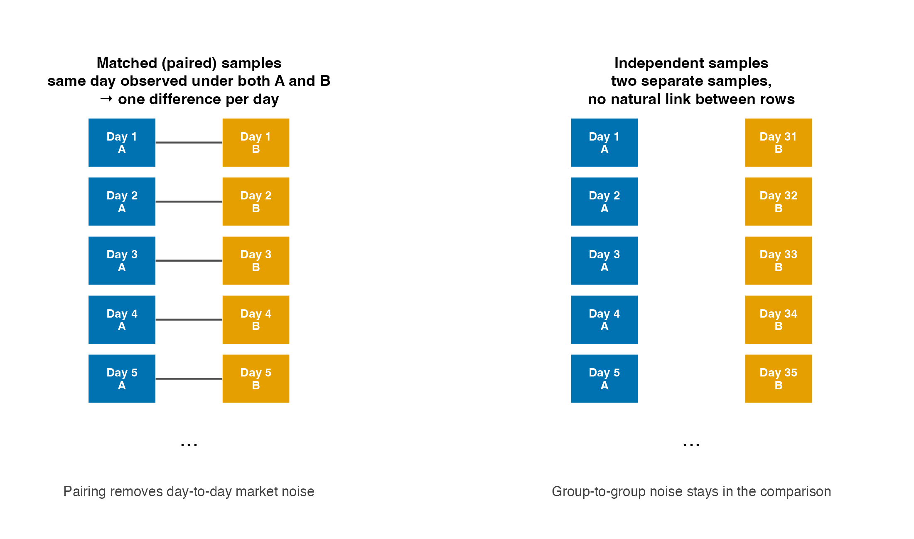
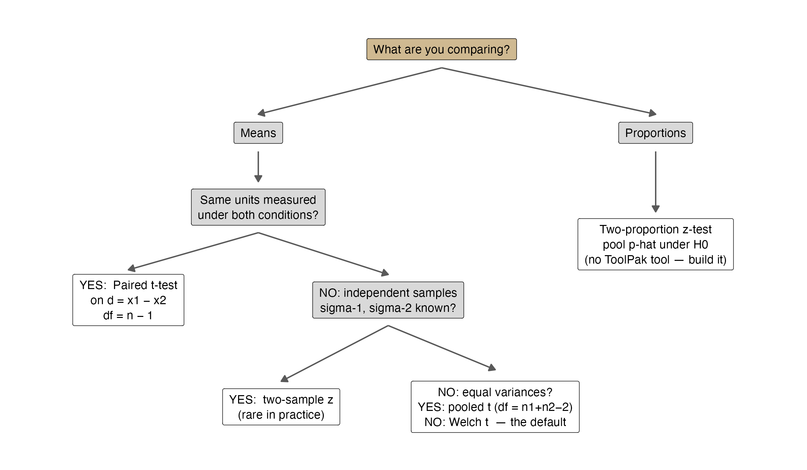
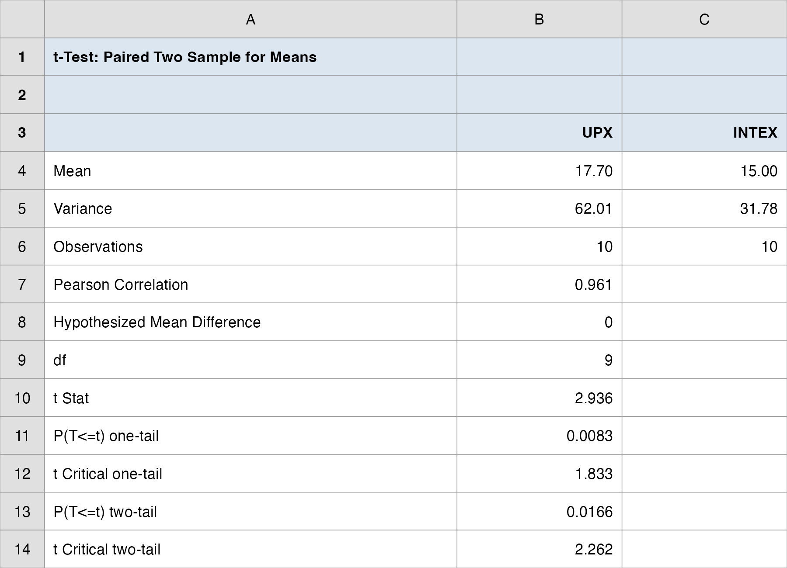
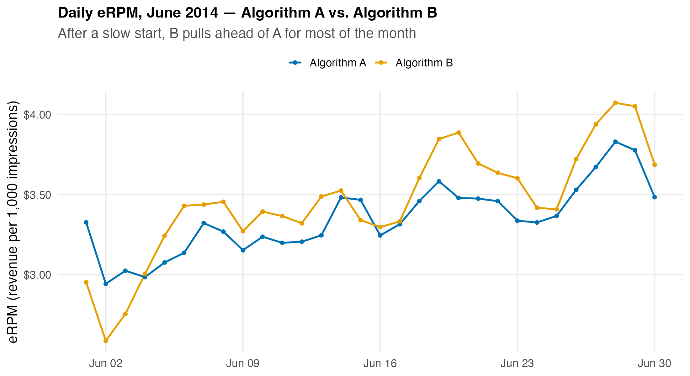
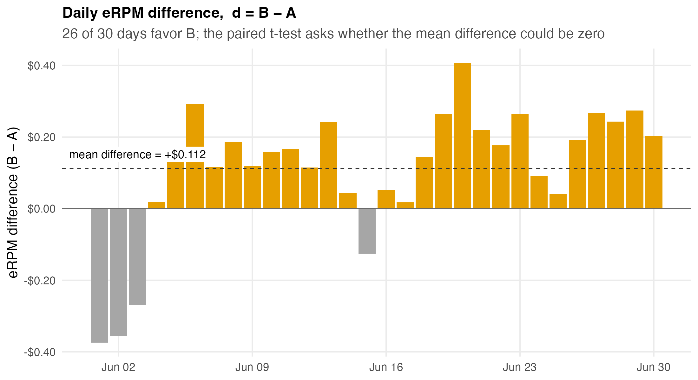
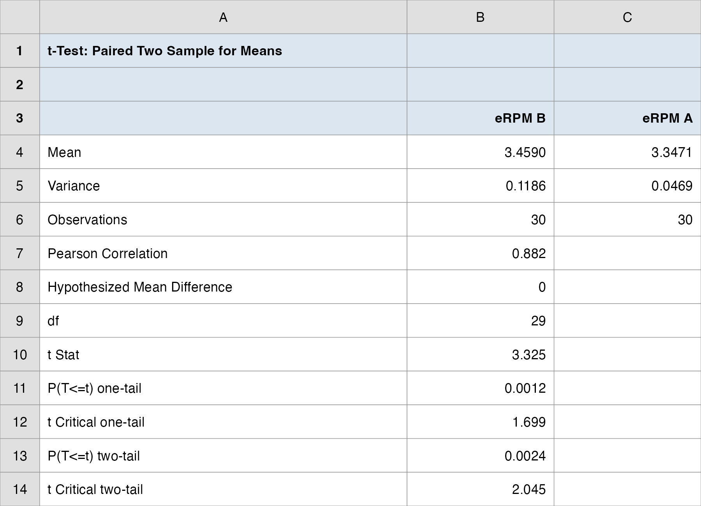
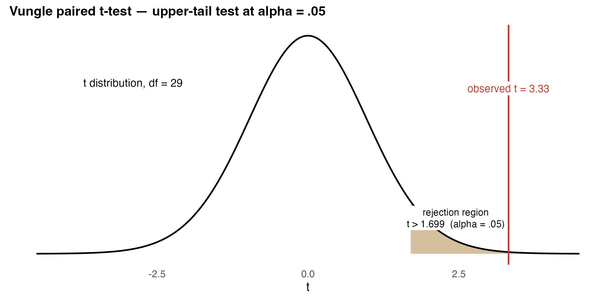
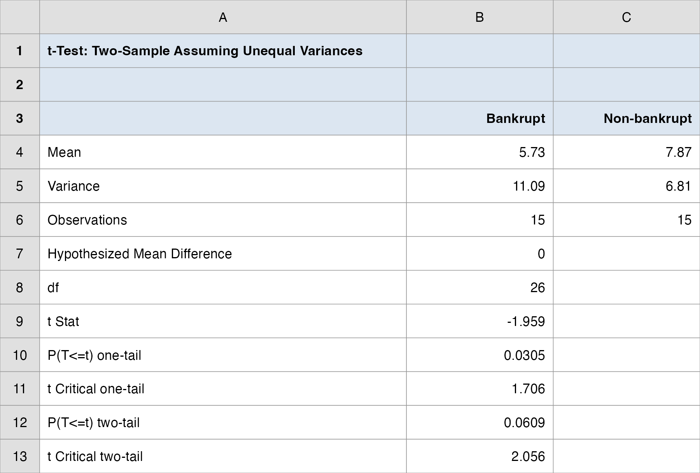
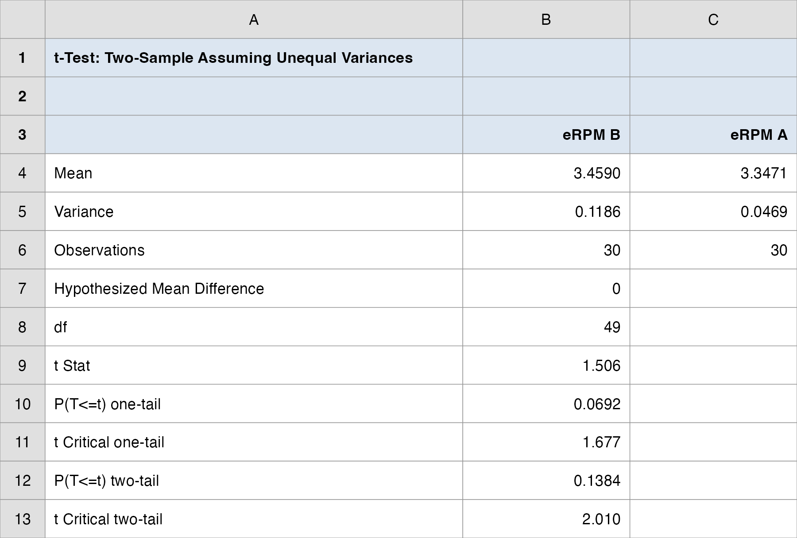
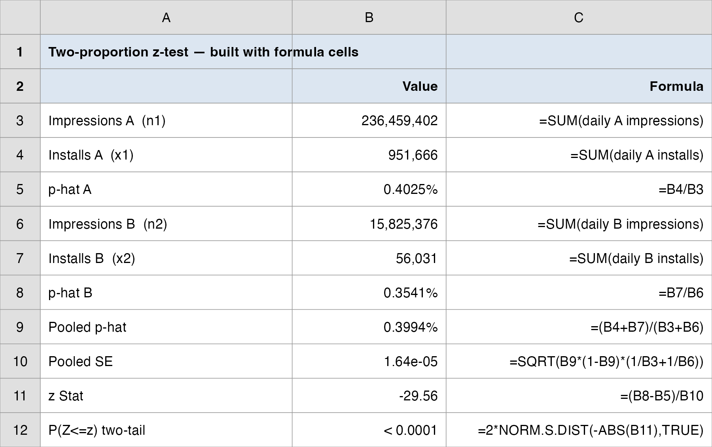

## Overview

:::::: nonincremental
::::: columns
::: {.column style="width: 50%; text-align: center; justify-content: center; align-items: center;"}
- Case Spotlight: A/B Testing at Vungle
- Two designs: matched (paired) vs. independent samples
- Matched samples: the paired $t$-test
- Inferences About the Difference Between Two Population Means
  - $\sigma_1, \sigma_2$ Known
  - $\sigma_1, \sigma_2$ Unknown: pooled $t$ and Welch $t$
:::

::: {.column style="width: 50%; text-align: center; justify-content: center; align-items: center;"}
- Same data, different design: why pairing matters
- Inferences About the Difference Between Two Population Proportions
- Statistical vs. practical significance
- The rollout decision: from test results to a recommendation
:::
:::::
::::::

# Case Spotlight: A/B Testing at Vungle {background-color="#cfb991"}

## June 30, 2014: Two Analysts and One Month of Data

<br>

- [Vungle](https://techcrunch.com/2017/02/15/vungle-300-million/) is a mobile ad-tech startup: it serves 15-second video ads inside other companies' apps and earns revenue mainly when viewers **install** the advertised app (cost-per-install).

- Two Darden MBAs, **Andrew Kritzer** and **Hammond Guerin**, built a new ad-serving algorithm (**B**) and ran it head-to-head against the existing one (**A**) for the entire month of June 2014.

- The split was random: an MD5 hash of each user ID sent **1/16 of traffic to B**, the rest to A. Same market, same days, same apps; only the algorithm differs.

- The metric that pays the bills is **eRPM**: effective revenue per 1,000 impressions.

- Guerin is about to become Vungle's **head of data science**. His credibility (and his stock options) ride on this call.

## The Brief: Today's Managerial Question

<br>

- **The big call you own as Vungle's manager:** *roll out algorithm B, or stay with A?* We have built toward it all term; today we settle it.

> "B's daily eRPM averaged about **\$0.11 higher** than A's. Is that a **real improvement**, or just month-to-month **noise**? Should Vungle **roll out B** to all traffic?"

<br>

- In Topic 8 we tested **one** population against a benchmark ("is B's mean eRPM above \$3.30?"). Today's question is the one that decides the rollout: **is B really better than A?**, comparing **two** populations.

- **How today's studio runs:** I demo each test on a textbook example, then on the Vungle data; you debrief the rollout call; then your group runs a fresh case and submits its own call.

- By the end of class you, the manager, will have the recommendation, with the statistics to back it up.

## How Every Class Runs

{.nostretch fig-align="center" width="90%"}

::: nonincremental
The class **ends on the Team Sprint**, your group's graded submission: a decision plus your read of the analysis, one PDF before you leave.
:::

## How Today's Tools Answer It

<br>

Every tool today maps onto the Vungle dataset:

| Feature of the Vungle test | The tool |
|---|---|
| Same 30 days observed under both A and B | **Matched samples → paired $t$-test** |
| What if we (wrongly) ignored the day pairing? | **Independent samples $t$-test** (a cautionary contrast) |
| Millions of impressions → installs (yes/no) | **Two-proportion $z$-test** |
| "Roll out or not?" | Test results become **decision signals** (Decision Analysis, Topic 4) |

<br>

- One dataset, three tests, and they will **not** all point the same way. That tension is today's managerial lesson.

# Comparing Two Groups: Design First {background-color="#cfb991"}

## The Canonical Business Question

<br>

- "Is treatment B systematically different from A?" appears everywhere in business:

  - New ad algorithm vs. current one (Vungle)
  - New web page layout vs. old (conversion A/B tests)
  - Delivery carrier 1 vs. carrier 2 (cost, speed)
  - Trained employees vs. untrained (productivity)

- The null hypothesis is the **skeptic's position**: any observed gap is just sampling noise.

- Before any formula, you must answer a **design** question: *how were the two samples collected?*

## Two Ways to Collect the Comparison

<br>

**Suppose you run a taste test of two flavors:**

- **Paired test (matched samples):** select **one** random sample and let **every person rate both flavors** (in random order).

  - Each sampled unit produces **one pair** of data values.

- **Unpaired test (independent samples):** select **two** random samples and let **each group rate only one flavor**.

  - No natural link between an observation in group 1 and any observation in group 2.

- Which is better? The **paired test tends to remove much of the extraneous variation** (differences in people, days, and experimental conditions) so the flavor effect stands out.

## Two Designs, in Pictures

```{r  echo=FALSE, out.width = "80%",fig.align="center"}

```

::: nonincremental
- **Paired is preferred when feasible**, but it requires that every unit *can* be measured under both conditions.
- When the units come from genuinely separate populations (bankrupt vs. non-bankrupt firms), only the **independent** design exists.
:::

## A Question That Often Comes Up

:::: {.faq}
**A question that often comes up at this point:**

[If pairing removes so much noise, why would any analyst ever use the independent design?]{.faq-q}

::: {.fragment .faq-a}
**Short answer:** because pairing is often impossible. A firm is either bankrupt or it is not, so you cannot measure the *same* firm under both conditions; the owner's-equity comparison later today has no natural pair. Vungle got lucky: it could run A and B on the *same 30 days*, so it chose the paired design before collecting any data. Use pairing when a single unit can sit under both treatments; otherwise the independent design is your only option.
:::
::::

## The Hypotheses Are About a Difference

<br>

- All of today's tests reuse the Topic 8 logic; the only change is the **parameter**: it is now a **difference**.

::: fragment

$$
\begin{aligned}
\text{Two means:} \quad & H_0: \mu_1 - \mu_2 = 0 \quad \text{vs.} \quad H_a: \mu_1 - \mu_2 \neq 0 \; (\text{or } >, <) \\
\text{Two proportions:} \quad & H_0: p_1 - p_2 = 0 \quad \text{vs.} \quad H_a: p_1 - p_2 \neq 0 \; (\text{or } >, <)
\end{aligned}
$$

:::

- Same machinery as before: a test statistic, a rejection region, a $p$-value, and a decision at significance level $\alpha$.

- The equality always lives in $H_0$; the claim we seek evidence **for** lives in $H_a$.

## Choosing the Right Test

```{r  echo=FALSE, out.width = "75%",fig.align="center"}

```

## Test Selection Cheat Sheet

::: r-fit-text
| Situation | Test | Test statistic | Distribution | Excel |
|---|---|---|---|---|
| Same units, two conditions | **Paired $t$** | $t = \dfrac{\bar{d} - 0}{s_d/\sqrt{n}}$ | $t$, $df = n-1$ | ToolPak: *t-Test: Paired Two Sample for Means* |
| Independent, $\sigma_1,\sigma_2$ known | **Two-sample $z$** | $z = \dfrac{(\bar{x}_1-\bar{x}_2) - D_0}{\sqrt{\sigma_1^2/n_1 + \sigma_2^2/n_2}}$ | $N(0,1)$ | ToolPak: *z-Test: Two Sample for Means* |
| Independent, $\sigma$ unknown, assumed equal | **Pooled $t$** | $t = \dfrac{(\bar{x}_1-\bar{x}_2) - D_0}{s_p\sqrt{1/n_1 + 1/n_2}}$ | $t$, $df = n_1+n_2-2$ | ToolPak: *t-Test: Two-Sample Assuming Equal Variances* |
| Independent, $\sigma$ unknown, not assumed equal | **Welch $t$** *(default)* | $t = \dfrac{(\bar{x}_1-\bar{x}_2) - D_0}{\sqrt{s_1^2/n_1 + s_2^2/n_2}}$ | $t$, Satterthwaite $df$ | ToolPak: *t-Test: Two-Sample Assuming Unequal Variances* |
| Two proportions (large samples) | **Two-proportion $z$** | $z = \dfrac{\bar{p}_1-\bar{p}_2}{\sqrt{\bar{p}(1-\bar{p})(1/n_1+1/n_2)}}$ | $N(0,1)$ | No built-in tool; formula cells |
:::

# Matched Samples: the Paired $t$-Test {background-color="#cfb991"}

## One Idea: Reduce Two Samples to One

<br>

- With a matched-sample design, **each sampled unit provides a pair of data values**: $(x_{1i}, x_{2i})$.

- **Key insight:** work with the **difference** for each pair,

::: fragment

$$
d_i = x_{1i} - x_{2i}
$$

:::

- The two-sample problem becomes a **one-sample** problem about the mean difference $\mu_d$, and we can apply *exactly* the single-population procedures from Topic 8.

- Point estimate of $\mu_d$:

::: fragment

$$
\bar{d} = \frac{1}{n}\sum_{i=1}^{n} d_i
$$

:::

## A Question That Often Comes Up

:::: {.faq}
**A question that often comes up at this point:**

[Why does subtracting within each pair get rid of the day-to-day swings?]{.faq-q}

::: {.fragment .faq-a}
**Short answer:** because both numbers in a pair share that day's conditions. If June 14 was a slow Saturday, *both* A and B earn less that day, so when you compute $d = \text{eRPM}_B - \text{eRPM}_A$ the Saturday effect cancels out of the difference. What survives is the part that is *not* shared: the algorithm. That is why the differences ($s_d = 0.18$) are far less noisy than the raw daily series ($s \approx 0.22$ to $0.34$).
:::
::::

## Paired $t$ Mechanics

<br>

:::: {style="font-size: 84%;"}
- Sample standard deviation of the differences:

::: fragment

$$
s_d = \sqrt{\frac{\sum_{i=1}^n (d_i - \bar{d})^2}{n - 1}}
$$

:::

- Standard error of $\bar{d}$:

::: fragment

$$
SE(\bar{d}) = \frac{s_d}{\sqrt{n}}
$$

:::

- Test statistic (under $H_0: \mu_d = 0$), with $df = n - 1$:

::: fragment

$$
t = \frac{\bar{d} - 0}{s_d / \sqrt{n}}
$$

:::
::::

## Tests, Intervals, and Decision Rules

<br>

- **Hypothesis forms:** $H_0: \mu_d = 0$ vs. $H_a: \mu_d \neq 0$ (two-tailed), or the one-sided versions $H_a: \mu_d > 0$ / $H_a: \mu_d < 0$.

- **Decision rule (critical value):** reject $H_0$ if $|t| \geq t_{\alpha/2,\,n-1}$ (two-tailed) or $t \geq t_{\alpha,\,n-1}$ (upper-tail).

- **Confidence interval for $\mu_d$:**

::: fragment

$$
\bar{d} \pm t_{\alpha/2,\,n-1} \cdot \frac{s_d}{\sqrt{n}}
$$

:::

- **$p$-values in Excel:**

  - Two-tailed: `=T.DIST.2T(ABS(t), df)`
  - Upper-tail: `=T.DIST.RT(t, df)`

## Anchor Example: Express Deliveries

:::: nonincremental
::: r-fit-text
To compare delivery times of two express services, **UPX** and **INTEX**, two reports were sent to each of **ten district offices**: one carried by UPX, the other by INTEX. *Same origin, same destination, same day: a natural pair.*

| District Office | UPX | INTEX | Difference $d_i$ |
|---|---:|---:|---:|
| Seattle | 32 | 25 | 7 |
| Los Angeles | 30 | 24 | 6 |
| Boston | 19 | 15 | 4 |
| Cleveland | 16 | 15 | 1 |
| New York | 15 | 13 | 2 |
| Houston | 18 | 15 | 3 |
| Atlanta | 14 | 15 | -1 |
| St. Louis | 10 | 8 | 2 |
| Milwaukee | 7 | 9 | -2 |
| Denver | 16 | 11 | 5 |

**Question:** do the data indicate a difference in mean delivery times?
:::
::::

## Express Deliveries: the Five Steps

::: r-fit-text
**1. Business context.** Choosing a carrier; the metric is delivery time (hours); slower deliveries cost client goodwill.

**2. Hypotheses** (is there *any* difference? → two-tailed):

$$
H_0: \mu_d = 0 \qquad H_a: \mu_d \neq 0 \qquad \alpha = 0.05
$$

**3. Test statistic.** From the ten differences:

$$
\bar{d} = 2.70, \quad s_d = 2.908, \quad SE = \frac{2.908}{\sqrt{10}} = 0.920, \quad t = \frac{2.70}{0.920} = 2.94, \quad df = 9
$$

**4. Decision.** $p\text{-value} = 0.017 \leq \alpha = 0.05$ → **reject $H_0$**. Also: 95% CI for $\mu_d$ = $(0.620,\; 4.780)$ hours; zero is not a plausible mean difference.

**5. The Manager's Translation.** *UPX averages about 2.7 hours slower than INTEX on identical routes: a real difference, not noise. If speed matters, route the volume to INTEX (then negotiate with UPX).*
:::

## Express Deliveries in Excel

::::: nonincremental
:::: columns
::: {.column width="38%"}
<br>

**Data → Data Analysis →<br> t-Test: Paired Two Sample for Means**

- Variable 1 Range: UPX column
- Variable 2 Range: INTEX column
- Hypothesized Mean Difference: `0`
- Alpha: `0.05`

<br>

Read the output: `t Stat = 2.936`, `P(T<=t) two-tail = 0.017` $\leq$ 0.05 → reject $H_0$.
:::

::: {.column width="62%"}
```{r  echo=FALSE, out.width = "100%",fig.align="center"}

```
:::
::::
:::::

# The Vungle Test: Is B Really Better? {background-color="#cfb991"}

## Step 1, Business Context: Why a Paired Design?

<br>

- Each of the **30 days of June 2014** is a natural experimental unit: on any given day, **the same advertising market** operates (same advertisers, same user pool, same day-of-week effects).

- Users were randomly split **within each day**: A and B ran **side by side**.

- So each day yields **one pair**, $(\text{eRPM}_A, \text{eRPM}_B)$, and one difference

::: fragment

$$
d_i = \text{eRPM}_{B,i} - \text{eRPM}_{A,i}
$$

:::

- Pairing **subtracts out day-specific noise** (weekend dips, late-June seasonality) and isolates the pure algorithm effect.

- Data: `data/vungle_erpm_paired.csv`, 30 rows, columns `erpm_A`, `erpm_B`, `diff_B_minus_A`.

## The Data: 30 Days of eRPM

```{r  echo=FALSE, out.width = "85%",fig.align="center"}

```

::: nonincremental
- B starts *below* A, then pulls ahead for most of the month. Eyeballing is suggestive, but Guerin needs more than an eyeball to bet his job on.
:::

## The Differences: $d = B - A$

```{r  echo=FALSE, out.width = "85%",fig.align="center"}

```

::: nonincremental
- 26 of 30 days favor B; the mean difference is **+\$0.112** per 1,000 impressions.
- The paired $t$-test asks: *could a mean difference this large arise by chance if the true difference were zero?*
:::

## Step 2: Hypotheses

<br>

::: fragment

$$
H_0: \mu_d \leq 0 \qquad \text{vs.} \qquad H_a: \mu_d > 0 \qquad \text{(upper-tail)} \qquad \alpha = 0.05
$$

:::

<br>

- **Why one-tailed?** The business decision is asymmetric: Vungle rolls out B **only if it is better**. "B is worse" and "B is the same" lead to the identical action: keep A.

- $\mu_d$ = the true mean daily eRPM advantage of B over A.

- We will also report the two-tailed $p$-value (the more conservative convention) and the conclusion will not change.

## A Question That Often Comes Up

:::: {.faq}
**A question that often comes up at this point:**

[Isn't a one-tailed test just a trick to make the $p$-value smaller and get the answer we want?]{.faq-q}

::: {.fragment .faq-a}
**Short answer:** it would be, if we picked the direction *after* seeing the data. We did not: the rollout rule, "ship B only if it beats A," fixes the direction $H_a: \mu_d > 0$ **before** the test, because "B is worse" and "B is the same" lead to the same action (keep A). The honest guard is that we also report the two-tailed $p$-value ($\approx 0.0024$), and B still wins. If the call had hinged on which tail you chose, that would be a red flag.
:::
::::

## Step 3: Test Statistic

<br>

From the 30 daily differences in `vungle_erpm_paired.csv`:

::: fragment

| Quantity | Value |
|---|---:|
| $n$ (days) | 30 |
| $\bar{d}$ (mean difference) | **\$0.1119** |
| $s_d$ | 0.1843 |
| $SE = s_d/\sqrt{30}$ | 0.0337 |
| $t = \bar{d}/SE$ | **3.325** |
| $df$ | 29 |

:::

<br>

::: fragment

$$
t = \frac{0.1119}{0.1843/\sqrt{30}} = \frac{0.1119}{0.0337} = 3.325
$$

:::

## Excel: t-Test Paired Two Sample for Means

::::: nonincremental
:::: columns
::: {.column width="38%"}
<br>

**Data → Data Analysis →<br> t-Test: Paired Two Sample for Means**

- Variable 1 Range: `erpm_B` column
- Variable 2 Range: `erpm_A` column
- Hypothesized Mean Difference: `0`
- Alpha: `0.05`

<br>

Key rows:

- `t Stat = 3.325`
- `P(T<=t) one-tail = 0.0012`
- `t Critical one-tail = 1.699`
:::

::: {.column width="62%"}
```{r  echo=FALSE, out.width = "100%",fig.align="center"}

```
:::
::::
:::::

## Step 4: Decision

```{r  echo=FALSE, out.width = "75%",fig.align="center"}

```

::: nonincremental
- **Critical value:** $t = 3.325 \geq t_{0.05,29} = 1.699$ → **reject $H_0$**.
- **$p$-value:** one-tail $p \approx 0.0012$ (two-tail $\approx 0.0024$) $\leq \alpha = 0.05$ → **reject $H_0$**.
- Strong evidence that algorithm B's mean daily eRPM is higher than A's.
:::

## The Confidence Interval Tells You the Size

<br>

- The test says the lift is **real**; the confidence interval says **how big** it plausibly is:

::: fragment

$$
\bar{d} \pm t_{0.025,29}\frac{s_d}{\sqrt{n}} = 0.1119 \pm 2.045 \times 0.0337 \;=\; (\$0.043,\; \$0.181)
$$

:::

- The entire interval is **above zero**, consistent with rejecting $H_0$.

- Even the **lower bound** (\$0.043 per 1,000 impressions) is a meaningful lift at Vungle's scale.

- In Excel: `=T.INV(0.975, 29)` → 2.045; bounds with formula cells from $\bar d$ and $SE$.

## A Question That Often Comes Up

:::: {.faq}
**A question that often comes up at this point:**

[The test already said B is better, so why do we also need the confidence interval?]{.faq-q}

::: {.fragment .faq-a}
**Short answer:** the test and the interval answer two different manager questions. The test answers "is the lift **real**?" (yes: reject $H_0$). The interval answers "**how big** is it?": between \$0.04 and \$0.18 per 1,000 impressions. A rollout decision needs the size, not just the verdict: \$0.04 and \$0.18 scale to very different annual revenue, and you would weigh each against the cost of switching algorithms.
:::
::::

## Step 5, the Manager's Translation: Back to the Decision

<br>

- *"A difference this large would arise by chance only about 1 in 1,000 times if B were no better than A, so we reject the 'no difference' story. On a typical day, B earns between \$0.04 and \$0.18 more per 1,000 impressions than A."*

- **Scale it:** A served ≈ 236.5M impressions in June. Had B served that traffic:

::: fragment

$$
\frac{236{,}459{,}402}{1{,}000} \times \$0.112 \approx \$26{,}500 \text{ per month} \;\approx\; \$318\text{K per year}
$$

:::

- Even at the CI lower bound (\$0.043), the lift is ≈ \$10K/month, material for a startup with \$25.5M raised.

- **Discussion hook:** the daily gap is noisy. The first week even favored A, and after two weeks B's lead was only ≈ \$0.04, still well below the full-month \$0.11. Stopping the test early could have hidden the effect. (Sequential testing is beyond today's scope, but exactly what real A/B platforms wrestle with.)

## Studio Check: Reproduce the Paired Test

::: {.nonincremental}
**Reproduce what the analyst did**, so you can verify the lift is real before you stake the rollout on it.

**Data:** `data/vungle_erpm_paired.csv`

1. In Excel: **Data → Data Analysis → t-Test: Paired Two Sample for Means** (Variable 1 = `erpm_B`, Variable 2 = `erpm_A`, α = 0.05).
2. Read off `t Stat` and `P(T<=t) one-tail`; build the 95% CI for the mean difference.
3. Decide at α = 0.05: is the lift real?

You should land on $t = 3.325$, one-tail $p \approx 0.0012$, 95% CI ≈ (\$0.043, \$0.181). The two things worth challenging: the one-tailed framing and whether 30 days generalizes.
:::

# Independent Samples: Comparing Two Means {background-color="#cfb991"}

## Setup and Point Estimate

<br>

- Two **independent** random samples: sizes $n_1, n_2$ from populations with means $\mu_1, \mu_2$.

- Point estimate of $\mu_1 - \mu_2$:  $\bar{x}_1 - \bar{x}_2$.

- Sampling distribution of $\bar{x}_1 - \bar{x}_2$: centered at $\mu_1 - \mu_2$, with standard error built from **both** sampling variances:

::: fragment

$$
SE(\bar{x}_1 - \bar{x}_2) = \sqrt{\frac{\sigma_1^2}{n_1} + \frac{\sigma_2^2}{n_2}}
$$

:::

- Which test statistic you use depends on what you know about $\sigma_1, \sigma_2$: the three cases that follow.

## Case 1, $\sigma_1, \sigma_2$ Known: the Two-Sample $z$

<br>

- Rare in practice (you seldom *know* population standard deviations), but conceptually clean:

::: fragment

$$
z = \frac{(\bar{x}_1 - \bar{x}_2) - D_0}{\sqrt{\sigma_1^2/n_1 + \sigma_2^2/n_2}}
\qquad\qquad
\text{CI:}\;\; (\bar{x}_1 - \bar{x}_2) \pm z_{\alpha/2}\sqrt{\frac{\sigma_1^2}{n_1} + \frac{\sigma_2^2}{n_2}}
$$

:::

- $D_0$ = hypothesized difference, usually 0.

- **Excel:** Data Analysis → *z-Test: Two Sample for Means* (requires the two known variances as inputs); $p$-values via `=NORM.S.DIST`.

- Note: the worksheet function `=Z.TEST` is for **one** sample only; the two-sample version needs the ToolPak tool or formula cells.

## Case 2, $\sigma$ Unknown, Assumed Equal: the Pooled $t$

<br>

- If it is reasonable to assume $\sigma_1 = \sigma_2 = \sigma$, combine both samples into one **pooled variance**:

::: fragment

$$
s_p^2 = \frac{(n_1 - 1)s_1^2 + (n_2 - 1)s_2^2}{n_1 + n_2 - 2}
$$

:::

::: fragment

$$
t = \frac{(\bar{x}_1 - \bar{x}_2) - D_0}{s_p\sqrt{\dfrac{1}{n_1} + \dfrac{1}{n_2}}},
\qquad df = n_1 + n_2 - 2
$$

:::

- CI: $(\bar{x}_1 - \bar{x}_2) \pm t_{\alpha/2,\,n_1+n_2-2}\; s_p\sqrt{1/n_1 + 1/n_2}$

- **Excel:** Data Analysis → *t-Test: Two-Sample Assuming Equal Variances*.

## Case 3, $\sigma$ Unknown, Not Assumed Equal: the Welch $t$

<br>

:::: {style="font-size: 80%;"}
- Drop the equal-variance assumption; each sample keeps its own variance:

::: fragment

$$
t = \frac{(\bar{x}_1 - \bar{x}_2) - D_0}{\sqrt{\dfrac{s_1^2}{n_1} + \dfrac{s_2^2}{n_2}}}
$$

:::

- Degrees of freedom (Satterthwaite approximation; typically non-integer, so round **down**):

::: fragment

$$
df = \frac{\left(\dfrac{s_1^2}{n_1} + \dfrac{s_2^2}{n_2}\right)^2}{\dfrac{(s_1^2/n_1)^2}{n_1 - 1} + \dfrac{(s_2^2/n_2)^2}{n_2 - 1}}
$$

:::

- CI: $(\bar{x}_1 - \bar{x}_2) \pm t_{\alpha/2,\,df}\sqrt{s_1^2/n_1 + s_2^2/n_2}$
::::

## Practical Guidance: Default to Welch

<br>

- **Unless you have a strong theoretical reason to assume equal variances, use Welch.** It is the safe default: when variances *are* equal it loses almost nothing; when they differ it protects you.

- **Excel:** Data Analysis → *t-Test: Two-Sample Assuming Unequal Variances*.

- Reading any ToolPak $t$-test output, the same rows every time:

  - `Mean`, `Variance`, `Observations`: the summary statistics per group
  - `df`: degrees of freedom used
  - `t Stat`: the test statistic
  - `P(T<=t) one-tail` / `two-tail`: your $p$-values
  - `t Critical one-tail` / `two-tail`: the cutoffs for $\alpha$

## A Question That Often Comes Up

:::: {.faq}
**A question that often comes up at this point:**

[If the pooled $t$ usually gives a similar answer, why is Welch the safer default?]{.faq-q}

::: {.fragment .faq-a}
**Short answer:** Welch never assumes the two groups have the same spread; pooled does. When the variances really are equal, Welch costs you almost nothing (the owner's-equity example gives nearly the same $t$ either way). When they differ, say a steady algorithm A versus a more volatile B, pooling understates the true uncertainty and can hand you a false "significant." You only know the variances are equal *after* checking, so start with the test that does not need the assumption.
:::
::::

## Anchor Example: Start-up Owner's Equity

<br>

**Two populations** (no pairing is possible, since a firm is either bankrupt or it isn't):

::: nonincremental
1. Small business firms that went **bankrupt** within the first year
2. Firms that are **not bankrupt**
:::

**Variable of interest:** owner's equity (\$K) at founding.

<br>

| Group | $n$ | $\bar{x}$ | $s$ |
|---|---:|---:|---:|
| Bankrupt | 15 | 5.73 | 3.33 |
| Non-bankrupt | 15 | 7.87 | 2.61 |

<br>

**Question:** is there a difference in average owner's equity between bankrupt and non-bankrupt firms?

## Owner's Equity: the Five Steps

::: r-fit-text
**1. Business context.** Does thin capitalization at founding predict first-year failure? (Lender screening, founder advice.)

**2. Hypotheses** (two-tailed): $H_0: \mu_1 - \mu_2 = 0$ vs. $H_a: \mu_1 - \mu_2 \neq 0$, $\alpha = 0.05$. Independent samples, $\sigma$ unknown, no reason to assume equal variances → **Welch $t$**.

**3. Test statistic.**

$$
t = \frac{(5.73 - 7.87) - 0}{\sqrt{\dfrac{3.33^2}{15} + \dfrac{2.61^2}{15}}} = \frac{-2.14}{1.093} = -1.96, \qquad df \approx 26
$$

**4. Decision.** $p$-value (two-tail) $\approx 0.061 > \alpha = 0.05$ → **fail to reject $H_0$**. 95% CI for $\mu_1 - \mu_2$: $(-4.4,\; 0.1)$, which barely includes zero.

**5. The Manager's Translation.** *Bankrupt firms started with about \$2.1K less equity on average, but with only 15 firms per group we cannot rule out chance at the 5% level. A borderline result, worth a bigger sample before building lending policy on it.*
:::

## Owner's Equity in Excel

::::: nonincremental
:::: columns
::: {.column width="38%" .r-fit-text}
<br>

**Data → Data Analysis →<br> t-Test: Two-Sample Assuming Unequal Variances**

- Variable 1 Range: Bankrupt column
- Variable 2 Range: Non-bankrupt column
- Hypothesized Mean Difference: `0`

<br>

**"Fail to reject" ≠ "the means are equal."** With $n = 15$ per group the test has **low power**; a \$2K average gap may be economically real yet statistically undetectable here.

(With equal $n$, the pooled $t$ gives the same $t$-statistic with $df = 28$, same conclusion.)
:::

::: {.column width="62%"}
```{r  echo=FALSE, out.width = "100%",fig.align="center"}

```
:::
::::
:::::

# Same Data, Different Design {background-color="#cfb991"}

## What If We Ignored the Pairing?

::::: nonincremental
:::: columns
::: {.column width="38%"}
<br>

Treat the 30 A-days and 30 B-days as **two independent samples** (Welch), *wrong design, same data*:

- $\bar{x}_A = 3.347$, $s_A = 0.217$
- $\bar{x}_B = 3.459$, $s_B = 0.344$
- $t = 1.51$, $p$ (two-tail) $\approx 0.138$

<br>

**Fail to reject $H_0$** at $\alpha = 0.05$. The \$0.11 lift "disappears."

*(ToolPak: Variable 1 = `erpm_B`, Variable 2 = `erpm_A`, same order as the paired test, so $t$ is positive.)*
:::

::: {.column width="62%"}
```{r  echo=FALSE, out.width = "100%",fig.align="center"}

```
:::
::::
:::::

## The Lesson: Design Drives Conclusions

<br>

| | Paired $t$ (correct) | Independent $t$ (wrong) |
|---|---:|---:|
| Test statistic | **3.33** | 1.51 |
| $p$-value (two-tail) | **0.0024** | 0.138 |
| Decision at $\alpha = .05$ | Reject $H_0$ (B wins) | Fail to reject |

<br>

- **Same data. Same question. Different design assumption → opposite conclusion.**

- Why: day-to-day market swings (weekends, seasonality) inflate the independent-samples noise ($s \approx 0.22$–$0.34$), while pairing cancels them ($s_d = 0.18$ on the *differences*, and the A/B series are correlated at $r = 0.88$).

- The design decision was made **before any data were collected**, when Vungle chose to run A and B *in parallel within each day*. Good analysis starts at design, not at the formula sheet.

## A Question That Often Comes Up

:::: {.faq}
**A question that often comes up at this point:**

[How can the exact same 30 numbers say "B wins" one way and "no difference" the other? Which one is right?]{.faq-q}

::: {.fragment .faq-a}
**Short answer:** the paired test is the right one here, because the data *are* paired: A and B ran on the same days, so the days are linked, and the A/B series move together ($r = 0.88$). The independent test throws that link away and treats day-to-day swings as random noise, which inflates the standard error and buries the \$0.11 lift. Same numbers, but the wrong test answers the wrong question. Match the test to how the data were collected.
:::
::::

# Comparing Two Proportions {background-color="#cfb991"}

## Vungle's Other Metric: Conversion Rate

<br>

- eRPM is revenue per impression. Advertisers also watch the **conversion rate**: installs ÷ impressions.

- The case: *"small improvements in the click-through or conversion rates could have a large effect on Vungle's revenue."*

- June 2014 totals (`vungle_daily.csv`):

::: fragment

| Metric | Algorithm A | Algorithm B |
|---|---:|---:|
| Impressions | 236,459,402 | 15,825,376 |
| Installs | 951,666 | 56,031 |
| Conversion rate $\bar{p}$ | **0.4025%** | **0.3541%** |

:::

- **Question:** does B convert impressions to installs at a different rate than A?

## Unit of Observation: Days vs. Impressions

<br>

- Careful: the "sample size" just changed by seven orders of magnitude:

  - For **eRPM**, the unit was the **day**: $n = 30$ paired days.
  - For **conversion**, the unit is the **impression**: each one is a Bernoulli trial (install / no install), so $n_1 \approx 236$M and $n_2 \approx 16$M.

- Large-sample conditions easily satisfied: $n\bar{p} \geq 5$ and $n(1-\bar{p}) \geq 5$ for both groups (e.g., $n_2\bar{p}_2 = 56{,}031 \gg 5$).

- Also note the **traffic imbalance**: A got ~15× B's impressions (the 1/16 hash split). That is exactly why we compare **rates**, never raw counts: B's 56K installs vs. A's 952K says nothing by itself.

- *Honest caveat:* impressions within a day are not perfectly independent (time structure). Beyond today's scope, but a good question to ask any A/B platform.

## Estimating $p_1 - p_2$

<br>

- Two independent large samples; observe $\bar{p}_1 = x_1/n_1$ and $\bar{p}_2 = x_2/n_2$.

- Point estimate: $\bar{p}_1 - \bar{p}_2$.

- Confidence interval, where each group keeps its **own** variance (do **not** pool for CIs):

::: fragment

$$
(\bar{p}_1 - \bar{p}_2) \pm z_{\alpha/2}\sqrt{\frac{\bar{p}_1(1-\bar{p}_1)}{n_1} + \frac{\bar{p}_2(1-\bar{p}_2)}{n_2}}
$$

:::

## Testing $p_1 - p_2 = 0$: Pool Under $H_0$

<br>

- Under $H_0$ the two proportions are the **same** $p$, so the best estimate of it uses **all** the data:

::: fragment

$$
\bar{p} = \frac{x_1 + x_2}{n_1 + n_2}
\qquad\qquad
SE_{pool} = \sqrt{\bar{p}(1-\bar{p})\left(\frac{1}{n_1} + \frac{1}{n_2}\right)}
$$

:::

- Test statistic:

::: fragment

$$
z = \frac{\bar{p}_1 - \bar{p}_2}{SE_{pool}}
$$

:::

- Decision rule and $p$-value exactly as in the one-proportion $z$-test (Topic 8); Excel: `=NORM.S.DIST`.

- **Rule of thumb:** pool under $H_0$ (testing); do **not** pool for confidence intervals.

## A Question That Often Comes Up

:::: {.faq}
**A question that often comes up at this point:**

[Why pool the two conversion rates for the test but keep them separate for the interval?]{.faq-q}

::: {.fragment .faq-a}
**Short answer:** the test starts by *assuming* $H_0$ is true, that A and B share one conversion rate $p$, so the best estimate of that single rate uses all 252M trials combined. The confidence interval makes no such assumption: it just reports the gap and how uncertain it is, so each group must keep its own rate ($\bar p_A = 0.403\%$, $\bar p_B = 0.354\%$). Pooling there would smuggle in the very "they are equal" claim the interval is trying to measure.
:::
::::

## No ToolPak Tool: Build It with Formulas

::::: nonincremental
:::: columns
::: {.column width="34%"}
<br>

The Data Analysis ToolPak has **no two-proportion z tool**; five formula cells do the job.

<br>

This is worth mastering: most real A/B testing metrics (click-through, conversion, churn) are **proportions**.
:::

::: {.column width="66%"}
```{r  echo=FALSE, out.width = "100%",fig.align="center"}

```
:::
::::
:::::

## Vungle Conversion: the Five Steps

::: r-fit-text
**1. Business context.** Advertisers pay mostly per install; conversion rate signals how well ads match users.

**2. Hypotheses** (two-tailed): $H_0: p_B - p_A = 0$ vs. $H_a: p_B - p_A \neq 0$, $\alpha = 0.05$.

**3. Test statistic.**

$$
\bar{p} = \frac{951{,}666 + 56{,}031}{236{,}459{,}402 + 15{,}825{,}376} = 0.3994\%,
\qquad SE_{pool} = 1.64 \times 10^{-5}
$$

$$
z = \frac{0.003541 - 0.004025}{0.0000164} = \mathbf{-29.56}
$$

**4. Decision.** $|z| = 29.56 \gg z_{0.025} = 1.96$; $p$-value $< 0.0001$ → **reject $H_0$** overwhelmingly.

**5. The Manager's Translation.** *B converts impressions to installs at a genuinely lower rate than A: 0.354% vs. 0.403%, a 12% relative drop. This is not noise.*
:::

## The Surprise: B Converts Less but Earns More

<br>

| Metric | Winner | Evidence |
|---|---|---|
| eRPM (revenue per 1,000 impressions) | **B** | paired $t = 3.33$, $p = 0.0024$ |
| Conversion rate (installs per impression) | **A** | $z = -29.56$, $p < 0.0001$ |

<br>

- Both results are statistically decisive, and they **point in opposite directions**.

- This is not a data error. It is the most realistic moment in this course: **real decisions face multiple metrics that disagree.**

- So which metric should drive the rollout?

## Make the Call: Which Metric Wins?

::: {.nonincremental}
**The conflict you face as the manager:** B **earns more** per impression (paired $t = 3.33$) but **converts fewer** installs ($z = -29.6$). Both results are statistically decisive.

Before the debrief, settle three questions:

1. Which metric should drive the decision for Vungle's **business model**, and why?
2. What would you **monitor** after rollout, and why?
3. State the call in **three sentences**: the call, the number, the caveat.

The metric that matches the business model wins, not the bigger number. We resolve it on the next slide, then land the full rollout call in the Debrief.
:::

## Reconciling the Two Metrics

<br>

- eRPM rewards **revenue per impression**, not installs per impression.

- The case tells us eRPM varied **from \$2 to \$7 per campaign**, and the vast majority of Vungle's ads were **CPI**: advertisers pay per install, at very different prices.

- So B apparently **selects higher-value campaigns**: fewer installs, but each install is worth more, a richer optimization target than raw conversion.

- Analogy: a salesperson who closes fewer deals at much higher margins.

- **The metric must match the business model.** Vungle is a revenue-maximizing platform → eRPM is the right north star; conversion is a *health metric* to monitor.

## Statistical vs. Practical Significance

<br>

- With $n$ in the **hundreds of millions**, the conversion test was guaranteed to be "significant": at this scale, even a microscopic difference produces a huge $z$.

- $z = -29.56$ tells you the difference is *real*; it does **not** tell you the difference *matters*.

- Always pair the test with the **effect size**: -0.048 percentage points (a 12% relative drop in conversion). That is the number the manager should debate.

- Flip side from the equity example: small samples can make real effects invisible (low power). **Large $n$: everything is significant. Small $n$: nothing is.** Neither replaces judgment about magnitude.

## A Question That Often Comes Up

:::: {.faq}
**A question that often comes up at this point:**

[If a $z$ of $-29.6$ does not settle the conversion question, what number should the manager actually act on?]{.faq-q}

::: {.fragment .faq-a}
**Short answer:** the effect size, not the $z$. The $z$ only confirms the gap is not luck (with 252M trials, that was never in doubt). The number to debate is the size of the gap: $-0.048$ percentage points, a 12% relative drop in conversion. Then ask the business question the $z$ cannot: is a 12% conversion drop tolerable given B's higher eRPM? That is a judgment call about magnitude, which is why we monitor conversion rather than block the rollout on it.
:::
::::

# Debrief: The Rollout Call {background-color="#cfb991"}

## Three Tests, One Decision

<br>

| Test | Result | Decision signal |
|---|---|---|
| Paired $t$, eRPM (B vs. A) | $t = 3.33$, $p = 0.0024$ | B earns more per impression. **Roll out.** |
| Independent $t$, same data, wrong design | $t = 1.51$, $p = 0.138$ | (Cautionary: wrong design would have hidden the lift.) |
| Two-proportion $z$, conversion | $z = -29.56$, $p < 0.0001$ | B converts less. **Monitor.** |

<br>

- **Your recommendation as the manager:** roll out B. eRPM is the metric aligned with Vungle's business model, the lift is statistically solid (\$0.04–\$0.18 per 1,000), and it is worth ≈ \$26.5K/month on June's traffic. Track the install funnel weekly post-rollout in case the lower conversion rate erodes advertiser satisfaction.

## From Inference to Decision Analysis

<br>

- In Topic 4 you computed expected values for *roll out / keep A / test first*. Today's output feeds straight into that framework:

  - The CI $(\$0.043, \$0.181)$ per 1,000 impressions is the **range of payoffs** for the "roll out" branch.
  - The $p$-value bounds the probability of the bad state ("B is not actually better"), the input Bayesian revision needs.

- This is the division of labor in analytics:

  - **Inference** (Topics 7–9): *what is true, and how sure are we?*
  - **Decision analysis** (Topic 4): *given that uncertainty, what should we do?*

## Two-Population Tests on One Page: the Vungle Bridge Table

::: r-fit-text
| Test | $H_0$ | Applied to Vungle | Statistic | Conclusion |
|---|---|---|---|---|
| Paired $t$ | $\mu_d = 0$ | Daily eRPM, B - A, 30 paired days | $t = 3.33$, $p = .0024$ | Reject: B earns more |
| Welch $t$ (independent) | $\mu_1 - \mu_2 = 0$ | Same eRPM data, pairing ignored | $t = 1.51$, $p = .138$ | Fail to reject: wrong design hides the lift |
| Pooled $t$ | $\mu_1 - \mu_2 = 0$ | (Owner's-equity anchor; equal-variance variant) | $t = -1.96$, $p = .060$ | Fail to reject: low power at $n = 15$ |
| Two-sample $z$ ($\sigma$ known) | $\mu_1 - \mu_2 = 0$ | Rare; completeness of the decision tree | n/a | Use when $\sigma_1, \sigma_2$ truly known |
| Two-proportion $z$ | $p_1 - p_2 = 0$ | Conversion: installs/impressions, 252M trials | $z = -29.56$, $p < .0001$ | Reject: B converts less |
:::

## Today's Question, Today's Answer

<br>

**The question (Topic 9 of the ladder):**

> *Is B really better than A?*

::: fragment
<br>

**The answer we reached today:**

> **Yes, on the metric that pays the bills.** Paired on 30 days, B's mean daily eRPM beats A's by **\$0.11** ($t = 3.33$, one-tail $p = 0.0012$, 95% CI \$0.04 to \$0.18): a real lift, not noise. B converts fewer installs ($z = -29.6$), but eRPM is Vungle's north star, so the call is **roll out B** and monitor the install funnel.
:::

## The Manager's Takeaway

<br>

- **One sentence:** Algorithm B earns about **\$0.11 more per 1,000 impressions** than A, and the paired test says that lift is real, not luck ($p < 0.01$): roll out B.

- **One number to remember:** $t = 3.33$, and where it came from: $\bar{d}/(s_d/\sqrt{n})$.

- **One caveat:** B's conversion rate is **lower** ($z = -29.6$); monitor the install funnel after rollout, because the eRPM advantage depends on high-value campaigns continuing to bid.

- **Practice with the real data:**
  - `data/vungle_erpm_paired.csv` + ToolPak → reproduce $t = 3.325$ (paired) and $t = 1.51$ (unequal variances).
  - `data/vungle_daily.csv` + five formula cells → reproduce $z = -29.56$.
  - Worked solutions: `data/vungle_ab_analysis.xlsx`.

## ⏱️ Team Sprint: Your Group Case

::: {.sprint .nonincremental}
**Now it's your group's turn.** Today's in-class group case is posted on **Brightspace** (*Topic 09 Group Case*): a separate business decision you make with today's tools.

**What you'll use:** two-sample tests (paired $t$, Welch $t$, two-proportion $z$). **Excel:** Analysis ToolPak → the matching *t-Test* tool, or formula cells for the proportion test.

**Submit one PDF per group before you leave:** your decision plus the numbers behind it.
:::

# Wrap-up {background-color="#cfb991"}

## Summary

::: nonincremental
Some key takeaways from this session:

- **Design comes first:** matched (paired) samples reduce two-sample problems to one-sample problems on the differences, and remove extraneous unit-to-unit variation.
- The paired $t$, pooled $t$, Welch $t$, two-sample $z$, and two-proportion $z$ all reuse the Topic 8 logic; only the parameter (a **difference**) and the standard error change.
- **Default to Welch** for independent means; **pool only under $H_0$** for proportion tests.
- Same data, different design → different conclusion: Vungle's lift is decisive paired ($t = 3.33$) and invisible unpaired ($t = 1.51$).
- Statistical significance ≠ practical significance: with 252M impressions everything is "significant" (judge the **effect size**); with $n = 15$ per group, real effects can hide, so mind the **power**.
- Test results are **inputs to decisions**, not decisions: the rollout call weighs the metric that matches the business model.
- **Next time:** we stop *comparing* and start *predicting* with **Simple Regression** (an auto-parts retailer choosing store sites).
:::

# Thank you! {background-color="#cfb991"}
