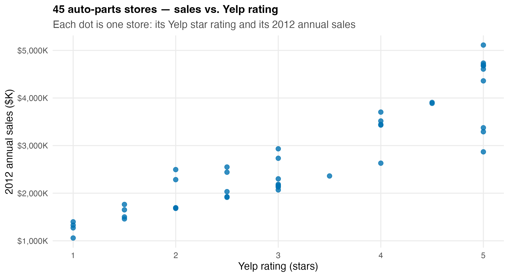
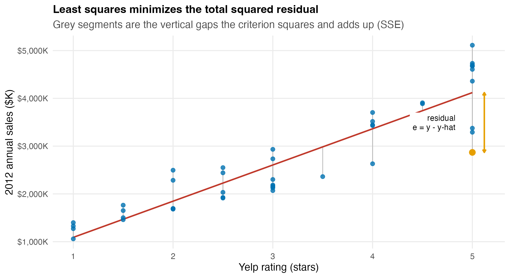
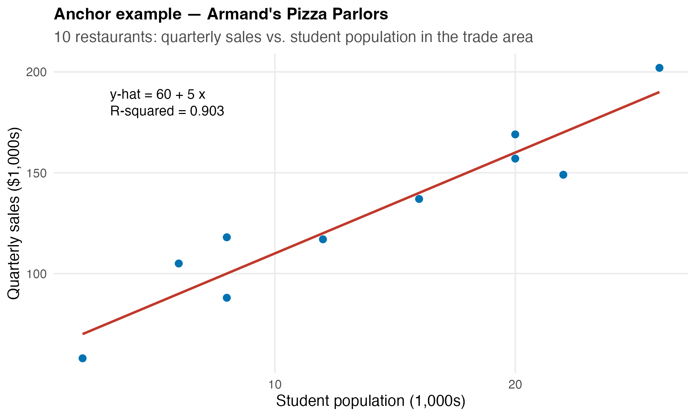
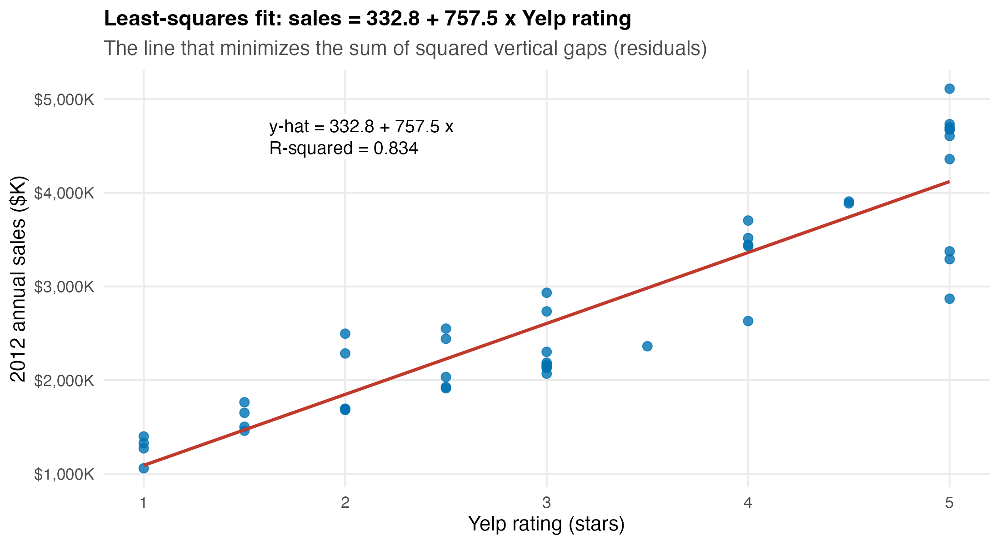
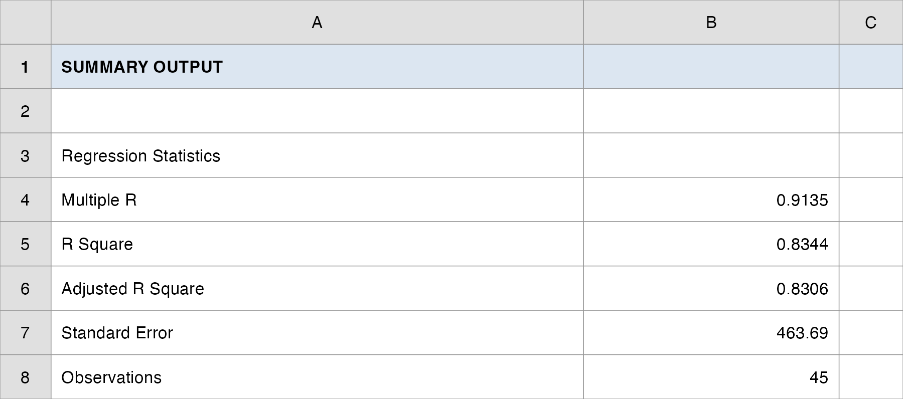
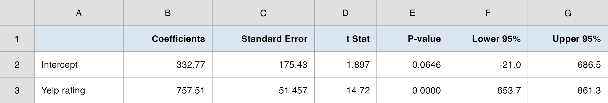
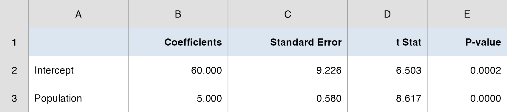
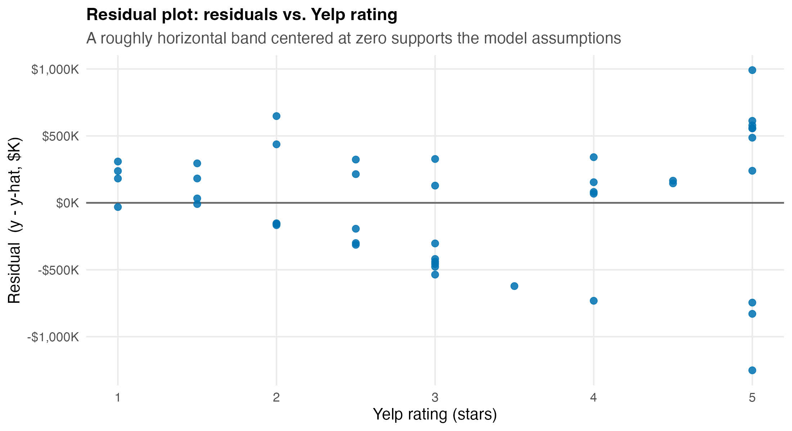
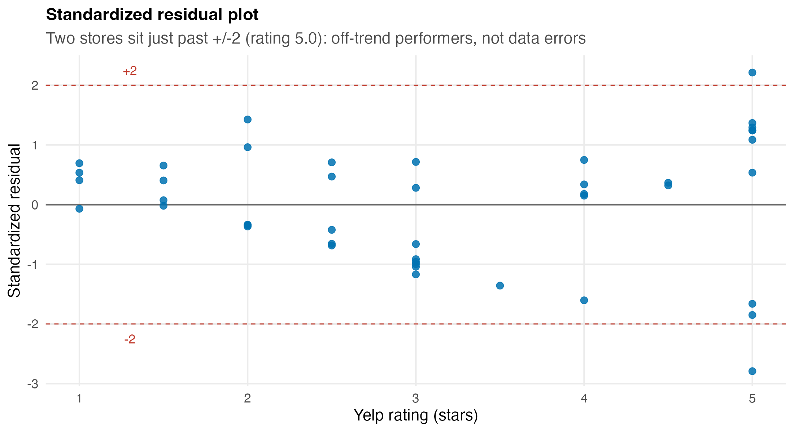
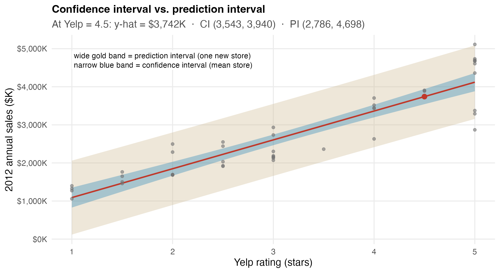

## Overview

:::::: nonincremental
::::: columns
::: {.column style="width: 50%; text-align: center; justify-content: center; align-items: center;"}
- New Case Spotlight: an auto-parts retailer picking store sites
- From *comparing* groups to *predicting* an outcome
- The simple linear regression model
- Least squares: the best-fit line
- Interpreting the slope and intercept
- $R^2$: how much does the line explain?
:::

::: {.column style="width: 50%; text-align: center; justify-content: center; align-items: center;"}
- Is the relationship real? The $t$-test on the slope
- Confidence interval for the slope
- Residual analysis: checking the assumptions
- Predicting sales for a brand-new store
- Confidence vs. prediction intervals
- From a fitted line to a site recommendation
:::
:::::
::::::

# Case Spotlight: Auto-Parts Retail {background-color="#cfb991"}

## A New Case: Where Should the Next Store Go?

<br>

- We close the Vungle engagement and open a new one. **You are now the manager** of a regional **auto-parts retailer** with **45 stores** and capital to open more.

- The real-estate team scores prospective sites on demographics (population, income) and on the store's **Yelp rating** (a proxy for service quality once a store is open).

- The question on the table: **which sites will sell?** As the manager you want every new lease backed by a sales forecast, not a hunch.

- We have one dataset, `data/autoparts.csv`: for each of the 45 existing stores, its **2012 annual sales** (\$K), trade-area **population** and **income**, an **end-cap** placement flag, and its **Yelp rating**.

- Until now we *compared* two groups. Now we *predict* a number, and that is what **regression** does.

## The Brief: Where Should the Next Dollar Go?

<br>

- **The manager's big call (we land it across Topics 10–11):** *where should the next dollar go?* Every new lease commits capital, so the manager wants sales forecast before signing.

::: fragment
- **Today's question, Lecture 1:** *does one driver, a store's Yelp rating, predict its annual sales?*
:::

::: fragment
- **Today's question, Lecture 2:** *is that slope real, and can we forecast a brand-new site?*
:::

::: fragment
- **How the studio runs:** I demo each step on a textbook anchor (**Armand's Pizza**) and on the auto-parts data, then **your group** reproduces the model, stress-tests it, and makes the site call.
:::

## From Comparing to Predicting

<br>

| What we did (Topics 7–9) | What we do now |
|---|---|
| Estimate / test **one** number (a mean, a proportion) | Model **how one variable moves with another** |
| "Is B's eRPM above \$3.30?" | "How many \$ of sales per Yelp star?" |
| Output: a decision (reject / fail to reject) | Output: an **equation you can forecast with** |

<br>

- Regression develops an **equation** showing how a **dependent variable** $y$ (what we predict, sales) relates to an **independent variable** $x$ (the predictor, Yelp rating).

- **Simple** linear regression uses **one** predictor; the relationship is approximated by a **straight line**. (More predictors → multiple regression, next topic.)

# Lecture 1: The Model, Least Squares, and $R^2$ {background-color="#cfb991"}

## The Brief: Lecture 1

<br>

> "Does one driver, a store's **Yelp rating**, predict its **annual sales**? Fit a straight line to `sales ~ yelp_rating`: what does the slope mean in dollars, and how much of the store-to-store sales gap does Yelp rating explain?"

<br>

- By the end of Lecture 1 **your group** will have a fitted equation, a dollars-per-star interpretation, and an $R^2$: the raw material for a site score.

- The manager's decision it feeds: **rank prospective sites** by predicted sales.

## How Every Class Runs

{.nostretch fig-align="center" width="90%"}

::: nonincremental
The class **ends on the Team Sprint**, your group's graded submission: a decision plus your read of the analysis, one PDF before you leave.
:::

## The Simple Linear Regression Model

<br>

- The **model** describes how $y$ relates to $x$ and a random **error term** $\varepsilon$ in the whole population of stores:

::: fragment

$$
y = \beta_0 + \beta_1 x + \varepsilon
$$

:::

- $\beta_0$ (intercept) and $\beta_1$ (slope) are unknown **population parameters**; $\varepsilon$ captures everything about sales that Yelp rating does **not** explain.

- We never see $\beta_0, \beta_1$; we **estimate** them from our 45-store sample. The estimated equation is

::: fragment

$$
\hat{y} = b_0 + b_1 x
$$

:::

- $\hat{y}$ is the **predicted** mean sales at a given rating; $b_0, b_1$ are the sample estimates of $\beta_0, \beta_1$.

## A Question That Often Comes Up

:::: {.faq}
**A question that often comes up at this point:**

[If $\beta_0$ and $\beta_1$ are the numbers we actually want, why bother with $b_0$ and $b_1$? Why not just use the true values?]{.faq-q}

::: {.fragment .faq-a}
**Short answer:** because nobody knows the true $\beta_0, \beta_1$. They describe *every* auto-parts store that could ever exist, and we only get to see our 45. So we **estimate** them with $b_0, b_1$ from the sample, write the fit with a hat ($\hat{y}$), and then spend Lecture 2 asking how trustworthy that estimate is. Same sample-to-population leap as every topic since interval estimation.
:::
::::

## What a Line Can Look Like

<br>

- The sign of $\beta_1$ sets the story:

  - $\beta_1 > 0$, a **positive** relationship: higher $x$ goes with higher $y$ (we expect this for Yelp → sales).
  - $\beta_1 < 0$, a **negative** relationship: higher $x$ goes with lower $y$.
  - $\beta_1 = 0$, **no** linear relationship: $x$ tells you nothing about $y$.

- **Honest caveat, regression is not causation.** A line that fits well says rating and sales *move together*; it does **not** prove better service *causes* sales. We will return to this when we test significance.

## The Data: Just Look First

```{r  echo=FALSE, out.width = "78%",fig.align="center"}

```

::: nonincremental
- 45 stores. Higher-rated stores clearly tend to sell more, but the cloud has spread. We need a **line** to summarize the trend and a **number** to summarize how tight it is.
:::

## Least Squares: Define "Best Fit"

<br>

- Infinitely many lines pass through a cloud of points. Which one is **best**? The one that makes the **residuals** smallest.

- A **residual** is the vertical gap between an actual store and the line:

::: fragment

$$
e_i = y_i - \hat{y}_i
$$

:::

- **Least squares criterion:** choose $b_0, b_1$ to **minimize the sum of squared residuals**:

::: fragment

$$
\min \;\; \text{SSE} = \sum_{i=1}^{n} (y_i - \hat{y}_i)^2
$$

:::

- Squaring penalizes big misses and keeps positives and negatives from cancelling.

## A Question That Often Comes Up

:::: {.faq}
**A question that often comes up at this point:**

[Why square the residuals? Couldn't we just minimize the sum of their absolute values, so a \$500K miss counts as \$500K instead of being blown up?]{.faq-q}

::: {.fragment .faq-a}
**Short answer:** absolute values would also keep the misses from cancelling, but squaring does two extra jobs the manager wants. It comes down hard on a store the line badly misses (a \$500K miss costs four times a \$250K miss), and it yields clean, closed-form formulas for $b_0$ and $b_1$, the ones Excel's `SLOPE`/`INTERCEPT` evaluate in one click. That is why "least squares," not "least absolute," is the standard fit.
:::
::::

## The Least-Squares Formulas

<br>

:::: {style="font-size: 90%;"}
- **Slope**, the workhorse:

::: fragment

$$
b_1 = \frac{\sum_{i=1}^{n} (x_i - \bar{x})(y_i - \bar{y})}{\sum_{i=1}^{n} (x_i - \bar{x})^2}
$$

:::

- **Intercept**, which forces the line through the point of averages $(\bar{x}, \bar{y})$:

::: fragment

$$
b_0 = \bar{y} - b_1 \bar{x}
$$

:::

- In Excel you rarely type these: `=SLOPE(y, x)`, `=INTERCEPT(y, x)`, or the full **Regression** tool do the arithmetic.
::::

## What the Criterion Is Minimizing

```{r  echo=FALSE, out.width = "72%",fig.align="center"}

```

::: nonincremental
- Each grey segment is one residual $e_i$. Least squares is the unique line that makes the **sum of those squared lengths** as small as possible.
:::

## Anchor Example: Armand's Pizza Parlors

:::: nonincremental
::: r-fit-text
A classic: **Armand's Pizza** has 10 restaurants near college campuses. Sales clearly depend on how many students live nearby. $x$ = student population in the trade area (1,000s); $y$ = quarterly sales (\$1,000s).

| | Student population $x$ (000s) | Quarterly sales $y$ (\$000s) |
|---|---:|---:|
| Restaurant 1 | 2 | 58 |
| Restaurant 2 | 6 | 105 |
| $\vdots$ | $\vdots$ | $\vdots$ |
| Restaurant 10 | 26 | 202 |

**Least-squares fit:** $\bar{x} = 14$, $\bar{y} = 130$, and the slope/intercept formulas give

$$
b_1 = 5, \qquad b_0 = 60 \qquad\Rightarrow\qquad \hat{y} = 60 + 5x
$$
:::
::::

## Armand's: Reading the Line

```{r  echo=FALSE, out.width = "58%",fig.align="center"}

```

::: nonincremental
- **Slope $b_1 = 5$:** each additional **1,000 students** in the trade area is associated with **\$5,000** more quarterly sales.
- **Intercept $b_0 = 60$:** the line's height at $x = 0$, outside the data range, so read it as a fitting constant, not "sales with zero students."
:::

## The Auto-Parts Fit

```{r  echo=FALSE, out.width = "70%",fig.align="center"}

```

::: fragment

$$
\widehat{\text{sales}} = 332.8 + 757.5 \times (\text{Yelp rating})
$$

:::

## Interpreting the Auto-Parts Slope and Intercept

<br>

- **Slope $b_1 = +757.5$:** each additional **Yelp star** is associated with about **\$757.5K** more in annual sales. *This is the number the real-estate team can use to score sites.*

- **Intercept $b_0 = +332.8$:** the line's height at a rating of zero. No store has a zero rating, so do **not** interpret it as "sales of a zero-star store"; it just anchors the line.

- **The manager's translation:** *Moving a store from a 3.0 to a 4.0 Yelp rating is worth roughly three-quarters of a million dollars in predicted annual sales.*

- **Sanity check:** the slope is positive and large, consistent with the upward cloud. Good.

## A Question That Often Comes Up

:::: {.faq}
**A question that often comes up at this point:**

[If each star is worth \$757.5K, can the real-estate team just plug in any rating, say a planned flagship aiming for 6.0 stars, and read off the predicted sales?]{.faq-q}

::: {.fragment .faq-a}
**Short answer:** only inside the range we actually observed. Our 45 stores span 1 to 5 stars, and Yelp caps at 5.0, so a 6.0 is impossible: the line was never tested out there. Plugging in an $x$ outside the data is **extrapolation**, and nothing guarantees the relationship stays straight past the edge of the cloud. Score sites in the 1-to-5 rating range your existing stores cover.
:::
::::

## $R^2$: How Much Does the Line Explain?

<br>

- Total variation in sales splits into what the line **explains** and what it **leaves** as error:

::: fragment

$$
\underbrace{\text{SST}}_{\sum (y_i - \bar{y})^2} \;=\; \underbrace{\text{SSR}}_{\sum (\hat{y}_i - \bar{y})^2} \;+\; \underbrace{\text{SSE}}_{\sum (y_i - \hat{y}_i)^2}
$$

:::

- The **coefficient of determination** is the explained share:

::: fragment

$$
R^2 = \frac{\text{SSR}}{\text{SST}} = 1 - \frac{\text{SSE}}{\text{SST}}, \qquad 0 \le R^2 \le 1
$$

:::

- $R^2 = 0$: the line explains nothing. $R^2 = 1$: every point sits exactly on the line.

## $R^2$ for the Auto-Parts Model

<br>

- From the auto-parts fit:

::: fragment

| Quantity | Value |
|---|---:|
| SST (total variation) | 55,840,034 |
| SSR (explained by line) | 46,594,785 |
| SSE (left as error) | 9,245,249 |
| $R^2 = \text{SSR}/\text{SST}$ | **0.834** |

:::

- **Interpretation:** Yelp rating alone explains **83.4%** of the store-to-store variation in annual sales, strong for a single predictor.

- The remaining **16.6%** is everything else (location, merchandising, competition). *That gap is exactly what motivates adding more predictors next topic.*

- In Excel: `=RSQ(sales, yelp)` or read **R Square** off the Regression output.

## $R^2$ and Correlation Are the Same Story

<br>

- The sample **correlation** $r$ and $R^2$ are tightly linked in simple regression:

::: fragment

$$
r = (\text{sign of } b_1)\sqrt{R^2}
$$

:::

- Here $b_1 > 0$ and $R^2 = 0.834$, so $r = +\sqrt{0.834} = +0.913$, a strong positive correlation, the same fact $R^2$ reports.

- **Correlation** measures the *tightness and direction* of the linear association; **$R^2$** measures the *share of variation explained*. Same coin, two faces.

## A Question That Often Comes Up

:::: {.faq}
**A question that often comes up at this point:**

[Is $R^2 = 0.834$ "good"? What is the cutoff a manager should require before trusting a regression?]{.faq-q}

::: {.fragment .faq-a}
**Short answer:** there is no universal cutoff; "good" depends on the field and the decision. For one predictor against messy store-level sales, 0.834 is strong. But a high $R^2$ does not make the line *correct*: a curved relationship can still post a high $R^2$, and a significant slope can come with a modest one. So we never stop at $R^2$. Lecture 2 tests whether the slope is real and checks the residuals before the manager signs anything.
:::
::::

## Excel: One Click Gives You Everything

::::: nonincremental
:::: columns
::: {.column width="40%"}
<br>

**Data → Data Analysis → Regression**

- Input Y Range: `sales2012_k`
- Input X Range: `yelp_rating`
- Check **Labels**, **Residuals**, **Residual Plots**

<br>

The top block is **Regression Statistics**: `Multiple R`, `R Square`, `Standard Error`, `Observations`.
:::

::: {.column width="60%"}
```{r  echo=FALSE, out.width = "100%",fig.align="center"}

```

```{r  echo=FALSE, out.width = "100%",fig.align="center"}

```
:::
::::
:::::

## The Manager's Takeaway (Lecture 1)

<br>

- **One sentence:** Yelp rating is a strong predictor of store sales: each star is worth about **\$757K** in predicted annual sales.

- **One number:** $R^2 = 0.834$: Yelp rating alone explains **83%** of the sales differences across stores.

- **One caveat:** "explains" is **association, not cause**, and 17% is still unexplained; one variable is rarely the whole story. We have a *fitted* line, but we have not yet asked whether it is **statistically real** or whether the model's **assumptions** hold. That is Lecture 2.

## Today's Question, Today's Answer

<br>

**The question (Topic 10, Lecture 1 of the ladder):**

> *Does one driver, a store's Yelp rating, predict its annual sales: what is the slope worth in dollars, and how much of the sales gap does rating explain?*

::: fragment
<br>

**The answer we reached today:**

> **Yes.** Least squares fits $\widehat{\text{sales}} = 332.8 + 757.5 \times (\text{Yelp rating})$: each star is worth about **\$757.5K** in predicted annual sales, and $R^2 = \textbf{0.834}$, so Yelp rating alone explains **83%** of the store-to-store sales gap. Whether that slope is *statistically real* is the Lecture 2 question.
:::

## ⏱️ Team Sprint: Your Group Case (Lecture 1)

::: {.sprint .nonincremental}
**Now it's your group's turn.** Today's in-class group case is posted on **Brightspace** (*Topic 10 Group Case, Lecture 1*): a separate business decision you make with today's tools.

**What you'll use:** simple linear regression (fit the line, interpret the slope in business units, and read $R^2$). **Excel:** Analysis ToolPak → Regression.

**Submit one PDF per group before you leave:** your decision plus the numbers behind it.
:::

# Lecture 2: Inference, Assumptions, and Prediction {background-color="#cfb991"}

## The Brief: Lecture 2

<br>

> "Is the slope **real**, and can we **forecast** a new site? The fitted slope is +757.5 \$K per star, but our 45 stores are a **sample**. Is the Yelp–sales relationship real, do the model's assumptions hold, and what sales should we forecast for a specific new site?"

<br>

- Lecture 1 *described* the sample. Lecture 2 does **inference**: from these 45 stores to the population of all possible stores.

- Three jobs the manager needs settled before signing a lease: (1) **test** the slope, (2) **validate** the assumptions with residuals, (3) **predict** a new store with an honest margin of error.

## How Every Class Runs

{.nostretch fig-align="center" width="90%"}

::: nonincremental
The class **ends on the Team Sprint**, your group's graded submission: a decision plus your read of the analysis, one PDF before you leave.
:::

## The Assumptions Behind the Line

<br>

- Everything we are about to do (tests, intervals) rests on four assumptions about the error term $\varepsilon$:

  1. **Mean zero:** $E(\varepsilon) = 0$, so the line is right on average.
  2. **Constant variance:** $\text{Var}(\varepsilon) = \sigma^2$ is the same for all $x$ (**homoscedasticity**).
  3. **Independence:** the errors for different stores are independent.
  4. **Normality:** $\varepsilon$ is normally distributed.

- If these are badly violated, the $p$-values and intervals can mislead. We will **check** them with residual plots after we test, but they are the foundation, so flag them first.

## Estimating $\sigma$: the Standard Error of the Estimate

<br>

- The tests need an estimate of the error spread $\sigma$. The **mean square error** estimates $\sigma^2$:

::: fragment

$$
s^2 = \text{MSE} = \frac{\text{SSE}}{n - 2}
$$

:::

- Its square root, $s = \sqrt{\text{MSE}}$, is the **standard error of the estimate**: the typical vertical miss of the line, in the units of $y$:

::: fragment

$$
s = \sqrt{\frac{\text{SSE}}{n-2}} = \sqrt{\frac{9{,}245{,}249}{43}} \approx \$464\text{K}
$$

:::

- We divide by $n - 2$ because we spent two degrees of freedom estimating $b_0$ and $b_1$. In Excel: `=STEYX(sales, yelp)` or read **Standard Error** off the output.

## A Question That Often Comes Up

:::: {.faq}
**A question that often comes up at this point:**

[For a single mean we divided by $n - 1$. Why $n - 2$ here, and does it matter with 45 stores?]{.faq-q}

::: {.fragment .faq-a}
**Short answer:** each parameter we estimate from the data costs one degree of freedom. A single mean costs one, so $n - 1$. The regression line costs two, an intercept $b_0$ and a slope $b_1$, so $n - 2 = 43$. With 45 stores the difference between dividing by 43, 44, or 45 is tiny, but the rule keeps $s$ an honest, slightly conservative estimate of the error spread, which feeds straight into every $t$ and interval that follows.
:::
::::

## Testing the Slope: Is the Relationship Real?

<br>

- If $\beta_1 = 0$, $x$ has **no** linear effect on $y$, so there is no relationship to forecast with. We test:

::: fragment

$$
H_0: \beta_1 = 0 \qquad \text{vs.} \qquad H_a: \beta_1 \neq 0 \qquad (\alpha = 0.05)
$$

:::

- The test statistic divides the estimated slope by its standard error, with $df = n - 2$:

::: fragment

$$
t = \frac{b_1 - 0}{s_{b_1}}, \qquad s_{b_1} = \frac{s}{\sqrt{\sum (x_i - \bar{x})^2}}
$$

:::

- Same logic as every test since Topic 8: a statistic, a $t$ distribution, a $p$-value, a decision.

## Anchor: Armand's Slope Is Significant

::::: nonincremental
:::: columns
::: {.column width="40%"}
<br>

For Armand's Pizza:

$$
t = \frac{5}{0.580} = 8.62, \quad df = 8
$$

$p\text{-value} \approx 0.000 \le 0.05$ → **reject $H_0$**.

<br>

Student population is a **significant** predictor of restaurant sales: the slope is not zero.
:::

::: {.column width="60%"}
```{r  echo=FALSE, out.width = "100%",fig.align="center"}

```
:::
::::
:::::

## The Auto-Parts Slope Test

<br>

- From the Regression output (`yelp_rating` row):

::: fragment

| Quantity | Value |
|---|---:|
| $b_1$ (slope) | 757.5 |
| $s_{b_1}$ (std. error of slope) | 51.46 |
| $t = b_1 / s_{b_1}$ | **14.7** |
| $df = n - 2$ | 43 |
| $p$-value | $< 0.0001$ |

:::

- $|t| = 14.7$ is enormous against $t_{0.025, 43} = 2.02$ → **reject $H_0$** decisively.

- **Translation:** the Yelp–sales relationship is *not* a fluke of these 45 stores. There is overwhelming evidence the true slope is positive.

## A Question That Often Comes Up

:::: {.faq}
**A question that often comes up at this point:**

[A $t$ of 14.7 and $p < 0.0001$ sound spectacular. Does that mean Yelp rating is a *huge* driver of sales?]{.faq-q}

::: {.fragment .faq-a}
**Short answer:** no, those two readings answer different questions. The $t$-test and $p$-value only say the slope is **not zero**: the relationship is real, not noise. *How big* the effect is comes from the slope itself (\$757.5K per star) and the CI around it; *how much it explains* comes from $R^2$ (0.834). A predictor can be highly significant yet small, or significant yet leave most variation unexplained. Read all three, not just the $p$-value.
:::
::::

## Confidence Interval for the Slope

<br>

- The test says the slope is nonzero; the **confidence interval** says how big it plausibly is:

::: fragment

$$
b_1 \pm t_{\alpha/2,\,n-2}\; s_{b_1} = 757.5 \pm 2.02 \times 51.46 = (\$653.7\text{K},\; \$861.3\text{K})
$$

:::

- We are 95% confident each Yelp star is worth between **\$654K and \$861K** in annual sales.

- The interval is **entirely above zero**: the same conclusion as the test (reject $H_0$), now with a magnitude the manager can plan around.

- **Equivalence:** reject $H_0: \beta_1 = 0$ at $\alpha = 0.05$ $\iff$ zero is **not** in the 95% CI. Read directly off the **Lower 95% / Upper 95%** columns of the output.

## A Note on the F Test

<br>

- The Regression output also reports an **F test** (the ANOVA block): $F = \text{MSR}/\text{MSE}$, testing the same $H_0: \beta_1 = 0$.

- In **simple** regression (one predictor) the $F$ and $t$ tests are **equivalent**; in fact $F = t^2$:

::: fragment

$$
F = 216.7 = t^2 \quad (t = 14.7)
$$

:::

- Same conclusion, same $p$-value. (When we add predictors next topic, $F$ tests the model *as a whole* while each $t$ tests one variable, and then they differ.)

## Significance Is Not Causation

<br>

- Rejecting $H_0: \beta_1 = 0$ tells us the **relationship is statistically significant**: Yelp and sales move together more than chance would explain.

- It does **not** establish that **better service causes** higher sales. Reverse causation (busy, well-stocked stores earn better reviews) and lurking variables (a great location drives *both*) are live alternatives.

- It also does **not** prove the relationship is **linear** outside the range we observed; extrapolating a 6-star store is meaningless.

- *Use regression to forecast and to quantify; use judgment and design to claim causation.*

## Residual Analysis: Validating the Assumptions

<br>

- A significant slope is worthless if the model is the **wrong shape**. **Residuals** are our window onto the error term; they should look like random noise.

- The core diagnostic: **plot residuals against $x$** (or against $\hat{y}$). We want a **horizontal band of points centered at zero** with no pattern.

- Two warning signs to learn:

  - A **curved** (U-shaped) band → the relationship is **nonlinear**; a straight line is the wrong functional form (consider adding $x^2$).
  - A **fan** that widens → **non-constant variance** (heteroscedasticity); the constant-variance assumption fails (consider transforming $y$).

## The Auto-Parts Residual Plot

```{r  echo=FALSE, out.width = "72%",fig.align="center"}

```

::: nonincremental
- Roughly horizontal, centered at zero, no fan and no curve → the **linearity** and **constant-variance** assumptions look reasonable. The straight-line model is defensible.
:::

## Standardized Residuals and Outliers

- Dividing each residual by its standard deviation gives a **standardized residual**, on a $z$-like scale.

- **Rule of thumb:** a standardized residual with $|z| > 2$ flags an **outlier**, a store that performs far off-trend for its rating. Investigate; don't auto-delete.

::: fragment

```{r  echo=FALSE, out.width = "60%",fig.align="center"}

```

:::

## Two Stores Worth a Conversation

<br>

- Two stores sit just past $\pm 2$, both rated **5.0 stars**:

  - One **under-performs** badly (sales far below the \$4.1M its rating predicts).
  - One **over-performs** (sales well above the line).

- These are **not data errors**; they are real stores the model can't fully explain with rating alone.

- *What might separate two 5-star stores?* End-cap placement, local income, population. **That is the teaser for multiple regression:** adding the variables that explain the residuals.

## A Question That Often Comes Up

:::: {.faq}
**A question that often comes up at this point:**

[Those two off-trend stores drag the line around. Should we just delete them so the model fits better?]{.faq-q}

::: {.fragment .faq-a}
**Short answer:** no, not on sight. A point past $\pm 2$ flags a store to **investigate**, not to erase. Delete it only if you find a genuine error (a sales figure keyed wrong, a store mislabeled). If the store is real, dropping it just hides information: here the two 5-star outliers are the clue that rating alone misses something. The honest move is to keep them, report them, and add the predictors that explain them, which is the next topic.
:::
::::

## Forecasting a New Store: Point Prediction

<br>

- The real payoff: a prospective site rates **4.5 stars** on comparable stores. Predicted sales:

::: fragment

$$
\hat{y} = 332.8 + 757.5 \times 4.5 = \$3{,}742\text{K} \;\approx\; \$3.74\text{M}
$$

:::

- That single number is the **point prediction**, but a point with no margin of error is a trap. Two different questions need two different intervals:

  - **Confidence interval:** the **mean** sales of *all* stores rated 4.5.
  - **Prediction interval:** the sales of **this one** new store.

## Confidence Interval vs. Prediction Interval

<br>

:::: {style="font-size: 86%;"}
- **Confidence interval** for the mean response at $x^*$, narrower:

::: fragment

$$
\hat{y} \pm t_{\alpha/2,\,n-2}\; s\sqrt{\frac{1}{n} + \frac{(x^* - \bar{x})^2}{\sum (x_i - \bar{x})^2}}
$$

:::

- **Prediction interval** for one new store at $x^*$, wider (note the extra **1**):

::: fragment

$$
\hat{y} \pm t_{\alpha/2,\,n-2}\; s\sqrt{1 + \frac{1}{n} + \frac{(x^* - \bar{x})^2}{\sum (x_i - \bar{x})^2}}
$$

:::

- The PI carries the **individual store's** own scatter ($s$) *on top of* the uncertainty in the line; that is the extra "1."
::::

## The Two Intervals, in a Picture

```{r  echo=FALSE, out.width = "66%",fig.align="center"}

```

::: nonincremental
- At Yelp = 4.5: point \$3.74M; **CI** $(\$3{,}543\text{K},\; \$3{,}940\text{K})$ for the average such store; **PI** $(\$2{,}786\text{K},\; \$4{,}698\text{K})$ for one specific new store.
- Both bands are **narrowest near $\bar{x}$** and flare out at the edges; forecasts far from the data are less certain.
:::

## A Question That Often Comes Up

:::: {.faq}
**A question that often comes up at this point:**

[We are deciding on one specific lease. Which interval does the manager quote, the tight CI or the wide PI?]{.faq-q}

::: {.fragment .faq-a}
**Short answer:** the **prediction interval**, (\$2.79M, \$4.70M). The CI, (\$3.54M, \$3.94M), is for the *average* of all 4.5-star stores; it would matter if you were opening dozens at once. A lease commits you to *one* store, which carries its own scatter on top of the line's uncertainty, so the honest range is the wider PI. Quoting the narrow CI for a single site would understate the risk on the one decision capital is riding on.
:::
::::

## What Makes a Forecast Tighter or Looser

<br>

- Four levers set the width of these intervals:

  1. **Confidence level** $(1-\alpha)$: more confidence → wider.
  2. **Data spread** $s$: noisier data → wider.
  3. **Sample size** $n$: more stores → narrower.
  4. **Distance of $x^*$ from $\bar{x}$**: forecasting far from the average rating → wider.

- **The manager's lesson:** a confident forecast comes from a tight model ($s$ small), lots of data ($n$ large), and a site that looks like the stores we already have ($x^*$ near $\bar{x}$). Forecasting an exotic site is a guess dressed as a number.

## The Manager's Takeaway (Lecture 2)

<br>

- **One sentence:** the Yelp–sales slope is overwhelmingly significant ($t = 14.7$, $p < 0.0001$); a 4.5-star site is forecast at **\$3.74M**, and for *one* lease we quote the **prediction interval** $(\$2.79\text{M}, \$4.70\text{M})$.

- **One number:** 95% CI for the slope = **(\$654K, \$861K)** per star: the magnitude the real-estate team plans around.

- **One caveat:** the model assumes the new site behaves like our 45 stores; the two off-trend 5-star outliers warn that rating alone misses something, which is exactly why we add predictors next.

## The Whole Engagement on One Page

::: r-fit-text
| Step | Question | Tool | Auto-parts result |
|---|---|---|---|
| Fit | What's the line? | Least squares | $\hat{y} = 332.8 + 757.5\,x$ |
| Interpret | What's a star worth? | Slope $b_1$ | **+\$757.5K** per Yelp star |
| Explain | How good is the fit? | $R^2$ | **0.834** (83% of sales variation) |
| Test | Is it real? | $t$ test on slope | $t = 14.7$, $p < .0001$ → reject $H_0$ |
| Quantify | How big, plausibly? | 95% CI for slope | (\$654K, \$861K) per star |
| Validate | Do assumptions hold? | Residual plot | Horizontal band → OK (2 outliers) |
| Forecast | What will a new site sell? | Point + PI | \$3.74M; PI (\$2.79M, \$4.70M) at 4.5 stars |
:::

## The Manager's Takeaway

<br>

- **One sentence:** Yelp rating predicts auto-parts store sales strongly and significantly (about **\$758K per star**, explaining **83%** of the sales gap), so the real-estate team can use it to score and forecast sites.

- **One number to remember:** $b_1 = 757.5$, and where it came from: $\sum(x-\bar{x})(y-\bar{y}) / \sum(x-\bar{x})^2$.

- **One caveat:** regression forecasts and quantifies; it does **not** prove causation, and 17% of sales is still unexplained; a single predictor is a start, not the answer.

- **Practice with the real data:** `data/autoparts.csv` + Regression tool → reproduce $b_1 = 757.5$, $R^2 = 0.834$, $t = 14.7$ (worked solutions in `data/autoparts_regression.xlsx`).

## Today's Question, Today's Answer

<br>

**The question (Topic 10, Lecture 2 of the ladder):**

> *Is the slope real, do the assumptions hold, and what sales should we forecast for a specific new site?*

::: fragment
<br>

**The answer we reached today:**

> **Real and forecastable.** The slope test gives $t = \textbf{14.7}$, $p < 0.0001$, so we reject $H_0: \beta_1 = 0$; the 95% CI is **(\$654K, \$861K)** per star. The residual band is horizontal (assumptions hold, two 5-star outliers aside). A 4.5-star site forecasts at **\$3.74M**, and for *one* lease we quote the prediction interval **(\$2.79M, \$4.70M)**.
:::

## ⏱️ Team Sprint: Your Group Case (Lecture 2)

::: {.sprint .nonincremental}
**Now it's your group's turn.** Today's in-class group case is posted on **Brightspace** (*Topic 10 Group Case, Lecture 2*): a separate business decision you make with today's tools.

**What you'll use:** testing the slope (the $t$-test and 95% CI), a residual check, and a prediction interval for a new case. **Excel:** Analysis ToolPak → Regression.

**Submit one PDF per group before you leave:** your decision plus the numbers behind it.
:::

# Wrap-up {background-color="#cfb991"}

## Summary

::: {.nonincremental style="font-size: 92%;"}
The main points from this session:

- **Regression predicts** where comparison only contrasts: the line $\hat{y} = b_0 + b_1 x$ turns a relationship into a forecast.
- **Least squares** picks the line that minimizes $\sum (y_i - \hat{y}_i)^2$; the **slope** is the business number (\$757.5K per Yelp star), the **intercept** just anchors the line.
- **$R^2 = \text{SSR}/\text{SST}$** is the share of variation the line explains (0.834 here); $r = (\text{sign } b_1)\sqrt{R^2}$ ties it to correlation.
- **Inference** asks if the slope is real: $t = b_1/s_{b_1}$ with $df = n-2$ (and $F = t^2$); the 95% CI gives the plausible magnitude.
- **Residual plots** validate the assumptions: a horizontal band is fine; a curve means nonlinearity, a fan means non-constant variance.
- **Prediction** needs the right interval: a **CI** for the mean response, a **wider PI** for one new store; both widen as $x^*$ leaves $\bar{x}$.
- **Next topic, Multiple Regression** on the same data: add population, income, and end-cap, and learn what "holding everything else constant" means.
:::

# Thank you! {background-color="#cfb991"}
