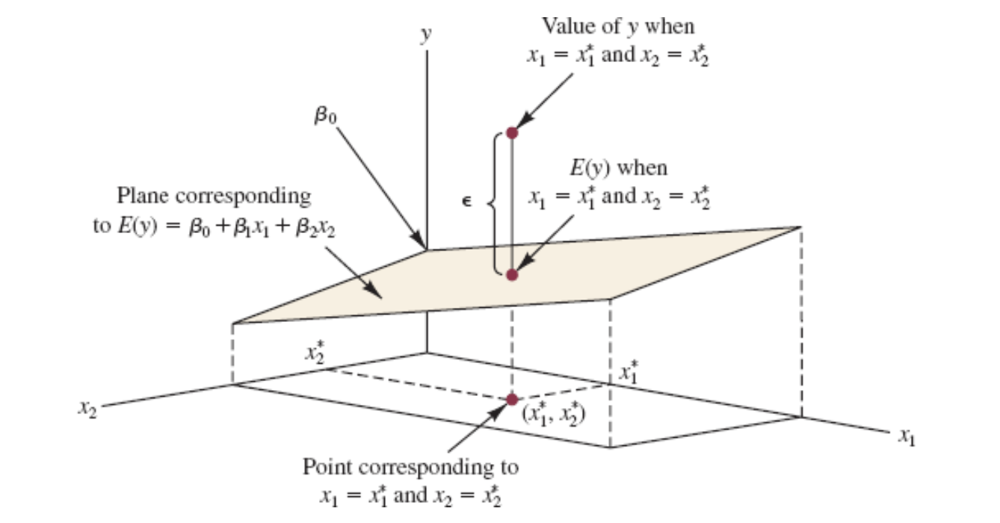
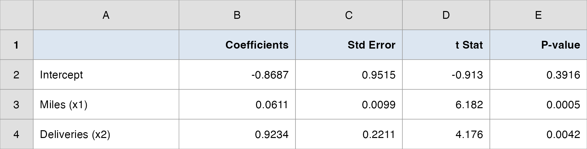
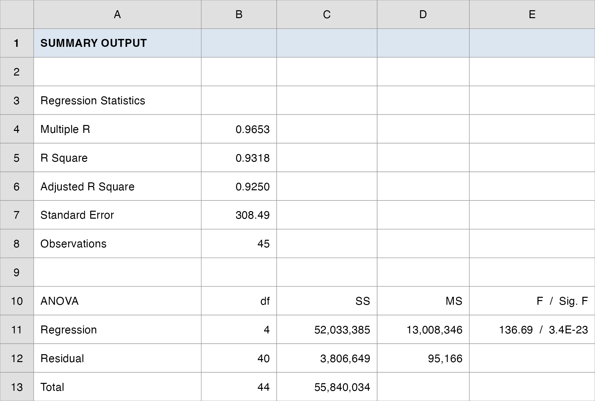
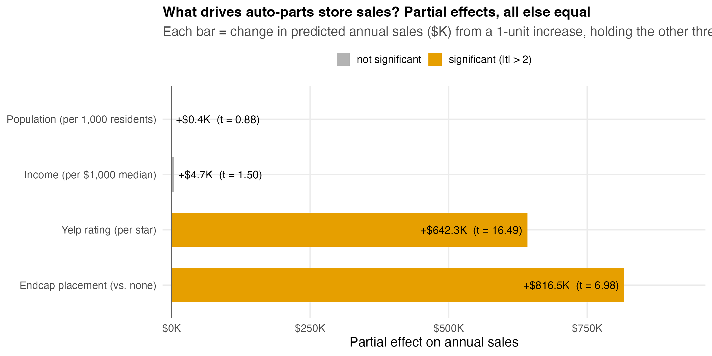
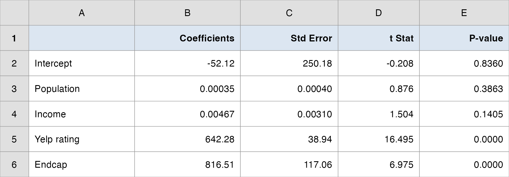
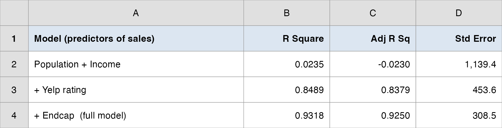
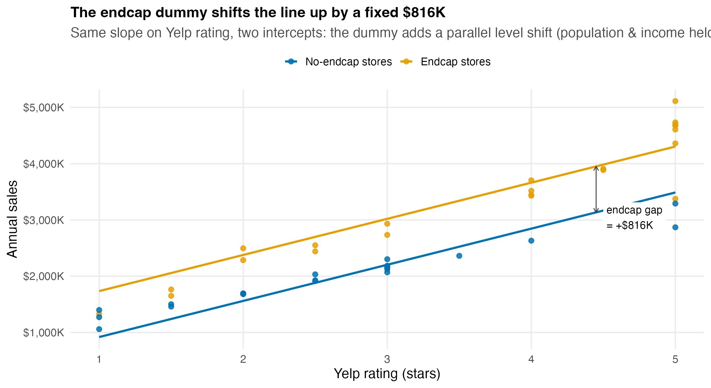
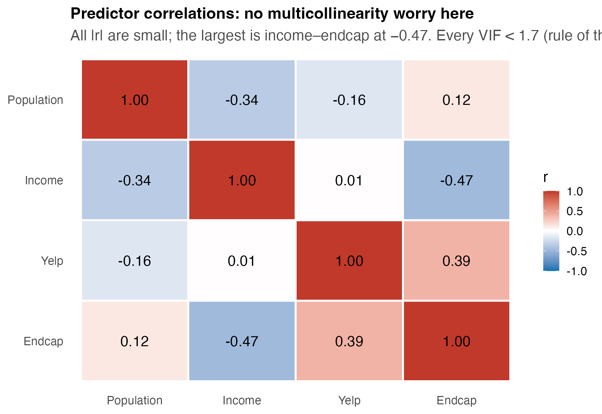

## Overview

:::::: nonincremental
::::: columns
::: {.column style="width: 50%; text-align: center; justify-content: center; align-items: center;"}
- Case Spotlight: an auto-parts retailer choosing where to invest
- One predictor to many: the multiple regression model
- Least squares and the **partial** coefficient: "holding the others constant"
- How well does the model fit? $R^2$ and **adjusted** $R^2$
:::

::: {.column style="width: 50%; text-align: center; justify-content: center; align-items: center;"}
- Is the model useful? The overall **$F$-test**
- Which predictors matter? The individual **$t$-tests**
- A switch on or off: the **dummy** (indicator) variable
- When predictors overlap: **multicollinearity**
- The investment call: demographics or service & merchandising?
:::
:::::
::::::

# Case Spotlight: Auto-Parts Retail {background-color="#cfb991"}

## Last Topic We Predicted with One Variable. Now We Have Four.

<br>

- Our client is a regional **auto-parts retail chain** — 45 stores, deciding where to put its next dollar.

- Last time we found a single strong predictor of a store's annual sales: its **Yelp rating**. Each extra star was worth roughly **+\$758K** a year. A clean simple-regression story.

- But a Yelp rating is a *symptom*, not a lever you can pull directly. The CFO's real question is sharper:

::: fragment
> "We can invest in **location** (open stores in bigger, richer markets), in **service** (raise the customer experience), or in **merchandising** (pay for premium **endcap** shelf placement). **Which actually drives sales — and where should the money go?**"
:::

- Answering that needs **several predictors at once** — and a way to isolate the effect of each one. That is today's tool: **multiple regression**.

## The Data: 45 Stores, Four Candidate Drivers

<br>

::: {style="font-size: 90%;"}
| Column | What it measures | The lever it represents |
|---|---|---|
| `sales2012_k` | annual store sales (\$ thousands) | **the outcome we want to grow** |
| `population_3mi` | residents within 3 miles | location — market size |
| `income_3mi` | median household income within 3 miles | location — market wealth |
| `yelp_rating` | average Yelp rating (1–5 stars) | service / customer experience |
| `endcap` | 1 = premium endcap shelf placement, 0 = none | merchandising spend |
:::

<br>

- Data: `data/autoparts.csv` — 45 rows, one per store. `endcap` is already coded **0/1**.

- **The trap we will spring today:** the two drivers a manager *expects* to dominate — population and income — turn out **not** to matter once service and merchandising are in the model.

## How Today's Studio Runs

<br>

- **Two lectures, two halves of the decision:**

  - **Lecture 1 — Build & read the model.** Fit sales on all four drivers; interpret each **partial** coefficient ("holding the others constant"); judge overall fit with $R^2$ and adjusted $R^2$. Anchor: **Butler Trucking**.

  - **Lecture 2 — Test & decide.** Which drivers are *real* ($F$-test vs. $t$-tests)? Put a **dollar value on an endcap** with a dummy variable; check the predictors don't overlap (multicollinearity); make the investment call.

- I demo each idea on a small textbook anchor → **your team runs it on the auto-parts data** → we debrief the recommendation together.

- By the end, **your team** tells the CFO where to invest — with the regression to back it.

# Lecture 1 — Building & Reading the Model {background-color="#cfb991"}

## The Brief — Lecture 1

<br>

> "Fit a model for store sales using **all four** drivers at once. For each driver, tell me its effect on sales **holding the others fixed** — and tell me how much of the sales story the model captures."

<br>

- Simple regression answered "does Yelp predict sales?" in isolation. But stores with high Yelp ratings might also sit in richer markets — so the simple slope can **mix two effects together**.

- Multiple regression's superpower: estimate the effect of **each** driver **while statistically holding the others constant** — the closest thing we have to a controlled comparison from observational data.

- First we build the machine and learn to read its output. Testing and the dollar decision come in Lecture 2.

# From One Predictor to Many {background-color="#cfb991"}

## The Multiple Regression Model

<br>

- With $p$ independent variables $x_1, x_2, \ldots, x_p$, the **population model** is:

::: fragment

$$
y = \beta_0 + \beta_1 x_1 + \beta_2 x_2 + \cdots + \beta_p x_p + \epsilon
$$

:::

- The **regression equation** (the mean response) drops the error term:

::: fragment

$$
E(y) = \beta_0 + \beta_1 x_1 + \beta_2 x_2 + \cdots + \beta_p x_p
$$

:::

- Same error assumptions as before: $E(\epsilon)=0$, constant variance $\sigma^2$, independent errors, normally distributed.

- $\beta_j$ = the change in $E(y)$ for a **one-unit increase in $x_j$ when all other variables are held constant.** That phrase is the whole point of today.

## A Plane, Not a Line

```{r  echo=FALSE, out.width = "62%",fig.align="center"}

```

::: nonincremental
- With two predictors, $E(y) = \beta_0 + \beta_1 x_1 + \beta_2 x_2$ traces a **plane** in 3-D space; with $p$ predictors it is a *hyperplane* we can no longer draw — but the algebra is identical.
- The vertical gap from a point to the plane is the error $\epsilon$; least squares tilts the plane to make those gaps as small as possible.
:::

## Estimating the Coefficients: Least Squares Again

<br>

- The **estimated** equation replaces the unknown $\beta$'s with sample estimates $b$'s:

::: fragment

$$
\hat{y} = b_0 + b_1 x_1 + b_2 x_2 + \cdots + b_p x_p
$$

:::

- Same criterion as simple regression — pick the $b$'s that **minimize the sum of squared residuals**:

::: fragment

$$
\min \; SSE = \min \sum_{i=1}^{n} (y_i - \hat{y}_i)^2
$$

:::

- The closed-form solution needs matrix algebra, so we let **Excel** do the arithmetic. Our job is to **read and interpret** the output — that is where the business judgment lives.

## The Partial Coefficient — the Key Idea

<br>

- In simple regression, $b_1$ was *the* effect of $x$ on $y$.

- In multiple regression, $b_j$ is a **partial** coefficient: the effect of $x_j$ on $y$ **after the model has already accounted for every other predictor.**

- Read every coefficient with the same clause attached:

  - "$b_j$ = the predicted change in $y$ for a one-unit increase in $x_j$, **holding all other variables constant.**"

- This is why a predictor can look important alone yet vanish in the full model — its apparent effect was really the work of a variable it travels with. (We will watch exactly this happen to population and income.)

# Anchor Example: Butler Trucking {background-color="#cfb991"}

## Butler Trucking — Two Predictors of Travel Time

<br>

- Managers at **Butler Trucking** want better driver schedules. They believe a driver's **total daily travel time** ($y$, hours) depends on two things about the route:

  - $x_1$ = **miles** traveled
  - $x_2$ = number of **deliveries** made

- Ten driving assignments were recorded. The proposed model:

::: fragment

$$
y = \beta_0 + \beta_1 x_1 + \beta_2 x_2 + \epsilon \qquad (n = 10,\; p = 2)
$$

:::

- A small, clean example — perfect for learning to read the output table before we scale up to 45 stores and four predictors.

## Butler — the Estimated Equation

::::: nonincremental
:::: columns
::: {.column width="46%"}
<br>

**Data → Data Analysis → Regression**

- Input Y Range: travel-time column
- Input X Range: the **two** columns (miles, deliveries) together
- Labels ✓, Confidence Level 95% ✓

<br>

From the **Coefficients** column:

$$
\hat{y} = -0.869 + 0.0611\,x_1 + 0.923\,x_2
$$
:::

::: {.column width="54%"}
```{r  echo=FALSE, out.width = "100%",fig.align="center"}

```
:::
::::
:::::

## Butler — Reading the Partial Coefficients

<br>

- $b_1 = +0.0611$ (miles): each **additional mile** adds about **0.061 hour** (\~3.7 min) to travel time — **holding the number of deliveries constant.**

- $b_2 = +0.923$ (deliveries): each **additional delivery** adds about **0.92 hour** — **holding miles constant.**

- **Predict** assignment #1 ($x_1=100$, $x_2=4$):

::: fragment

$$
\hat{y} = -0.869 + 0.0611(100) + 0.923(4) = 8.94 \text{ hours}
$$

:::

- Actual was $9.3$, so the **residual** is $9.3 - 8.94 = +0.36$ hour: this route took slightly longer than the model expects.

# How Well Does the Model Fit? {background-color="#cfb991"}

## Partitioning the Variation: SST = SSR + SSE

<br>

- Exactly as in simple regression, total variation in $y$ splits into explained + unexplained:

::: fragment

$$
\underbrace{\sum (y_i - \bar{y})^2}_{SST \;(\text{total})} \;=\; \underbrace{\sum (\hat{y}_i - \bar{y})^2}_{SSR \;(\text{explained})} \;+\; \underbrace{\sum (y_i - \hat{y}_i)^2}_{SSE \;(\text{unexplained})}
$$

:::

- The **multiple coefficient of determination** is the explained share:

::: fragment

$$
R^2 = \frac{SSR}{SST} = 1 - \frac{SSE}{SST}
$$

:::

- For Butler: $R^2 = 21.60 / 23.90 = 0.904$ — miles and deliveries together explain about **90%** of the variation in travel time.

## The $R^2$ Trap: It Can Only Go Up

<br>

- Here is the catch that makes $R^2$ dangerous in multiple regression:

  - **Adding *any* predictor — even a useless, random one — can only *increase* $R^2$ (never decrease it).**

- Why: a new variable gives least squares one more knob to fit noise, so $SSE$ shrinks and $R^2$ ticks up — whether or not the variable is real.

- So a bigger $R^2$ does **not** mean a better model. If we chased $R^2$ alone, we would throw every variable we could find into the model.

- We need a fit measure that **charges a penalty** for each predictor added. That is **adjusted $R^2$.**

## Adjusted $R^2$ — Pay a Fee per Predictor

::: {style="font-size: 90%;"}
- Adjusted $R^2$ replaces the raw sums of squares with their **per-degree-of-freedom** versions:

::: fragment

$$
R^2_a = 1 - \frac{SSE/(n - p - 1)}{SST/(n - 1)} = 1 - (1 - R^2)\,\frac{n - 1}{n - p - 1}
$$

:::

- The penalty rises with $p$ (more predictors) and eases with $n$ (more data). Two consequences:

  - $R^2_a \le R^2$ **always**, and the gap widens as you add predictors.
  - $R^2_a$ goes **up only if a new predictor reduces the error variance $s^2$ (= MSE) more than the penalty costs.**

- That makes $R^2_a$ a real **model-building criterion**: compare candidate models, prefer the higher $R^2_a$.

- Butler: $R^2 = 0.904$ but $R^2_a = 0.876$ — the gap is the fee for using two predictors on only ten observations.
:::

# The Spine Model: All Four Drivers {background-color="#cfb991"}

## Fitting Sales on All Four Drivers in Excel

::::: nonincremental
:::: columns
::: {.column width="42%"}
<br>

**Data → Data Analysis → Regression**

- Input Y Range: `sales2012_k`
- Input X Range: all **four** predictor columns (`population_3mi`, `income_3mi`, `yelp_rating`, `endcap`) — selected together
- Labels ✓, Confidence Level 95% ✓

<br>

The top block reports overall fit; we read it now and test it in Lecture 2.
:::

::: {.column width="58%"}
```{r  echo=FALSE, out.width = "100%",fig.align="center"}

```
:::
::::
:::::

## The Estimated Equation for Store Sales

<br>

From the **Coefficients** column of the output:

::: fragment

$$
\widehat{\text{sales}} = -52.1 + 0.00035\,\text{pop} + 0.0047\,\text{income} + 642.3\,\text{yelp} + 816.5\,\text{endcap}
$$

:::

<br>

- **Fit:** $R^2 = 0.932$, adjusted $R^2 = 0.925$ — the four drivers together explain about **93%** of the variation in store sales, and that holds up after the per-predictor penalty.

- Standard error $s = \$308.5\text{K}$: a rough "typical miss" of the model's sales prediction.

- Now the interpretation — and the surprise.

## Reading the Partial Effects

```{r  echo=FALSE, out.width = "82%",fig.align="center"}

```

::: nonincremental
- Each **Yelp star** predicts **+\$642K** in annual sales, holding location and merchandising fixed. An **endcap** predicts **+\$816K**, holding everything else fixed.
- The two location drivers (population, income) move the needle far less — we will test whether they matter at all next lecture.
:::

## The Surprise: Bigger Market ≠ More Sales

<br>

- A manager's intuition says **population** and **income** should dominate — more people, more money, more sales.

- But the partial coefficients say otherwise:

  - **Population:** $+0.00035$ → about **+\$0.35K per extra 1,000 residents**. Essentially flat.
  - **Income:** $+0.0047$ → about **+\$4.7K per extra \$1,000 of median income**. Small.

- Meanwhile **service** (Yelp) and **merchandising** (endcap) carry the model.

- **Why the intuition fails:** in simple regression a market-size variable can look strong because it travels with the variables that *really* matter. Once those are in the model, "holding the others constant" strips the borrowed credit away. We will confirm this with formal tests in Lecture 2.

## ⏱️ Team Sprint 1 — Build & read the model

::: {.sprint .nonincremental}
**Decide:** what does each driver contribute to predicted store sales, holding the others constant?

**Data:** `data/autoparts.csv` · **Time:** ~12 min

1. In Excel: **Data → Data Analysis → Regression.** Y = `sales2012_k`; X = the four columns `population_3mi`, `income_3mi`, `yelp_rating`, `endcap` (select together). Check **Labels** and **Confidence Level 95%**.
2. Write out the estimated equation $\widehat{\text{sales}} = b_0 + b_1(\text{pop}) + \cdots$ from the **Coefficients** column.
3. Record $R^2$ and **Adjusted $R^2$** from the top block. In one sentence, say what fraction of the sales story the model captures.
4. Translate the **Yelp** and **endcap** coefficients into plain dollars ("each extra star / an endcap is worth about \$___K, holding the others fixed").

**Hand in (1 slide):** the equation, $R^2$ vs. adjusted $R^2$, and your dollar reading of the two biggest drivers.
:::

## Debrief — Manager's Takeaway (Lecture 1)

<br>

- **One sentence:** four drivers explain **93%** of store-sales variation, and the effects that matter are **service (Yelp, +\$642K/star)** and **merchandising (endcap, +\$816K)** — *not* the market-size variables a manager would bet on.

- **One number:** **adjusted $R^2 = 0.925$** — high fit that *survives* the penalty for using four predictors, so the model isn't just padded with noise.

- **One caveat:** "holding the others constant" is doing heavy lifting. A coefficient near zero (population, income) doesn't prove the variable is irrelevant in the world — only that it adds little **once the others are in.** Next lecture we make that rigorous with the $F$- and $t$-tests.

## Carry-forward (to Lecture 2)

::: nonincremental
- **Your client (homework, part 1):** fit a multiple regression for your team's case with **two or more** predictors. Report the estimated equation, $R^2$, and adjusted $R^2$; interpret each coefficient with the "holding the others constant" clause.

- **Next lecture:** which of these drivers are *statistically real*? We separate the **overall $F$-test** from the **individual $t$-tests**, put a defensible **dollar value on an endcap** with a dummy variable, and make the investment call.
:::

# Lecture 2 — Testing & the Investment Call {background-color="#cfb991"}

## The Brief — Lecture 2

<br>

> "The model fits well — but is each driver *real*, or could its coefficient be noise? Put a **dollar figure on an endcap** we can defend in a budget meeting. Then tell me: invest in **location, service, or merchandising**?"

<br>

- A high $R^2$ tells us the model predicts well **in aggregate**. It does **not** tell us which individual coefficients we can trust.

- Today we add the inference layer: an **overall** test (is the model useful at all?), **individual** tests (which predictors carry their weight?), the **dummy variable** that turns "has an endcap" into a dollar amount, and a **multicollinearity** check so we don't get fooled by overlapping predictors.

# Is the Model Useful? The Overall $F$-Test {background-color="#cfb991"}

## $F$ vs. $t$: Different Jobs Now

<br>

- In **simple** regression, the $F$-test and the $t$-test gave the **same** answer — there was only one predictor to judge.

- In **multiple** regression they split into two distinct jobs:

  - **$F$-test (overall):** is the model **as a whole** useful — does **at least one** predictor carry information?
  - **$t$-tests (individual):** taken **one at a time**, which specific predictors are pulling their weight?

- You always read them in that order: **$F$ first** (is anything here?), then **$t$'s** (which things?).

## The $F$-Test — Hypotheses and Statistic

<br>

- **Hypotheses** — $H_0$ says *every* slope is zero (the model explains nothing):

::: fragment

$$
H_0: \beta_1 = \beta_2 = \cdots = \beta_p = 0 \qquad H_a: \text{at least one } \beta_j \neq 0
$$

:::

- **Test statistic** — the ratio of explained to unexplained variation, each per degree of freedom:

::: fragment

$$
F = \frac{MSR}{MSE} = \frac{SSR/p}{SSE/(n - p - 1)} \;\sim\; F_{p,\; n-p-1} \text{ under } H_0
$$

:::

- Reject $H_0$ when $F$ is large (p-value $\le \alpha$). In Excel this is the **"Significance F"** cell in the ANOVA block.

## The $F$-Test on the Auto-Parts Model

<br>

From the ANOVA block ($n = 45$, $p = 4$):

::: fragment

| Source | df | SS | MS | $F$ |
|---|---:|---:|---:|---:|
| Regression | 4 | 52,033,385 | 13,008,346 | **136.7** |
| Residual | 40 | 3,806,649 | 95,166 | |
| Total | 44 | 55,840,034 | | |

:::

::: fragment

$$
F = \frac{MSR}{MSE} = \frac{13{,}008{,}346}{95{,}166} = 136.7, \qquad \text{Significance } F \approx 3.4\times10^{-23}
$$

:::

- $F = 136.7$ with p-value far below any $\alpha$ → **reject $H_0$**: the model is overwhelmingly useful — **at least one** driver carries real information. Now, *which ones?*

# Which Predictors Matter? The $t$-Tests {background-color="#cfb991"}

## The Individual $t$-Test

<br>

- For each predictor we ask: does it add information **in the presence of all the others**?

::: fragment

$$
H_0: \beta_j = 0 \qquad H_a: \beta_j \neq 0 \qquad t = \frac{b_j}{s_{b_j}}, \quad df = n - p - 1
$$

:::

- $s_{b_j}$ is the standard error of the coefficient (Excel's "Standard Error" column). Reject $H_0$ when the p-value $\le \alpha$, i.e. roughly when $|t| \gtrsim 2$.

- **Critical subtlety:** each $t$-test is *conditional on the other predictors being in the model.* A predictor can be significant alone and insignificant here — because a teammate is already explaining its share.

## Reading the Coefficient Table

::::: nonincremental
:::: columns
::: {.column width="40%"}
<br>

For each predictor, the output gives **Coefficient**, **Std Error**, **t Stat**, **P-value**, and a 95% CI.

- $|t| > 2$ (p < 0.05) → **significant**
- $|t| < 2$ (p > 0.05) → **not significant** *in this model*

<br>

Scan the **t Stat** column top to bottom and sort the drivers into "real" vs. "can't tell."
:::

::: {.column width="60%"}
```{r  echo=FALSE, out.width = "100%",fig.align="center"}

```
:::
::::
:::::

## The Verdict on Each Driver

<br>

::: fragment

| Driver | Coefficient | $t$ | p-value | Significant? |
|---|---:|---:|---:|---|
| Population | +0.00035 | 0.88 | 0.39 | **No** |
| Income | +0.0047 | 1.50 | 0.14 | **No** |
| Yelp rating | **+642.3** | **16.5** | < 0.0001 | **Yes** |
| Endcap | **+816.5** | **6.98** | < 0.0001 | **Yes** |

:::

- The model is highly significant overall ($F = 136.7$) — yet **two of its four predictors are individually insignificant.**

- **The lesson:** a significant $F$ does **not** mean every variable matters. Here all the explanatory power comes from **service (Yelp)** and **merchandising (endcap)**; the location variables are statistical passengers.

- *Significance ≠ importance, and importance ≠ significance.* Judge each on its own evidence.

## Confirming with a Side-by-Side Comparison

::::: nonincremental
:::: columns
::: {.column width="40%"}
<br>

Build models step by step and watch **adjusted $R^2$**:

- **Population + Income alone:** the demographics explain almost **nothing**.
- **Add Yelp:** adjusted $R^2$ leaps.
- **Add Endcap:** it climbs again.

<br>

The location variables a manager would buy first are the ones that move the model **least**.
:::

::: {.column width="60%"}
```{r  echo=FALSE, out.width = "100%",fig.align="center"}

```
:::
::::
:::::

# The Dummy Variable: Pricing an Endcap {background-color="#cfb991"}

## A Switch, Not a Dial: Encoding "Has an Endcap"

<br>

- `endcap` isn't a number you can have more or less of — it is a **category**: a store either has premium endcap placement or it doesn't.

- We encode it as a **dummy (indicator) variable**: $1$ = has an endcap, $0$ = none. The $0$ category is the **reference** (baseline) level.

- Excel treats the 0/1 column **like any other predictor** — no special tool. Its coefficient has a special meaning:

  - $b_{\text{endcap}}$ = the **average difference in sales between an endcap store and a non-endcap store, holding the other predictors constant.**

- In other words, the dummy coefficient is the **dollar value of an endcap** — exactly what the CFO asked for.

## What the Dummy Does to the Equation

<br>

- Split the fitted equation by the two values of the dummy (all else held fixed):

::: fragment

$$
\text{No endcap } (x=0): \quad \widehat{\text{sales}} = (b_0 + \cdots) + 642.3\,\text{yelp}
$$

$$
\text{Endcap } (x=1): \quad \widehat{\text{sales}} = (b_0 + 816.5 + \cdots) + 642.3\,\text{yelp}
$$

:::

- Same slope on every other variable — only the **intercept shifts up by \$816.5K.**

- A dummy gives the two groups **parallel lines**: identical response to Yelp, location, income — but a fixed **level gap** between them.

## The Endcap Gap, Drawn

```{r  echo=FALSE, out.width = "74%",fig.align="center"}

```

::: nonincremental
- Two parallel lines, separated by a constant **\$816K** — the endcap premium, holding population, income, and Yelp fixed.
- $t = 6.98$, p < 0.0001 → this gap is **not** noise. An endcap is a real, sizeable lever.
:::

## Putting a Defensible Number on the Decision

<br>

- **Scenario:** the chain plans a new store with `population_3mi = 120,000`, `income_3mi = 55,000`, `yelp_rating = 4.0`. Should it pay for endcap placement?

- Plug into the fitted equation, once with `endcap = 0` and once with `endcap = 1`:

::: fragment

| Configuration | Predicted annual sales |
|---|---:|
| Without endcap | **\$2,816K** |
| With endcap | **\$3,632K** |
| **Lift from the endcap** | **+\$816K / year** |

:::

- **The decision rule:** negotiate for the endcap **if its annual cost is below \~\$816K.** If the placement leases for, say, \$150K/year, that is a clear yes. The dummy turned a vague "merchandising matters" into a number you can put in a budget.

## A Note on Categories with More Than Two Levels

<br>

- `endcap` had two levels → **one** dummy. The rule generalizes:

  - A categorical variable with $k$ levels needs $\mathbf{k - 1}$ dummy variables (one level is the reference).

- Example — three store **formats** (Standard, Express, Flagship): use **two** dummies (`Express` 0/1, `Flagship` 0/1); "Standard" is the reference. Each dummy coefficient is that format's sales gap **versus Standard**.

- **Do not** encode categories as a single 1/2/3 number — that would falsely force the levels to be evenly spaced and ordered. Always use separate 0/1 columns.

# When Predictors Overlap: Multicollinearity {background-color="#cfb991"}

## Why We Check It

<br>

- **Multicollinearity** = two or more predictors are strongly correlated *with each other*.

- When predictors overlap, the model struggles to credit the effect to one versus another. Symptoms:

  - coefficient **standard errors inflate** → wide CIs, small $t$'s;
  - coefficients become **unstable** and can flip sign;
  - an *important* predictor can look insignificant — not because it's useless, but because a correlated partner is absorbing its credit.

- It rarely hurts **prediction**, but it muddies **interpretation** — and interpretation is exactly what the CFO is buying.

## Detecting It: Correlations and VIF

::::: nonincremental
:::: columns
::: {.column width="46%"}
<br>

- **Quick look:** the predictor **correlation matrix** (Data Analysis → Correlation). Flag any pair with $|r| > 0.7$.

- **Formal measure:** the **Variance Inflation Factor**,

$$
VIF_j = \frac{1}{1 - R_j^2}
$$

where $R_j^2$ is from regressing $x_j$ on all the other predictors. **Rule of thumb: investigate when VIF > 5.**
:::

::: {.column width="54%"}
```{r  echo=FALSE, out.width = "100%",fig.align="center"}

```
:::
::::
:::::

## Our Model Is Clean — So the Verdict Stands

<br>

- For the auto-parts model every pairwise correlation is small (largest: income–endcap at $-0.47$) and **every VIF is below 1.7** — far under the threshold of 5.

::: fragment

| Predictor | VIF |
|---|---:|
| Population | 1.17 |
| Income | 1.49 |
| Yelp rating | 1.29 |
| Endcap | 1.62 |

:::

- So population and income are insignificant for an **honest** reason — they genuinely add little once service and merchandising are in the model. This is **not** a multicollinearity artifact; the verdict is trustworthy.

- *Contrast:* had population and income been highly correlated, we'd have to be cautious — their small $t$'s could have been an overlap symptom rather than true irrelevance.

## ⏱️ Team Sprint 2 — Test the drivers & make the call

::: {.sprint .nonincremental}
**Decide:** which drivers are *real*, what is an endcap worth, and where should the CFO invest?

**Data:** `data/autoparts.csv` · **Time:** ~15 min

1. From your regression output, read **Significance F** (overall test) — is the model useful at all?
2. In the **Coefficients** table, mark each predictor **significant** ($|t| > 2$, p < 0.05) or **not** — sort the four drivers into "real" vs. "can't tell."
3. **Price the endcap:** predict sales for a planned store (`pop = 120,000`, `income = 55,000`, `yelp = 4.0`) with `endcap = 0` and with `endcap = 1`; the difference is the endcap's dollar value.
4. State the investment call in **three sentences**: the lever to fund · the number · the caveat.

**Hand in (1 slide):** your significant-vs-not verdict, the endcap's dollar value, and the CFO recommendation.
:::

## Debrief — Manager's Takeaway (Lecture 2)

<br>

- **One sentence:** the overall model is decisive ($F = 136.7$), but only **service (Yelp)** and **merchandising (endcap)** survive their individual $t$-tests — so the budget goes there, not into bigger-market real estate.

- **One number:** **\$816K** — an endcap's value, straight off the dummy coefficient; defensible against any lease under that figure.

- **One caveat:** every coefficient is read "holding the other three constant" and the model is *descriptive* — pilot the endcap, then re-estimate before betting the chain on it.

# Debrief — The Investment Call {background-color="#cfb991"}

## The Whole Picture on One Page

::: r-fit-text
| Driver | Partial effect | $t$ | Verdict | Investment read |
|---|---:|---:|---|---|
| Population (3 mi) | +\$0.35K / 1,000 residents | 0.88 | not significant | bigger market ≠ more sales here |
| Income (3 mi) | +\$4.7K / \$1,000 income | 1.50 | not significant | richer market ≠ more sales here |
| **Yelp rating** | **+\$642K / star** | **16.5** | **significant** | **invest in service / experience** |
| **Endcap** | **+\$816K** | **6.98** | **significant** | **buy the endcap placement** |

Model: $R^2 = 0.932$, adjusted $R^2 = 0.925$, overall $F = 136.7$ (p $< 10^{-22}$), $s = \$308.5$K, all VIF $< 1.7$.
:::

- **Recommendation to the CFO:** stop chasing big, rich markets — **location demographics don't move sales** in this chain. The money belongs in **service quality** (every Yelp star ≈ +\$642K/yr) and in **endcap merchandising** (≈ +\$816K/yr, well worth a sub-\$816K lease). Both effects are statistically rock-solid and not a multicollinearity mirage.

## $F$ vs. $t$ — the Lesson That Travels

<br>

- **The $F$-test and the $t$-tests answer different questions, and you need both:**

  - $F$ said the model **as a whole** is useful — but that alone could have tempted us to keep all four variables.
  - The $t$-tests revealed that **half the predictors were dead weight**, steering the budget toward the two that actually pay.

- **Significance is conditional.** Every coefficient and every $t$ here means "…*holding the other three constant.*" Change the set of predictors and the story can change.

- **Significance ≠ importance.** With huge samples trivial effects turn "significant"; with small samples real effects can hide. Always pair the test with the **dollar size** of the effect — that is the number a manager decides on.

## Manager's Takeaway

<br>

- **One sentence:** for this 45-store chain, **service and merchandising — not location demographics — drive sales**, so invest in Yelp rating (+\$642K/star) and endcap placement (+\$816K), each statistically decisive.

- **One number to remember:** **\$816K** — the value of an endcap, read straight off a dummy variable's coefficient, holding everything else constant.

- **One caveat:** the model *describes* 45 existing stores; it does not *prove* that buying an endcap will *cause* +\$816K at a brand-new store. Correlation control is the best we can do with observational data — pilot it, then re-estimate.

- **Practice with the real data:** `data/autoparts.csv` + Excel Regression → reproduce $R^2 = 0.932$, $F = 136.7$, the four coefficients, and the prediction. Worked solutions: `data/autoparts_regression.xlsx`.

## Summary

::: nonincremental
Some key takeaways from this topic:

- **Multiple regression** estimates the effect of each predictor **holding the others constant** — observational data's closest move to a controlled comparison.
- A **partial coefficient** can differ wildly from its simple-regression cousin: population and income looked plausible but added nothing once Yelp and endcap were in.
- **$R^2$ only ever rises** when you add predictors → judge model size with **adjusted $R^2$**, which charges a fee per predictor.
- **$F$ first, then $t$:** $F$ asks "is the model useful at all?"; the $t$-tests ask "which predictors carry their weight?" A significant $F$ does not bless every coefficient.
- A **dummy variable** (0/1) prices a category — the endcap coefficient *is* the dollar value of an endcap; $k$ levels need $k-1$ dummies.
- **Multicollinearity** (overlapping predictors; check VIF > 5) muddies interpretation; here every VIF < 1.7, so the verdict holds.
- Regression output is an **input to a decision**: translate coefficients into dollars and weigh them against costs.
:::

## Carry-forward

::: nonincremental
- **Your client (homework, part 2):** for your team's case, run the **overall $F$-test** and the **individual $t$-tests**; if your case has a natural category, add a **dummy** and interpret its coefficient as a group difference. Check **VIF** for any predictors you suspect overlap. Close with a one-paragraph recommendation: which lever should the client pull, and what is it worth?

- **Where we've been:** from *comparing* two groups (inference) to *predicting* with one driver (simple regression) to *isolating many drivers at once* (today) — the analyst's core toolkit for turning data into a defensible business decision.
:::

# Thank you! {background-color="#cfb991"}
