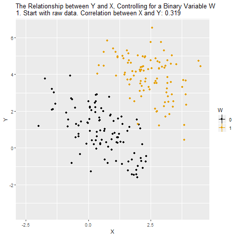
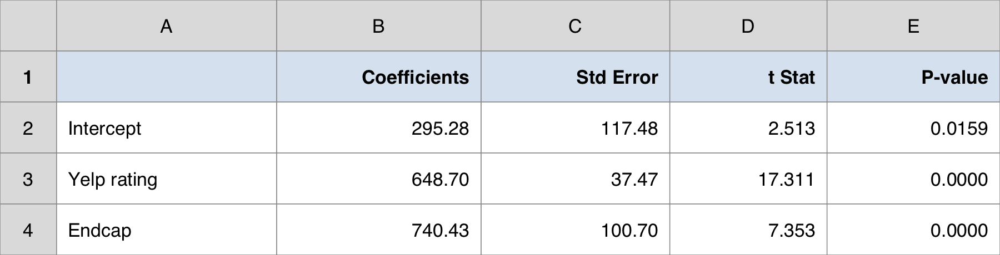
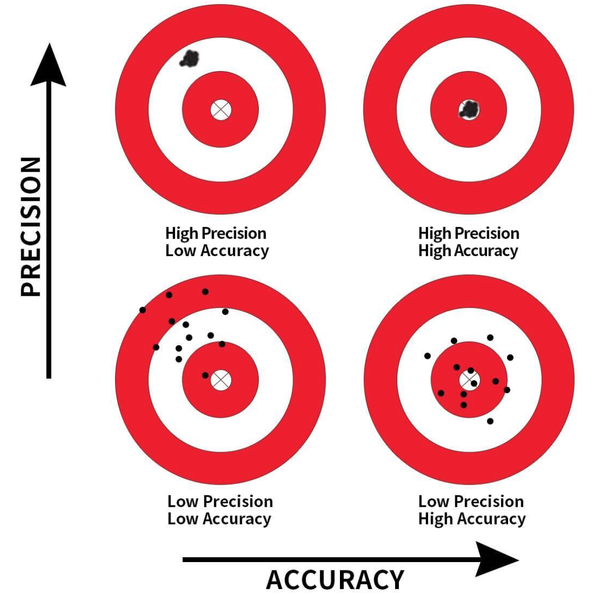
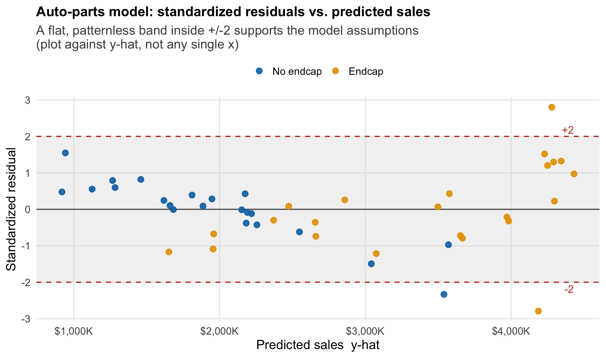

## Overview

:::::: nonincremental
::::: columns
::: {.column style="width: 50%; text-align: center; justify-content: center; align-items: center;"}
- Case Spotlight: an auto-parts retailer choosing where to invest
- One predictor to many: the multiple regression model
- Least squares and the **partial** coefficient: "holding the others constant"
- How well does the model fit? $R^2$ and **adjusted** $R^2$
:::


::: {.column style="width: 50%; text-align: center; justify-content: center; align-items: center;"}
- Is the model useful? The overall **$F$-test**
- Which predictors matter? The individual **$t$-tests**
- A switch on or off: the **dummy** (indicator) variable
- When predictors overlap: **multicollinearity**
- The investment call: demographics or service & merchandising?
:::
:::::
::::::

# Case Spotlight: Auto-Parts Retail {background-color="#cfb991"}

## Last Topic We Predicted with One Variable. Now We Have Four.

<br>

- You are the **manager** of a regional **auto-parts retail chain**: 45 stores, deciding where to put the next dollar.

- Last time we found a single strong predictor of a store's annual sales: its **Yelp rating**. Each extra star was worth roughly **+\$758K** a year. A clean simple-regression story.

- But a Yelp rating is a *symptom*, not a lever you can pull directly. Your real question as the manager is sharper:

::: fragment
> "We can invest in **location** (open stores in bigger, richer markets), in **service** (raise the customer experience), or in **merchandising** (pay for premium **endcap** shelf placement). **Which actually drives sales, and where should the money go?**"
:::

- Answering that needs **several predictors at once**, plus a way to isolate the effect of each one. That is today's tool: **multiple regression**.

## The Data: 45 Stores, Four Candidate Drivers

<br>

::: {style="font-size: 90%;"}
| Column | What it measures | The lever it represents |
|---|---|---|
| `sales2012_k` | annual store sales (\$ thousands) | **the outcome we want to grow** |
| `population_3mi` | residents within 3 miles | location: market size |
| `income_3mi` | median household income within 3 miles | location: market wealth |
| `yelp_rating` | average Yelp rating (1–5 stars) | service / customer experience |
| `endcap` | 1 = premium endcap shelf placement, 0 = none | merchandising spend |
:::

<br>

- Data: `data/autoparts.csv`, 45 rows, one per store. `endcap` is already coded **0/1**.

- **The trap we will spring today:** the two drivers you might *expect* to dominate (population and income) turn out **not** to matter once service and merchandising are in the model.

## How Today's Studio Runs

<br>

- **Two lectures, two halves of the decision:**

  - **Lecture 1, build & read the model.** Fit sales on all four drivers; interpret each **partial** coefficient ("holding the others constant"); judge overall fit with $R^2$ and adjusted $R^2$.

  - **Lecture 2, test & decide.** Which drivers are *real* ($F$-test vs. $t$-tests)? Put a **dollar value on an endcap** with a dummy variable; check the predictors don't overlap (multicollinearity); make the investment call.

- A good analyst builds the model on the auto-parts data; **your team reproduces and interrogates it**, then we debrief the recommendation together.

- By the end, **you** decide where to invest, with the regression to back the call.

# Lecture 1: Building & Reading the Model {background-color="#cfb991"}

## The Brief: Lecture 1

<br>

- **The big call you own:** *where should the next dollar go?* **Today's piece of it:** *which drivers move sales once the others are held constant?*

::: fragment
> "Fit a model for store sales using **all four** drivers at once. For each driver, tell me its effect on sales **holding the others fixed**, and tell me how much of the sales story the model captures."
:::

<br>

- Simple regression answered "does Yelp predict sales?" in isolation. But stores with high Yelp ratings might also sit in richer markets, so the simple slope can **mix two effects together**.

- Multiple regression estimates the effect of **each** driver **while statistically holding the others constant**: the closest thing we have to a controlled comparison from observational data.

- First we build the machine and learn to read its output. Testing and the dollar decision come in Lecture 2.

## How Every Class Runs

{.nostretch fig-align="center" width="90%"}

::: nonincremental
The class **ends on the Team Sprint**, your group's graded submission: a decision plus your read of the analysis, one PDF before you leave.
:::

# From One Predictor to Many {background-color="#cfb991"}

## The Multiple Regression Model

<br>

- With $p$ independent variables $x_1, x_2, \ldots, x_p$, the **population model** is:

::: fragment

$$
y = \beta_0 + \beta_1 x_1 + \beta_2 x_2 + \cdots + \beta_p x_p + \varepsilon
$$

:::

- The **regression equation** (the mean response) drops the error term:

::: fragment

$$
E(y) = \beta_0 + \beta_1 x_1 + \beta_2 x_2 + \cdots + \beta_p x_p
$$

:::

- Same error assumptions as before: $E(\varepsilon)=0$, constant variance $\sigma^2$, independent errors, normally distributed.

- $\beta_j$ = the change in $E(y)$ for a **one-unit increase in $x_j$ when all other variables are held constant.** That phrase is the whole point of today.


## A Plane, Not a Line

```{r  echo=FALSE, out.width = "62%",fig.align="center"}
knitr::include_graphics("figs/multiple_regression_plot.png")
```

::: nonincremental
- With two predictors, $E(y) = \beta_0 + \beta_1 x_1 + \beta_2 x_2$ traces a **plane** in 3-D space; with $p$ predictors it is a *hyperplane* we can no longer draw, but the algebra is identical.
- The vertical gap from a point to the plane is the error $\varepsilon$; least squares tilts the plane to make those gaps as small as possible.
:::

## Estimating the Coefficients: Least Squares Again

<br>

- The **estimated** equation replaces the unknown $\beta$'s with sample estimates $b$'s:

::: fragment

$$
\hat{y} = b_0 + b_1 x_1 + b_2 x_2 + \cdots + b_p x_p
$$

:::

- Same criterion as simple regression: pick the $b$'s that **minimize the sum of squared residuals**:

::: fragment

$$
\min \; SSE = \min \sum_{i=1}^{n} (y_i - \hat{y}_i)^2
$$

:::

- The closed-form solution needs matrix algebra, so we let **Excel** do the arithmetic. Your job is to **read and interpret** the output; that is where the business judgment lives.

## The Partial Coefficient: the Key Idea

<br>

- In simple regression, $b_1$ was *the* effect of $x$ on $y$.

- In multiple regression, $b_j$ is a **partial** coefficient: the effect of $x_j$ on $y$ **after the model has already accounted for every other predictor.**

- Read every coefficient with the same clause attached:

  - "$b_j$ = the predicted change in $y$ for a one-unit increase in $x_j$, **holding all other variables constant.**"

- This is why a predictor can look important alone yet vanish in the full model: its apparent effect was the work of a variable it travels with. (We will watch exactly this happen to population and income.)

## Watch "Holding Constant" Change the Story

:::::: columns
::: {.column width="52%"}
{.nostretch fig-align="center" width="78%"}

::: {style="font-size: 50%;"}
Source: [Nick Huntington-Klein, animated causal plots](https://nickchk.com/causalgraphs.html)
:::
:::
::: {.column width="48%"}
- The raw cloud tilts one way: a single **pooled** correlation that ignores a lurking variable (here, the two colors).
- Split by that variable and the relationship **within each group** can flatten, steepen, or even **flip**.
- A **partial coefficient** reads exactly that within-group story: the effect of one driver among stores that match on the others.
- Hold this picture for the auto-parts surprise: population *looks* like it lifts sales, until we hold service and merchandising constant.
:::
::::::

## A Question That Often Comes Up

:::: {.faq}
**A question that often comes up at this point:**

["Holding the others constant" sounds like an experiment, but we never ran one. How can the model hold income fixed when our 45 stores all have different incomes?]{.faq-q}

::: {.fragment .faq-a}
**Short answer:** it does it with arithmetic, not with a lab. Least squares finds the income coefficient by asking: among stores that are *similar on population, Yelp, and endcap*, how does sales change as income changes? It compares like with like statistically. That is weaker than a real experiment (we cannot rule out a lurking driver we never measured), but it is the closest a single observational model gets to "all else equal."
:::
::::

# Warm-Up: Two Drivers on the Spine {background-color="#cfb991"}

## Two Drivers First: Yelp and Endcap

<br>

- Before all four, we fit a **smaller** model on the same 45 stores: sales on just the **Yelp rating** and the **endcap** dummy. Two predictors keep the output table easy to read.

::: fragment

$$
\widehat{\text{sales}} = b_0 + b_1\,\text{yelp} + b_2\,\text{endcap} \qquad (n = 45,\; p = 2)
$$

:::

- Same machine as before: least squares tilts a **plane** over the 45 stores, and each $b$ is a **partial** coefficient, read "holding the other driver constant."

- Read the output, interpret the two partial effects, predict one store: then we add the two location drivers.

## Do It in Excel: Fit Sales on Two Drivers

:::::: columns
::: {.column width="46%"}
**Follow along:**

1. `yelp_rating` and `endcap` already sit **side by side** (columns **E:F**).
2. **Data → Data Analysis → Regression**.
3. Input Y Range: `sales2012_k` (column **B**); Input X Range: **E:F** together.
4. Check **Labels** and **Confidence Level 95%**; click OK.
5. Read the **Coefficients** column: $b_0 = 295.3$, $b_1 = 648.7$, $b_2 = 740.4$.
:::
::: {.column width="54%"}
{.nostretch fig-align="center" width="100%"}

::: {.fragment}
$$
\widehat{\text{sales}} = 295.3 + 648.7\,\text{yelp} + 740.4\,\text{endcap}
$$
:::
:::
::::::

## Reading the Two Partial Coefficients

<br>

- $b_1 = +648.7$ (Yelp): each **extra star** predicts about **+\$649K** in annual sales, **holding endcap placement constant.**

- $b_2 = +740.4$ (endcap): an **endcap** predicts about **+\$740K**, **holding the Yelp rating constant.**

- **Predict** store #5 (Yelp $=5.0$, endcap $=1$), stacked against the simpler options:

::: fragment

| Prediction for store #5 | Sales |
|---|---:|
| Null (guess the average) | \$2,706K |
| Simple, Yelp only (Topic 10) | \$4,120K |
| **Two drivers (Yelp + endcap)** | **\$4,279K** |
| Actual | \$4,677K |

:::

- Each step lands closer to the \$4,677K actual; the two-driver **residual** is $4677 - 4279 = +\$398\text{K}$. Still short: maybe location is helping. That is what the next two drivers test.

# How Well Does the Model Fit? {background-color="#cfb991"}

## Partitioning the Variation: SST = SSR + SSE

<br>

- Exactly as in simple regression, total variation in $y$ splits into explained + unexplained:

::: fragment

$$
\underbrace{\sum (y_i - \bar{y})^2}_{SST \;(\text{total})} \;=\; \underbrace{\sum (\hat{y}_i - \bar{y})^2}_{SSR \;(\text{explained})} \;+\; \underbrace{\sum (y_i - \hat{y}_i)^2}_{SSE \;(\text{unexplained})}
$$

:::

- The **multiple coefficient of determination** is the explained share:

::: fragment

$$
R^2 = \frac{SSR}{SST} = 1 - \frac{SSE}{SST}
$$

:::

- For the two-driver warm-up: $R^2 = 51{,}797{,}905 / 55{,}840{,}034 = 0.928$: Yelp and endcap together explain about **93%** of the variation in store sales.

## The $R^2$ Trap: It Can Only Go Up

<br>

- Here is the catch that makes $R^2$ dangerous in multiple regression:

  - **Adding *any* predictor (even a useless, random one) can only *increase* $R^2$, never decrease it.**

- Why: a new variable gives least squares one more knob to fit noise, so $SSE$ shrinks and $R^2$ ticks up, whether or not the variable is real.

- So a bigger $R^2$ does **not** mean a better model. If we chased $R^2$ alone, we would throw every variable we could find into the model.

- We need a fit measure that **charges a penalty** for each predictor added. That is **adjusted $R^2$.**

## Adjusted $R^2$: Pay a Fee per Predictor

::: {style="font-size: 90%;"}
- Adjusted $R^2$ replaces the raw sums of squares with their **per-degree-of-freedom** versions:

::: fragment

$$
\text{adjusted } R^2 = 1 - \frac{SSE/(n - p - 1)}{SST/(n - 1)} = 1 - (1 - R^2)\,\frac{n - 1}{n - p - 1}
$$

:::

- The penalty rises with $p$ (more predictors) and eases with $n$ (more data). Two consequences:

  - Adjusted $R^2 \le R^2$ **always**, and the gap widens as you add predictors.
  - Adjusted $R^2$ goes **up only if a new predictor reduces the error variance $s^2$ (= MSE) more than the penalty costs.**

- That makes adjusted $R^2$ a real **model-building criterion**: compare candidate models, prefer the higher one.

- Two-driver warm-up: $R^2 = 0.9276$ but adjusted $R^2 = 0.9242$; on 45 stores the fee for two predictors is small, and next we watch whether two *more* drivers can clear it.
:::

## A Question That Often Comes Up

:::: {.faq}
**A question that often comes up at this point:**

[If adjusted $R^2$ is the honest measure, why does Excel report plain $R^2$ at all, and which one do I quote to the chain?]{.faq-q}

::: {.fragment .faq-a}
**Short answer:** quote **both**, and let the gap tell the story. Plain $R^2$ answers "how much variation did this model explain?" (a description of these 45 stores); adjusted $R^2$ answers "would this fit survive a fair charge for the predictors I used?" (the model-building question). For the two-driver warm-up they are close, $0.9276$ vs $0.9242$: a small gap means both predictors are earning their keep, not padding the fit.
:::
::::

# The Spine Model: All Four Drivers {background-color="#cfb991"}

## Do It in Excel: Fit Sales on All Four Drivers

:::::: columns
::: {.column width="46%"}
**Follow along:**

1. The **four predictors already sit side by side** in columns **C:F** (`population_3mi`, `income_3mi`, `yelp_rating`, `endcap`).
2. **Data → Data Analysis → Regression**.
3. Input Y Range: `sales2012_k` (column **B**); Input X Range: **C:F**, all four together.
4. Check **Labels** and **Confidence Level 95%**; click OK.
5. Read the top block: **R Square**, **Adjusted R Square**, **Standard Error** ($s$).
:::
::: {.column width="54%"}
{.nostretch fig-align="center" width="100%"}

::: {.fragment}
The top block reports overall fit; we read it now and test it in Lecture 2.
:::
:::
::::::

## The Estimated Equation for Store Sales

<br>

From the **Coefficients** column of the output:

::: fragment

$$
\widehat{\text{sales}} = -52.1 + 0.00035\,\text{pop} + 0.0047\,\text{income} + 642.3\,\text{yelp} + 816.5\,\text{endcap}
$$

:::

<br>

- **Fit:** $R^2 = 0.932$, adjusted $R^2 = 0.925$: the four drivers together explain about **93%** of the variation in store sales, and that holds up after the per-predictor penalty.

- Standard error $s = \$308.5\text{K}$: a rough "typical miss" of the model's sales prediction.

- Now the interpretation, and the surprise.

## How Much Better Than Guessing, or Than One Driver?

<br>

- A model earns its complexity only if it beats the simpler options. Stack three, all on the same 45 stores:

::: fragment

| Model | What it uses | $R^2$ | Typical miss |
|---|---|---:|---:|
| Null (no model) | guess the average \$2,706K every time | 0.000 | \~\$1,114K |
| Simple (Topic 10) | Yelp rating alone | 0.834 | \~\$453K |
| **Multiple (today)** | **all four drivers** | **0.932** | **\~\$291K** |

:::

- Each rung **cuts the typical miss**: \$1,114K with no model, \$453K with one driver, \$291K with four. Yelp did the heavy lifting; the other three still shave off another third of the error.

- The payoff of the topic is not only *which* drivers matter, but a **sharper sales prediction** for the next store.

## Reading the Partial Effects

```{r  echo=FALSE, out.width = "82%",fig.align="center"}
knitr::include_graphics("figs/autoparts_coef_effects.png")
```

::: nonincremental
- Each **Yelp star** predicts **+\$642K** in annual sales, holding location and merchandising fixed. An **endcap** predicts **+\$816K**, holding everything else fixed.
- The two location drivers (population, income) move the needle far less; we will test whether they matter at all next lecture.
:::

## The Surprise: Bigger Market ≠ More Sales

<br>

- Intuition says **population** and **income** should dominate: more people, more money, more sales.

- But the partial coefficients say otherwise:

  - **Population:** $+0.00035$ → about **+\$0.35K per extra 1,000 residents**. Flat.
  - **Income:** $+0.0047$ → about **+\$4.7K per extra \$1,000 of median income**. Small.

- Meanwhile **service** (Yelp) and **merchandising** (endcap) carry the model.

- **Why the intuition fails:** in simple regression a market-size variable can look strong because it travels with the variables that **actually drive sales**. Once those are in the model, "holding the others constant" strips the borrowed credit away. We will confirm this with formal tests in Lecture 2.

## A Question That Often Comes Up

:::: {.faq}
**A question that often comes up at this point:**

[Does a near-zero coefficient on population mean a chain should *never* care about market size?]{.faq-q}

::: {.fragment .faq-a}
**Short answer:** no, and this is the trap a manager must not fall into. The $+0.00035$ on population says only that *among our 45 stores*, once Yelp and endcap are accounted for, market size adds almost nothing extra. It does not say population is irrelevant in the world. Our stores may already sit in reasonable markets, so size has little room left to explain. The coefficient is a statement about *this model and this data*, not a universal law of retail.
:::
::::

## The Manager's Takeaway (Lecture 1)

<br>

- **One sentence:** four drivers explain **93%** of store-sales variation, and the effects that matter are **service (Yelp, +\$642K/star)** and **merchandising (endcap, +\$816K)**, *not* the market-size variables you might bet on.

- **One number:** **adjusted $R^2 = 0.925$**: high fit that *survives* the penalty for using four predictors, so the model isn't just padded with noise.

- **One caveat:** "holding the others constant" is doing heavy lifting. A coefficient near zero (population, income) doesn't prove the variable is irrelevant in the world, only that it adds little **once the others are in.** Next lecture we make that rigorous with the $F$- and $t$-tests, and put a defensible dollar value on an endcap.

## Today's Question, Today's Answer

<br>

**The question (Topic 11, Lecture 1):**

> *Which drivers move store sales once the others are held constant, and how much of the sales story does the model capture?*

::: fragment
<br>

**The answer we reached today:**

> The four-driver model explains **93%** of sales variation (adjusted $R^2 = 0.925$), and the partial effects that carry it are **service (Yelp, +\$642K/star)** and **merchandising (endcap, +\$816K)**, *not* population (+\$0.35K/1,000 residents) or income (+\$4.7K/\$1,000). Whether each effect is *real* or noise is the **testing** question, settled in Lecture 2.
:::

## ⏱️ Team Sprint: Your Group Case (Lecture 1)

::: {.sprint .nonincremental}
**Now it's your group's turn.** Today's in-class group case is posted on **Brightspace** (*Topic 11 Group Case: Lecture 1*): a separate business decision you make with today's tools.

**What you'll use:** the multiple regression equation and its **partial** coefficients ("holding the others constant"), plus $R^2$ vs. adjusted $R^2$. **Excel:** Analysis ToolPak → Regression.

**Submit one PDF per group before you leave:** your decision plus the numbers behind it.
:::

# Lecture 2: Testing & the Investment Call {background-color="#cfb991"}

## The Brief: Lecture 2

<br>

- **The big call you own:** *where should the next dollar go?* **Today's piece of it:** *which levers are worth investing in*, weighing $F$ vs. $t$, the dummy, and multicollinearity?

::: fragment
> "The model fits well, but is each driver *real*, or could its coefficient be noise? Put a **dollar figure on an endcap** we can defend in a budget meeting. Then tell me: invest in **location, service, or merchandising**?"
:::

<br>

- A high $R^2$ tells us the model predicts well **in aggregate**. It does **not** tell us which individual coefficients we can trust.

- Today we add the inference layer: an **overall** test (is the model useful at all?), **individual** tests (which predictors carry their weight?), the **dummy variable** that turns "has an endcap" into a dollar amount, and a **multicollinearity** check so we don't get fooled by overlapping predictors.

## How Every Class Runs

{.nostretch fig-align="center" width="90%"}

::: nonincremental
The class **ends on the Team Sprint**, your group's graded submission: a decision plus your read of the analysis, one PDF before you leave.
:::

# Is the Model Useful? The Overall $F$-Test {background-color="#cfb991"}

## $F$ vs. $t$: Different Jobs Now

<br>

- In **simple** regression, the $F$-test and the $t$-test gave the **same** answer: there was only one predictor to judge.

- In **multiple** regression they split into two distinct jobs:

  - **$F$-test (overall):** is the model **as a whole** useful, does **at least one** predictor carry information?
  - **$t$-tests (individual):** taken **one at a time**, which specific predictors are pulling their weight?

- You always read them in that order: **$F$ first** (is anything here?), then **$t$'s** (which things?).

## The $F$-Test: Hypotheses and Statistic

<br>

- **Hypotheses.** $H_0$ says *every* slope is zero (the model explains nothing):

::: fragment

$$
H_0: \beta_1 = \beta_2 = \cdots = \beta_p = 0 \qquad H_a: \text{at least one } \beta_j \neq 0
$$

:::

- **Test statistic:** the ratio of explained to unexplained variation, each per degree of freedom:

::: fragment

$$
F = \frac{MSR}{MSE} = \frac{SSR/p}{SSE/(n - p - 1)} \;\sim\; F_{p,\; n-p-1} \text{ under } H_0
$$

:::

- Reject $H_0$ when $F$ is large (p-value $\le \alpha$). In Excel this is the **"Significance F"** cell in the ANOVA block.

## Do It in Excel: Find the $F$-Test in the Output

:::::: columns
::: {.column width="46%"}
**Follow along:**

1. In the **same** Regression output, find the **ANOVA** block (below the fit statistics).
2. Read **SS** and **MS** for the **Regression** and **Residual** rows.
3. The **F** cell is $MSR / MSE$ already computed for you.
4. Read **Significance F**: that is the overall p-value; reject $H_0$ when it is $\le \alpha$.
:::
::: {.column width="54%"}
{.nostretch fig-align="center" width="100%"}
:::
::::::

## The $F$-Test on the Auto-Parts Model

<br>

From the ANOVA block ($n = 45$, $p = 4$):

::: fragment

| Source | df | SS | MS | $F$ |
|---|---:|---:|---:|---:|
| Regression | 4 | 52,033,385 | 13,008,346 | **136.7** |
| Residual | 40 | 3,806,649 | 95,166 | |
| Total | 44 | 55,840,034 | | |

:::

::: fragment

$$
F = \frac{MSR}{MSE} = \frac{13{,}008{,}346}{95{,}166} = 136.7, \qquad \text{Significance } F \approx 9.2\times10^{-23}
$$

:::

- $F = 136.7$ with p-value far below any $\alpha$ → **reject $H_0$**: the model is decisively useful, so **at least one** driver carries real information. Now, *which ones?*

# Which Predictors Matter? The $t$-Tests {background-color="#cfb991"}

## The Individual $t$-Test

<br>

- For each predictor we ask: does it add information **in the presence of all the others**?

::: fragment

$$
H_0: \beta_j = 0 \qquad H_a: \beta_j \neq 0 \qquad t = \frac{b_j}{s_{b_j}}, \quad df = n - p - 1
$$

:::

- $s_{b_j}$ is the standard error of the coefficient (Excel's "Standard Error" column). Reject $H_0$ when the p-value $\le \alpha$, i.e. roughly when $|t| \gtrsim 2$.

- **Critical subtlety:** each $t$-test is *conditional on the other predictors being in the model.* A predictor can be significant alone and insignificant here, because a teammate is already explaining its share.

## Do It in Excel: Read the Coefficient Table

:::::: columns
::: {.column width="46%"}
**Follow along:**

1. In the same Regression output, scroll to the **Coefficients** table.
2. Each row gives **Coefficient**, **Std Error**, **t Stat**, **P-value**, and a 95% CI.
3. Read each **t Stat** $= b_j / s_{b_j}$ down the column.
4. $|t| > 2$ (p < 0.05) → **significant**; $|t| < 2$ (p > 0.05) → **not significant** *in this model*.
5. Sort the four drivers into "real" vs. "can't tell."
:::
::: {.column width="54%"}
{.nostretch fig-align="center" width="100%"}
:::
::::::

## The Verdict on Each Driver

<br>

::: fragment

| Driver | Coefficient | $t$ | p-value | Significant? |
|---|---:|---:|---:|---|
| Population | +0.00035 | 0.88 | 0.39 | **No** |
| Income | +0.0047 | 1.50 | 0.14 | **No** |
| Yelp rating | **+642.3** | **16.5** | < 0.0001 | **Yes** |
| Endcap | **+816.5** | **6.98** | < 0.0001 | **Yes** |

:::

- The model is highly significant overall ($F = 136.7$), yet **two of its four predictors are individually insignificant.**

- **The lesson:** a significant $F$ does **not** mean every variable matters. Here all the explanatory power comes from **service (Yelp)** and **merchandising (endcap)**; the location variables are statistical passengers.

- *Significance ≠ importance, and importance ≠ significance.* Judge each on its own evidence.

## A Question That Often Comes Up

:::: {.faq}
**A question that often comes up at this point:**

[Population and income are insignificant. Should a manager just delete them from the model?]{.faq-q}

::: {.fragment .faq-a}
**Short answer:** for *this* decision, yes: the budget should follow Yelp and endcap, and the next slide shows adjusted $R^2$ barely moves when we drop the two demographics. But keep them in the analyst's working file. They cost almost nothing, they document *why* you ruled location out (the investment story is "we checked size and wealth, they did not pay"), and a future store in a far smaller or poorer market might revive them. Insignificant here is not "proven useless forever."
:::
::::

## Do It in Excel: Compare Models Side by Side

:::::: columns
::: {.column width="46%"}
**Follow along:**

1. Run **Regression** with X = population + income only; note **Adjusted R Square**.
2. Re-run adding `yelp_rating` to the X range; note adjusted $R^2$ again.
3. Re-run adding `endcap`; note adjusted $R^2$ once more.
4. Stack the three adjusted-$R^2$ values: demographics explain almost **nothing**; Yelp makes it leap; endcap climbs again.
:::
::: {.column width="54%"}
{.nostretch fig-align="center" width="100%"}

::: {.fragment}
The location variables you would buy first are the ones that move the model **least**.
:::
:::
::::::

# The Dummy Variable: Pricing an Endcap {background-color="#cfb991"}

## A Switch, Not a Dial: Encoding "Has an Endcap"

<br>

- `endcap` isn't a number you can have more or less of; it is a **category**: a store either has premium endcap placement or it doesn't.

- We encode it as a **dummy (indicator) variable**: $1$ = has an endcap, $0$ = none. The $0$ category is the **reference** (baseline) level.

- Excel treats the 0/1 column **like any other predictor**, with no special tool. Its coefficient has a special meaning:

  - $b_{\text{endcap}}$ = the **average difference in sales between an endcap store and a non-endcap store, holding the other predictors constant.**

- In other words, the dummy coefficient is the **dollar value of an endcap**: exactly what you asked your analyst to find.

## What the Dummy Does to the Equation

<br>

- Split the fitted equation by the two values of the dummy (all else held fixed):

::: fragment

$$
\text{No endcap } (x=0): \quad \widehat{\text{sales}} = (b_0 + \cdots) + 642.3\,\text{yelp}
$$

$$
\text{Endcap } (x=1): \quad \widehat{\text{sales}} = (b_0 + 816.5 + \cdots) + 642.3\,\text{yelp}
$$

:::

- Same slope on every other variable; only the **intercept shifts up by \$816.5K.**

- A dummy gives the two groups **parallel lines**: identical response to Yelp, location, income, but a fixed **level gap** between them.

## The Endcap Gap, Drawn

```{r  echo=FALSE, out.width = "74%",fig.align="center"}
knitr::include_graphics("figs/autoparts_endcap_dummy.png")
```

::: nonincremental
- Two parallel lines, separated by a constant **\$816K**: the endcap premium, holding population, income, and Yelp fixed.
- $t = 6.98$, p < 0.0001 → this gap is **not** noise. An endcap is a real, sizeable lever.
:::

## A Question That Often Comes Up

:::: {.faq}
**A question that often comes up at this point:**

[Why force the two groups onto *parallel* lines? Why not just split the data and run a separate regression for endcap and non-endcap stores?]{.faq-q}

::: {.fragment .faq-a}
**Short answer:** you could, but the dummy gives you more for less. With one 0/1 column the endcap and non-endcap stores **pool** their data to estimate the slopes on Yelp, population, and income, so each slope rests on all 45 stores instead of two smaller, noisier subsets, and the coefficient on the dummy is exactly the \$816K gap you want to defend. The parallel-lines assumption says "an endcap adds the same dollar amount regardless of Yelp." If you suspect the endcap *changes* the Yelp slope, that is an interaction, a refinement beyond today's model.
:::
::::

## Putting a Defensible Number on the Decision

::: {style="font-size: 88%;"}

- **Scenario:** the chain plans a new store with `population_3mi = 120,000`, `income_3mi = 55,000`, `yelp_rating = 4.0`. Should it pay for endcap placement?

- Plug into the fitted equation, once with `endcap = 0` and once with `endcap = 1`:

::: fragment

| Configuration | Predicted annual sales |
|---|---:|
| Null (average store) | \$2,706K |
| Simple, Yelp only (Topic 10) | \$3,363K |
| Multiple, **without** endcap | **\$2,816K** |
| Multiple, **with** endcap | **\$3,632K** |
| **Lift from the endcap** | **+\$816K / year** |

:::

- The Yelp-only model guesses **\$3,363K** here: it **over-credits** Yelp, which in Topic 10 absorbed the endcap effect the four-driver model now separates out.

- **The decision rule:** buy the endcap **if its annual lease is below \~\$816K** (a \$150K placement is a clear yes): the dummy turns a vague "merchandising matters" into a budget number.

- These are **point** predictions; the software also gives a **confidence interval** (mean of all such stores) and a wider **prediction interval** (this one store), read straight off the output.

:::


## A Note on Categories with More Than Two Levels

<br>

- `endcap` had two levels → **one** dummy. The rule generalizes:

  - A categorical variable with $k$ levels needs $\mathbf{k - 1}$ dummy variables (one level is the reference).

- Example, three store **formats** (Standard, Express, Flagship): use **two** dummies (`Express` 0/1, `Flagship` 0/1); "Standard" is the reference. Each dummy coefficient is that format's sales gap **versus Standard**.

- **Do not** encode categories as a single 1/2/3 number; that would falsely force the levels to be evenly spaced and ordered. Always use separate 0/1 columns.

## A Question That Often Comes Up

:::: {.faq}
**A question that often comes up at this point:**

[Three formats, but only two dummies? Why not give Standard its own 0/1 column too, so every format is represented?]{.faq-q}

::: {.fragment .faq-a}
**Short answer:** because a third column would be redundant and break the math. "Standard" is already identified: a store with `Express = 0` and `Flagship = 0` *is* a Standard store. Adding a Standard column would make the three columns add to 1 in every row, which collides with the intercept and the regression cannot be estimated. The dropped level becomes the **reference**, and you read each remaining coefficient as a gap *versus* it: "Flagship sells \$X more than Standard, all else equal."
:::
::::

# When Predictors Overlap: Multicollinearity {background-color="#cfb991"}

## Why We Check It

<br>

- **Multicollinearity** = two or more predictors are strongly correlated *with each other*.

- When predictors overlap, the model struggles to credit the effect to one versus another. Symptoms:

  - coefficient **standard errors inflate** → wide CIs, small $t$'s;
  - coefficients become **unstable** and can flip sign;
  - an *important* predictor can look insignificant, not because it's useless, but because a correlated partner is absorbing its credit.

- It rarely hurts **prediction**, but it muddies **interpretation**, and interpretation is exactly what you are buying from the analyst.

## Detecting It: Correlations and VIF

::::: nonincremental
:::: columns
::: {.column width="46%"}
<br>

- **Quick look:** the predictor **correlation matrix** (Data Analysis → Correlation). Flag any pair with $|r| > 0.7$.

- **Formal measure:** the **Variance Inflation Factor**,

$$
VIF_j = \frac{1}{1 - R_j^2}
$$

where $R_j^2$ is from regressing $x_j$ on all the other predictors. **Rule of thumb: investigate when VIF > 5.**
:::

::: {.column width="54%"}
```{r  echo=FALSE, out.width = "100%",fig.align="center"}
knitr::include_graphics("figs/autoparts_predictor_corr.png")
```
:::
::::
:::::

## Our Model Is Clean, So the Verdict Stands

<br>

- For the auto-parts model every pairwise correlation is small (largest: income–endcap at $-0.47$) and **every VIF is below 1.7**, far under the threshold of 5.

::: fragment

| Predictor | VIF |
|---|---:|
| Population | 1.17 |
| Income | 1.49 |
| Yelp rating | 1.29 |
| Endcap | 1.62 |

:::

- So population and income are insignificant for an **honest** reason: they genuinely add little once service and merchandising are in the model. This is **not** a multicollinearity artifact; the verdict is trustworthy.

- *Contrast:* had population and income been highly correlated, we'd have to be cautious; their small $t$'s could have been an overlap symptom rather than true irrelevance.

## A Question That Often Comes Up

:::: {.faq}
**A question that often comes up at this point:**

[What does a VIF of, say, $5$ actually mean, and what would a manager do if our auto-parts model had hit it?]{.faq-q}

::: {.fragment .faq-a}
**Short answer:** $VIF = 5$ means a predictor's coefficient has a standard error about $\sqrt{5} \approx 2.2$ times wider than if it shared nothing with the others, so its $t$ shrinks and its effect gets blurry. Our worst is endcap at $1.62$, harmless. If population and income had come in at, say, $VIF = 8$, the fix is not to panic: drop one of the overlapping pair, or combine them into a single "market quality" index, then re-estimate and re-read the coefficients.
:::
::::

# One Last Check: Residual Analysis {background-color="#cfb991"}

## Precision vs. Accuracy: Why the Assumptions Matter

:::::: columns
::: {.column width="58%"}
{.nostretch fig-align="center" width="90%"}
:::
::: {.column width="42%"}
::: {style="font-size: 90%;"}
- **Precision:** the predictions are **consistent**, a tight spread when you repeat.
- **Accuracy:** the predictions are **unbiased**, centered on the truth, not systematically high or low.
- A regression can have one without the other. What buys you **both** is meeting the error assumptions: zero-mean, constant-variance, independent, roughly normal.
- The residual plot is how we **check** them before trusting the \$816K endcap number.
:::
:::
::::::

## Validating the Model: Plot the Residuals Against $\hat{y}$

<br>

- Before we trust the coefficients, we check the **error assumptions** the model rests on (zero-mean, constant-variance, normal errors). The tool is the same residual we used in simple regression.

- **What changes with four predictors:** there is no single $x$-axis to plot against. In simple regression a residual plot against $x$ and against $\hat{y}$ carry the same picture; with several predictors they do not.

  - So in multiple regression we plot residuals against the **fitted value $\hat{y}$**, the one number that combines all four drivers.

- We use the **standardized** residual (each residual divided by its own standard error), on a $z$-like scale, so the **$|z| > 2$ outlier rule** applies directly. Excel's Regression tool prints these in its Residual Output; computing them by hand across four predictors is impractical.

## The Auto-Parts Residual Plot

```{r  echo=FALSE, out.width = "70%",fig.align="center"}

```

::: nonincremental
- The band is roughly **flat and centered at zero**, no fan and no curve across the \$1M to \$4M range of $\hat{y}$: the constant-variance and linearity assumptions hold, so the coefficient verdicts are safe to read.
- Only **3 of 45 stores** sit just past $\pm 2$ (about the 5% you expect by chance), none wildly so. Flag them to investigate, not to delete: these are the real stores the four drivers still miss.
:::

## A Question That Often Comes Up

:::: {.faq}
**A question that often comes up at this point:**

[In simple regression we plotted residuals against $x$. Why switch to plotting against $\hat{y}$ now?]{.faq-q}

::: {.fragment .faq-a}
**Short answer:** because there is no single $x$ anymore. With four drivers you would need four separate residual plots, and each would miss the patterns the others create. The fitted value $\hat{y}$ rolls all four predictors into one axis, so a single plot shows whether the model misses systematically (a curve), whether the spread fans out (non-constant variance), or whether a store sits far off ($|z| > 2$). For the auto-parts model the band is clean, which is the green light to act on the coefficients.
:::
::::

# Debrief: The Investment Call {background-color="#cfb991"}

## The Whole Picture on One Page

::: r-fit-text
| Driver | Partial effect | $t$ | Verdict | Investment read |
|---|---:|---:|---|---|
| Population (3 mi) | +\$0.35K / 1,000 residents | 0.88 | not significant | bigger market ≠ more sales here |
| Income (3 mi) | +\$4.7K / \$1,000 income | 1.50 | not significant | richer market ≠ more sales here |
| **Yelp rating** | **+\$642K / star** | **16.5** | **significant** | **invest in service / experience** |
| **Endcap** | **+\$816K** | **6.98** | **significant** | **buy the endcap placement** |

Model: $R^2 = 0.932$, adjusted $R^2 = 0.925$, overall $F = 136.7$ (p $< 10^{-22}$), $s = \$308.5$K, all VIF $< 1.7$.
:::

- **Your recommendation as the manager:** stop chasing big, rich markets; **location demographics don't move sales** in this chain. The money belongs in **service quality** (every Yelp star ≈ +\$642K/yr) and in **endcap merchandising** (≈ +\$816K/yr, well worth a sub-\$816K lease). Both effects are statistically rock-solid and not a multicollinearity mirage.

## $F$ vs. $t$: the Lesson That Travels

<br>

- **The $F$-test and the $t$-tests answer different questions, and you need both:**

  - $F$ said the model **as a whole** is useful, but that alone could have tempted us to keep all four variables.
  - The $t$-tests revealed that **half the predictors were dead weight**, steering the budget toward the two that actually pay.

- **Significance is conditional.** Every coefficient and every $t$ here means "…*holding the other three constant.*" Change the set of predictors and the story can change.

- **Significance ≠ importance.** With huge samples trivial effects turn "significant"; with small samples real effects can hide. Always pair the test with the **dollar size** of the effect: that is the number you decide on as the manager.

## The Manager's Takeaway

<br>

- **One sentence:** for this 45-store chain, **service and merchandising drive sales, not location demographics**, so invest in Yelp rating (+\$642K/star) and endcap placement (+\$816K), each statistically decisive.

- **One number to remember:** **\$816K**, the value of an endcap, read straight off a dummy variable's coefficient, holding everything else constant.

- **One caveat:** the model *describes* 45 existing stores; it does not *prove* that buying an endcap will *cause* +\$816K at a brand-new store. Correlation control is the best we can do with observational data: pilot it, then re-estimate.

- **Practice with the real data:** `data/autoparts.csv` (in the datasets zip) + Excel Regression → reproduce $R^2 = 0.932$, $F = 136.7$, the four coefficients, and the endcap prediction yourself.

## Today's Question, Today's Answer

<br>

**The question (Topic 11, Lecture 2):**

> *Which levers are worth investing in once we test each driver, and where should the next dollar go?*

::: fragment
<br>

**The answer we reached today:**

> The model is decisively useful ($F = 136.7$), but only **two** drivers survive their individual $t$-test: **Yelp** ($t = 16.5$, +\$642K/star) and **endcap** ($t = 6.98$, +\$816K); population and income are insignificant ($t = 0.88$, $1.50$), and every VIF $< 1.7$ so the verdict is honest, not an overlap artifact. **Invest in service and merchandising, not location:** buy the endcap whenever its lease runs below **\$816K/year**.
:::

## ⏱️ Team Sprint: Your Group Case (Lecture 2)

::: {.sprint .nonincremental}
**Now it's your group's turn.** Today's in-class group case is posted on **Brightspace** (*Topic 11 Group Case: Lecture 2*): a separate business decision you make with today's tools.

**What you'll use:** the overall **$F$-test** vs. the individual **$t$-tests**, a **dummy** variable, and a **VIF** check, then translate the coefficients into a dollar call. **Excel:** Analysis ToolPak → Regression.

**Submit one PDF per group before you leave:** your decision plus the numbers behind it.
:::

# Wrap-up {background-color="#cfb991"}

## Summary

::: nonincremental
What the auto-parts model taught us:

- **Multiple regression** estimates the effect of each predictor **holding the others constant**: observational data's closest move to a controlled comparison.
- A **partial coefficient** can differ wildly from its simple-regression cousin: population and income looked plausible but added nothing once Yelp and endcap were in.
- **$R^2$ only ever rises** when you add predictors → judge model size with **adjusted $R^2$**, which charges a fee per predictor.
- **$F$ first, then $t$:** $F$ asks "is the model useful at all?"; the $t$-tests ask "which predictors carry their weight?" A significant $F$ does not bless every coefficient.
- A **dummy variable** (0/1) prices a category: the endcap coefficient *is* the dollar value of an endcap; $k$ levels need $k-1$ dummies.
- **Multicollinearity** (overlapping predictors; check VIF > 5) muddies interpretation; here every VIF < 1.7, so the verdict holds.
- **This closes the prediction arc:** from *comparing* two groups, to *predicting* with one driver, to *isolating many drivers at once* (today).
:::

# Thank you! {background-color="#cfb991"}
